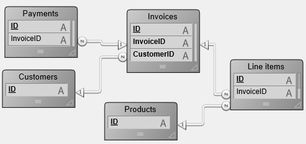

Un **trigger** est une méthode associée à une table. C'est une propriété d'une table. Vous n'appelez pas un trigger, les triggers sont appelés automatiquement par le moteur de 4D à chaque fois qu'un enregistrement de la table est manipulé (ajout, suppression et modification). Les triggers sont des méthodes qui peuvent éviter des opérations “illégales” dans votre base. Par exemple, dans une facturation, vous pouvez empêcher qu'un utilisateur crée une facture sans spécifier à qui elle doit être adressée. Les triggers sont un outil puissant permettant de contrôler les opérations sur les tables, et d'éviter des pertes de données accidentelles. Vous pouvez créer des triggers très simples et les rendre de plus en plus sophistiqués.


<!-- INCLUDE triggers.vs-events.Desc -->


## Activer et créer un trigger  

Par défaut, lorsque vous créez une table en mode Développement, la table n'a pas de trigger.

Pour utiliser un trigger pour une table, vous devez :

- activer le trigger et indiquer à 4D quand l'appeler.
- créer et écrire le code pour le trigger.

Activer un trigger qui n'est pas encore écrit ou écrire un trigger sans l'activer n'affecte pas les opérations effectuées sur une table.

1. Pour activer le trigger, sélectionnez les options **Triggers** pour la table dans la fenêtre de l'Inspecteur de structure :


2. Pour créer ou modifier le code d'un trigger pour une table, cliquez sur le bouton **Editer** dans la palette de l'Inspecteur de structure ou double-cliquez sur le titre de la table dans la fenêtre de Structure en appuyant sur la touche **Alt** (Windows)/**Option** (macOS). 


## Description des triggers

### Sur sauvegarde enregistrement  

Si cette option est sélectionnée, le trigger sera appelé à chaque fois qu'un enregistrement de la table est modifié, c'est-à-dire dans les circonstances suivantes :

- Vous modifiez un enregistrement en saisie de données (mode Développement, commande [`MODIFY RECORD`](../commands/modify-record) ou SQL `UPDATE`).
- Vous sauvegardez un enregistrement existant avec [`SAVE RECORD`](../commands/save-record).
- Vous appelez une commande qui provoque la sauvegarde d'un enregistrement existant (par exemple [`ARRAY TO SELECTION`](../commands/array-to-selection), [`APPLY TO SELECTION`](../commands/apply-to-selection), etc.).
- Vous utilisez une fonction ORDA qui sauvegarde l'entité.

:::note

Pour des raisons d'optimisation, le trigger n'est pas appelé lors de la sauvegarde de l'enregistrement par l'utilisateur ou via la commande [`SAVE RECORD`](../commands/save-record) si aucun champ de la table n'a été modifié dans l'enregistrement. Si vous souhaitez "forcer" l'appel du trigger dans ce cas, il suffit d'auto-affecter un champ :

```4d
[thetable]thefield:=[thetable]thefield
```

:::

### Sur suppression enregistrement 

Si cette option est sélectionnée, le trigger sera appelé à chaque fois qu'un enregistrement de la table est supprimé, c'est-à-dire dans les circonstances suivantes :

- Vous supprimez un enregistrement en mode Développement ou en appelant la commande [`DELETE RECORD`](../commands/delete-record), [`DELETE SELECTION`](../commands/delete-selection) ou SQL `DELETE`.
- Vous effectuez des opérations qui provoquent la suppression d'un enregistrement lié par l'intermédiaire des options de contrôle de suppression d'un lien.
- Vous utilisez une fonction ORDA qui supprime une entité.

:::note

La commande [`TRUNCATE TABLE`](../commands/trucate-table) ne provoque PAS l'appel du trigger.

:::

### Sur sauvegarde nouvel enregistrement  

Si cette option est sélectionnée, le trigger sera appelé à chaque fois qu'un enregistrement est créé dans la table, c'est-à-dire dans les circonstances suivantes :

- Vous ajoutez un enregistrement lors de la saisie de données (mode Développement, commande [`ADD RECORD`](../commands/add-record) ou SQL `INSERT` command).
- Vous créez puis sauvegardez un enregistrement avec [`CREATE RECORD`](../commands/create-record) et [`SAVE RECORD`](../commands/save-record). Notez que le trigger est appelé au moment où vous exécutez [`SAVE RECORD`](../commands/save-record), et non quand il est réellement créé.
- Vous importez des enregistrements (mode Développement ou commandes du langage).
- Vous appelez d'autres commandes qui créent et/ou sauvegardent de nouveaux enregistrements (par exemple [`ARRAY TO SELECTION`](../commands/array-to-selection), [`SAVE RELATED ONE`](../commands/save-related-one), etc.).
- Vous utilisez des fonctions ORDA telles que [`ds.dataclass.new()`](../API/DataClassClass.md#new) et [`entity.save()`](../API/EntityClass.md#save).


## Evénements moteur

Un trigger peut être invoqué pour l'un des trois événements moteur décrits ci-dessus. Dans le trigger, vous détectez quel événement a lieu en appelant la commande [`Trigger event`](../commands/trigger-event). Cette commande retourne une valeur numérique qui indique l'événement moteur.

Typiquement, vous écrivez un trigger avec une structure du type [`Case of` structure](../Concepts/flow-control.md#case-ofelseend-case) sur le résultat retourné par [`Trigger event`](../commands/trigger-event) :


```4d
  //Trigger for [anyTable]
#DECLARE -> $result : Integer
$result:=0 // On suppose que la requête sera acceptée
 Case of
    :(Trigger event=On Saving New Record Event)
  // Effectuer les actions appropriées pour sauvegarder l'enregistrement nouvellement créé
    :(Trigger event=On Saving Existing Record Event)
  // Effectuer les actions appropriées pour sauvegarder l'enregistrement déjà existant
    :(Trigger event=On Deleting Record Event)
  // Effectuer les actions appropriées pour détruire l'enregistrement
 End case
 ```


## Les triggers sont des fonctions  

Un trigger a deux finalités :

- Effectuer des actions sur l'enregistrement juste avant qu'il soit sauvegardé ou supprimé.
- Accepter ou rejeter une opération de base de données.


### Effectuer des actions  

A chaque fois qu'un enregistrement est sauvegardé (ajouté ou modifié) dans une table [Documents], vous souhaitez estampiller l'enregistrement avec des marqueurs de création et de modification. Vous pouvez écrire le trigger suivant :

```4d
  // Trigger pour la table [Documents]
 Case of
    :(Trigger event=On Saving New Record Event)
       [Documents]CreationStamp:=myTimeStamp
       [Documents]ModificationStamp:=myTimeStamp
    :(Trigger event=On Saving Existing Record Event)
       [Documents]ModificationStamp:=myTimeStamp
 End case
```

:::note

La fonction *myTimeStamp* utilisée dans cet exemple est une petite méthode projet retournant le nombre de secondes écoulées depuis une date choisie arbitrairement.

:::

Une fois que ce trigger a été écrit et activé, peu importe la façon dont vous ajoutez ou modifiez un enregistrement dans la table [Documents] (saisie de données, import, méthode projet, ORDA...), la valeur des deux champs [Documents]CreationStamp et [Documents]ModificationStamp sera automatiquement assignée par le trigger avant que l'enregistrement ne soit écrit sur disque.


### Accepter ou rejeter l'opération  

Pour accepter ou rejeter une opération de base de données, le trigger doit **retourner un code d'erreur de trigger** dans le résultat de la fonction.

#### Example

Prenons le cas d'une table [Employees]. Pendant la saisie de données, vous contrôlez le champ de numéro de sécurité sociale. Par exemple, lorsque l'utilisateur clique sur le bouton de validation, vous vérifiez le champ utilisant la méthode objet du bouton : 

```4d
  // Méthode objet bouton bAccept
 If(GoodSSnumber([Employees]SSNumber))
    ACCEPT
 Else
    BEEP
    ALERT("Saisissez un numéro de sécurité sociale et cliquez sur OK.")
 End if
```

Si la valeur du champ est correcte, vous acceptez la saisie de données, sinon vous affichez une alerte et restez en saisie de données.

Si vous créez aussi des enregistrements pour la table [Employees] par programmation, le code ci-dessous serait valide MAIS violerait la règle imposée dans la méthode objet créée plus haut :

```4d
  // Extrait d'une méthode projet
  // ...
 CREATE RECORD([Employees])
 [Employees]Name:="DOE"
 SAVE RECORD([Employees]) // <-- violation de la règle ! Il n'y a pas de numéro de sécurité sociale !
  // ...
```

En utilisant un trigger pour la table [Employees], vous pouvez appliquer la contrainte sur [Employees]SSNumber à tous les niveaux de la base. Le trigger serait du type :

```4d
  // Trigger pour  [Employees]
 #DECLARE -> $result : Integer
 var $dbEvent : Integer
 $result:=0
 $dbEvent:=Trigger event
 Case of
    :(($dbEvent=On Saving New Record Event)|($dbEvent=On Saving Existing Record Event))
       If(Not(GoodSSnumber([Employees]SSNumber)))
          $result:=-15050
       Else
  // ...
       End if
  // ...
 End case
```

Une fois que ce trigger est écrit et activé, la ligne SAVE RECORD([Employees]) de la méthode projet ci-dessus génèrera une erreur moteur -15050 et l'enregistrement ne sera PAS sauvegardé.

De la même façon, si un plug-in 4D essayait de sauvegarder un enregistrement dans [Employees] avec un numéro de sécurité sociale incorrect, le trigger génèrerait la même erreur et l'enregistrement ne serait pas sauvegardé non plus.

Le trigger garantit que personne (utilisateur, développeur, plug-in...) ne peut violer la règle sur le numéro de sécurité sociale (à dessein ou par erreur).

Notez que même si vous n'avez pas créé de trigger pour une table, la base peut retourner des erreurs moteur lorsque vous essayez de sauvegarder ou de détruire un enregistrement. Vous pouvez, par exemple, recevoir l'erreur -9998, si vous essayez de sauvegarder un enregistrement.

Ainsi, les triggers retournent des erreurs moteur de base de données supplémentaires dans 4D :

- 4D gère les erreurs “normales” : index unique, contrôles relationnels, etc.
- En utilisant les triggers, vous pouvez créer des codes d'erreurs propres à votre application.

**Important** : Vous pouvez retourner le code d'erreur de votre choix. Cependant, n'utilisez pas des codes d'erreurs déjà utilisés par le moteur de 4D. Nous vous recommandons fortement d'utiliser des codes compris entre -32000 et -15000. Nous réservons les erreurs supérieures à -15000 au moteur de 4D.

Au niveau du process, vous gérez les erreurs trigger de la même façon que les erreurs du moteur de base de données :

- vous pouvez laisser 4D afficher la boîte de dialogue standard d'erreur, la méthode est alors interrompue.
- vous pouvez utiliser une [méthode de gestion d'erreur](../Concepts/error-handling.md) et traiter l'erreur de façon appropriée (à l’exception des commandes qui agissent sur une sélection d’enregistrements, voir la note ci-dessous).

:::note Notes

- Pendant la saisie, si une erreur trigger est retournée au moment où vous essayez de valider ou de supprimer un enregistrement, l'erreur est gérée comme une erreur sur un index unique. La boîte de dialogue d'erreur est affichée et vous restez en saisie de données. Même si vous n'utilisez une base qu'en mode Développement (et non en Application), vous bénéficiez des triggers.
- Lorsqu'une erreur est générée par un trigger pour un enregistrement dans le cadre d'une commande qui agit sur une sélection d'enregistrements (telle que [`DELETE SELECTION`](../commands/delete-selection), [`APPLY TO SELECTION`](../commands/apply-to-selection), [`ARRAY TO SELECTION`](../commands/array-to-selection)...), l'enregistrement n'est pas traité mais automatiquement enregistré dans le [LockedSet du process](../Develop/processes.md#elements-of-a-process). La commande poursuit son exécution jusqu’à la fin, et aucune erreur ne peut être identifiée. Le cas échéant, la méthode de traitement des erreurs, n’est pas appelée. Pour savoir si des erreurs ont été générées dans ce contexte, vous devez tester le `LockedSet` juste après l’appel de commande. De plus, dans le trigger, vous devez stocker des codes d’erreur, dans une collection par exemple, et les manipuler par la suite. 

:::

Même si un trigger ne retourne pas d'erreur ($result=0), cela ne signifie pas qu'une opération de la base s'effectuera correctement. Il peut y avoir eu un doublon sur l'index unique. Si l'opération est la mise à jour d'un enregistrement, ce dernier peut être verrouillé, une erreur d'entrée/sortie peut se produire, bien d'autres choses encore peuvent arriver. Ces vérifications sont effectuées après l'exécution du trigger. Cependant, du point de vue du plus haut niveau du process en exécution, les erreurs retournées par le moteur de la base de données ou celle d'un trigger sont de même nature : une erreur trigger est une erreur du moteur de la base de données.


## Les triggers et l'architecture 4D  

TrLes triggers sont exécutés au niveau du moteur de la base de données. Ce point est illustré dans le schéma suivant :


Les triggers sont exécutés sur la machine où est situé le moteur de la base de données. Si ce point est une évidence dans le cas de 4D en local, il convient de rappeler que pour 4D Server, les triggers sont exécutés sur la machine serveur (dans le process "jumeau" du process ayant déclenché le trigger) et non sur la machine cliente.

Quand un trigger est appelé, il s'exécute dans le contexte du process qui tente l'opération. Ci-dessous, ce process est appelé **process appelant** l'exécution du trigger. Les éléments inclus dans ce contexte diffèrent suivant que la base est exécutée avec 4D en mode local ou avec 4D Server :

- avec 4D en mode local, le trigger fonctionne avec les sélections courantes, les enregistrements courants, les statuts lecture/écriture des tables, les verrouillages d'enregistrements, etc., du process appelant.
- avec 4D Server, seul le contexte de base de données du process client appelant est préservé (verrouillages d'enregistrements et statut transactionnel). 4D Server garantit également (et uniquement) que l'enregistrement courant de la table du trigger est correctement positionné. Les autres éléments contextuels (sélections courantes par exemple) sont ceux du process du trigger.

Soyez prudent lorsque vous utilisez les autres objets de la base et du langage, car un trigger peut s'exécuter sur une machine différente de celle du process appelant : c'est le cas avec 4D Server !

- **Variables process** : Chaque trigger possède sa propre table de variables process. Un trigger n'a pas accès aux variables process du process appelant.
- **Variables locales** : Vous pouvez utiliser des variables locales dans un trigger. Leur aire d'action est l'exécution du trigger (elles sont créées/détruites au cours de cette exécution).
- **Sémaphores** : Un trigger peut tester ou placer des sémaphores globaux et locaux (sur la machine où il s'exécute dans ce dernier cas). Cependant, un trigger doit s'exécuter rapidement. En conséquence, utilisez plutôt des sémaphores locaux dans un trigger, sauf si vous avez une idée précise en tête.
- **Ensembles et sélections temporaires** : Si vous utilisez un ensemble ou une sélection temporaire dans un trigger, vous travaillez alors avec ceux de la machine où les triggers s'exécutent. En client/serveur, les ensembles et sélections temporaires "process" (dont le nom ne débute ni par $ ni par <>) créés sur le client sont visibles dans un trigger.
- **Interface utilisateur** : N'utilisez PAS d'éléments d'interface utilisateur dans un trigger (alerte, message ou dialogue). Cela signifie également que tracer le trigger dans la [fenêtre du Débogueur](../Debugging/debugger.md) doit être limité. Souvenez-vous que les triggers en client/serveur s'exécutent sur la machine 4D Server. Un message d'alerte affiché sur le poste serveur ne dit pas grand chose à l'utilisateur qui, lui, travaille sur sa machine cliente. Laissez le process appelant gérer l'interface utilisateur.

A noter que, en client/serveur, si vous utilisez le système de mots de passe de 4D, vous pouvez exécuter la commande [`Current user`](../commands/current-user) dans le trigger afin, par exemple, de stocker dans une table journal le nom de l'utilisateur à l'origine de l'appel du trigger.


## Triggers et transactions 

Les [transactions](./transactions.md) doivent être gérées au niveau du process appelant. Il est fortement déconseillé de gérer des transactions au niveau du trigger. Si, pendant l'exécution d'un trigger, vous devez ajouter, modifier ou détruire plusieurs enregistrements et souhaitez garantir l'intégrité de vos données à l'aide d'une transaction, vous devez d'abord tester (à partir du trigger) si le process appelant est en cours de transaction avec la commande [`In transaction`](../commands/in-transaction). En effet, si ce n'est pas le cas et si le trigger rencontre un enregistrement verrouillé, le process appelant n'aura aucun moyen d'annuler a posteriori les actions déjà effectuées par le trigger. Par conséquent, si vous n'êtes pas en transaction, ne commencez pas les opérations à exécuter, et retournez simplement une erreur dans $0 afin de signaler au process appelant que l'opération de base de données doit être exécutée dans une transaction.

:::note

Afin d'optimiser le fonctionnement combiné des triggers et des transactions, 4D n'appelle PAS les triggers lors d'un [`VALIDATE TRANSACTION`](../commands/validate-transaction). Cela évite que les triggers soient exécutés deux fois.

:::


## Triggers en cascade  

Prenons l'exemple de la structure suivante :



Note : Les tables ont été contractées (il y a davantage de champs).

Admettons que la base “autorise” la suppression d'une facture. Voyons comment une telle opération serait gérée au niveau du trigger (puisque vous pourriez aussi décider d'effectuer l'opération au niveau du process).

Afin que soit maintenue l'intégrité relationnelle des données, la suppression d'une facture requiert les actions suivantes de la part du trigger de [Invoices] :

- Décrémenter le champ Ventes de la table [Customers] du montant de la facture.
- Supprimer tous les enregistrements de [Line Items] liés à la facture.
- Ceci implique aussi que le trigger de [Line Items] décrémente le champ Quantité vendue des enregistrements [Products] liés à la ligne de facture que l'on s'apprête à supprimer.
- Supprimer tous les enregistrements de [Payments] liés à la facture.

Tout d'abord, le trigger de Invoices ne doit effectuer ces actions que si le process appelant est en transaction, afin qu'une annulation rétroactive soit possible en cas de rencontre d'un enregistrement verrouillé.

Deuxièmement, le trigger de [Line Items] est **en cascade** avec le trigger de Invoices. Le premier s'exécute "à l'intérieur" du second parce que la destruction des éléments de la liste est consécutive à un appel à `DELETE SELECTION` dans le trigger de Invoices.

Admettons que toutes les tables dans cet exemple ont des triggers activés pour tous les événements de la base de données. La cascade des triggers sera :

- Le trigger de Invoices est appelé car le process appelant supprime une facture
   - Le trigger de Customers est appelé car le trigger Invoices met à jour le champ Ventes
   - Le trigger de Line Items est appelé car le trigger Invoices supprime une ligne (ce qui est répété)
      - Le trigger de Products est appelé car le trigger Line Items met à jour le champ Quantité vendue
   -Le trigger de Payments est appelé car le trigger Invoices supprime un paiement (ce qui est répété)

Dans cette cascade, le trigger de Invoices s'exécute au niveau 1, les triggers [Customers], [Line Items] et [Payments] au niveau 2 et le trigger [Products] au niveau 3.

Dans les triggers, vous pouvez détecter à quel niveau un trigger est exécuté grâce à la commande [`Trigger level`](../commands/trigger-level). De plus, vous pouvez aussi obtenir des informations sur les autres niveaux en utilisant la commande [`TRIGGER PROPERTIES`](../commands/trigger-properties).

Si, par exemple, vous détruisiez un enregistrement [Products] à un niveau process, le trigger de [Products] s'exécuterait au niveau 1, non au niveau 3, comme plus haut.

Avec [`Trigger level`](../commands/trigger-level) et [`TRIGGER PROPERTIES`](../commands/trigger-properties), vous pouvez identifier la raison d'une action. Dans l'exemple ci-dessus, une facture est supprimée au niveau process. Prenons pour hypothèse que nous voulons détruire un enregistrement [Customers] au niveau process. Le trigger de [Customers] devrait alors être conçu pour détruire toutes les factures liées à ce client. Cela signifie que le trigger Invoices devrait être invoqué comme plus haut, mais pour une autre raison. Du trigger Invoices, vous pouvez détecter si le niveau est 1 ou 2. S'il est 2, vous pouvez vérifier si oui ou non c'est à cause de la suppression de l'enregistrement Customer lui-même. Si tel est le cas, vous n'avez même plus besoin de vous préoccuper de la mise à jour du champ Ventes.


