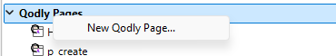
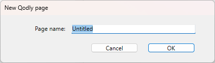
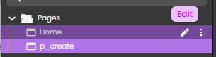

L'Explorateur est une fenêtre du mode Développement qui vous permet d'accéder facilement aux tables, formulaires, méthodes, commandes 4D intégrées, constantes et aux modules d'extension. Il fournit également des informations sur ces éléments. Vous pouvez afficher l'explorateur à tout moment en choisissant l'une des pages dans le sous-menu **Développement > Explorateur** ou en cliquant sur le bouton **Explorateur** dans la barre d'outils.

:::note

Pour une description complète de l'Explorateur, veuillez vous référer au [chapitre Explorateur sur doc.4d.com](https://doc.4d.com/4Dv21/4D/21/Explorer.200-7676561.en.html).

:::

## Page Formulaires

La page Formulaires contient trois listes : **Formulaires projet**, **Formulaires table** et **Pages Qodly**.

### Pages Qodly

Cette section vous permet de visualiser la liste des pages Qodly définies dans votre projet. Vous pouvez également ajouter ou ouvrir des pages.

Les pages listées dans la section Pages Qodly sont stockées dans le sous-dossier [**WebForm**](../Project/architecture.md#webforms) du dossier Sources du projet.

:::note

Les pages Qodly ne sont pas visibles dans la page **Accueil** de l'Explorateur.

:::

### Conditions requises

Les pages Qodly sont créées et éditées dans [Qodly Studio](https://developer.4d.com/qodly/4DQodlyPro/qodlyStudioInterface), un outil de développement basé sur le web. L'accès à Qodly Studio à partir de 4D nécessite quelques [configurations spécifiques](https://developer.4d.com/qodly/4DQodlyPro/gettingStarted#requirements), que vous [pouvez définir en un clic](https://developer.4d.com/qodly/4DQodlyPro/gettingStarted#one-click-configuration).

### Créer ou ouvrir une page Qodly

Vous pouvez créer ou ouvrir des pages Qodly directement à partir de l'Explorateur 4D. Si les [conditions requires](#requirements) sont remplies, la page est ouverte dans l'[éditeur de pages de Qodly Studio](https://developer.4d.com/qodly/4DQodlyPro/pageLoaders/pageLoaderOverview).

Pour créer une page :

- Sélectionnez **Nouvelle page Qodly...** dans le menu contextuel,  
  

- ou cliquez sur l'icône **+** ou sélectionnez **Nouvelle page Qodly...** dans la partie inférieure de l'Explorateur. 
  

Saisissez le nom de la page et cliquez sur **OK** pour ouvrir la page dans Qodly Studio :

Pour ouvrir une page :

- double-cliquez sur un nom de page Qodly, ou
- cliquez avec le bouton droit de la souris sur le nom d'une page Qodly et sélectionnez **Editer...** dans le menu contextuel.

### Renommer ou supprimer une page Qodly

Le renommage et la suppression d'une page Qodly ne peuvent être effectués que dans l'[éditeur de pages de Qodly Studio](https://developer.4d.com/qodly/4DQodlyPro/pageLoaders/pageLoaderOverview).

Cliquez sur l'icône du stylo pour renommer la page : 

Cliquez sur le bouton d'options et sélectionnez **Supprimer** pour supprimer une page : 

Une boîte de dialogue de confirmation s'affiche.

