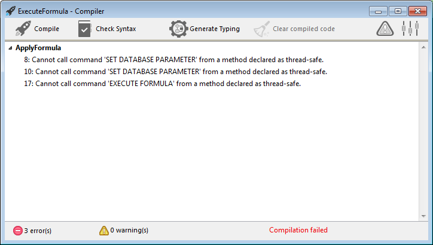

Le code 4D compilé peut être exécuté dans des **process préemptifs**. Grâce à cette fonctionnalité, vos applications 4D compilées peuvent tirer pleinement parti des ordinateurs multicoeurs, de sorte que leur exécution soit plus rapide et qu'elles puissent supporter davantage d'utilisateurs connectés.

## Qu'est-ce qu'un process préemptif?

Lorsqu'il est exécuté en mode _préemptif_, un process est dédié à un CPU (i.e. un processeur). La gestion des process est alors déléguée au système, qui peut allouer chaque CPU séparément sur une machine multicoeur.

Lorsqu'ils sont exécutés en mode _coopératif_, tous les process sont gérés par le process (thread) de l'application parente et partagent le même processeur, même sur une machine multicœur.

En conséquence, en mode préemptif, les performances globales de l'application sont améliorées, notamment sur les machines multicœurs, car plusieurs process peuvent réellement s'exécuter simultanément. Cependant, les gains réels dépendent des opérations en cours d'exécution. En contrepartie, étant donné qu'en mode préemptif chaque process est indépendant des autres et n'est pas géré directement par l'application, il y a des contraintes spécifiques appliquées au code que vous souhaitez rendre compatible avec une utilisation en préemptif. De plus, l'exécution en préemptif n'est disponible que dans certains contextes.

## Disponibilité du mode préemptif

L'utilisation du mode préemptif est prise en charge dans les contextes d'exécution suivants :

| Contexte            | Exécution préemptive                                                   |
| ------------------- | ---------------------------------------------------------------------- |
| 4D Server           | oui                                                                    |
| 4D mode distant     | oui, avec [ServerNet ou QUIC](../settings/client-server#network-layer) |
| 4D mono-utilisateur | oui                                                                    |
| Mode compilé        | oui                                                                    |
| Mode interprété     | non                                                                    |

Si le contexte d'exécution prend en charge le mode préemptif et si la méthode est "thread-safe", un nouveau process 4D lancé à l'aide des commandes `New process` ou `CALL WORKER`, ou du menu "Exécuter la méthode", sera exécuté dans un process préemptif.

Sinon, si vous appelez `New process` ou `CALL WORKER` à partir d'un contexte d'exécution qui n'est pas pris en charge (c'est-à-dire en mode interprété), le process est toujours coopératif.

## Code thread-safe ou non thread-safe

Le code 4D ne peut être exécuté dans un process préemptif que lorsque certaines conditions sont remplies. Chaque partie du code en cours d'exécution (commandes, méthodes, variables, fonctions, etc.) doit être conforme à l'utilisation préemptive. Les éléments qui peuvent être exécutés dans des process préemptifs sont appelés thread-safe et ceux qui ne peuvent pas être exécutés dans des process préemptifs sont appelés thread-unsafe.

:::note

Étant donné qu'un process est géré indépendamment à partir de la méthode du process parent, l'ensemble de la chaîne d'appel ne doit pas inclure de code thread-unsafe ; sinon, l'exécution préemptive ne sera pas possible. Ce point est détaillé [dans ce paragraphe](#when-is-a-process-started-preemptively).

:::

La propriété "thread safety" de chaque élément dépend de l'élément lui-même :

- Commandes 4D : la propriété thread-safe est une propriété interne. Dans le manuel Langage de 4D, les commandes thread-safe sont identifiées par l'icône . Vous pouvez également utiliser la commande [`Command name`](https://doc.4d.com/4dv20/help/command/fe/page538.html) pour savoir si une commande peut être utilisée de manière thread-safe. Une grande partie des commandes 4D peut s'exécuter en mode préemptif.
- Méthodes projet : les conditions pour être thread-safe sont répertoriées dans [ce paragraphe](#writing-a-thread-safe-method).

Fondamentalement, le code à exécuter dans des threads préemptifs ne peut pas appeler des parties avec des interactions externes, telles que du code de plug-in ou des variables interprocess. Cependant, l'accès aux données est autorisé car le serveur de données 4D et ORDA prennent en charge l'exécution préemptive.

## Déclaration d'une méthode préemptive

Par défaut, 4D exécute toutes les méthodes projet de votre application en mode coopératif. Si vous voulez bénéficier du mode préemptif, la première étape consiste à déclarer explicitement toutes les méthodes que vous souhaitez démarrer en mode préemptif chaque fois que cela est possible, c'est-à-dire les méthodes que vous considérez comme étant capables d'être exécutées dans un process préemptif. Le compilateur va [vérifier que ces méthodes sont réellement thread-safe](#writing-a-thread-safe-method) au moment de la compilation. Vous pouvez également interdire le mode préemptif pour certaines méthodes, si nécessaire.

Gardez à l'esprit que déclarer une méthode "capable" d'être utilisée en préemptif la rend éligible à l'exécution en préemptif mais ne garantit pas qu'elle sera réellement exécutée en mode préemptif. Le démarrage d'un process en mode préemptif résulte d'une [évaluation effectuée par 4D](#when-is-a-process-started-preemptively) concernant les propriétés de toutes les méthodes dans la chaîne d'appel du process.

Pour déclarer votre méthode éligible à une utilisation en mode préemptif, vous devez utiliser l'option de déclaration "Mode d'exécution" dans la boîte de dialogue des Propriétés de la méthode :


Les options suivantes sont prises en charge :

- **Peut être exécutée dans un process préemptif** : En sélectionnant cette option, vous déclarez que la méthode est capable d'être exécutée dans un process préemptif et qu'elle doit donc être exécutée en mode préemptif à chaque fois que cela est possible. La propriété "preemptive" de la méthode prend pour valeur "capable".

  Lorsque cette option est sélectionnée, le compilateur de 4D vérifiera que la méthode est effectivement capable et retournera des erreurs si ce n'est pas le cas -- par exemple, si elle appelle directement ou indirectement des commandes ou d'autres méthodes qui, elles, ne peuvent pas être exécutées en mode préemptif (toute la chaîne d'appel est analysée mais les erreurs sont signalées uniquement au premier niveau). Dans ce cas, vous pourrez modifier la méthode afin de la rendre "thread-safe" ou sélectionner une autre option.

  Si l'éligibilité de la méthode au mode préemptif est confirmée par le compilateur, elle est étiquetée "thread-safe" en interne et sera exécutée en mode préemptif à chaque fois que les conditions requises seront réunies. Cette propriété définit son éligibilité pour le mode préemptif mais ne garantit pas que la méthode sera réellement exécutée en mode préemptif, car ce mode d'exécution nécessite un [contexte spécifique](#when-is-a-process-started-preemptively).

- **Ne peut pas être exécutée dans un process préemptif** : En sélectionnant cette option, vous déclarez que la méthode ne doit jamais être exécutée en mode préemptif, et doit par conséquent toujours être exécutée en mode coopératif. La propriété "preemptive" de la méthode prend pour valeur "incapable".

  Lorsque cette option est sélectionnée, le compilateur de 4D ne vérifiera pas la compatibilité de la méthode avec le mode préemptif ; elle sera automatiquement étiquetée "thread-unsafe" en interne (même dans le cas où elle est théoriquement compatible). Lorsqu'elle sera appelée en exécution, cette méthode "contaminera" toutes les autres méthodes dans le même thread, les forçant à s'exécuter en mode coopératif, même si elles sont elles-mêmes "thread-safe".

- **Indifférent** (défaut) : En sélectionnant cette option, vous déclarez que vous ne souhaitez pas gérer la propriété du mode préemptif pour la méthode. La propriété "preemptive" de la méthode prend pour valeur "indifferent".

  Lorsque cette option est sélectionnée, le compilateur de 4D évaluera la compatibilité de la méthode avec le mode préemptif et lui apposera l'étiquette interne "thread-safe" ou "thread-unsafe". Aucune erreur liée à l'exécution en préemptif ne sera toutefois retournée. Si la méthode est évaluée "thread-safe", à l'exécution elle n'empêchera pas l'utilisation du mode préemptif si elle est appelée dans un contexte préemptif. A l'inverse, si la méthode est évaluée "thread-unsafe", à l'exécution elle empêchera toute utilisation du mode préemptif si elle est appelée.

A noter qu'avec cette option, quel que soit le résultat de l'évaluation de sa compatibilité avec le mode préemptif, la méthode sera toujours exécutée en mode coopératif lorsqu'elle sera appelée directement par 4D en tant que méthode parente (par exemple via la commande `New process`). La propriété "thread-safe" interne n'est prise en compte que lorsque la méthode est appelée par d'autres méthodes à l'intérieur de la chaîne d'appel.

:::note Cas particulier

Si la méthode a aussi la propriété [**Partagée entre composants et projet hôte**](../Project/code-overview.md#shared-by-components-and-host-database), l'option **Indifférent** marquera automatiquement la méthode comme thread-unsafe. Si vous souhaitez qu'une méthode de composant partagé soit thread-safe, vous devez explicitement lui attribuer l'option **Peut être exécutée dans un process préemptif**.

:::

## Quand un process est-il démarré en préemptif ?

:::info Rappel

L'exécution en préemptif n'est disponible qu'en mode compilé.

:::

En mode compilé, lorsque vous démarrez un process créé à l'aide des commandes `New process` ou `CALL WORKER`, 4D lit la propriété "preemptive" de la méthode du process (également nommée méthode _parente_) et exécute le process en mode préemptif ou coopératif, en fonction de cette propriété :

- Si la méthode du process est thread-safe (validée lors de la compilation), le process est exécuté dans un thread préemptif.
- Si la méthode du process est thread-unsafe, le process est exécuté dans un thread coopératif.
- Si la propriété "preemptive" de la méthode du process a été réglée sur "indifferent", par compatibilité, le process s'exécute dans un thread coopératif (même si la méthode est effectivement capable d'une utilisation en préemptif). Notez cependant que cette fonctionnalité de compatibilité est appliquée uniquement lorsque la méthode est utilisée en tant que méthode de process : une méthode déclarée "indifferent" mais marquée comme "thread-safe" en interne par le compilateur peut être appelée de manière préemptive par une autre méthode (voir ci-dessous).

La propriété thread-safe réelle dépend de la chaîne d'appels. Si une méthode avec la propriété déclarée comme "capable" appelle une méthode thread-unsafe à l'un de ses sous-niveaux, une erreur de compilation sera renvoyée : si une seule méthode dans toute la chaîne d'appels n'est pas thread-safe, elle "contaminera" toutes les autres méthodes et l'exécution préemptive sera rejetée par le compilateur. Un thread préemptif ne peut être créé que lorsque l'ensemble de la chaîne est thread-safe et que la méthode du process a été déclarée "Peut être exécutée dans un processus préemptif".
D'autre part, une même méthode thread-safe peut être exécutée dans un thread préemptif lorsqu'elle est dans une chaîne d'appel et dans un thread coopératif lorsqu'elle est dans une autre chaîne d'appel.

Par exemple, considérons les méthodes projet suivantes :

```4d
  //Méthode  projet MyDialog
  //contient des appels d'interface : sera thread unsafe en interne
 $win:=Open form window("tools";Palette form window)
 DIALOG("tools")
```

```4d
  //Méthode projet MyComp
  //contient un calcul simple : sera thread safe en interne
 #DECLARE($value : Integer) -> $result : Integer
 $result:=$value*2
```

```4d
  //Méthode projet CallDial
 var $vName : Text
 MyDialog
```

```4d
  //Méthode projet CallComp
 var $vAge : Integer
 MyComp($vAge)
```

Exécuter une méthode en mode préemptif dépendra de sa propriété "execution" et de la chaîne d'appel. Le tableau suivant illustre ces différentes situations :


| Déclaration et chaîne d'appel         | Compilation | Propriété thread safe résultante       | Mode d'exécution     | Commentaire                                                                                                                                                                                                                                                                                                                                                                                                                                                                                                                                                         |
| ------------------------------------- | ----------- | -------------------------------------- | -------------------- | ------------------------------------------------------------------------------------------------------------------------------------------------------------------------------------------------------------------------------------------------------------------------------------------------------------------------------------------------------------------------------------------------------------------------------------------------------------------------------------------------------------------------------------------------------------------- |
|  | OK          |   | Préemptif            | CallComp est la méthode parente, déclarée "capable" d'une utilisation en préemptif ; étant donné que MyComp est thread-safe en interne, CallComp est thread-safe et le process est préemptif                                                                                                                                                                                                                                                                                                                                                                        |
|  | Error       |   | Exécution impossible | CallDial est la méthode parente, déclarée "capable" ; MyDialog est "indifferent". Cependant, étant donné que MyDialog est thread-unsafe en interne, il contamine la chaîne d'appels. La compilation échoue en raison d'un conflit entre la déclaration de CallDial et sa capacité réelle. La solution consiste soit à modifier MyDialog afin qu'il devienne thread-safe pour que l'exécution soit préemptive, soit à modifier la déclaration de la propriété CallDial afin qu'elle s'exécute de manière coopérative |
|  | OK          |   | Coopératif           | Étant donné que CallDial est déclaré "incapable" d'une utilisation préemptive, la compilation marque thread-unsafe en interne ; ainsi, l'exécution sera toujours coopérative, indépendamment de l'état de MyDialog                                                                                                                                                                                                                                                                                                                                                  |
|  | OK          |   | Coopératif           | Étant donné que CallComp est la méthode parente avec la propriété "Indifferent", le process est coopératif même si toute la chaîne est thread-safe.                                                                                                                                                                                                                                                                                                                                                                                                 |
|  | OK          |  | Coopératif           | Puisque CallDial est la méthode parente (la propriété était "Indifferent"), le process est coopératif et la compilation est réussie                                                                                                                                                                                                                                                                                                                                                                                                              |

### Comment connaître le mode d'exécution courant

4D vous permet d'identifier le mode d'exécution des process en mode compilé :

- La commande [`PROCESS PROPERTIES`](https://doc.4d.com/4dv20/help/command/fr/page336.html) vous permet de savoir si un process est exécuté en mode préemptif ou coopératif.
- L'Explorateur d'exécution et la [fenêtre d'administration de 4D Server](../ServerWindow/processes.md#process-type) affichent des icônes spécifiques pour les process préemptifs.

## Ecrire une méthode thread-safe

Pour être thread-safe, une méthode doit respecter les règles suivantes :

- Elle doit avoir soit la propriété "Peut être exécutée dans un process préemptif" soit "Indifférent"
- Elle ne doit pas appeler une commande ou une fonction 4D qui n'est pas thread-safe.
- Elle ne doit pas appeler une autre méthode projet ou fonction qui n'est pas thread-safe
- Elle ne doit pas appeler un plug-in qui est thread-unsafe.
- Elle ne doit pas utiliser de variables interprocess(1)
- Elle ne doit pas appeler d'objets d'interface (2) (il y a cependant des exceptions, voir ci-dessous).

(1) Pour échanger des données entre des process préemptifs (et entre tous les process), vous pouvez transmettre des [collections partagées ou des objets partagés](../Concepts/shared.md) en tant que paramètres aux process, et/ou utiliser le catalogue [`Storage`](https://doc.4d.com/4dv20/help/command/fr/page1525.html).
Les [process Worker](processes.md#worker-processes) vous permettent également d'échanger des messages entre tous les process, y compris les process préemptifs.

(2) La commande [`CALL FORM`](https://doc.4d.com/4dv20/help/command/fe/page1391.html) fournit une solution élégante pour appeler des objets d'interface à partir d'un process préemptif.

:::note Notes

- Dans le cas d'une méthode "Partagée entre composants et projets hôtes", la propriété "Peut être exécutée dans un process préemptif" doit être sélectionnée.
- Toutes les instructions SQL sont thread-safe. Le code SQL inséré dans les blocs `Begin SQL`/`End SQL` doit respecter les conditions suivantes :
  - Il doit s'appliquer à 4D Server ou à la base de données 4D locale (les bases de données ODBC ou distantes via `SQL LOGIN` sont thread-unsafe. Cependant, les bases de données locales utilisées avec `USE DATABASE` sont thread-safe).
  * Tout trigger appelé par des instructions SQL doit être thread-safe (voir [Triggers](#triggers) ci-dessous).

:::

Les méthodes avec la propriété "Peut être exécutée dans un process préemptif" seront vérifiées par 4D lors de la compilation. Une erreur de compilation est émise chaque fois que le compilateur trouve quelque chose qui l'empêche d'être thread-safe :



:::info

Il est possible de [désactiver localement la vérification de la thread-safety](#).

:::

The [symbol file](../Project/compiler.md#complete-list-of-methods), if enabled, also contains the thread safety status for each method.

### Interface utilisateur

Étant donné qu'il s'agit d'accès "externes", les appels aux objets de l'interface utilisateur tels que les formulaires ainsi qu'au débogueur ne sont pas autorisés dans les threads préemptifs.

Les seuls accès possibles à l'interface utilisateur depuis un thread préemptif sont :

- [Dialogue d'erreurs standard](../Debugging/basics). La boîte de dialogue est affichée dans le process du mode utilisateur (sur 4D) ou dans le process de l'interface utilisateur du serveur (4D Server). Le bouton **Trace** est désactivé.
- Les indicateurs de progression standard
- Les dialogues `ALERT`, `Request` et `CONFIRM`. La boîte de dialogue est affichée dans le process du mode utilisateur (sur 4D) ou dans le process de l'interface utilisateur du serveur (4D Server). Notez que si 4D Server a été lancé en tant que service sur Windows sans autorisation de l'utilisateur, les dialogues ne seront pas affichés.

### Triggers

When a method uses a command that can call a [trigger](https://doc.4d.com/4Dv20R6/4D/20-R6/Triggers.300-6958353.en.html), the 4D compiler evaluates the thread safety of the trigger in order to check the thread safety of the method:

```4d
 SAVE RECORD([Table_1]) //trigger sur Table_1, s'il existe, doit être thread-safe
```

Voici la liste des commandes qui sont vérifiées au moment de la compilation pour la propriété thread safe du trigger :

`SAVE RECORD`, `SAVE RELATED ONE`, `DELETE RECORD`, `DELETE SELECTION`, `ARRAY TO SELECTION`, `JSON TO SELECTION`, `APPLY TO SELECTION`, `IMPORT DATA`, `IMPORT DIF`, `IMPORT ODBC`, `IMPORT SYLK`, `IMPORT TEXT`.

Si la table est passée de manière dynamique, le compilateur peut parfois ne pas être en mesure de déterminer quel trigger il doit évaluer. Voici quelques exemples de telles situations :

```4d
 DEFAULT TABLE([Table_1])
 SAVE RECORD
 SAVE RECORD($ptrOnTable->)
 SAVE RECORD(Table(myMethodThatReturnsATableNumber())->)
```

Dans ce cas, tous les triggers sont évalués. Si une commande thread-unsafe est détectée dans au moins un trigger, l'ensemble du groupe est rejeté et la méthode est déclarée thread-unsafe.

:::note

In [client/server applications](../Desktop/clientServer.md), triggers may be executed in cooperative mode, even if their code is thread-safe. This happens when a trigger is activated from a remote process: in this case, the trigger is executed in the ["twinned" process of the client process](https://doc.4d.com/4Dv20R6/4D/20-R6/4D-Server-and-the-4D-Language.300-7182872.en.html#68966) on the server machine. Since this process is used for all calls from the client, it is always executed in cooperative mode.

:::

### Méthodes de gestion d'erreurs

Les [méthodes d'interception d'erreurs](../Concepts/error-handling.md) installées par la commande `ON ERR CALL` doivent être thread-safe si elles sont susceptibles d'être appelées à partir d'un process préemptif. Pour gérer ce cas, le compilateur vérifie la propriété thread-safe des méthodes projet d'interception d'erreurs passées à la commande `ON ERR CALL` lors de la compilation et renvoie les erreurs appropriées si elles ne sont pas conformes à l'exécution préemptive.

Notez que cette vérification n'est possible que lorsque le nom de la méthode est passé en tant que constante et non calculé, comme illustré ci-dessous :

```4d
ON ERR CALL("myErrMethod1") //sera vérifié par le compilateur
ON ERR CALL("myErrMethod"+String($vNum)) //ne sera pas vérifié par le compilateur
```

De plus, si une méthode projet de capture d'erreurs ne peut pas être appelée à l'exécution (suite à un problème de thread safety, ou pour toute autre raison comme "méthode introuvable"), l'erreur -10532 "Impossible d'appeler la méthode de projet de gestion des erreurs 'nomMethode'" est générée.

### Compatibilité des pointeurs

Un process ne peut déréférencer un pointeur pour accéder à la valeur d'une autre variable process que si les deux process sont coopératifs ; sinon, 4D génèrera une erreur. Dans un process préemptif, si du code 4D essaie de déréférencer un pointeur vers une variable interprocess, 4D génèrera une erreur.

Exemple avec les méthodes suivantes :

Méthode1 :

```4d
 myVar:=42
 $pid:=New process("Method2";0;"process name";->myVar)
```

Méthode2 :

```4d
 $value:=$1->
```

Si le process exécutant la méthode 1 ou le process exécutant la méthode 2 est préemptif, alors l'expression `$value:=$1->` génèrera une erreur d'exécution.

### Référence de document DocRef

L'utilisation des paramètres de type DocRef (référence de document ouvert, utilisée ou renvoyée par `Open document`, `Create document`, `Append document`, `CLOSE DOCUMENT`, `RECEIVE PACKET`, `SEND PACKET`) est limitée aux contextes suivants :

- Lorsqu'elle est appelée à partir d'un process préemptif, une référence `DocRef` n'est utilisable que depuis ce process préemptif.
- Lorsqu'elle est appelée à partir d'un process coopératif, une référence `DocRef` est utilisable depuis n'importe quel autre processus coopératif.

## Désactiver localement la vérification de la propriété thread-safe

Il peut y avoir certains cas où vous préférez que la vérification de la propriété thread-safe des commandes ne soit pas appliquée à certaines parties du code, par exemple lorsqu'il contient des commandes thread-unsafe que vous savez ne jamais être appelées.

Pour faire cela, vous devez entourer le code à exclure de la vérification avec les directives spéciales `%T-` et `%T+` en tant que commentaires. Le commentaire `//%T-` désactive la vérification de la propriété thread safe et `//%T+` la réactive :

```4d
  // %T- to disable thread safety checking

  // Place the code containing commands to be excluded from thread safety checking here
 $w:=Open window(10;10;100;100) //for example

  // %T+ to enable thread safety checking again for the rest of the method
```

Bien entendu, le développeur 4D est responsable de la compatibilité du code entre les directives de désactivation et de réactivation avec le mode préemptif. Des erreurs d'exécution seront générées si du code thread-unsafe est exécuté dans un process préemptif.
