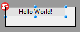
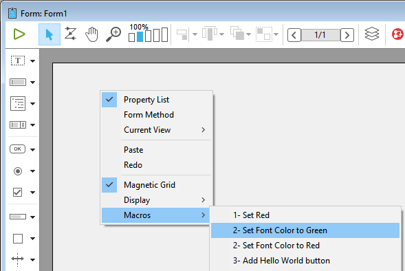

L'éditeur de formulaires 4D prend en charge les macros. Une macro est un ensemble d'instructions permettant de réaliser une action ou une séquence d'actions. Lorsqu'elle est appelée, la macro exécutera ses instructions et, automatiquement, les actions.

Par exemple, si vous avez un rapport récurrent avec une mise en forme spécifique (par exemple, certains textes doivent apparaître en rouge et certains textes en vert), vous pouvez créer une macro pour définir automatiquement la couleur. Vous pouvez créer des macros pour l'éditeur de formulaires de 4D qui pourront :

- Créer et exécuter du code 4D
- Afficher les boîtes de dialogue
- Sélectionnez des objets de formulaire
- Ajouter / supprimer / modifier des formulaires, des objets de formulaire ainsi que leurs propriétés
- Modifier les fichiers de projet (mettre à jour, supprimer)

Le code des macros prend en charge les [class functions (fonctions de classe)](Concepts/classes.md) et les [propriétés d'objet de formulaire en JSON](FormObjects/properties_Reference.md) pour vous permettre de définir n'importe quelle fonctionnalité perso

Des macros peuvent être définies pour le projet hôte ou pour les composants du projet. Habituellement, vous créez une macro et l'installez dans les composants que vous utilisez pour le développement.

Lorsqu'elle est appelée, une macro remplace tous les comportements précédemment spécifiés.

## Exemple pratique

Dans ce court exemple, vous verrez comment créer et appeler une macro qui ajoute un bouton d'alerte "Hello World!" dans le coin supérieur gauche de votre formulaire.

1. Dans un fichier `formMacros.json` dans le dossier `Sources` de votre projet, entrez le code suivant :

```js
{
   "macros": {
      "Add Hello World button": {
       "class": "AddButton"
     }
   }
}
```

2. Créez une classe 4D nommée `AddButton`.

3. Dans la classe `AddButton`, écrivez la fonction suivante :

```4d
Function onInvoke($editor : Object)->$result : Object
	
	var $btnHello : Object
	
	// Créer un bouton "Hello"
	$btnHello:=New object("type"; "button"; \
	"text"; "Hello World!"; \
	"method"; New object("source"; "ALERT(\"Hello World!\")"); \
	"events"; New collection("onClick"); \
	"width"; 120; \
	"height"; 20; \
	"top"; 0; \
	"left"; 0)	
	
	// Ajouter le bouton dans la page courante
	$editor.editor.currentPage.objects.btnHello:=$btnHello	
	
	// Sélectionner le nouveau bouton dans l'éditeur de formulaires
	$editor.editor.currentSelection.clear() //unselect elements
	$editor.editor.currentSelection.push("btnHello")	
	
	// Notifier l'éditeur de formulaires de la modification
	$result:=New object("currentSelection"; $editor.editor.currentSelection;\  
		"currentPage"; $editor.editor.currentPage)
```

Ensuite, vous pouvez appeler la macro :



## Appeler des macros dans l'éditeur de formulaires

Lorsque des macros sont définies dans votre projet 4D, vous pouvez appeler une macro à l'aide du menu contextuel de l'éditeur de formulaires :



Ce menu est crée selon le(s) [fichier(s) de définition de macro](#location-of-macros) `formMacros.json`. Les macros sont classées par ordre alphabétique.

Ce menu peut être appelé dans une zone vide ou une sélection dans le formulaire. Les objets sélectionnés sont passés à `$editor.currentSelection` ou `$editor.target` dans la [fonction `onInvoke`](#oninvoke) de la macro.

Une seule macro peut exécuter plusieurs opérations. Si elle est sélectionnée, la fonction **Annuler** de l'éditeur de formulaires peut être utilisée pour inverser les opérations de macro.

## Emplacement du fichier de macro

Toutes les macros de l'éditeur de formulaire 4D sont définies dans un seul fichier JSON par projet ou composant : `FormMacros.json`.

Ce fichier doit se trouver dans le dossier **Projet** >**Sources** de l'hôte ou du composant :


## Déclaration de macros

La structure du fichier `formMacros.json` est la suivante :

```js
{
    "macros": {
            <macroName>: {
                "class": <className>,
                <customProperty> : <value>
        }
    }
}
```

Voici la description du contenu du fichier JSON :

| Attribut |               |                    | Type   | Description                                                                          |
| -------- | ------------- | ------------------ | ------ | ------------------------------------------------------------------------------------ |
| macros   |               |                    | object | liste des macros définis                                                             |
|          | `<macroName>` |                    | object | définition de la macro                                                               |
|          |               | class              | string | nom de classe de la macro                                                            |
|          |               | `<customProperty>` | any    | (optionnel) valeur personnalisée à récupérer dans le constructeur |

Les propriétés personnalisées, lorsqu'elles sont utilisées, sont passées à la fonction [constructeur](#class-constructor) de la macro.

### Exemple

```js
{
   "macros": {
     "Open Macros file": {
       "class": "OpenMacro"
     },
     "Align to Right on Target Object": {
       "class": "AlignOnTarget",
       "myParam": "right"
     },
     "Align to Left on Target Object": {
       "class": "AlignOnTarget",
       "myParam": "left"
     }
   }
}
```

## Instancier des macros dans 4D

Chaque macro que vous souhaitez instancier dans votre projet ou composant doit être déclarée en tant que [classe 4D](Concepts/classes.md).

Le nom de la classe doit correspondre au nom défini à l'aide de l'attribut [class](#creating-macros) du fichier `formMacros.json`.

Les macros sont instanciées au lancement de l'application. Par conséquent, si vous modifiez la structure de la classe macro (ajout d'une fonction, modification d'un paramètre...) ou le [constructeur](#class-constructor), vous devrez redémarrer l'application pour appliquer les modifications.

## Fonctions macro

Chaque classe de macro peut contenir un `Class constructor` (constructeur de classe) et deux fonctions : `onInvoke()` et `onError()`.

### Class constructor

#### Class constructor($macro : Object)

| Paramètres | Type   | Description                                                                          |
| ---------- | ------ | ------------------------------------------------------------------------------------ |
| $macro     | Object | Objet de déclaration de macro (dans le fichier `formMacros.json`) |

Les macros sont instanciées à l'aide d'une fonction [class constructor](Concepts/classes.md#class-constructor), le cas échéant.

Le class constructor est appelé une fois lors de l'instanciation de classe, qui se produit au démarrage de l'application.

Les propriétés personnalisées ajoutées à la [déclaration macro](#declaring-macros) sont retournées dans le paramètre de la fonction class contructor.

#### Exemple

Dans le fichier `formMacros.json` :

```js
{
   "macros": {
     "Align to Left on Target Object": {
       "class": "AlignOnTarget",
       "myParam": "left"
     }
   }
}
```

Vous pouvez écrire :

```4d
// Class "AlignOnTarget"
Class constructor($macro : Object)
    This.myParameter:=$macro.myParam //gauche
    ...
```

### onInvoke()

#### onInvoke($editor : Object) -> $result : Object

| Paramètres | Type   | Description                                                                                                    |
| ---------- | ------ | -------------------------------------------------------------------------------------------------------------- |
| $editor    | Object | Objet Form Editor Macro Proxy contenant les propriétés du formulaire                                           |
| $result    | Object | Objet Form Editor Macro Proxy retournant des propriétés modifiées par la macro (facultatif) |

La fonction `onInvoke` est automatiquement exécutée à chaque fois que la macro est appelée.

Lorsque la fonction est appelée, elle reçoit dans la propriété `$editor.editor` une copie de tous les éléments du formulaire avec leurs valeurs courantes. Vous pouvez ensuite exécuter n'importe quelle opération sur ces propriétés.

Une fois les opérations terminées, si la macro entraîne la modification, l'ajout ou la suppression d'objets, vous pouvez transmettre les propriétés modifiées résultantes dans `$result`. Le processeur de macros analysera les propriétés retournées et appliquera les opérations nécessaires dans le formulaire. Évidemment, moins vous retournez de propriétés, moins le traitement prendra du temps.

Voici les propriétés retournées dans le paramètre *$editor* :

| Propriété                                                        | Type       | Description                                                                            |
| ---------------------------------------------------------------- | ---------- | -------------------------------------------------------------------------------------- |
| $editor.editor.form              | Object     | L'ensemble du formulaire                                                               |
| $editor.editor.file              | File       | Objet fichier du formulaire                                                            |
| $editor.editor.name              | Text       | Nom du formulaire                                                                      |
| $editor.editor.table             | number     | Numéro de table du formulaire, 0 pour un formulaire projet                             |
| $editor.editor.currentPageNumber | number     | Numéro de la page courante                                                             |
| $editor.editor.currentPage       | Object     | Page courante, contenant tous les objets du formulaire et l'ordre de saisie de la page |
| $editor.editor.currentSelection  | Collection | Collection de noms d'objets sélectionnés                                               |
| $editor.editor.formProperties    | Object     | Propriétés du formulaire courant                                                       |
| $editor.editor.target            | string     | Nom de l'objet sous la souris lorsque vous cliquez sur une macro                       |

Voici les propriétés que vous pouvez passer dans l'objet `$result` si vous voulez que le processeur de macro exécute une modification. Toutes les propriétés sont optionnelles:

| Propriété                         | Type       | Description                                                             |
| --------------------------------- | ---------- | ----------------------------------------------------------------------- |
| currentPage                       | Object     | Page courante incluant les objets modifiés par la macro, le cas échéant |
| currentSelection                  | Collection | Sélection courante si modifiée par la macro                             |
| formProperties                    | Object     | Propriétés du formulaire si modifiées par la macro                      |
| editor.groups     | Object     | informations du groupe, si les groupes sont modifiés par la macro       |
| editor.views      | Object     | informations sur les vues, si les vues sont modifiées par la macro      |
| editor.activeView | Text       | Nom de la vue active                                                    |

Par exemple, si des objets de la page courante et des groupes ont été modifiés, vous pouvez écrire ce qui suit :

```4d
	$result:=New object("currentPage"; $editor.editor.currentPage ; \ 
			"editor"; New object("groups"; $editor.editor.form.editor.groups))

```

#### attribut `method`

Lors de la manipulation de l'attribut `method` des objets de formulaire, vous pouvez définir la valeur de l'attribut de deux manières différentes dans les macros :

- En utilisant une [chaîne de caractères contenant le nom/chemin du fichier](FormObjects/properties_Action.md#method).

- En utilisant un objet avec la structure suivante :

| Propriété | Type | Description        |
| --------- | ---- | ------------------ |
| source    | Text | code de la méthode |

4D créera un fichier en utilisant le nom de l'objet dans le dossier "objectMethods" avec le contenu de l'attribut `source`. Cette fonctionnalité n'est disponible que pour le code macro.

#### Propriété `$4dId` dans `currentPage.objects`

La propriété `$4dId` définit un ID unique pour chaque objet de la page courante. Cette clé est utilisée par le processeur de macros pour gérer les modifications dans `$result.currentPage` :

- si la clé `$4dId` est manquante à la fois dans le formulaire et dans un objet dans `$result`, l'objet est créé.
- si la clé `$4dId` existe dans le formulaire mais est manquante dans `$result`, l'objet est supprimé.
- si la clé `$4dId` existe à la fois dans le formulaire et dans un objet dans `$result` l'objet est modifié.

#### Exemple

Vous souhaitez définir une fonction macro qui appliquera la couleur rouge et le style de police italique à tous les objets sélectionnés.

```4d
Function onInvoke($editor : Object)->$result : Object
	var $name : Text
	
	If ($editor.editor.currentSelection.length>0)		
		//  Définir le contour en rouge et le style en italique pour chaque objet sélectionné
		For each ($name; $editor.editor.currentSelection)
			$editor.editor.currentPage.objects[$name].stroke:="red"
			$editor.editor.currentPage.objects[$name].fontStyle:="italic"

		End for each 
		
	Else 
		ALERT("Please select a form object.")
	End if 
	
	// Notifier 4D de la modification
	$result:=New object("currentPage"; $editor.editor.currentPage)
```

### onError()

#### onError($editor : Object; $resultMacro : Object ; $error : Collection)

| Paramètres   |                                                                                           | Type       | Description                              |
| ------------ | ----------------------------------------------------------------------------------------- | ---------- | ---------------------------------------- |
| $editor      |                                                                                           | Object     | Objet envoyé à [onInvoke](#oninvoke)     |
| $resultMacro |                                                                                           | Object     | Objet retourné par [onInvoke](#oninvoke) |
| $error       |                                                                                           | Collection | Pile d'erreurs                           |
|              | [].errCode            | Number     | Code d'erreur                            |
|              | [].message            | Text       | Description de l'erreur                  |
|              | [].componentSignature | Text       | Signature du composant interne           |

La fonction `onError` est exécutée lorsque le processeur de macros rencontre une erreur.

Lors de l'exécution d'une macro, si 4D rencontre une erreur qui empêche l'annulation de la macro, il n'exécute pas la macro. C'est le cas par exemple si l'exécution d'une macro se traduirait par :

- supprimer ou modifier un script dont le fichier est en lecture seule.
- créer deux objets avec le même ID interne.

#### Exemple

Dans une définition de classe de macro, vous pouvez écrire le code d'erreur générique suivant:

```4d
Function onError($editor : Object; $resultMacro : Object; $error : Collection)
	var $obj : Object
	var $txt : Text
	$txt:=""
	
	For each ($obj; $error)
		$txt:=$txt+$obj.message+" \n"
	End for each 
	
	ALERT($txt)
```
