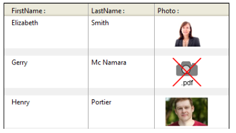

4D inclut une prise en charge spécifique des images utilisées dans vos formulaires.

## Formats natifs pris en charge

4D intègre une gestion native des images. Cela signifie que les images sont affichées et stockées dans leur format d’origine, sans interprétation dans 4D. The specific features of the different formats (shading, transparent areas, etc.) will be retained when they are copied and pasted, and will be displayed without alteration. Ce support natif est valable pour toutes les images stockées dans les formulaires 4D : [images statiques](FormObjects/staticPicture.md) collées en mode Développement, images collées dans des [objets de saisie](FormObjects/input_overview.md) à l'exécution,

Les formats d'image les plus courants sont pris en charge par les deux plates-formes : jpeg, gif, png, tiff, bmp, etc. Sous macOS, le format pdf est également disponible pour l'encodage et le décodage.

> La liste complète des formats pris en charge varie en fonction du système d’exploitation et des codecs personnalisés installés sur les postes. Pour savoir quels sont codecs disponibles, vous devez utiliser la commande `PICTURE CODEC LIST` (voir aussi la description du [type de données image](Concepts/dt_picture.md)).

### Format d'image non disponible

Une icône spécifique est affichée pour les images stockées dans un format non disponible sur le poste. L'extension du format manquant est inscrite en bas de l'icône :

L'icône est automatiquement utilisée partout où l'image doit être affichée :

Cette icône indique que l'image ne peut être ni affichée ni manipulée localement -- mais elle peut être stockée sans altération pour être affichée sur une autre machine. C'est le cas, par exemple, pour les images PDF sous Windows ou les images au format PICT.

## Images de haute résolution

4D prend en charge des images haute résolution sur les plateformes macOS et Windows. Les images haute résolution peuvent être définies par le facteur d'échelle ou le dpi.

### Facteur d'échelle

Les écrans haute résolution ont une densité de pixels plus élevée que les écrans standard traditionnels. Pour que les images s'affichent correctement sur des écrans haute résolution, le nombre de pixels de l'image doit être multiplié par le _facteur d'échelle_ (c'est-à-dire deux fois plus grand, trois fois plus grand, etc.).

Lorsque vous utilisez des images haute résolution, vous pouvez spécifier le facteur d'échelle en ajoutant "@nx" dans le nom de l'image (où _n_ désigne le facteur d'échelle). Dans le tableau ci-dessous, vous constaterez que le facteur d'échelle est indiqué dans les noms des images haute résolution, _circle@2x.png_ et _circle@3x.png_.

| Type d'affichage    | Facteur d'échelle                                                  | Exemple                                                                                                                                                                                         |
| ------------------- | ------------------------------------------------------------------ | ----------------------------------------------------------------------------------------------------------------------------------------------------------------------------------------------- |
| Résolution standard | densité de pixel 1:1.              | **1x**  _circle.png_                                                                                                          |
| Haute résolution    | Densité de pixel augmentée d'un facteur de 2 ou 3. | <table><th>2x</th><th>3x</th><tr><td>*circle@2x.png*</td><td> *circle@3x.png*</td></tr></table> |

Les images haute résolution avec la convention @nx peuvent être utilisées dans les objets suivants :

- [Static pictures](FormObjects/staticPicture.md)
- [Boutons](FormObjects/button_overview.md)/[radio](FormObjects/radio_overview.md)/[cases à cocher](FormObjects/checkbox_overview.md)
- [Boutons image](FormObjects/pictureButton_overview.md)/[Pop-up image](FormObjects/picturePopupMenu_overview.md)
- [Tab controls](FormObjects/tabControl.md)
- [List box headers](FormObjects/listbox_overview.md#list-box-headers)
- [Menu icons](Menus/properties.md#item-icon)

4D priorise automatiquement les images avec la résolution la plus élevée. 4D priorise automatiquement les images avec la résolution la plus élevée. Même si une commande ou une propriété spécifie _circle.png_, _circle@3x.png_ sera utilisé (le cas échéant).

> A noter que cette résolution se produit uniquement pour l'affichage des images à l'écran, aucune hiérarchisation automatique n'est effectuée lors de l'impression.

### DPI

Si 4D donne automatiquement la priorité à la résolution la plus élevée, il existe cependant des différences de comportement en fonction de la résolution de l'écran et de l'image _(\*)_ et du format de l'image :

| Opération                                                                                                                                                                          | Comportement                                                                                                                                                                                                                                                                                                                                                                                                                                                                                                                                                                                                                                                                     |
| ---------------------------------------------------------------------------------------------------------------------------------------------------------------------------------- | -------------------------------------------------------------------------------------------------------------------------------------------------------------------------------------------------------------------------------------------------------------------------------------------------------------------------------------------------------------------------------------------------------------------------------------------------------------------------------------------------------------------------------------------------------------------------------------------------------------------------------------------------------------------------------- |
| Déposer ou Coller                                                                                                                                                                  | If the picture has:<ul><li>**72dpi or 96dpi** - The picture is "[Center](FormObjects/properties_Picture.md#center--truncated-non-centered)" formatted and the object containing the picture has the same number of pixels.</li><li>**Other dpi** - The picture is "[Scaled to fit](FormObjects/properties_Picture.md#scaled-to-fit)" formatted and the object containing the picture is equal to (picture's number of pixels \* screen dpi) / (picture's dpi)</li> <li>**No dpi** - The picture is "[Scaled to fit](FormObjects/properties_Picture.md#scaled-to-fit)" formatted.</li></ul> |
| [Taille automatique](https://doc.4d.com/4Dv19/4D/19/Setting-object-display-properties.300-5416671.en.html#148057) (menu contextuel de l'éditeur de formulaires) | If the picture's display format  is:<ul><li>**[Scaled](FormObjects/properties_Picture.md#scaled-to-fit)** - The object containing the picture is resized according to (picture's number of pixels \* screen dpi) / (picture's dpi) </li> <li>**Not scaled** - The object containing the picture has the same number of pixels as the picture.</li></ul>                                                                                                                                                                                                                                                    |

_(\*) Typically,  macOS = 72dpi, Windows = 96dpi_

## Images en mode sombre (macOS uniquement)

Vous pouvez définir des images et des icônes spécifiques qui seront utilisées à la place des images standard lorsque [les formulaires utilisent le mode sombre](properties_FormProperties.md#color-scheme).

Une image en mode sombre est définie comme suit :

- l'image du mode sombre porte le même nom que la version standard (mode clair) avec le suffixe "`_sombre`"
- l'image en mode sombre est stockée à côté de la version standard.

Au moment de l'exécution, 4D charge automatiquement l'image en mode clair ou sombre, en fonction du [mode de couleurs du formulaire courant](https://doc.4d.com/4dv19/help/command/en/1761.html).

## Coordonnées de la souris dans une image

4D lets you retrieve the local coordinates of the mouse in an [input object](FormObjects/input_overview.md) associated with a [picture expression](FormObjects/properties_Object.md#expression-type), in case of a click or a hovering, even if a scroll or zoom has been applied to the picture. Ce mécanisme, proche de celui d'une image map, peut être utilisé par exemple pour gérer les barres de bouton défilables ou bien l'interface de logiciels de cartographie.

The coordinates are returned in the _MouseX_ and _MouseY_ [System Variables](../Concepts/variables.md#system-variables). Les coordonnées sont exprimées en pixels par rapport à l'angle supérieur gauche de l'image (0,0). Lorsque la souris se trouve en dehors du système de coordonnées de l'image, la valeur -1 est retournée dans _MouseX_ et _MouseY_.

You can get the value of these variables as part of the [`On Clicked`](Events/onClicked.md), [`On Double Clicked`](Events/onDoubleClicked.md), [`On Mouse up`](Events/onMouseUp.md), [`On Mouse Enter`](Events/onMouseEnter.md), or [`On Mouse Move`](Events/onMouseMove.md) form events.
