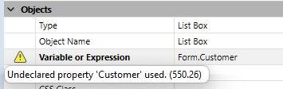

---

## Schéma de couleurs

> La propriété de schéma de couleurs n'est appliquée que sur macOS.

Cette propriété définit la palette de couleurs du formulaire. By default when the property is not set, the value for a color scheme is **inherited** (the form uses the scheme defined at the [application level](../commands-legacy/set-application-color-scheme.md)). Pour le formulaire, cette option peut être remplacée par l'une des deux options suivantes :

- dark - texte clair sur fond foncé
- light - texte foncé sur fond clair

> Une palette de couleurs définie ne peut pas être remplacée par un CSS.

#### Grammaire JSON

| Nom         | Type de données | Valeurs possibles |
| ----------- | --------------- | ----------------- |
| colorScheme | string          | "dark", "light"   |

---

## CSS

This property allows you to load specific CSS file(s) for the form.

A CSS file defined at the form level will override default style sheet(s). For more information, please refer to [Style sheets](createStylesheet.md) page.

#### Grammaire JSON

| Nom | Type de données      | Valeurs possibles                                                                                                                                                                                                                                                                                                               |
| --- | -------------------- | ------------------------------------------------------------------------------------------------------------------------------------------------------------------------------------------------------------------------------------------------------------------------------------------------------------------------------- |
| css | string or collection | CSS file path(s) provided as:<li>a string (a file for both platforms)</li><li>a collection of strings (a list of files for both platform)</li><li>a collection of {"path":string;"media":"mac" \| "win"} objects </li> |

---

## Form Class

Name of an existing [user class](../Concepts/classes.md#class-definition) to associate to the form . The user class can belong to the host project or to a [component](../Extensions/develop-components.md#sharing-of-classes), in which case the formal syntax is "[_componentNameSpace_](../settings/general.md#component-namespace-in-the-class-store).className".

Associating a class to the form provides the following benefits:

- When you work in the [Form editor](../FormEditor/formEditor.md), the associated class is used for accurate syntax checking of expressions such as `Form.myProperty` in all areas of the [Property list](../FormEditor/formEditor.md#property-list) that support [expressions](../Concepts/quick-tour.md#expressions) (e.g. **Variable or Expression**, **Font color expression**...). Errors are displayed in red and warnings are displayed in yellow in the left column of the Property list and you can hover it to get explanations:

- The detection of errors in the code of form object expressions by the [compiler](../Project/compiler.md) is improved.

- You can also to benefit from [autocompletion features](../code-editor/write-class-method.md#autocomplete-functions) in the code editor.

- When the form is executed, 4D automatically instantiates a user class object for the form, which is returned by the [`Form`](../commands/form.md) object. Your code can directly access class functions defined in the user class through the `Form` command (e.g. `Form.message()`) without having to pass a _formData_ object as parameter to the [`DIALOG`](../commands/dialog.md), [`Print form`](../commands/print-form.md), or [`FORM LOAD`](../commands/form-load.md) commands.

:::note

See [this blog post](http://blog.4d.com/empower-your-development-process-with-your-forms) for an illustration of this feature.

:::

#### Grammaire JSON

| Nom       | Type de données | Valeurs possibles                                                                                                       |
| --------- | --------------- | ----------------------------------------------------------------------------------------------------------------------- |
| formClass | string          | name of an existing user class ("_className_" or "_componentNameSpace_._className_") |

---

## Form Name

This property is the name of the form itself and is used to refer to the form by name using the 4D language. The form name must comply with the [rules specified for identifiers](Concepts/identifiers.md) in 4D.

#### Grammaire JSON

The form name is defined by the name of the folder that contains the form.4Dform file. See [project architecture](Project/architecture.md#sources-folder) for more information.

---

## Form Type

The form type, _i.e._ its destination, defines the features that will be available to the form. For example, [markers](properties_Markers.md) can only be set for list (output) table forms.

Each table in a database generally has at least two table forms. One for listing records on-screen and the other for displaying one record at a time (used for data entry and modifications):

- Output form - the _output form_ or _list form_ displays a list of records, with a single line per record. The results of queries are shown in an output form and users can double-click a line to display the input form for that record.
  

- Input form - used for data entry. It displays a single record per screen and typically has buttons for saving and canceling modifications to the record and for navigating from record to record (_i.e._, First Record, Last Record, Previous Record, Next Record).
  

Supported types depend on the form category:

| Form Type                | JSON grammar     | Description                                                   | Supported with              |
| ------------------------ | ---------------- | ------------------------------------------------------------- | --------------------------- |
| Formulaire détaillé      | detailScreen     | A display form for data entry and modification                | Project forms - Table forms |
| Detail Form for Printing | detailPrinter    | A printed report with one page per record, such as an invoice | Project forms - Table forms |
| List Form                | listScreen       | A form for listing records on the screen                      | Table forms                 |
| List Form for Printing   | listPrinter      | A printed report that list records                            | Table forms                 |
| Aucun                    | _no destination_ | A form with no specific feature                               | Project forms - Table forms |

#### Grammaire JSON

| Nom         | Type de données | Valeurs possibles                                            |
| ----------- | --------------- | ------------------------------------------------------------ |
| destination | string          | "detailScreen", "listScreen", "detailPrinter", "listPrinter" |

---

## Inherited Form Name

This property designates the [form to inherit](forms.md#inherited-forms) in the current form.

To inherit from a table form, set the table in the [Inherited Form Table](#inherited-form-table) property.

To remove inheritance, select `\<None>` in the Property List (or " " in JSON).

#### Grammaire JSON

| Nom           | Type de données | Valeurs possibles                                                                                                                  |
| ------------- | --------------- | ---------------------------------------------------------------------------------------------------------------------------------- |
| inheritedForm | string          | Name of table or project form OR a POSIX path to a .json file describing the form OR an object describing the form |

---

## Inherited Form Table

This property specifies the database table from which to [inherit a form](forms.md#inherited-forms) in the current form.

Set to `\<None>` in the Property List (or " " in JSON) to inherited from a project form.

#### Grammaire JSON

| Nom                | Type de données  | Valeurs possibles          |
| ------------------ | ---------------- | -------------------------- |
| inheritedFormTable | string or number | table name or table number |

---

## Pages

Chaque formulaire est composé d'au moins deux pages :

- une page 0 (page de fond)
- une page 1 (page principale)

Pour plus d'informations, veuillez consulter le thème [Pages formulaire](forms.md#form-pages).

#### Grammaire JSON

| Nom   | Type de données | Valeurs possibles                                                                                   |
| ----- | --------------- | --------------------------------------------------------------------------------------------------- |
| pages | collection      | Collection de pages (chaque page est un objet, la page 0 est le premier élément) |

---

## Publié en tant que sous-formulaire

Pour qu'un formulaire de composant soit sélectionné comme [sous-formulaire](FormObjects/subform_overview.md) dans une base de données hôte, il doit avoir été explicitement partagé. Lorsque cette propriété est sélectionnée, le formulaire sera publié dans le projet hôte.

Seuls les projets formulaire peuvent être indiqués comme étant des sous-formulaires publiés.

#### Grammaire JSON

| Nom    | Type de données | Valeurs possibles |
| ------ | --------------- | ----------------- |
| shared | boolean         | true, false       |

---

## Mémoriser géométrie

Lorsque cette option est cochée, si la fenêtre est ouverte via la commande `Creer fenetre` formulaire avec le paramètre `*`, plusieurs paramètres du formulaire seront automatiquement mémorisés par 4D au moment de la fermeture de la fenêtre, quelle que soi

- la page courante,
- la position, la taille et la visibilité de chaque objet du formulaire (y compris la taille et la visibilité des colonnes de list box).

> Cette option ne prend pas en compte les objets générés via la commande `OBJECT DUPLICATE`. Pour que l’utilisateur retrouve son environnement lors de l’utilisation de cette commande, le développeur doit répéter la séquence de création, définition et positionnement des objets.

Lorsque cette option est cochée, l’option [Mémoriser valeur](FormObjects/properties_Object.md#save-value) est en outre disponible pour certains objets.

#### Grammaire JSON

| Nom              | Type de données | Valeurs possibles |
| ---------------- | --------------- | ----------------- |
| memorizeGeometry | boolean         | true, false       |

#### Voir également

[**Save Value**](FormObjects/properties_Object.md#save-value)

---

## Nom de la fenêtre

Le nom de la fenêtre est utilisé lorsque le formulaire est ouvert à l'aide des commandes `Open form window` et `Open window` dans l'environnement d'application. Le nom de la fenêtre apparaît dans la barre de titre de la fenêtre.

Vous pouvez utiliser des références dynamiques pour définir les noms de fenêtre des formulaires, c'est-à-dire :

- Une référence XLIFF standard stockée dans le dossier Resources.
- Un libellé de table ou de champ : La syntaxe à appliquer est la suivante : `<?[TableNum]FieldNum>` ou `<?[TableName]FieldName>`.
- Une variable ou un champ : La syntaxe à appliquer est la suivante : `\N-<VariableName&#062 ;` ou `&#060 ;[TableName]FieldName&#062 ;`. La valeur du champ ou de la variable sera affichée dans le nom de la fenêtre.

> Le nombre de caractères pour un nom de fenêtre est limité à 31.

#### Grammaire JSON

| Nom         | Type de données | Valeurs possibles                                             |
| ----------- | --------------- | ------------------------------------------------------------- |
| windowTitle | string          | Le nom de la fenêtre sous forme de texte brut ou de référence |
