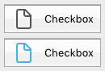
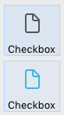
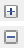

Une case à cocher est un type de bouton utilisée pour saisir ou afficher une donnée binaire (vrai-faux). Basically, it is either checked or unchecked, but a [third state](#three-states-check-box) can be defined.


Check boxes are controlled by methods or [standard actions](#using-a-standard-action). La méthode associée à une case à cocher est exécutée lorsqu’elle est cochée. Comme tous les boutons, une case à cocher est initialisée à la valeur zéro lorsque le formulaire est ouvert pour la première fois.

Une case à cocher affiche généralement du texte en face de la case. This text is set in the [Title](properties_Object.md#title) property of the check box. You can enter a title in the form of an XLIFF reference in this area (see [Appendix B: XLIFF architecture](https://doc.4d.com/4Dv17R5/4D/17-R5/Appendix-B-XLIFF-architecture.300-4163748.en.html)).

## Utiliser une case à cocher

A check box can be associated to a [variable or expression](properties_Object.md#variable-or-expression) of type integer or boolean.

- **integer:** if the box is checked, the variable has the value 1. Lorsqu'elle n'est pas cochée, elle porte la valeur 0. Si la case à cocher a un troisième état (voir ci-dessous), elle porte la valeur 2.
- **boolean:** if the box is checked, the variable has the value `True`. When not checked, it has the value `False`.

Une partie ou la totalité des cases à cocher contenues dans un formulaires peut être cochée ou non cochée. Plusieurs cases à cocher permettent à l'utilisateur de cocher plusieurs options.

### Cases à cocher à trois états

Check box objects with [Regular](checkbox_overview.md#regular) and [Flat](checkbox_overview.md#flat) [button style](properties_TextAndPicture.md#button-style) accept a third state. Ce troisième état représente un statut intermédiaire, généralement utilisé pour l’affichage. Il permet par exemple d’indiquer qu’une propriété est présente parmi une sélection d’objets mais pas dans chaque objet de la sélection.


To enable this third state, you must select the [Three-States](properties_Display.md#three-states) property.

This property is only available for regular and flat check boxes associated with numeric [variables or expressions](properties_Object.md#variable-or-expression) — check boxes for Boolean expressions cannot use the [Three-States](properties_Display.md#three-states) property (a Boolean expression cannot be in an intermediary state).

La variable associée à la case à cocher retourne la valeur 2 lorsque celle-ci se trouve dans le troisième état.

> En saisie, les cases à cocher à trois états affichent séquentiellement chaque état, dans l’ordre suivant : non coché / coché / intermédiaire / non coché, etc. L’état intermédiaire étant généralement inutile en saisie ; il vous suffit, dans le code, de “forcer” la valeur de la variable à 0 lorsqu’elle prend la valeur 2 afin de passer directement de l’état coché à l’état non coché.

## Utiliser une action standard

You can assign a [standard action](properties_Action.md#standard-action) to a check box to handle attributes of text areas. For example, if you assign the `fontBold` standard action, at runtime the check box will manage the "bold" attribute of the selected text in the current area.

Seules les actions qui peuvent représenter un statut vrai/faux (actions "à coche") sont prises en charge par cet objet :

| Actions prises en charge            | Conditions d'utilisation (le cas échéant) |
| ----------------------------------- | ------------------------------------------------------------ |
| avoidPageBreakInsideEnabled         | Zones 4D Write Pro uniquement                                |
| fontItalic                          |                                                              |
| fontBold                            |                                                              |
| fontLinethrough                     |                                                              |
| fontSubscript                       | Zones 4D Write Pro uniquement                                |
| fontSuperscript                     | Zones 4D Write Pro uniquement                                |
| fontUnderline                       |                                                              |
| font/showDialog                     | Mac uniquement                                               |
| htmlWYSIWIGEnabled                  | Zones 4D Write Pro uniquement                                |
| section/differentFirstPage          | Zones 4D Write Pro uniquement                                |
| section/differentLeftRightPages     | Zones 4D Write Pro uniquement                                |
| spell/autoCorrectionEnabled         |                                                              |
| spell/autoDashSubstitutionsEnabled  | Mac uniquement                                               |
| spell/autoLanguageEnabled           | Mac uniquement                                               |
| spell/autoQuoteSubstitutionsEnabled | Mac uniquement                                               |
| spell/autoSubstitutionsEnabled      |                                                              |
| spell/enabled                       |                                                              |
| spell/grammarEnabled                | Mac uniquement                                               |
| spell/showDialog                    | Mac uniquement                                               |
| spell/visibleSubstitutions          |                                                              |
| visibleBackground                   | Zones 4D Write Pro uniquement                                |
| visibleFooters                      | Zones 4D Write Pro uniquement                                |
| visibleHeaders                      | Zones 4D Write Pro uniquement                                |
| visibleHiddenChars                  | Zones 4D Write Pro uniquement                                |
| visibleHorizontalRuler              | Zones 4D Write Pro uniquement                                |
| visiblePageFrames                   | Zones 4D Write Pro uniquement                                |
| visibleReferences                   |                                                              |
| widowAndOrphanControlEnabled        | Zones 4D Write Pro uniquement                                |

For detailed information on these actions, please refer to the [Standard actions](properties_Action.md#standard-action) section.

## Styles des boutons "Case à cocher"

Check boxes use [button styles](properties_TextAndPicture.md#button-style) to control a check box's general appearance as well as its available properties. Il est possible d'appliquer différents styles prédéfinis aux cases à cocher. Plusieurs variantes peuvent être obtenues en combinant ces propriétés/comportements.

With the exception of the [available properties](#supported-properties), many check box objects are _structurally_ identical. La différence réside dans le traitement de leurs variables associées.

4D propose des cases à cocher avec les styles de bouton prédéfinis suivants :

### Classique

The Regular check box button style is a standard system check box (_i.e._, a rectangle with a descriptive title):


#### Exemple JSON :

```
	"myCheckBox": {
		"type": "checkbox",	
		"style":"regular",
		"text": "Cancel",	
		"action": "Cancel", 	
		"left": 60,			
		"top": 160,		
		"width": 100,			
		"height": 20		
		"dataSourceTypeHint":"boolean"
		}
```

### A plat

Le style plat du bouton case à cocher a un design minimaliste. Le graphisme du style A plat est particulièrement utile pour les formulaires à imprimer.


#### Exemple JSON :

```
	"myCheckBox": {
			"type": "checkbox",	
			"style":"flat",
			"text": "Cancel",	
			"action": "cancel", 
			"left": 60,		
 			"top": 160,	
 			"width": 100,			
			"height": 20			
			}
```

### Bouton barre outils

Le style de bouton Barre d'outils est principalement destiné à l'intégration dans une barre d'outils.

Le style de bouton Barre d'outils a un arrière-plan transparent avec un titre. It is usually associated with a [4-state picture](properties_TextAndPicture.md#number-of-states).

Exemples avec les états coché / non coché / surligné :


#### Exemple JSON :

```
	"myCheckBox": {
                "type": "checkbox",
                "style":"toolbar",	
                "text": "Checkbox",
				"icon": "/RESOURCES/File.png", 
				"iconFrames": 4 
                "left": 60,	
                "top": 160,	
                "width": 100,					
                "height": 20					
                }
```

### Bevel

The Bevel check box button style combines the appearance of the [Regular](#regular) button style (_i.e._, a rectangle with a descriptive title) with the [Toolbar Button](#toolbar-button) button style's behavior.

Le style de bouton Bevel possède un fond gris clair et un titre. It is usually associated with a [4-state picture](properties_TextAndPicture.md#number-of-states).

Exemples avec les états coché / non coché / surligné :


#### Exemple JSON :

```
	"myCheckBox": {
                "type": "checkbox",	
                "style":"bevel",
                "text": "Checkbox",	 
 				"icon": "/RESOURCES/File.png", 
				"iconFrames": 4 
              	"left": 60,	
                "top": 160,	
                "width": 100,				
                "height": 20				
                }
```

### Bevel arrondi

The Rounded Bevel check box button style is nearly identical to the [Bevel](#bevel) button style except, depending on the OS, the corners of the button may be rounded. As with the Bevel button style, the Rounded Bevel button style combines the appearance of the [Regular](#regular) button style with the [Toolbar Button](#toolbar-button) button style's behavior.

Le style de bouton Bevel arrondi possède un fond gris clair et un titre. It is usually associated with a [4-state picture](properties_TextAndPicture.md#number-of-states).

Exemple sous macOS :


> On Windows, the Rounded Bevel button style is identical to the [Bevel](#bevel) button style.

#### Exemple JSON :

```4d
	"myCheckBox": {
                "type": "checkbox",	
                "style":"roundedBevel",	 
                "text": "Checkbox",	
 				"icon": "/RESOURCES/File.png", 
				"iconFrames": 4 
                "left": 60,	
                "top": 160,	
                "width": 100,			
                "height": 20			
                }
```

### OS X Gradient

The OS X Gradient check box button style is nearly identical to the [Bevel](#bevel) button style. As with the Bevel button style, the OS X Gradient button style combines the appearance of the [Regular](#regular) button style with the [Toolbar Button](#toolbar-button) button style's behavior.

Le style Gradient OS X a un arrière-plan gris clair et un titre et s'affiche sous la forme d'un bouton système bicolore sur macOS. It is usually associated with a [4-state picture](properties_TextAndPicture.md#number-of-states).



> On Windows, this check box button style is identical to the [Bevel](#bevel) button style.

#### Exemple JSON :

```
	"myCheckBox": {
			"type": "checkbox",	
			"style":"gradientBevel", 
			"text": "Checkbox",	
			"icon": "/RESOURCES/File.png",
			"iconFrames": 4
			"left": 60,		
			"top": 160,		
			"width": 100,				
			"height": 20				
           }
```

### OS X Texture

The OS X Textured button style is similar to the [Bevel](#bevel) button style but with a smaller size (maximum size is the size of a standard macOS system button). As with the Bevel button style, the OS X Textured button style combines the appearance of the [Regular](#regular) button style with the [Toolbar Button](#toolbar-button) button style's behavior.

Par défaut, le style OS X Textured apparaît comme :

- _Windows_ - a standard system button with a light blue background with a title in the center.


- _macOS_ - a standard system button. Sa hauteur est prédéfinie : il n'est pas possible de l'agrandir ou de la réduire.


#### Exemple JSON :

```
	"myCheckBox": {
			"type": "checkbox",	
			"style":"texturedBevel", 
			"text": "Checkbox",	
			"left": 60,	
			"top": 160,	
			"width": 100,					
			"height": 20					
			}
```

### Office XP

The Office XP button style combines the appearance of the [Regular](#regular) button style with the [Toolbar Button](#toolbar-button) button style's behavior.

Les couleurs (surbrillance et arrière-plan) d'une case à cocher avec le style de bouton Office XP sont basées sur les couleurs du système. L'apparence de la case à cocher peut être différente lorsque le curseur la survole, selon le système d'exploitation :

- _Windows_ - its background only appears when the mouse rolls over it. Exemples avec les états coché / non coché / surligné :


- _macOS_ - its background is always displayed. Exemples avec les états cochés / non cochés :



#### Exemple JSON :

```
	"myCheckBox": {
                "type": "checkbox",	
                "style":"office",
                "text": "Checkbox",	 
                "action": "fontBold",
 				"icon": "/RESOURCES/File.png", 
				"iconFrames": 4 	
               "left": 60,	
                "top": 160,		
                "width": 100,			
                "height": 20			
                }
```

### Contracter/Déployer

Ce style de case à cocher peut être utilisé pour ajouter une icône standard contracter/déployer. Ces icônes sont utilisées nativement dans les listes hiérarchiques.

- _Windows_ - the icon looks like a [+] or a [-]



- _macOS_ - it looks like a triangle pointing right or down.


:::info

The Collapse/Expand style is named "disclosure" in the [button style JSON Grammar](properties_TextAndPicture.md#button-style).

:::

#### Exemple JSON :

```
	"myCheckBox": {
                "type": "checkbox",	
                "style":"disclosure",
				"method": "m_collapse",
				"left": 60,	
                "top": 160,	
                "width": 100,			
                "height": 20			
                }
```

### Disclosure

Sous macOS et Windows, une case à cocher avec le style "Disclosure" apparaît comme un bouton disclosure standard, généralement utilisé pour afficher/masquer des informations supplémentaires. Lorsqu'il est utilisé comme bouton radio, le symbole du bouton pointe vers le bas avec la valeur 0 et vers le haut avec la valeur 1.

- _Windows_

  

- _macOS_

  

:::info

The Disclosure style is named "roundedDisclosure" in the [button style JSON Grammar](properties_TextAndPicture.md#button-style).

:::

#### Exemple JSON :

```
	"myCheckBox": {
                "type": "checkbox",		
                "style":"roundedDisclosure",	
				"method": "m_disclose",
                "left": 60,		
                "top": 160,	
                "width": 100,			
                "height": 20			
                }
```

### Personnalisé

Le style de case à cocher personnalisé accepte une image d'arrière-plan personnalisée et permet de gérer des propriétés spécifiques :

- [Background pathname](properties_TextAndPicture.md#backgroundPathname)
- [Icon Offset](properties_TextAndPicture.md#icon-offset)
- [Horizontal Margin](properties_TextAndPicture.md#horizontalMargin) and [Vertical Margin](properties_TextAndPicture.md#verticalMargin)

It is usually associated with a [4-state picture](properties_TextAndPicture.md#number-of-states), that can be used in conjunction with a [4-state](properties_TextAndPicture.md#number-of-states) [background picture](properties_TextAndPicture.md#backgroundPathname).

#### Exemple JSON :

```
	"myCheckbox": {
		"type": "checkbox",
		"style":"custom",
		"text": "OK", 
		"icon": "/RESOURCES/smiley.jpg", 
		"iconFrame": 4, 
		"customBackgroundPicture": "/RESOURCES/paper.jpg", 
		"iconOffset": 5, //custom icon offset when clicked
		"left": 60,	
		"top": 160,	
		"width": 100,		
		"height": 20,
		"customBorderX": 20,
		"customBorderY": 5
		}
```

## Propriétés prises en charge

Toutes les cases à cocher partagent une même série de propriétés de base :

[Bold](properties_Text.md#bold) - [Bottom](properties_CoordinatesAndSizing.md#bottom) - [Button Style](properties_TextAndPicture.md#button-style) - [Class](properties_Object.md#css-class) - [Enterable](properties_Entry.md#enterable) - [Expression Type](properties_Object.md#expression-type) - [Focusable](properties_Entry.md#focusable) - [Font](properties_Text.md#font) - [Font Color](properties_Text.md#font-color) - [Font Size](properties_Text.md#font-size) - [Height](properties_CoordinatesAndSizing.md#height) - [Help Tip](properties_Help.md#help-tip) - [Horizontal Alignment](properties_Text.md#horizontal-alignment)(1) - [Horizontal Sizing](properties_ResizingOptions.md#horizontal-sizing) - [Image hugs title](properties_TextAndPicture.md#image-hugs-title)(2) - [Italic](properties_Text.md#italic) - [Left](properties_CoordinatesAndSizing.md#left) - [Number of States](properties_TextAndPicture.md#number-of-states)(2) - [Object Name](properties_Object.md#object-name) - [Picture pathname](properties_TextAndPicture.md#picture-pathname)(2) - [Right](properties_CoordinatesAndSizing.md#right) - [Save value](properties_Object.md#save-value) - [Shortcut](properties_Entry.md#shortcut) - [Standard action](properties_Action.md#standard-action) - [Title](properties_Object.md#title) - [Title/Picture Position](properties_TextAndPicture.md#title-picture-position)(2) - [Top](properties_CoordinatesAndSizing.md#top) - [Type](properties_Object.md#type) - [Underline](properties_Text.md#underline) - [Variable or Expression](properties_Object.md#variable-or-expression) - [Vertical Sizing](properties_ResizingOptions.md#vertical-sizing) - [Visibility](properties_Display.md#visibility) - [Width](properties_CoordinatesAndSizing.md#width)

> (1) Not supported by the [Regular](#regular) and [Flat](#flat) styles.<br/>
> (2) Not supported by the [Regular](#regular), [Flat](#flat), [Disclosure](#disclosure) and [Collapse/Expand](#collapseexpand) styles.

Additional specific properties are available, depending on the [button style](#button-styles):

- Custom: [Background pathname](properties_TextAndPicture.md#backgroundPathname) - [Horizontal Margin](properties_TextAndPicture.md#horizontalMargin) - [Icon Offset](properties_TextAndPicture.md#icon-offset) - [Vertical Margin](properties_TextAndPicture.md#verticalMargin)
- Flat, Regular: [Three-States](properties_Display.md#three-states)
