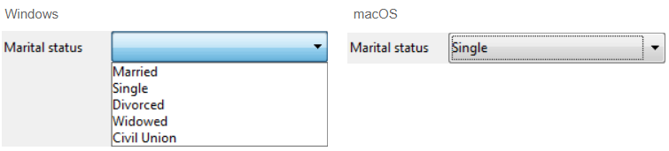

Les listes déroulantes sont des objets de formulaire qui permettent à l'utilisateur de sélectionner un élément dans une liste. Vous gérez les éléments qui apparaissent dans les listes déroulantes à l’aide d'un objet, d'un tableau, d’une énumération ou d'une action standard.

Sous macOS, les listes déroulantes sont aussi parfois appelées "pop-up menu". Les deux noms font référence aux mêmes objets. Comme le montre l'exemple suivant, l'apparence de ces objets peut différer légèrement selon la plateforme :


## Types de listes déroulantes

Vous pouvez créer différents types de listes déroulantes avec différentes fonctionnalités. To define a type, select the appropriate **Expression Type** and **Data Type** values in the Property list, or use their JSON equivalent.

| Type                                          | Fonctionnalités                                                                            | Type d’expression | Type de données                    | Définition JSON                                                                                                                       |
| --------------------------------------------- | ------------------------------------------------------------------------------------------ | ----------------- | ---------------------------------- | ------------------------------------------------------------------------------------------------------------------------------------- |
| Object                                        | Construit sur une collection                                                               | Object            | Numérique, texte, date ou heure    | `dataSourceTypeHint: object` + `numberFormat: <format>` or `textFormat: <format>` or `dateFormat: <format>` or `timeFormat: <format>` |
| Tableau                                       | Construit sur un tableau                                                                   | Tableau           | Numérique, texte, date ou heure    | `dataSourceTypeHint: arrayNumber` or `arrayText` or `arrayDate` or `arrayTime`                                                        |
| Enumération enregistrée en tant que valeur    | Construit sur une liste de choix (standard)                             | Liste             | Valeur de l'élément sélectionné    | `dataSourceTypeHint: text` + `saveAs: value`                                                                                          |
| Enumération enregistrée en tant que référence | Construit sur une liste de choix. La position de l'élément est sauvegardée | Liste             | Référence de l'élément sélectionné | `dataSourceTypeHint: integer` + `saveAs: reference`                                                                                   |
| Enumération hiérarchique                      | Peut afficher un contenu hiérarchique                                                      | Liste             | Référence de liste                 | `dataSourceTypeHint: integer`                                                                                                         |
| Action standard                               | Construit automatiquement par l'action                                                     | _any_             | _any except List reference_        | any definition + `action: <action>` (+ `focusable: false` for actions applying to other areas)                     |

## Gestion des listes déroulantes

### Utiliser un objet

> Cette fonctionnalité n'est disponible que dans les projets 4D.

An [object](Concepts/dt_object.md) encapsulating a [collection](Concepts/dt_collection.md) can be used as the data source of a drop-down list. Cet objet doit avoir les propriétés suivantes :

| Propriété      | Type                   | Description                                                                                                                                                                                                                                                                   |
| -------------- | ---------------------- | ----------------------------------------------------------------------------------------------------------------------------------------------------------------------------------------------------------------------------------------------------------------------------- |
| `valeurs`      | Collection             | Obligatoire - Collection de valeurs scalaires. Toutes les valeurs doivent être du même type. Supported types:<li>strings</li><li>numbers</li><li>dates</li><li>times</li>If empty or not defined, the drop-down list is empty |
| `index`        | number                 | Index of the currently selected item (value between 0 and `collection.length-1`). If you set -1, `currentValue` is displayed as a placeholder string                                                                                       |
| `currentValue` | identique à Collection | Élément actuellement sélectionné (utilisé comme texte exemple si passé par code)                                                                                                                                                                           |

Si l'objet contient d'autres propriétés, elles sont ignorées.

Pour initialiser l'objet associé à la liste déroulante, vous pouvez :

- Enter a list of default values in the object properties by selecting `\<Static List>` in the [Data Source](properties_DataSource.md) theme of the Property List. Les valeurs par défaut sont chargées automatiquement dans un objet.

- Exécuter le code qui crée l'objet et ses propriétés. For example, if "myList" is the [variable](properties_Object.md#variable-or-expression) associated to the drop-down list, you can write in the [On Load](Events/onLoad.md) form event:

```4d
// Form.myDrop is the datasource of the form object
 
Form.myDrop:=New object
Form.myDrop.values:=New collection("apples"; "nuts"; "pears"; "oranges"; "carrots")
Form.myDrop.index:=-1  //currentValue is a placeholder
Form.myDrop.currentValue:="Select a fruit" 
```

La liste déroulante est affichée avec le texte d'exemple :


Après que l'utilisateur sélectionne une valeur :


```4d
Form.myDrop.values // ["apples","nuts","pears","oranges","carrots"]
Form.myDrop.currentValue //"oranges"
Form.myDrop.index //3
```

### Utiliser un tableau

Un [tableau](Concepts/arrays.md) est une liste de valeurs gardées en mémoire qui sont référencées par le nom du tableau. Une liste déroulante peut afficher un tableau comme une liste de valeurs lorsque vous cliquez dessus.

Pour initialiser le tableau associé à la liste déroulante, vous pouvez :

- Enter a list of default values in the object properties by selecting `\<Static List>` in the [Data Source](properties_DataSource.md) theme of the Property List. Les valeurs par défaut sont automatiquement chargées dans un tableau. Vous pouvez faire référence à ce tableau par l’intermédiaire du nom de la variable associée à l’objet.

- Avant que l’objet ne soit affiché, exécutez une méthode qui affecte des valeurs au tableau. Par exemple :

```4d
  ARRAY TEXT(aCities;6) 
  aCities{1}:="Philadelphia" 
  aCities{2}:="Pittsburg" 
  aCities{3}:="Grand Blanc" 
  aCities{4}:="Bad Axe" 
  aCities{5}:="Frostbite Falls" 
  aCities{6}:="Green Bay" 
```

In this case, the name of the [variable](properties_Object.md#variable-or-expression) associated with the object in the form must be `aCities`. Ce code peut être placé dans la méthode formulaire et être exécuté lorsque l’événement formulaire `Sur chargement` se produit.

- Avant que l’objet ne soit affiché, chargez les valeurs d’une énumération dans le tableau à l’aide de la commande [LIST TO ARRAY](https://doc.4d.com/4dv19/help/command/en/page288.html). Par exemple :

```4d
   LIST TO ARRAY("Cities";aCities)
```

In this case also, the name of the [variable](properties_Object.md#variable-or-expression) associated with the object in the form must be `aCities`. Ce code peut être exécuté à la place de celui proposé plus haut.

Si vous voulez stocker dans un champ le choix de l’utilisateur, il est nécessaire d’écrire du code pour affecter les valeurs et de l’exécuter après la validation de l’enregistrement. Ce code pourrait être le suivant :

```4d
  Case of
    :(Form event=On Load)
       LIST TO ARRAY("Cities";aCities)
       If(Record number([People])<0) `new record
          aCities:=3 `display a default value
       Else `existing record, display stored value
          aCities:=Find in array(aCities;City)
       End if
    :(Form event=On Clicked) `user modified selection
       City:=aCities{aCities} `field gets new value
    :(Form event=On Validate)
       City:=aCities{aCities}
    :(Form event=On Unload)
       CLEAR VARIABLE(aCities)
 End case
```

Vous devez sélectionner chaque événement que vous testez dans votre Au cas où. Les tableaux contiennent toujours un nombre fini d’éléments. La liste des éléments est dynamique et peut être modifiée par programmation. Les éléments d’un tableau peuvent être modifiés et triés.

### Utiliser une énumération

If you want to use a drop-down list to manage the values of an input area (listed field or variable), 4D lets you reference the field or variable directly as the drop-down list's [data source](properties_Object.md#variable-or-expression). Cette possibilité facilite la gestion des champs/variables énuméré(e) s.

Par exemple, dans le cas d'un champ "Couleur" qui ne peut contenir que les valeurs "Blanc", "Bleu", "Vert" ou "Rouge", il est possible de créer une liste contenant ces valeurs et de l'associer à une liste déroulante qui fait référence au champ "Couleur" 4D. 4D se charge alors de gérer automatiquement la saisie et l’affichage de la valeur courante dans le formulaire.

> Si vous utilisez une énumération hiérarchique, seul le premier niveau sera affiché et sélectionnable. If you use a hierarchical list, only the first level is displayed and can be selected.

To associate a drop-down list with a field or variable, enter the name of the field or variable directly as the [Variable or Expression](properties_Object.md#variable-or-expression) field of the drop-down list in the Property List.

> Il n'est pas possible d'utiliser cette fonctionnalité avec un objet ou une liste déroulante de tableaux. Si vous entrez un nom de champ dans la zone "Variable ou Expression", vous devez utiliser une énumération.

Lorsque le formulaire est exécuté, 4D gère automatiquement la liste déroulante lors de la saisie ou de l'affichage : lorsque l'utilisateur choisit une valeur, celle-ci est enregistrée dans le champ ; cette valeur de champ est affichée dans la liste déroulante lors de l'affichage du formulaire :



#### Valeur de l'élément sélectionné ou Référence de l'élément sélectionné

When you have associated a drop-down list with a choice list and with a field or a variable, you can set the [**Data Type**](properties_DataSource.md#data-type) property to **Selected item value** or **Selected item reference**. Cette option permet d'optimiser la taille des données stockées.

### Utiliser une énumération hiérarchique

Une liste déroulante hiérarchique a une sous-liste associée à chaque élément de la liste. Voici un exemple de liste déroulante hiérarchique :


> Dans les formulaires, les listes déroulantes hiérarchiques sont limitées à deux niveaux.

You can assign the hierarchical choice list to the drop-down list object using the [Choice List](properties_DataSource.md#choice-list) field of the Property List.

You manage hierarchical drop-down lists using the **Hierarchical Lists** commands of the 4D Language. All commands that support the `(*; "name")` syntax can be used with hierarchical  drop-down lists, e.g. [`List item parent`](https://doc.4d.com/4dv19/help/command/en/page633.html).

### Utiliser une action standard

You can build automatically a drop-down list using a [standard action](properties_Action.md#standard-action). Cette fonctionnalité est prise en charge dans les contextes suivants :

- Use of the `gotoPage` standard action. In this case, 4D will automatically display the [page of the form](FormEditor/forms.md#form-pages) that corresponds to the number of the item that is selected. Par exemple, si l’utilisateur clique sur le 3e élément, 4D affichera la page 3 du formulaire courant (si elle existe). Au moment de l'exécution, la liste déroulante affiche par défaut les numéros de page (1, 2...).

- Use of a standard action that displays a sublist of items, for example `backgroundColor`. Cette fonctionnalité nécessite que :
  - a styled text area ([4D Write Pro area](writeProArea_overview.md) or [input](input_overview.md) with [multistyle](properties_Text.md#multi-style) property) is present in the form as the standard action target.
  - the [focusable](properties_Entry.md#focusable) property is not set to the drop-down list.
    Lors de l'exécution, la liste déroulante affichera une liste automatique de valeurs, par exemple les couleurs d'arrière-plan. Vous pouvez remplacer cette liste automatique par une liste personnalisée en associant à l'objet une énumération dans laquelle chaque élément a lui-même été assigné à une action standard.

> Cette fonctionnalité ne peut pas être utilisée avec une liste déroulante hiérarchique.

## Propriétés prises en charge

[Alpha Format](properties_Display.md#alpha-format) - [Bold](properties_Text.md#bold) - [Bottom](properties_CoordinatesAndSizing.md#bottom) - [Button Style](properties_TextAndPicture.md#button-style) - [Choice List](properties_DataSource.md#choice-list) - [Class](properties_Object.md#css-class) - [Data Type (expression type)](properties_DataSource.md#data-type-expression-type) - [Data Type (list)](properties_DataSource.md#data-type-list) - [Date Format](properties_Display.md#date-format) - [Expression Type](properties_Object.md#expression-type) - [Focusable](properties_Entry.md#focusable) - [Font](properties_Text.md#font) - [Font Color](properties_Text.md#font-color) - [Font Size](properties_Text.md#font-size) - [Height](properties_CoordinatesAndSizing.md#height) - [Help Tip](properties_Help.md#help-tip) - [Horizontal Sizing](properties_ResizingOptions.md#horizontal-sizing) - [Italic](properties_Text.md#italic) - [Left](properties_CoordinatesAndSizing.md#left) - [Not rendered](properties_Display.md#not-rendered) - [Object Name](properties_Object.md#object-name) - [Right](properties_CoordinatesAndSizing.md#right) - [Standard action](properties_Action.md#standard-action) - [Save value](properties_Object.md#save-value) - [Time Format](properties_Display.md#time-format) - [Top](properties_CoordinatesAndSizing.md#top) - [Type](properties_Object.md#type) - [Underline](properties_Text.md#underline) - [Variable or Expression](properties_Object.md#variable-or-expression) - [Vertical Sizing](properties_ResizingOptions.md#vertical-sizing) - [Visibility](properties_Display.md#visibility) - [Width](properties_CoordinatesAndSizing.md#width)
