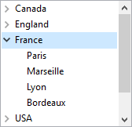

Les listes hiérarchiques sont des objets de formulaire permettant d'afficher des données sous forme de listes comportant un ou plusieurs niveaux qu'il est possible de déployer ou de contracter.



Le cas échéant, l'icône déployer/contractée est automatiquement affichée à gauche de l'élément. Les listes hiérarchiques prennent en charge un nombre illimité de sous-niveaux.

## Sources de données de liste hiérarchique

Le contenu d'un objet formulaire liste hiérarchique peut être initialisé de l'une des manières suivantes :

- Associer une [énumération](properties_DataSource.md#choice-list) à l'objet. L'énumération doit avoir été définie dans l'éditeur de listes en mode Développement.
- Assignez directement une référence de liste hiérarchique à la [variable ou à l'expression](properties_Object.md#variable-or-expression) associée à l'objet formulaire.

Dans les deux cas, vous gérez une liste hiérarchique lors de l'exécution via sa référence _ListRef_, à l'aide des commandes de [liste hiérarchique](https://doc.4d.com/4Dv17R6/4D/17-R6/Hierarchical-Lists.201-4310291.en.html) du langage 4D.

## RefListe et nom d'objet

Une liste hiérarchique est à la fois un **objet de langage** existant en mémoire et un **objet de formulaire**.

L'**objet de langage** est référencé de manière unique par un identifiant interne, de type Entier long, désigné par _RefListe_ dans ce manuel. Cet identifiant est retourné par les commandes permettant de créer des listes `New list`, `Copy list`, `Load list`, `BLOB to list`. Il n’existe qu’une seule instance en mémoire de l’objet de langage et toute modification effectuée sur cet objet est immédiatement répercutée dans tous les endroits où il est utilisé.

L'**objet de formulaire** n'est pas nécessairement unique : il peut exister plusieurs représentations d’une même liste hiérarchique dans un même formulaire ou dans des formulaires différents. Comme pour les autres objets de formulaire, vous désignez l'objet dans le langage via la syntaxe (\*;"NomListe", etc.).

Vous connectez l'"objet de langage" liste hiérarchique avec l'"objet de formulaire" liste hiérarchique par l'intermédiaire de la variable contenant la valeur de l'identifiant unique RefListe. Par exemple, si vous avez associé la [variable](properties_Object.md#variable-or-expression) mylist à l'objet de formulaire, vous écrivez :

```4d
mylist:=New list
```

Chaque représentation de liste dispose de caractéristiques propres et partage des caractéristiques communes avec l’ensemble des représentations. Les caractéristiques propres à chaque représentation de liste sont les suivantes :

- La sélection,
- L’état déployé/contracté des éléments,
- La position du curseur de défilement.

The other characteristics (font, font size, style, entry control, color, list contents, icons, etc.) are common to all the representations and cannot be modified separately.
Consequently, when you use commands based on the expanded/collapsed configuration or the current item, for example `Count list items` (when the final `*` parameter is not passed), it is important to be able to specify the representation to be used without any ambiguity.

Vous devez utiliser l'identifiant de type `RefListe` avec les commandes du langage lorsque vous souhaitez désigner la liste hiérarchique résidant en mémoire. Par ailleurs, si vous souhaitez désigner la représentation au niveau du formulaire d'un objet Liste hiérarchique, vous devez utiliser le nom de l'objet (type chaîne) dans la commande, via la syntaxe (\*;"NomListe"...).

> Dans le cas des commandes définissant des propriétés, la syntaxe basée sur le nom d’objet ne signifie pas que seul l’objet de formulaire désigné sera modifié par la commande, mais que l’action de la commande sera basée sur l’état de cet objet. Les caractérisques communes des listes hiérarchiques sont toujours modifiées dans toutes les représentations.
> Par exemple, si vous passez l’instruction :

```4d
SET LIST ITEM FONT(*;"mylist1";*;thefont)
```

> ... you are indicating that you want to modify the font of the hierarchical list item associated with the _mylist1_ form object. La commande tiendra compte de l’élément courant de l’objet _mylist1_ pour définir l’élément à modifier, mais cette modification sera reportée dans toutes les représentations de la liste dans tous les process.

### Prise en compte du @

Comme pour les autres commandes de gestion des propriété d’objets, il est possible d’utiliser le caractère “@” dans le paramètre `NomListe`. En principe, cette syntaxe permet de désigner un ensemble d’objets dans le formulaire. Toutefois, dans le contexte des commandes de liste hiérarchique, ce principe n’est pas applicable dans tous les cas. Cette syntaxe aura deux effets différents en fonction du type de commande :

- Pour les commandes fixant des propriétés, cette syntaxe désigne tous les objets dont le nom correspond (fonctionnement standard). Par exemple, le paramètre "LH@" désigne tous les objets de type liste hiérarchique dont le nom débute par “LH”
  - `DELETE FROM LIST`
  - `INSERT IN LIST`
  - `SELECT LIST ITEMS BY POSITION`
  - `SET LIST ITEM`
  - `SET LIST ITEM FONT`
  - `SET LIST ITEM ICON`
  - `SET LIST ITEM PARAMETER`
  - `SET LIST ITEM PROPERTIES`

- Pour les commandes récupérant des propriétés, cette syntaxe désigne le premier objet dont le nom correspond. Ces commandes sont :
  - `Count list items`
  - `Find in list`
  - `GET LIST ITEM`
  - `Get list item font`
  - `GET LIST ITEM ICON`
  - `GET LIST ITEM PARAMETER`
  - `GET LIST ITEM PROPERTIES`
  - `List item parent`
  - `List item position`
  - `Selected list items`

## Commandes génériques utilisables avec les listes hiérarchiques

Il est possible de modifier l’apparence d’une liste hiérarchique dans un formulaire à l’aide de plusieurs commandes 4D génériques. Vous devez passer à ces commandes soit le nom d’objet de la liste hiérarchique (en utilisant le paramètre \*), soit son nom de variable (contenant la valeur RefListe) :

- `OBJECT SET FONT`
- `OBJECT SET FONT STYLE`
- `OBJECT SET FONT SIZE`
- `OBJECT SET COLOR`
- `OBJECT SET FILTER`
- `OBJECT SET ENTERABLE`
- `OBJECT SET SCROLLBAR`
- `OBJECT SET SCROLL POSITION`
- `OBJECT SET RGB COLORS`

> Rappel : A l'exception de la commande `OBJECT SET SCROLL POSITION`, ces commandes modifient toutes les représentations d'une même liste, même si vous désignez une liste via son nom d'objet.

## Priorité des commandes de propriété

Certaines propriétés d’une liste hiérarchique (par exemple l’attribut **saisissable** ou la couleur) peuvent être définies de trois manières : via la Liste des propriétés en mode Développement, via une commande du thème “Propriétés des objets” ou via une  Lorsque ces trois moyens sont utilisés pour définir les propriétés d’une liste, l’ordre de priorité suivant est appliqué :

1. Commandes du thème “Liste hiérarchique”
2. Commandes générique de propriété d'objet
3. Propriété formulaire

Ce principe est appliqué quel que soit l’ordre d’appel des commandes. Si une propriété d’élément est modifiée individuellement via une commande de liste hiérarchique, la commande de propriété d’objet équivalente sera sans effet sur cet élément même si elle est appelée ultérieurement. Par exemple, si vous modifiez la couleur d’un élément via la commande `SET LIST ITEM PROPERTIES`, la commande `OBJECT SET COLOR` n’aura aucun effet sur cet élément.

## Gestion des éléments par position ou par référence

Vous pouvez généralement travailler de deux manières avec le contenu des listes hiérarchiques : par position ou par référence.

- Lorsque vous travaillez par position, 4D se base sur la position relative des éléments dans la liste affichée à l'écran pour les identifier. Le résultat sera différent selon que certains éléments hiérarchiques sont déployés ou non. A noter qu'en cas de multi-représentation, chaque objet de formulaire comporte sa propre configuration d'éléments contractés/déployés.
- Lorsque vous travaillez par référence, 4D se base sur le numéro unique _réfElément_ des éléments de la liste. Chaque élément peut être ainsi désigné, quelle que soit sa position ou son affichage dans la liste hiérarchique.

### Exploiter les numéros de référence des éléments (réfElément)

Chaque élément d'une liste hiérarchique dispose d'un numéro de référence (_réfElément_) de type Entier long. Cette valeur est destinée uniquement à votre propre usage : 4D ne fait que la maintenir.

> Attention : Vous pouvez utiliser comme numéro de référence toute valeur de type entier long, sauf la valeur 0. En effet, pour la plupart des commandes de ce thème, la valeur 0 permet de désigner le dernier élément ajouté à la liste.

Voici quelques astuces quant à l'utilisation du numéro de référence unique :

1. Vous n'avez pas besoin d'identifier chaque élément de façon unique (niveau débutant).

   - Premier exemple : vous construisez par programmation un système d'onglets, par exemple, un carnet d'adresses. Comme le système vous retournera le numéro de l'onglet sélectionné, vous n'aurez probablement pas besoin de davantage d'informations. Dans ce cas, ne vous préoccupez pas des numéros de référence des éléments : passez n'importe quelle valeur (hormis 0) dans le paramètre _réfElément_. Notez que pour un système de carnet d'adresses, vous pouvez prédéfinir une liste A, B,..., Z en mode Développement. Vous pouvez également la créer par programmation afin d'éliminer les lettres pour lesquelles il n'y a pas d'enregistrement.
   - Deuxième exemple : en travaillant avec une base, vous construisez progressivement une liste de mots-clés. Vous pouvez sauvegarder la liste à la fin de chaque session, en utilisant les commandes `SAVE LIST` ou `LIST TO BLOB`, et la recharger au début de chaque session, à l'aide des commandes `Load list` ou `BLOB to list`. Vous pouvez afficher cette liste dans une palette flottante ; lorsque l'utilisateur clique sur un mot-clé de la liste, l'élément choisi est inséré dans la zone saisissable sélectionnée du process de premier plan. En tout état de cause, l'important est que vous ne traitez que l'élément sélectionné (par clic ou glisser-déposer), car la commande `Selected list items`vous retourne la position de l'élément que vous devez traiter. En utilisant cette valeur de position, vous obtenez le libellé de l'élément grâce à la commande `GET LIST ITEM`. Ici aussi, vous n'avez pas besoin d'identifier de façon unique chaque élément ; vous pouvez passer n'importe quelle valeur (hormis 0) dans le paramètre _réfElément_.

2. Vous avez besoin d'identifier partiellement les éléments de la liste (niveau intermédiaire).\
   You use the item reference number to store information needed when you must work with the item; this point is detailed in the example of the `APPEND TO LIST` command. Dans cet exemple, nous utilisons les numéros de référence des éléments pour stocker des numéros d'enregistrements. Cependant, nous devons pouvoir établir une distinction entre les éléments qui correspondent aux enregistrements [Départements] et ceux qui correspondent aux enregistrements [Employés].

3. Vous avez besoin d'identifier les éléments de la liste de façon unique (niveau avancé).\
   Vous programmez une gestion élaborée de listes hiérarchiques, dans laquelle vous devez absolument pouvoir identifier chaque élément de manière unique à tous les niveaux de la liste. Un moyen simple d'implémenter ce fonctionnement est de maintenir un compteur personnel. Supposons que vous créez une liste _hlList_ à l'aide de la commande `APPEND TO LIST`. A ce stade, vous initialisez un compteur _vlhCounter_ à 1. A chaque fois que vous appelez `APPEND TO LIST` ou `INSERT IN LIST`, vous incrémentez ce compteur `(vlhCounter:=vlhCounter+1)`, et vous passez le compteur comme numéro de référence de l'élément. L'astuce consiste à ne pas décrémenter le compteur lorsque vous détruisez des éléments — le compteur ne peut qu'augmenter. En procédant ainsi, vous garantissez l'unicité des numéros de référence des éléments. Puisque ces numéros sont des valeurs de type Entier long, vous pouvez ajouter ou insérer plus de deux milliards d'éléments dans une liste qui a été réinitialisée... (si vous manipulez d'aussi grandes quantités d'éléments, cela signifie généralement que vous devriez utiliser une table plutôt qu'une liste.)

> Si vous exploitez les Opérateurs sur les bits, vous pouvez également utiliser les numéros de référence des éléments pour stocker des informations qui peuvent être logées dans un Entier long, c'est-à-dire 2 Entiers, des valeurs de 4 octets ou encore 32 Booléens.

### Quand avez-vous besoin de numéros de référence uniques ?

Dans la plupart des cas, lorsque vous utilisez des listes hiérarchiques pour des besoins d'interface utilisateur, pour lesquels seul l'élément sélectionné (par un clic ou par glisser-déposer) est important, vous n'avez pas besoin d'utiliser les numéros de référence des éléments. Les commandes `Selected list items` et `GET LIST ITEM`vous fournissent toutes les informations nécessaires à la gestion de l'élément sélectionné. De plus, des commandes telles que `INSERT IN LIST` et `DELETE FROM LIST` vous permettent de manipuler la liste de manière "relative" à l'élément sélectionné.

En pratique, vous devez vous préoccuper des numéros de référence d'éléments lorsque vous voulez accéder directement par programmation à n'importe quel élément de la liste, et pas nécessairement à l'élément couramment sélectionné.

## Élément modifiable

Vous pouvez choisir si les éléments de la liste hiérarchique peuvent être modifiés par l'utilisateur à l'aide du raccourci **Alt + clic** (Windows)/ **Option + clic** (macOS), ou en effectuant un clic long sur le texte de l'élément.

- Quelle que soit la source de données de la liste hiérarchique, vous pouvez contrôler l'ensemble de l'objet avec la propriété [Saisissable](properties_Entry.md#enterable).

- En outre, si vous remplissez la liste hiérarchique à l'aide d'une liste créée dans l'éditeur de listes, vous contrôlez si un élément d'une liste hiérarchique est modifiable à l'aide de l'option **Élément modifiable** dans l'éditeur de listes. Pour plus d'informations, consultez [Définir les propriétés des énumérations ](https://doc.4d.com/4Dv18/4D/18/Definir-les-proprietes-des-enumerations.300-4575487.fr.html).

## Propriétés prises en charge

[Bold](properties_Text.md#bold) - [Border Line Style](properties_BackgroundAndBorder.md#border-line-style) - [Bottom](properties_CoordinatesAndSizing.md#bottom) - [Choice List](properties_DataSource.md#choice-list) - [Class](properties_Object.md#css-class) - [Draggable](properties_Action.md#draggable) - [Droppable](properties_Action.md#droppable) - [Enterable](properties_Entry.md#enterable) - [Entry Filter](properties_Entry.md#entry-filter) - [Fill Color](properties_BackgroundAndBorder.md#background-color--fill-color) - [Focusable](properties_Entry.md#focusable) - [Font](properties_Text.md#font) - [Font Color](properties_Text.md#font-color) - [Font Size](properties_Text.md#font-size) - [Height](properties_CoordinatesAndSizing.md#height) - [Help Tip](properties_Help.md#help-tip) - [Hide focus rectangle](properties_Appearance.md#hide-focus-rectangle) - [Horizontal Scroll Bar](properties_Appearance.md#horizontal-scroll-bar) - [Horizontal Sizing](properties_ResizingOptions.md#horizontal-sizing) - [Italic](properties_Text.md#italic) - [Left](properties_CoordinatesAndSizing.md#left) - [Multi-selectable](properties_Action.md#multi-selectable) - [Object Name](properties_Object.md#object-name) - [Right](properties_CoordinatesAndSizing.md#right) - [Top](properties_CoordinatesAndSizing.md#top) - [Type](properties_Object.md#type) - [Underline](properties_Text.md#underline) - [Vertical Scroll Bar](properties_Appearance.md#vertical-scroll-bar) - [Vertical Sizing](properties_ResizingOptions.md#vertical-sizing) - [Variable or Expression](properties_Object.md#variable-or-expression) - [Visibility](properties_Display.md#visibility) - [Width](properties_CoordinatesAndSizing.md#width)
