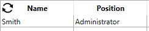
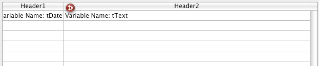
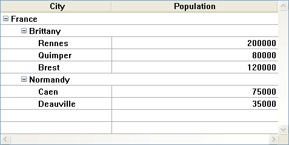
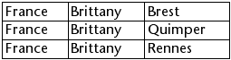
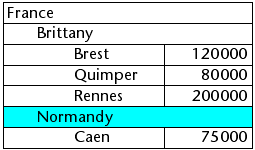
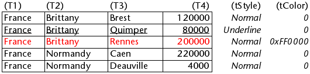

Les list box sont des objets actifs complexes permettant d’afficher et de saisir des données sous forme de tableaux. Ils peuvent être liés au contenu de la base de données, comme les sélections d'entités ("entity selections") et les sections d'enregistrement, ou à tout contenu linguistique tel que les collections et les tableaux. Ils incluent des fonctionnalités avancées concernant la saisie de données, le tri des colonnes, la gestion des événements, l'apparence personnalisée, le déplacement des colonnes, etc.


Une list box contient une ou plusieurs colonnes dont le contenu est automatiquement synchronisé. Le nombre de colonnes est en principe illimité (il dépend des ressources de la machine).

## Vue d’ensemble

### Principes d'utilisation basiques

En exécution, les list box permettent d’afficher et de saisir des données sous forme de listes. Pour passer une cellule en mode édition ([si la saisie est autorisée pour la colonne associée](#managing-entry)), il suffit de cliquer deux fois sur la valeur qu’elle contient :


Les utilisateurs peuvent saisir et afficher du texte sur plusieurs lignes au sein d’une cellule de list box. Pour ajouter un retour à la ligne, appuyez sur les touches **Ctrl+Retour chariot** sous Windows, ou appuyez sur les touches **Option+Retour chariot** sous macOS.

Les booléens et les images peuvent être affichés dans des cellules, ainsi que des dates, des heures ou des nombres. Il est possible de trier les valeurs de colonne en cliquant sur un en-tête ([tri standard](#managing-sorts)). Toutes les colonnes sont automatiquement synchronisées.

Il est également possible de redimensionner chaque colonne, et l'utilisateur peut modifier l'ordre des [colonnes](properties_ListBox.md#locked-columns-and-static-columns) et des [lignes](properties_Action.md#movable-rows) en les déplaçant à l'aide de la souris, si cette action est autorisée. Notez que les list box peuvent être utilisées [en mode hiérarchique](#hierarchical-list-boxes).

L'utilisateur peut sélectionner une ou plusieurs lignes à l'aide des raccourcis standard : **Maj + clic** pour une sélection adjacente et **Ctrl + clic** (Windows) ou **Commande + clic** (macOS) pour une sélection non adjacente.


### Parties de list box

Une list box est composée de quatre parties distinctes :

*   l’objet list box dans sa globalité,
*   les colonnes,
*   les en-têtes des colonnes, et
*   les pieds des colonnes.


Chaque partie dispose de son propre nom d’objet et de propriétés spécifiques. Par exemple, le nombre de colonnes ou la couleur alternée de chaque ligne sont définies dans les propriétés de l’objet list box, la largeur de chaque colonne est définie dans les propriétés des colonnes et la police de l’en-tête est définie dans les propriétés des en-têtes.

Il est possible d'ajouter une méthode objet à l'objet list box et/ou à chaque colonne de la list box. Les méthodes objet sont appelées dans l'ordre suivant :

1. Méthode objet de chaque colonne
2. Méthode objet de la list box

La méthode objet de colonne obtient les événements qui se produisent dans son [en-tête](#list-box-headers) et son [pied](#list-box-footers).


### Types de list box

Il existe différents types de list box avec leurs propres comportements et propriétés spécifiques. Le type de list box dépend de sa propriété [Data Source](properties_Object.md#data-source) :

- **Arrays**: each column is bound to a 4D array. Array-based list boxes can be displayed as [hierarchical list boxes](listbox_overview.md#hierarchical-list-boxes).
- **Selection** (**Current selection** or **Named selection**): each column is bound to an expression (e.g. a field) which is evaluated for every record of the selection.
- **Collection or Entity selection**: each column is bound to an expression which is evaluated for every element of the collection or every entity of the entity selection.
> > It is not possible to combine different list box types in the same list box object. The data source is set when the list box is created. It is then no longer possible to modify it by programming.


### Managing list boxes

You can completely configure a list box object through its properties, and you can also manage it dynamically through programming.

The 4D Language includes a dedicated "List Box" theme for list box commands, but commands from various other themes, such as "Object properties" commands or `EDIT ITEM`, `Displayed line number` commands can also be used. Refer to the [List Box Commands Summary](https://doc.4d.com/4Dv17R6/4D/17-R6/List-Box-Commands-Summary.300-4311159.en.html) page of the *4D Language reference* for more information.


## Objets de type List box

### List box de type tableau

Dans une list box de type tableau, chaque colonne est associée à un tableau 4D à une dimension ; tous les types de tableaux peuvent être utilisés, à l’exception des tableaux de pointeurs. The number of rows is based on the number of array elements.

By default, 4D assigns the name "ColumnX" to each column. You can change it, as well as other column properties, in the [column properties](listbox_overview.md#column-specific-properties). The display format for each column can also be defined using the `OBJECT SET FORMAT` command.
> Array type list boxes can be displayed in [hierarchical mode](listbox_overview.md#hierarchical-list-boxes), with specific mechanisms.

Avec les list box de type tableau, les valeurs des colonnes (saisie et affichage) sont gérées à l’aide des commandes du langage 4D. You can also associate a [choice list](properties_DataSource.md#choice-list) with a column in order to control data entry. Les valeurs des colonnes sont gérées à l’aide des commandes de haut niveau du thème List box (telles que `LISTBOX INSERT ROWS` ou `LISTBOX INSERT COLUMN`) ainsi que des commandes de manipulation des tableaux. Par exemple, pour initialiser le contenu d’une colonne, vous pouvez utiliser l’instruction suivante :

```4d
ARRAY TEXT(varCol;size)
```

Vous pouvez également utiliser une énumération :

```4d
LIST TO ARRAY("ListName";varCol)
```
> **Attention :** Lorsqu’un objet List box contient plusieurs colonnes de tailles différentes, seul le nombre d’éléments correspondant au plus petit tableau est affiché. Il est donc conseillé de veiller à ce que chaque tableau ait le même nombre d’éléments que les autres. A noter également que si une colonne de la list box est “vide” (c'est le cas lorsque le tableau associé n'a pas été correctement déclaré ou dimensionné via le langage), la list box n'affiche aucun contenu.


### List box de type sélection

Dans ce type de list box, chaque colonne peut être associée à un champ (par exemple `[Employees]LastName)` ou à une expression. The expression can be based on one or more fields (for example, `[Employees]FirstName+" "[Employees]LastName`) or it may simply be a formula (for example `String(Milliseconds)`). The expression can also be a project method, a variable or an array item. You can use the `LISTBOX SET COLUMN FORMULA` and `LISTBOX INSERT COLUMN FORMULA` commands to modify columns programmatically.

The contents of each row is then evaluated according to a selection of records: the **current selection** of a table or a **named selection**.

In the case of a list box based on the current selection of a table, any modification done from the database side is automatically reflected in the list box, and vice versa. The current selection is therefore always the same in both places.


### List box collection ou entity selection

In this type of list box, each column must be associated to an expression. The contents of each row is then evaluated per collection element or per entity of the entity selection.

Each element of the collection or each entity is available as an object that can be accessed through the [This](../Concepts/classes.md#this) keyword. A column expression can be a property path, a project method, a variable, or any formula, accessing each entity or collection element object through `This`, for example `This.<propertyPath>` (or `This.value` in case of a collection of scalar values). You can use the `LISTBOX SET COLUMN FORMULA` and `LISTBOX INSERT COLUMN FORMULA` commands to modify columns programmatically.

When the data source is an entity selection, any modifications made on the list box side are automatically saved in the database. On the other hand, modifications made on the database side are visible in the list box after touched entities have been reloaded.

When the data source is a collection, any modifications made in the list box values are reflected in the collection. When the data source is a collection, any modifications made in the list box values are reflected in the collection.

```4d
myCol:=myCol.push("new value") //display new value in list box
```


### Propriétés prises en charge

Les propriétés prises en charge dépendent du type de list box.


| Propriété                                                                                   | List box tableau | Liste box sélection | List box collection ou entity selection |
| ------------------------------------------------------------------------------------------- | ---------------- | ------------------- | --------------------------------------- |
| [Couleur de fond alternée](properties_BackgroundAndBorder.md#alternate-background-color)    | X                | X                   | X                                       |
| [Couleur de fond](properties_BackgroundAndBorder.md#background-color)                       | X                | X                   | X                                       |
| [Gras](properties_Text.md#bold)                                                             | X                | X                   | X                                       |
| [Expression couleur de fond](properties_BackgroundAndBorder.md#background-color-expression) |                  | X                   | X                                       |
| [Style de la bordure](properties_BackgroundAndBorder.md#border-line-style)                  | X                | X                   | X                                       |
| [Bas](properties_CoordinatesAndSizing.md#bottom)                                            | X                | X                   | X                                       |
| [Classe](properties_Object.md#css-class)                                                    | X                | X                   | X                                       |
| [Collection ou entity selection](properties_Object.md#collection-or-entity-selection)       |                  | X                   | X                                       |
| [Redimensionnement colonnes auto](properties_ResizingOptions.md#column-auto-resizing)       | X                | X                   | X                                       |
| [Élément courant](properties_DataSource.md#current-item)                                    |                  |                     | X                                       |
| [Position élément courant](properties_DataSource.md#current-item-position)                  |                  |                     | X                                       |
| [Source de données](properties_Object.md#data-source)                                       | X                | X                   | X                                       |
| [Nom formulaire détaillé](properties_ListBox.md#detail-form-name)                           |                  | X                   |                                         |
| [Afficher en-têtes](properties_Headers.md#display-headers)                                  | X                | X                   | X                                       |
| [Afficher pieds](properties_Footers.md#display-footers)                                     | X                | X                   | X                                       |
| [Double-clic sur ligne](properties_ListBox.md#double-click-on-row)                          |                  | X                   |                                         |
| [Glissable](properties_Action.md#droppable)                                                 | X                | X                   | X                                       |
| [Déposable](properties_Action.md#droppable)                                                 | X                | X                   | X                                       |
| [Focusable](properties_Entry.md#focusable)                                                  | X                | X                   | X                                       |
| [Police](properties_Text.md#font)                                                           | X                | X                   | X                                       |
| [Couleur de la police](properties_Text.md#font_color)                                       | X                | X                   | X                                       |
| [Expression couleur police](properties_Text.md#font-color-expression)                       |                  | X                   | X                                       |
| [Taille](properties_Text.md#font-size)                                                      | X                | X                   | X                                       |
| [Hauteur (list box)](properties_CoordinatesAndSizing.md#height)                             | X                | X                   | X                                       |
| [Hauteur (en-têtes)](properties_Headers.md#height)                                          | X                | X                   | X                                       |
| [Hauteur (pieds)](properties_Footers.md#height)                                             | X                | X                   | X                                       |
| [Masquer lignes vides finales](properties_BackgroundAndBorder.md#hide-extra-blank-rows)     | X                | X                   | X                                       |
| [Cacher rectangle de focus](properties_Appearance.md#hide-focus-rectangle)                  | X                | X                   | X                                       |
| [Cacher surlignage sélection](properties_Appearance.md#hide-selection-highlight)            | X                | X                   | X                                       |
| [List box hiérarchique](properties_Object.md#hierarchical-list-box)                         | X                |                     |                                         |
| [Ensemble surlignage](properties_ListBox.md#highlight-set)                                  |                  | X                   |                                         |
| [Alignement horizontal](properties_Text.md#horizontal-alignment)                            | X                | X                   | X                                       |
| [Couleur lignes horizontales](properties_Gridlines.md#horizontal-line-color)                | X                | X                   | X                                       |
| [Horizontal Padding](properties_CoordinatesAndSizing.md#horizontal-padding)                 | X                | X                   | X                                       |
| [Barre de défilement horizontale](properties_Appearance.md#horizontal-scroll-bar)           | X                | X                   | X                                       |
| [Dimensionnement horizontal](properties_ResizingOptions.md#horizontal-sizing)               | X                | X                   | X                                       |
| [Italique](properties_Text.md#italic)                                                       | X                | X                   | X                                       |
| [Gauche](properties_CoordinatesAndSizing.md#left)                                           | X                | X                   | X                                       |
| [Table principale](properties_DataSource.md#table)                                          |                  | X                   |                                         |
| [Meta info expression](properties_Text.md#meta-info-expression)                             |                  |                     | X                                       |
| [Méthode](properties_Action.md#method)                                                      | X                | X                   | X                                       |
| [Lignes déplaçables](properties_Action.md#movable-rows)                                     | X                |                     |                                         |
| [Sélection temporaire](properties_DataSource.md#selectionName)                              |                  | X                   |                                         |
| [Nombre de colonnes](properties_ListBox.md#number-of-columns)                               | X                | X                   | X                                       |
| [Nombre de colonnes verrouillées](properties_ListBox.md#number-of-locked-columns)           | X                | X                   | X                                       |
| [Nombre de colonnes statiques](properties_ListBox.md#number-of-static-columns)              | X                | X                   | X                                       |
| [Nom d'objet](properties_Object.md#object-name)                                             | X                | X                   | X                                       |
| [Droite](properties_CoordinatesAndSizing.md#right)                                          | X                | X                   | X                                       |
| [Tableau couleurs de fond](properties_BackgroundAndBorder.md#row-background-color-array)    | X                |                     |                                         |
| [Tableau de contrôle des lignes](properties_ListBox.md#row-control-array)                   | X                |                     |                                         |
| [Tableau couleurs de police](properties_Text.md#row-font-color-array)                       | X                |                     |                                         |
| [Hauteur des lignes](properties_CoordinatesAndSizing.md#row-height)                         | X                |                     |                                         |
| [Tableau hauteurs des lignes](properties_CoordinatesAndSizing.md#row-height-array)          | X                |                     |                                         |
| [Tableau de styles](properties_Text.md#row-style-array)                                     | X                |                     |                                         |
| [Eléments sélectionnés](properties_DataSource.md#selected-items)                            |                  |                     | X                                       |
| [Mode de sélection](properties_ListBox.md#selection-mode)                                   | X                | X                   | X                                       |
| [Saisie sur clic unique](properties_Entry.md#single-click-edit)                             | X                | X                   | X                                       |
| [Triable](properties_Action.md#sortable)                                                    | X                | X                   | X                                       |
| [Action standard](properties_Action.md#standard-action)                                     | X                |                     |                                         |
| [Expression style](properties_Text.md#style-expression)                                     |                  | X                   | X                                       |
| [Haut](properties_CoordinatesAndSizing.md#top)                                              | X                | X                   | X                                       |
| [Transparent](properties_BackgroundAndBorder.md#transparent)                                | X                | X                   | X                                       |
| [Type](properties_Object.md#type)                                                           | X                | X                   | X                                       |
| [Souligné](properties_Text.md#underline)                                                    | X                | X                   | X                                       |
| [Variable ou expression](properties_Object.md#variable-or-expression)                       | X                | X                   |                                         |
| [Alignement vertical](properties_Text.md#vertical-alignment)                                | X                | X                   | X                                       |
| [Couleur lignes verticales](properties_Gridlines.md#vertical-line-color)                    | X                | X                   | X                                       |
| [Vertical Padding](properties_CoordinatesAndSizing.md#vertical-padding)                     | X                | X                   | X                                       |
| [Barre de défilement verticale](properties_Appearance.md#vertical-scroll-bar)               | X                | X                   | X                                       |
| [Dimensionnement vertical](properties_ResizingOptions.md#vertical-sizing)                   | X                | X                   | X                                       |
| [Visibilité](properties_Display.md#visibility)                                              | X                | X                   | X                                       |
| [Largeur](properties_CoordinatesAndSizing.md#width)                                         | X                | X                   | X                                       |


> Les colonnes, en-têtes et pieds de list box prennent en charge des propriétés spécifiques.


### Événements formulaire pris en charge


| Evénement formulaire          | Propriétés supplémentaires retournées (voir [Evénement formulaire](https://doc.4d.com/4Dv18/4D/18/FORM-Evenement.301-4522191.fr.html) pour les propriétés principales) | Commentaires                                                                                          |
| ----------------------------- | ---------------------------------------------------------------------------------------------------------------------------------------------------------------------- | ----------------------------------------------------------------------------------------------------- |
| On After Edit                 | <li>[colonne](#propriétés-supplémentaires)</li><li>[columnName](#propriétés-supplémentaires)</li><li>[row](#propriétés-supplémentaires)</li>                                                                                            |                                                                                                       |
| On After Keystroke            | <li>[colonne](#propriétés-supplémentaires)</li><li>[columnName](#propriétés-supplémentaires)</li><li>[row](#propriétés-supplémentaires)</li>                                                                                            |                                                                                                       |
| Sur après tri                 | <li>[colonne](#propriétés-supplémentaires)</li><li>[columnName](#propriétés-supplémentaires)</li><li>[nomEn-tête](#propriétés-supplémentaires)</li>                                                                                            | *Les formules composées ne peuvent pas être triées. <br/>(ex : This.firstName + This.lastName)* |
| Sur clic alternatif           | <li>[colonne](#propriétés-supplémentaires)</li><li>[columnName](#propriétés-supplémentaires)</li><li>[row](#propriétés-supplémentaires)</li>                                                                                          | *Listbox tableau uniquement*                                                                          |
| Sur avant saisie              | <li>[colonne](#propriétés-supplémentaires)</li><li>[columnName](#propriétés-supplémentaires)</li><li>[row](#propriétés-supplémentaires)</li>                                                                                         |                                                                                                       |
| Sur avant frappe clavier      | <li>[colonne](#propriétés-supplémentaires)</li><li>[columnName](#propriétés-supplémentaires)</li><li>[row](#propriétés-supplémentaires)</li>                                                                                         |                                                                                                       |
| Sur début survol              | <li>[colonne](#propriétés-supplémentaires)</li><li>[columnName](#propriétés-supplémentaires)</li><li>[row](#propriétés-supplémentaires)</li>                                                                                         |                                                                                                       |
| On Clicked                    | <li>[colonne](#propriétés-supplémentaires)</li><li>[columnName](#propriétés-supplémentaires)</li><li>[row](#propriétés-supplémentaires)</li>                                                                                         |                                                                                                       |
| Sur fermeture corps           | <li>[row](#propriétés-supplémentaires)</li>                                                                                                                                             | *List box Sélection courante et Sélection temporaire uniquement*                                      |
| Sur contracter                | <li>[colonne](#propriétés-supplémentaires)</li><li>[columnName](#propriétés-supplémentaires)</li><li>[row](#propriétés-supplémentaires)</li>                                                                                         | *List box hiérarchiques uniquement*                                                                   |
| Sur déplacement colonne       | <li>[columnName](#propriétés-supplémentaires)</li><li>[nouvellePosition](#propriétés-supplémentaires)</li><li>[anciennePosition](#propriétés-supplémentaires)</li>                                                                                         |                                                                                                       |
| Sur redimensionnement colonne | <li>[colonne](#propriétés-supplémentaires)</li><li>[columnName](#propriétés-supplémentaires)</li><li>[nouvelleTaille](#propriétés-supplémentaires)</li><li>[ancienneTaille](#propriétés-supplémentaires)</li>                                                               |                                                                                                       |
| Sur données modifiées         | <li>[colonne](#propriétés-supplémentaires)</li><li>[columnName](#propriétés-supplémentaires)</li><li>[row](#propriétés-supplémentaires)</li>                                                                                         |                                                                                                       |
| Sur action suppression        | <li>[row](#propriétés-supplémentaires)</li>                                                                                                                                             |                                                                                                       |
| Sur affichage corps           | <li>[isRowSelected](#propriétés-supplémentaires)</li><li>[row](#propriétés-supplémentaires)</li>                                                                                                                   |                                                                                                       |
| On Double Clicked             | <li>[colonne](#propriétés-supplémentaires)</li><li>[columnName](#propriétés-supplémentaires)</li><li>[row](#propriétés-supplémentaires)</li>                                                                                         |                                                                                                       |
| Sur glisser                   | <li>[zone](#propriétés-supplémentaires)</li><li>[nomZone](#propriétés-supplémentaires)</li><li>[colonne](#propriétés-supplémentaires)</li><li>[columnName](#propriétés-supplémentaires)</li><li>[row](#propriétés-supplémentaires)</li>                                     |                                                                                                       |
| Sur déposer                   | <li>[colonne](#propriétés-supplémentaires)</li><li>[columnName](#propriétés-supplémentaires)</li><li>[row](#propriétés-supplémentaires)</li>                                                                                         |                                                                                                       |
| Sur déployer                  | <li>[colonne](#propriétés-supplémentaires)</li><li>[columnName](#propriétés-supplémentaires)</li><li>[row](#propriétés-supplémentaires)</li>                                                                                         | *List box hiérarchiques uniquement*                                                                   |
| Sur clic pied                 | <li>[colonne](#propriétés-supplémentaires)</li><li>[columnName](#propriétés-supplémentaires)</li><li>[nomPied](#propriétés-supplémentaires)</li>                                                                                         | *List box Tableau, Sélection courante et Sélection temporaire uniquement*                             |
| On Getting Focus              | <li>[colonne](#propriétés-supplémentaires)</li><li>[columnName](#propriétés-supplémentaires)</li><li>[row](#propriétés-supplémentaires)</li>                                                                                         | *Propriétés supplémentaires retournées uniquement lors de la modification d'une cellule*              |
| Sur clic entête               | <li>[colonne](#propriétés-supplémentaires)</li><li>[columnName](#propriétés-supplémentaires)</li><li>[nomEn-tête](#propriétés-supplémentaires)</li>                                                                                         |                                                                                                       |
| Sur chargement                |                                                                                                                                                                        |                                                                                                       |
| On Losing Focus               | <li>[colonne](#propriétés-supplémentaires)</li><li>[columnName](#propriétés-supplémentaires)</li><li>[row](#propriétés-supplémentaires)</li>                                                                                         | *Propriétés supplémentaires retournées uniquement lorsque la modification d'une cellule est achevée*  |
| Sur début survol              | <li>[zone](#propriétés-supplémentaires)</li><li>[nomZone](#propriétés-supplémentaires)</li><li>[colonne](#propriétés-supplémentaires)</li><li>[columnName](#propriétés-supplémentaires)</li><li>[row](#propriétés-supplémentaires)</li>                                     |                                                                                                       |
| Sur fin survol                |                                                                                                                                                                        |                                                                                                       |
| Sur survol                    | <li>[zone](#propriétés-supplémentaires)</li><li>[nomZone](#propriétés-supplémentaires)</li><li>[colonne](#propriétés-supplémentaires)</li><li>[columnName](#propriétés-supplémentaires)</li><li>[row](#propriétés-supplémentaires)</li>                                     |                                                                                                       |
| Sur ouverture corps           | <li>[row](#propriétés-supplémentaires)</li>                                                                                                                                             | *List box Sélection courante et Sélection temporaire uniquement*                                      |
| Sur déplacement ligne         | <li>[nouvellePosition](#propriétés-supplémentaires)</li><li>[anciennePosition](#propriétés-supplémentaires)</li>                                                                                                                   | *Listbox tableau uniquement*                                                                          |
| Sur nouvelle sélection        |                                                                                                                                                                        |                                                                                                       |
| Sur défilement                | <li>[horizontalScroll](#propriétés-supplémentaires)</li><li>[verticalScroll](#propriétés-supplémentaires)</li>                                                                                                                   |                                                                                                       |
| On Unload                     |                                                                                                                                                                        |                                                                                                       |


#### Propriétés supplémentaires

Les événements formulaire sur les list box ou colonnes de list box peuvent retourner les propriétés supplémentaires suivantes :

| Propriété        | Type        | Description                                                           |
| ---------------- | ----------- | --------------------------------------------------------------------- |
| area             | text        | List box object area ("header", "footer", "cell")                     |
| areaName         | text        | Name of the area                                                      |
| column           | entier long | Column number                                                         |
| columnName       | text        | Name of the column                                                    |
| footerName       | text        | Name of the footer                                                    |
| headerName       | text        | Name of the header                                                    |
| horizontalScroll | entier long | Positive if scroll is towards the right, negative if towards the left |
| isRowSelected    | boolean     | True if row is selected, else False                                   |
| newPosition      | entier long | New position of the column or row                                     |
| newSize          | entier long | New size (in pixels) of the column or row                             |
| oldPosition      | entier long | Previous position of the column or row                                |
| oldSize          | entier long | Previous size (in pixels) of the column or row                        |
| row              | entier long | Row number                                                            |
| verticalScroll   | entier long | Positive if scroll is towards the bottom, negative if towards the top |
> If an event occurs on a "fake" column or row that doesn't exist, an empty string is typically returned.


## Colonnes de list box

A list box is made of one or more column object(s) which have specific properties. You can select a list box column in the Form editor by clicking on it when the list box object is selected:


You can set standard properties (text, background color, etc.) for each column of the list box; these properties take priority over those of the list box object properties.
> You can define the [Expression type](properties_Object.md#expression-type) for array list box columns (String, Text, Number, Date, Time, Picture, Boolean, or Object).


### Propriétés spécifiques des list box

[Alpha Format](properties_Display.md#alpha-format) - [Alternate Background Color](properties_BackgroundAndBorder.md#alternate-background-color) - [Automatic Row Height](properties_CoordinatesAndSizing.md#automatic-row-height) - [Background Color](properties_Text.md#background-color) - [Background Color Expression](properties_BackgroundAndBorder.md#background-color-expression) - [Bold](properties_Text.md#bold) - [Choice List](properties_DataSource.md#choice-list) - [Class](properties_Object.md#css-class) - [Data Type (selection and collection list box column)](properties_DataSource.md#data-type) - [Date Format](properties_Display.md#date-format) - [Default Values](properties_DataSource.md#default-values) - [Display Type](properties_Display.md#display-type) - [Enterable](properties_Entry.md#enterable) - [Entry Filter](properties_Entry.md#entry-filter) - [Excluded List](properties_RangeOfValues.md#excluded-list) - [Expression](properties_DataSource.md#expression) - [Expression Type (array list box column)](properties_Object.md#expression-type) - [Font](properties_Text.md#font) - [Font Color](properties_Text.md#font-color) - [Horizontal Alignment](properties_Text.md#horizontal-alignment) - [Horizontal Padding](properties_CoordinatesAndSizing.md#horizontal-padding) - [Italic](properties_Text.md#italic) - [Invisible](properties_Display.md#visibility) - [Maximum Width](properties_CoordinatesAndSizing.md#maximum-width) - [Method](properties_Action.md#method) - [Minimum Width](properties_CoordinatesAndSizing.md#minimum-width) - [Multi-style](properties_Text.md#multi-style) - [Number Format](properties_Display.md#number-format) - [Object Name](properties_Object.md#object-name) - [Picture Format](properties_Display.md#picture-format) - [Resizable](properties_ResizingOptions.md#resizable) - [Required List](properties_RangeOfValues.md#required-list) - [Row Background Color Array](properties_BackgroundAndBorder.md#row-background-color-array) - [Row Font Color Array](properties_Text.md#row-font-color-array) - [Row Style Array](properties_Text.md#row-style-array) - [Save as](properties_DataSource.md#save-as) - [Style Expression](properties_Text.md#style-expression) - [Text when False/Text when True](properties_Display.md#text-when-false-text-when-true) - [Time Format](properties_Display.md#time-format) - [Truncate with ellipsis](properties_Display.md#truncate-with-ellipsis) - [Underline](properties_Text.md#underline) - [Variable or Expression](properties_Object.md#variable-or-expression) - [Vertical Alignment](properties_Text.md#vertical-alignment) - [Vertical Padding](properties_CoordinatesAndSizing.md#vertical-padding) - [Width](properties_CoordinatesAndSizing.md#width) - [Wordwrap](properties_Display.md#wordwrap)

### Événements formulaire pris en charge

| Evénement formulaire          | Propriétés supplémentaires retournées (voir [Evénement formulaire](https://doc.4d.com/4Dv18/4D/18/FORM-Evenement.301-4522191.fr.html) pour les propriétés principales) | Commentaires                                                                                          |
| ----------------------------- | ---------------------------------------------------------------------------------------------------------------------------------------------------------------------- | ----------------------------------------------------------------------------------------------------- |
| On After Edit                 | <li>[colonne](#propriétés-supplémentaires)</li><li>[columnName](#propriétés-supplémentaires)</li><li>[row](#propriétés-supplémentaires)</li>                                                                                         |                                                                                                       |
| On After Keystroke            | <li>[colonne](#propriétés-supplémentaires)</li><li>[columnName](#propriétés-supplémentaires)</li><li>[row](#propriétés-supplémentaires)</li>                                                                                         |                                                                                                       |
| Sur après tri                 | <li>[colonne](#propriétés-supplémentaires)</li><li>[columnName](#propriétés-supplémentaires)</li><li>[nomEn-tête](#propriétés-supplémentaires)</li>                                                                                         | *Les formules composées ne peuvent pas être triées. <br/>(ex : This.firstName + This.lastName)* |
| Sur clic alternatif           | <li>[colonne](#propriétés-supplémentaires)</li><li>[columnName](#propriétés-supplémentaires)</li><li>[row](#propriétés-supplémentaires)</li>                                                                                         | *Listbox tableau uniquement*                                                                          |
| Sur avant saisie              | <li>[colonne](#propriétés-supplémentaires)</li><li>[columnName](#propriétés-supplémentaires)</li><li>[row](#propriétés-supplémentaires)</li>                                                                                         |                                                                                                       |
| Sur avant frappe clavier      | <li>[colonne](#propriétés-supplémentaires)</li><li>[columnName](#propriétés-supplémentaires)</li><li>[row](#propriétés-supplémentaires)</li>                                                                                         |                                                                                                       |
| Sur début survol              | <li>[colonne](#propriétés-supplémentaires)</li><li>[columnName](#propriétés-supplémentaires)</li><li>[row](#propriétés-supplémentaires)</li>                                                                                      |                                                                                                       |
| On Clicked                    | <li>[colonne](#propriétés-supplémentaires)</li><li>[columnName](#propriétés-supplémentaires)</li><li>[row](#propriétés-supplémentaires)</li>                                                                                      |                                                                                                       |
| Sur déplacement colonne       | <li>[columnName](#propriétés-supplémentaires)</li><li>[nouvellePosition](#propriétés-supplémentaires)</li><li>[anciennePosition](#propriétés-supplémentaires)</li>                                                                                      |                                                                                                       |
| Sur redimensionnement colonne | <li>[colonne](#propriétés-supplémentaires)</li><li>[columnName](#propriétés-supplémentaires)</li><li>[nouvelleTaille](#propriétés-supplémentaires)</li><li>[ancienneTaille](#propriétés-supplémentaires)</li>                                                           |                                                                                                       |
| Sur données modifiées         | <li>[colonne](#propriétés-supplémentaires)</li><li>[columnName](#propriétés-supplémentaires)</li><li>[row](#propriétés-supplémentaires)</li>                                                                                      |                                                                                                       |
| On Double Clicked             | <li>[colonne](#propriétés-supplémentaires)</li><li>[columnName](#propriétés-supplémentaires)</li><li>[row](#propriétés-supplémentaires)</li>                                                                                      |                                                                                                       |
| Sur glisser                   | <li>[zone](#propriétés-supplémentaires)</li><li>[nomZone](#propriétés-supplémentaires)</li><li>[colonne](#propriétés-supplémentaires)</li><li>[columnName](#propriétés-supplémentaires)</li><li>[row](#propriétés-supplémentaires)</li>                                |                                                                                                       |
| Sur déposer                   | <li>[colonne](#propriétés-supplémentaires)</li><li>[columnName](#propriétés-supplémentaires)</li><li>[row](#propriétés-supplémentaires)</li>                                                                                      |                                                                                                       |
| Sur clic pied                 | <li>[colonne](#propriétés-supplémentaires)</li><li>[columnName](#propriétés-supplémentaires)</li><li>[nomPied](#propriétés-supplémentaires)</li>                                                                                      | *List box Tableau, Sélection courante et Sélection temporaire uniquement*                             |
| On Getting Focus              | <li>[colonne](#propriétés-supplémentaires)</li><li>[columnName](#propriétés-supplémentaires)</li><li>[row](#propriétés-supplémentaires)</li>                                                                                      | *Propriétés supplémentaires retournées uniquement lors de la modification d'une cellule*              |
| Sur clic entête               | <li>[colonne](#propriétés-supplémentaires)</li><li>[columnName](#propriétés-supplémentaires)</li><li>[nomEn-tête](#propriétés-supplémentaires)</li>                                                                                      |                                                                                                       |
| Sur chargement                |                                                                                                                                                                        |                                                                                                       |
| On Losing Focus               | <li>[colonne](#propriétés-supplémentaires)</li><li>[columnName](#propriétés-supplémentaires)</li><li>[row](#propriétés-supplémentaires)</li>                                                                                      | *Propriétés supplémentaires retournées uniquement lorsque la modification d'une cellule est achevée*  |
| Sur déplacement ligne         | <li>[nouvellePosition](#propriétés-supplémentaires)</li><li>[anciennePosition](#propriétés-supplémentaires)</li>                                                                                                                 | *Listbox tableau uniquement*                                                                          |
| Sur défilement                | <li>[horizontalScroll](#propriétés-supplémentaires)</li><li>[verticalScroll](#propriétés-supplémentaires)</li>                                                                                                                 |                                                                                                       |
| On Unload                     |                                                                                                                                                                        |                                                                                                       |


## En-têtes de list box

> Pour pouvoir accéder aux propriétés des en-têtes d'une list box, vous devez avoir coché l'option [Afficher en-têtes](properties_Headers.md#display-headers) dans la Liste des propriétés de la list box.

Lorsque les en-têtes sont affichés, vous pouvez sélectionner un en-tête dans l'éditeur de formulaires en cliquant dessus lorsque l'objet List box est sélectionné :


Vous pouvez définir, pour chaque en-tête de colonne de List box, des propriétés standard de texte : dans ce cas, ces propriétés sont prioritaires par rapport à celles de la colonne ou de la list box.


Vous pouvez également accéder à des propriétés spécifiques aux en-têtes. Specifically, an icon can be displayed in the header next to or in place of the column title, for example when performing [customized sorts](#managing-sorts).



At runtime, events that occur in a header are generated in the [list box column object method](#object-methods).

When the `OBJECT SET VISIBLE` command is used with a header, it is applied to all headers, regardless of the individual element set by the command. For example, `OBJECT SET VISIBLE(*;"header3";False)` will hide all headers in the list box object to which *header3* belongs and not simply this header.

### Propriétés spécifiques des en-têtes

[Bold](properties_Text.md#bold) - [Class](properties_Object.md#css-class) - [Font](properties_Text.md#font) - [Font Color](properties_Text.md#font-color) - [Help Tip](properties_Help.md#help-tip) - [Horizontal Alignment](properties_Text.md#horizontal-alignment) - [Horizontal Padding](properties_CoordinatesAndSizing.md#horizontal-padding) - [Icon Location](properties_TextAndPicture.md#icon-location) - [Italic](properties_Text.md#italic) - [Object Name](properties_Object.md#object-name) - [Pathname](properties_TextAndPicture.md#picture-pathname) - [Title](properties_Object.md#title) - [Underline](properties_Text.md#underline) - [Variable or Expression](properties_Object.md#variable-or-expression) - [Vertical Alignment](properties_Text.md#vertical-alignment) - [Vertical Padding](properties_CoordinatesAndSizing.md#vertical-padding) - [Width](properties_CoordinatesAndSizing.md#width)


## Pieds de List box
> Pour pouvoir accéder aux propriétés des pieds d'une List box, vous devez avoir coché l'option [Afficher pieds](properties_Footers.md#display-footers) dans la Liste des propriétés de la List box.

Les List box peuvent contenir des zones de "pied de page" non saisissables, affichant des informations supplémentaires. Dans les données présentées sous forme de tableaux, les pieds sont généralement utilisés pour afficher des calculs, tels que des sommes ou des moyennes.

Lorsque les pieds sont affichés, vous pouvez sélectionner un pied de list box dans l’éditeur de formulaires en cliquant dessus lorsque l’objet List box est sélectionné :


Vous pouvez définir, pour chaque pied de colonne de List box, des propriétés standard de texte : dans ce cas, ces propriétés sont prioritaires par rapport à celles de la colonne ou de la list box. You can also access specific properties for footers. In particular, you can insert a [custom or automatic calculation](properties_Object.md#variable-calculation).

At runtime, events that occur in a footer are generated in the [list box column object method](#object-methods).

When the `OBJECT SET VISIBLE` command is used with a footer, it is applied to all footers, regardless of the individual element set by the command. For example, `OBJECT SET VISIBLE(*;"footer3";False)` will hide all footers in the list box object to which *footer3* belongs and not simply this footer.

### Footer Specific Properties


[Alpha Format](properties_Display.md#alpha-format) - [Background Color](properties_BackgroundAndBorder.md#background-color-fill-color) - [Bold](properties_Text.md#bold) - [Class](properties_Object.md#css-class) - [Date Format](properties_Display.md#date-format) - [Expression Type](properties_Object.md#expression-type) - [Font](properties_Text.md#font) - [Font Color](properties_Text.md#font-color) - [Help Tip](properties_Help.md#help-tip) - [Horizontal Alignment](properties_Text.md#horizontal-alignment) - [Horizontal Padding](properties_CoordinatesAndSizing.md#horizontal-padding) - [Italic](properties_Text.md#italic) - [Number Format](properties_Display.md#number-format) - [Object Name](properties_Object.md#object-name) - [Picture Format](properties_Display.md#picture-format) - [Time Format](properties_Display.md#time-format) - [Truncate with ellipsis](properties_Display.md#truncate-with-ellipsis) - [Underline](properties_Text.md#underline) - [Variable Calculation](properties_Object.md#variable-calculation) - [Variable or Expression](properties_Object.md#variable-or-expression) - [Vertical Alignment](properties_Text.md#vertical-alignment) - [Vertical Padding](properties_CoordinatesAndSizing.md#vertical-padding) - [Width](properties_CoordinatesAndSizing.md#width) - [Wordwrap](properties_Display.md#wordwrap)


## Managing entry

For a list box cell to be enterable, both of the following conditions must be met:

- The cell’s column must have been set as [Enterable](properties_Entry.md#enterable) (otherwise, the cells of the column can never be enterable).
- In the `On Before Data Entry` event, $0 does not return -1. When the cursor arrives in the cell, the `On Before Data Entry` event is generated in the column method. Si, dans le contexte de cet événement, $0 est défini sur -1, la cellule est considérée comme non saisissable. Si l'événement a été généré après avoir appuyé sur **Tab** ou **Maj+Tab**, le focus va respectivement à la cellule suivante ou à la précédente. Si la valeur de $0 n'est pas -1 (par défaut $0 est 0), la cellule est saisissable et passe en mode d'édition.

Let’s consider the example of a list box containing two arrays, one date and one text. The date array is not enterable but the text array is enterable if the date has not already past.



Here is the method of the *arrText* column:

```4d
 Case of
    :(FORM event.code=On Before Data Entry) // a cell gets the focus
       LISTBOX GET CELL POSITION(*;"lb";$col;$row)
  // identification of cell
       If(arrDate{$row}<Current date) // if date is earlier than today
          $0:=-1 // cell is NOT enterable
       Else
  // otherwise, cell is enterable
       End if
 End case
```

The `On Before Data Entry` event is returned before `On Getting Focus`.

In order to preserve data consistency for selection type and entity selection type list boxes, any modified record/entity is automatically saved as soon as the cell is validated, i.e.:

- when the the cell is deactivated (user presses tab, clicks, etc.)
- when the listbox is no longer focused,
- when the form is no longer focused.

The typical sequence of events generated during data entry or modification is as follows:

| Action                                                                          | Type(s) de Listbox          | Séquence d'événements                                                                                                                                                                                          |
| ------------------------------------------------------------------------------- | --------------------------- | -------------------------------------------------------------------------------------------------------------------------------------------------------------------------------------------------------------- |
| A cell switches to edit mode (user action or a call to the `EDIT ITEM` command) | Tous                        | Sur avant saisie                                                                                                                                                                                               |
|                                                                                 | Tous                        | On Getting Focus                                                                                                                                                                                               |
| Its value is modified                                                           | Tous                        | Sur avant frappe clavier                                                                                                                                                                                       |
|                                                                                 | Tous                        | On After Keystroke                                                                                                                                                                                             |
|                                                                                 | Tous                        | On After Edit                                                                                                                                                                                                  |
| A user validates and leaves the cell                                            | List box de type sélection  | Save                                                                                                                                                                                                           |
|                                                                                 | Record selection list boxes | On saving an existing record trigger (if set)                                                                                                                                                                  |
|                                                                                 | List box de type sélection  | On Data Change(*)                                                                                                                                                                                              |
|                                                                                 | Entity selection list boxes | Entity is saved with automerge option, optimistic lock (see entity.save( )). In case of successful save, the entity is refreshed with the last update done. If the save operation fails, an error is displayed |
|                                                                                 | Tous                        | On Losing Focus                                                                                                                                                                                                |

(*) With entity selection list boxes, in the On Data Change event:
- the [Current item](properties_DataSource.md#current-item) object contains the value before modification.
- the `This` object contains the modified value.

> Data entry in collection/entity selection type list boxes has a limitation when the expression evaluates to null. In this case, it is not possible to edit or remove the null value in the cell.


## Managing selections

La gestion des sélections s'effectue différemment selon que la list box de type tableau, sélection d'enregistrements, ou collection/entity selection :

- **List box de type sélection :** les sélections sont gérées par l'intermédiaire d'un ensemble appelé par défaut `$ListboxSetN` (N débute à 0 et est incrémenté en fonction du nombre de list box dans le formulaire), que vous pouvez modifier si nécessaire. Cet ensemble est [défini dans les propriétés](properties_ListBox.md#highlight-set) de la list box. Il est maintenu automatiquement par 4D : si l'utilisateur sélectionne une ou plusieurs ligne(s) dans la list box, l'ensemble est immédiatement mis à jour. A l'inverse, il est possible d'utiliser les commandes du thème "Ensembles" afin de modifier par programmation la sélection dans la list box.

- **List box de type collection/entity selection** : les sélections sont gérées via des propriétés de list box dédiées :
    - [Elément courant](properties_DataSource.md#current-item) est un objet qui reçoit l'élément/l'entité sélectionné(e),
    - [Eléments sélectionnés](properties_DataSource.md#selected-items) retourne la collection des éléments sélectionnés,
    - [Position élément courant](properties_DataSource.md#current-item-position) retourne la position de l'élément ou de l'entité sélectionné(e).

- **List box de type tableau :** la commande `LISTBOX SELECT ROW` permet de sélectionner par programmation une ou plusieurs lignes de list box. En outre, [la variable associée à l’objet List box](properties_Object.md#variable-or-expression) peut être utilisée pour lire, fixer ou stocker les sélections de lignes dans l’objet. Cette variable correspond à un tableau de booléens automatiquement créé et maintenu par 4D. La taille de ce tableau est déterminée par celle de la list box : il contient le même nombre d’éléments que le plus petit tableau associé aux colonnes. Chaque élément de ce tableau contient `Vrai` si la ligne correspondante est sélectionnée et `Faux` sinon. 4D met à jour le contenu de ce tableau en fonction des actions utilisateur. A l’inverse, vous pouvez modifier la valeur des éléments de ce tableau afin de modifier la sélection dans la list box. En revanche, vous ne pouvez ni insérer ni supprimer de ligne dans ce tableau ; il n’est pas possible non plus de le retyper. La commande `Count in array` est utile dans ce cas pour connaître le nombre de lignes sélectionnées. Par exemple, cette méthode permet d’inverser la sélection de la première ligne de la list box (type tableau) :
```4d
 ARRAY BOOLEAN(tBListBox;10)
  // tBListBox est le nom de la variable associée à la List box dans le formulaire
 If(tBListBox{1}=True)
    tBListBox{1}:=False
 Else
    tBListBox{1}:=True
 End if
```

> The `OBJECT SET SCROLL POSITION` command scrolls the list box rows so that the first selected row or a specified row is displayed.


### Customizing appearance of selected rows

When the [Hide selection highlight](properties_Appearance.md#hide-selection-highlight) option is selected, you need to make list box selections visible using available interface options. Since selections are still fully managed by 4D, this means:

- For array type list boxes, you must parse the Boolean array variable associated with the list box to determine which rows are selected or not.
- For selection type list boxes, you have to check whether the current record (row) belongs to the set specified in the [Highlight Set](properties_ListBox.md#highlight-set) property of the list box.

You can then define specific background colors, font colors and/or font styles by programming to customize the appearance of selected rows. This can be done using arrays or expressions, depending on the type of list box being displayed (see the following sections).

> You can use the `lk inherited` constant to mimic the current appearance of the list box (e.g., font color, background color, font style, etc.).

#### List box de type sélection

To determine which rows are selected, you have to check whether they are included in the set indicated in the [Highlight Set](properties_ListBox.md#highlight-set) property of the list box. You can then define the appearance of selected rows using one or more of the relevant [color or style expression property](#using-arrays-and-expressions).

Keep in mind that expressions are automatically re-evaluated each time the:
- list box selection changes.
- list box gets or loses the focus.
- form window containing the list box becomes, or ceases to be, the frontmost window.


#### List box de type tableau
You have to parse the Boolean array [Variable or Expression](properties_Object.md#variable-or-expression) associated with the list box to determine whether rows are selected or not selected.

You can then define the appearance of selected rows using one or more of the relevant [color or style array property](#using-arrays-and-expressions).

Note that list box arrays used for defining the appearance of selected rows must be recalculated during the `On Selection Change` form event; however, you can also modify these arrays based on the following additional form events:
- `On Getting Focus` (list box property)
- `On Losing Focus` (list box property)
- `On Activate` (form property)
- `On Deactivate` (form property) ...depending on whether and how you want to visually represent changes of focus in selections.

##### Exemple

You have chosen to hide the system highlight and want to display list box selections with a green background color, as shown here:


For an array type list box, you need to update the [Row Background Color Array](properties_BackgroundAndBorder.md#row-background-color-array) by programming. In the JSON form, you have defined the following Row Background Color Array for the list box:

```
    "rowFillSource": "_ListboxBackground",
```

In the object method of the list box, you can write:

```4d
 Case of
    :(FORM event.code=On Selection Change)
       $n:=Size of array(LB_Arrays)
       ARRAY LONGINT(_ListboxBackground;$n) // row background colors
       For($i;1;$n)
          If(LB_Arrays{$i}=True) // selected
             _ListboxBackground{$i}:=0x0080C080 // green background
          Else // not selected
             _ListboxBackground{$i}:=lk inherited
          End if
       End for
 End case
```

For a selection type list box, to produce the same effect you can use a method to update the [Background Color Expression](properties_BackgroundAndBorder.md#background-color-expression) based on the set specified in the [Highlight Set](properties_ListBox.md#highlight-set) property.

For example, in the JSON form, you have defined the following Highlight Set and Background Color Expression for the list box:

```
    "highlightSet": "$SampleSet",
    "rowFillSource": "UI_SetColor",
```
You can write in the *UI_SetColor* method:

```4d
 If(Is in set("$SampleSet"))
    $color:=0x0080C080 // green background
 Else
    $color:=lk inherited
 End if

 $0:=$color
```

> In hierarchical list boxes, break rows cannot be highlighted when the [Hide selection highlight](properties_Appearance.md#hide-selection-highlight) option is checked. Since it is not possible to have distinct colors for headers of the same level, there is no way to highlight a specific break row by programming.


## Managing sorts

A sort in a list box can be standard or custom. When a column of a list box is sorted, all other columns are always synchronized automatically.

### Standard sort

By default, a list box provides standard column sorts when the header is clicked. A standard sort is an alphanumeric sort of evaluated column values, alternately ascending/descending with each successive click.

You can enable or disable standard user sorts by disabling the [Sortable](properties_Action.md#sortable) property of the list box (enabled by default).

Standard sort support depends on the list box type:

| List box type               | Support of standard sort | Commentaires                                                                                                 |
| --------------------------- | ------------------------ | ------------------------------------------------------------------------------------------------------------ |
| Collection d'objets         | Oui                      | <li>"This.a" or "This.a.b" columns are sortable.</li><li>The [list box source property](properties_Object.md#variable-or-expression) must be an [assignable expression](../Concepts/quick-tour.md#assignable-vs-non-assignable-expressions).</li>                                                       |
| Collection of scalar values | Non                      | Use custom sort with [`orderBy()`](..\API\CollectionClass.md#orderby) function                             |
| Entity selection            | Oui                      | <li>The [list box source property](properties_Object.md#variable-or-expression) must be an [assignable expression](../Concepts/quick-tour.md#assignable-vs-non-assignable-expressions).</li><li>Supported: sorts on object attribute properties (e.g. "This.data.city" when "data" is an object attribute)</li><li>Supported: sorts on related attributes (e.g. "This.company.name")</li><li>Not supported: sorts on object attribute properties through related attributes (e.g. "This.company.data.city"). For this, you need to use custom sort with [`orderByFormula()`](..\API\EntitySelectionClass.md#orderbyformula) function (see example below)</li> |
| Current selection           | Oui                      | Only simple expressions are sortable (e.g. `[Table_1]Field_2`)                                               |
| Named selection             | Non                      |                                                                                                              |
| Tableaux                    | Oui                      | Columns bound to picture and pointer arrays are not sortable                                                 |


### Custom sort

The developer can set up custom sorts, for example using the [`LISTBOX SORT COLUMNS`](https://doc.4d.com/4dv19/help/command/en/page916.html) command and/or combining the [`On Header Click`](../Events/onHeaderClick) and [`On After Sort`](../Events/onAfterSort) form events and relevant 4D commands.

Custom sorts allow you to:

- carry out multi-level sorts on several columns, thanks to the [`LISTBOX SORT COLUMNS`](https://doc.4d.com/4dv19/help/command/en/page916.html) command,
- use functions such as [`collection.orderByFormula()`](..\API\CollectionClass.md#orderbyformula) or [`entitySelection.orderByFormula()`](..\API\EntitySelectionClass.md#orderbyformula) to sort columns on complex criteria.

#### Exemple

You want to sort a list box using values of a property stored in a related object attribute. You have the following structure:


You design a list box of the entity selection type, bound to the `Form.child` expression. In the `On Load` form event, you execute `Form.child:=ds.Child.all()`.

You display two columns:

| Child name  | Parent's nickname            |
| ----------- | ---------------------------- |
| `This.name` | `This.parent.extra.nickname` |

If you want to sort the list box using the values of the second column, you have to write:

```4d
If (Form event code=On Header Click)
    Form.child:=Form.child.orderByFormula("This.parent.extra.nickname"; dk ascending)
End if
```

### Column header variable

The value of the [column header variable](properties_Object.md#variable-or-expression) allows you to manage additional information: the current sort of the column (read) and the display of the sort arrow.

- Si la variable est définie sur 0, la colonne n'est pas triée et la flèche de tri n'est pas affichée.  
  

- If the variable is set to 1, the column is sorted in ascending order and the sort arrow is displayed. 

- If the variable is set to 2, the column is sorted in descending order and the sort arrow is displayed. 

> Seules les [variables](Concepts/variables.md) déclarées ou dynamiques peuvent être utilisées comme variables d'en-tête de colonne. Les autres types d'[expressions](Concepts/quick-tour.md#expressions) telles que `Form.sortValue` ne sont pas pris en charge.

Vous pouvez définir la valeur de la variable (par exemple, Header2:=2) afin de "forcer" l'affichage de la flèche de tri. The column sort itself is not modified in this case; it is up to the developer to handle it.

> Seules les [list box de type tableau](#array-list-boxes) peuvent être hiérarchiques.


## Managing row colors, styles, and display

There are several different ways to set background colors, font colors and font styles for list boxes:

- at the level of the [list box object properties](#list-box-objects),
- at the level of the [column properties](#list-box-columns),
- using [arrays or expressions properties](#using-arrays-and-expressions) for the list box and/or for each column,
- at the level of the text of each cell (if [multi-style text](properties_Text.md#multi-style)).


### Priority & inheritance

Priority and inheritance principles are observed when the same property is set at more than one level.

| Niveau de priorité | Emplacement du paramètre                                             |
| ------------------ | -------------------------------------------------------------------- |
| high priority      | Cell (if multi-style text)                                           |
|                    | Column arrays/methods                                                |
|                    | List box arrays/methods                                              |
|                    | Column properties                                                    |
|                    | List box properties                                                  |
| low priority       | Meta Info expression (for collection or entity selection list boxes) |

For example, if you set a font style in the list box properties and another using a style array for the column, the latter one will be taken into account.

For each attribute (style, color and background color), an **inheritance** is implemented when the default value is used:

- for cell attributes: attribute values of rows
- for row attributes: attribute values of columns
- for column attributes: attribute values of the list box

This way, if you want an object to inherit the attribute value from a higher level, you can use pass the `lk inherited` constant (default value) to the definition command or directly in the element of the corresponding style/color array. For example, given an array list box containing a standard font style with alternating colors: 

You perform the following modifications:

- change the background of row 2 to red using the [Row Background Color Array](properties_BackgroundAndBorder.md#row-background-color-array) property of the list box object,
- change the style of row 4 to italics using the [Row Style Array](properties_Text.md#row-style-array) property of the list box object,
- two elements in column 5 are changed to bold using the [Row Style Array](properties_Text.md#row-style-array) property of the column 5 object,
- the 2 elements for column 1 and 2 are changed to dark blue using the [Row Background Color Array](properties_BackgroundAndBorder.md#row-background-color-array) property for the column 1 and 2 objects:


To restore the original appearance of the list box, you can:

- pass the `lk inherited` constant in element 2 of the background color arrays for columns 1 and 2: then they inherit the red background color of the row.
- pass the `lk inherited` constant in elements 3 and 4 of the style array for column 5: then they inherit the standard style, except for element 4, which changes to italics as specified in the style array of the list box.
- pass the `lk inherited` constant in element 4 of the style array for the list box in order to remove the italics style.
- pass the `lk inherited` constant in element 2 of the background color array for the list box in order to restore the original alternating color of the list box.


### Using arrays and expressions

Depending of the list box type, you can use different properties to customize row colors, styles and display:

| Propriété            | List box tableau                                                                         | Liste box sélection                                                                         | List box collection ou entity selection                                                                                                                         |
| -------------------- | ---------------------------------------------------------------------------------------- | ------------------------------------------------------------------------------------------- | --------------------------------------------------------------------------------------------------------------------------------------------------------------- |
| Couleur de fond      | [Tableau couleurs de fond](properties_BackgroundAndBorder.md#row-background-color-array) | [Expression couleur de fond](properties_BackgroundAndBorder.md#background-color-expression) | [Background Color Expression](properties_BackgroundAndBorder.md#background-color-expression) or [Meta info expression](properties_Text.md#meta-info-expression) |
| Couleur de la police | [Tableau couleurs de police](properties_Text.md#row-font-color-array)                    | [Expression couleur police](properties_Text.md#font-color-expression)                       | [Font Color Expression](properties_Text.md#font-color-expression) or [Meta info expression](properties_Text.md#meta-info-expression)                            |


[Row Style Array](properties_Text.md#row-style-array)|[Style Expression](properties_Text.md#style-expression)|[Style Expression](properties_Text.md#style-expression) or [Meta info expression](properties_Text.md#meta-info-expression)| Display|[Row Control Array](properties_ListBox.md#row-control-array)|-|-|


## Printing list boxes

Two printing modes are available: **preview mode** - which can be used to print a list box like a form object, and **advanced mode** - which lets you control the printing of the list box object itself within the form. Note that the "Printing" appearance is available for list box objects in the Form editor.

### Preview mode

Printing a list box in preview mode consists of directly printing the list box and the form that contains it using the standard print commands or the **Print** menu command. The list box is printed as it is in the form. This mode does not allow precise control of the printing of the object; in particular, it does not allow you to print all the rows of a list box that contains more rows than it can display.

### Mode avancé

In this mode, the printing of list boxes is carried out by programming, via the `Print object` command (project forms and table forms are supported). The `LISTBOX GET PRINT INFORMATION` command is used to control the printing of the object.

Dans ce mode :

- The height of the list box object is automatically reduced when the number of rows to be printed is less than the original height of the object (there are no "blank" rows printed). On the other hand, the height does not automatically increase according to the contents of the object. The size of the object actually printed can be obtained via the `LISTBOX GET PRINT INFORMATION` command.
- The list box object is printed "as is", in other words, taking its current display parameters into account: visibility of headers and gridlines, hidden and displayed rows, etc. These parameters also include the first row to be printed: if you call the `OBJECT SET SCROLL POSITION` command before launching the printing, the first row printed in the list box will be the one designated by the command.
- An automatic mechanism facilitates the printing of list boxes that contain more rows than it is possible to display: successive calls to `Print object` can be used to print a new set of rows each time. The `LISTBOX GET PRINT INFORMATION` command can be used to check the status of the printing while it is underway.


## List box hiérarchiques

Une list box hiérarchique est une list box dans laquelle le contenu de la première colonne apparaît sous forme hiérarchique. Ce type de représentation est adapté à la présentation d’informations comportant des valeurs répétées et/ou hiérarchiquement dépendantes (pays/région/ville...).

> Seules les [list box de type tableau](#array-list-boxes) peuvent être hiérarchiques.

Les list box hiérarchiques constituent un mode de représentation particulier des données, mais ne modifient pas la structure de ces données (les tableaux). Les list box hiérarchiques sont gérées exactement de la même manière que les list box non hiérarchiques.


### Définir une hiérarchie

Pour définir une list box hiérarchique, vous disposez de trois possibilités :

*   Configurer manuellement les éléments hiérarchiques via la liste des propriétés dans l’éditeur de formulaire (ou déditez le formulaire JSON).
*   Générer visuellement la hiérarchie à l’aide du pop up menu de gestion des list box, dans l’éditeur de formulaires.
*   Utiliser les commandes [LISTBOX SET HIERARCHY](https://doc.4d.com/4Dv17R5/4D/17-R5/LISTBOX-SET-HIERARCHY.301-4127969.en.html) et [LISTBOX GET HIERARCHY](https://doc.4d.com/4Dv17R5/4D/17-R5/LISTBOX-GET-HIERARCHY.301-4127970.en.html). Ces commandes sont décrites dans le *manuel Langage de 4D*.


#### Propriétés de la List Box hiérarchique

This property specifies that the list box must be displayed in hierarchical form. In the JSON form, this feature is triggered [when the *dataSource* property value is an array](properties_Object.md#hierarchical-list-box), i.e. a collection.

Additional options (**Variable 1...10**) are available when the *Hierarchical List Box* option is selected, corresponding to each *dataSource* array to use as break column. Each time a value is entered in a field, a new row is added. Up to 10 variables can be specified. These variables set the hierarchical levels to be displayed in the first column.

The first variable always corresponds to the name of the variable for the first column of the list box (the two values are automatically bound). This first variable is always visible and enterable. For example: country. The second variable is also always visible and enterable; it specifies the second hierarchical level. For example: regions. Beginning with the third field, each variable depends on the one preceding it. For example: counties, cities, and so on. A maximum of ten hierarchical levels can be specified. If you remove a value, the whole hierarchy moves up a level.

The last variable is never hierarchical even if several identical values exists at this level. For example, referring to the configuration illustrated above, imagine that arr1 contains the values A A A B B B, arr2 has the values 1 1 1 2 2 2 and arr3 the values X X Y Y Y Z. In this case, A, B, 1 and 2 could appear in collapsed form, but not X and Y:


This principle is not applied when only one variable is specified in the hierarchy: in this case, identical values may be grouped.
> If you specify a hierarchy based on the first columns of an existing list box, you must then remove or hide these columns (except for the first), otherwise they will appear in duplicate in the list box. If you specify the hierarchy via the pop-up menu of the editor (see below), the unnecessary columns are automatically removed from the list box.


#### Créer une hiérarchie via le menu contextuel

Lorsque vous sélectionnez au moins une colonne en plus de la première dans un objet list box (de type tableau) dans l’éditeur de formulaires, la commande **Créer hiérarchie** est disponible dans le menu contextuel :


This command is a shortcut to define a hierarchy. Lorsque vous la choisissez, les actions suivantes sont effectuées :

*   L'option **List box hiérarchique** est cochée pour l’objet dans la Liste des propriétés.
*   Les variables des colonnes sont utilisées pour définir la hiérarchie. Elles remplacent les variables éventuellement déjà définies.
*   Les colonnes sélectionnées n’apparaissent plus dans la list box (à l’exception du titre de la première).

Exemple : soit une list box dont les premières colonnes contiennent Pays, Région, Ville et Population. Lorsque Pays, Région et Ville sont sélectionnées (cf. illustration ci-dessus), si vous choisissez **Créer hiérarchie** dans le menu contextuel, une hiérarchie à trois niveaux est créée dans la première colonne, les colonnes 2 et 3 sont supprimées et la colonne Population la deuxième :


##### Annuler une hiérarchie
Lorsque la première colonne est sélectionnée et déjà définie comme hiérarchique, vous pouvez utiliser la commande **Annuler hiérarchie**. Lorsque vous choisissez cette commande, les actions suivantes sont effectuées :

*   L’option **List box hiérarchique** est désélectionnée pour l’objet,
*   Les niveaux hiérarchiques 2 à n sont supprimés et transformés en colonnes ajoutées dans la list box.


### Principes de fonctionnement

A la première ouverture d’un formulaire contenant une list box hiérarchique, par défaut toutes les lignes sont déployées.

Une ligne de rupture et un "noeud" hiérarchique sont automatiquement ajoutés dans la list box lorsque des valeurs sont répétées dans les tableaux. Par exemple, imaginons une list box contenant quatre tableaux définissant des villes, chaque ville étant caractérisée par un pays, une région, un nom et un nombre d’habitants :


Si cette list box est affichée sous forme hiérarchique (les trois premiers tableaux étant inclus dans la hiérarchie), vous obtenez :



Les tableaux ne sont pas triés avant la construction de la hiérarchie. Si par exemple un tableau contient les données AAABBAACC, la hiérarchie obtenue sera :

    > &gt; A B A C

Pour déployer ou contracter un "nœud" hiérarchique, cliquez dessus. Si vous effectuez **Alt+clic** (Windows) ou **Option+clic** (macOS) sur le nœud, tous ses sous-éléments seront déployés ou contractés. Ces opérations peuvent également être effectuées par programmation à l'aide des commandes `LISTBOX EXPAND` et `LISTBOX COLLAPSE`.

Lorsque des valeurs de type date ou heure sont incluses dans une list box hiérarchique, elles sont affichées dans un format normalisé.

#### Gestion des tris dans les list box hiérarchiques

Dans une list box en mode hiérarchique, un tri standard (effectué suite à un clic dans un en-tête de colonne de la list box) est toujours construit de la manière suivante :

- En premier lieu, tous les niveaux de la colonne hiérarchique (première colonne) sont automatiquement triés par ordre croissant.
- Le tri est ensuite effectué par ordre croissant ou décroissant (suivant l’action utilisateur) sur les valeurs de la colonne où le clic a eu lieu.
- Toutes les colonnes sont synchronisées.
- Lors des tris ultérieurs des colonnes non hiérarchiques de la list box, seul le dernier niveau de la première colonne est trié. Il est possible de modifier le tri de cette colonne en cliquant sur son en-tête.

Soit par exemple la list box suivante, dans laquelle aucun tri spécifique n’est défini :


Si vous cliquez sur l’en-tête "Population" afin de trier les populations par ordre croissant (ou alternativement décroissant), les données apparaissent ainsi :


Comme pour toutes les list box, vous pouvez [désactiver le mécanisme de tri standard](properties_Action.md#sortable) en désélectionnant la propriété "Triable" pour la list box et gérer le tri par programmation.


#### Gestion des sélections et des positions dans les list box hiérarchiques

Une list box hiérarchique affiche un nombre variable de lignes à l’écran en fonction de l’état déployé/contracté des nœuds hiérachiques. Cela ne signifie pas pour autant que le nombre de lignes des tableaux varie. Seul l’affichage est modifié, pas les données. Il est important de comprendre ce principe car la gestion programmée des list box hiérarchiques se base toujours sur les données des tableaux, pas sur les données affichées. En particulier, les lignes de rupture ajoutées automatiquement ne sont pas prises en compte dans les tableaux d’options d’affichage (cf. ci-dessous le paragraphe Gestion des lignes de rupture).

Examinons par exemple les tableaux suivants :



Si ces tableaux sont représentés hiérarchiquement, la ligne "Quimper" ne sera pas affichée sur la deuxième ligne mais sur la quatrième, à cause des deux lignes de rupture ajoutées :


Quelle que soit la manière dont les données sont affichées dans la list box (hiérarchique ou non-hiérarchique), si vous souhaitez passer la ligne contenant "Quimper" en gras, vous devrez utiliser l’instruction TabStyle{2} = Gras. Seule la position de la ligne dans les tableaux est prise en compte.

Ce principe est mis en oeuvre pour les tableaux internes permettant de gérer :

- les couleurs
- les couleurs de fond
- les styles
- les lignes masquées
- les sélections

Par exemple, si vous voulez sélectionner la ligne contenant Rennes, vous devez passer :

```4d
 ->MyListbox{3}:=True
```

Non-hierarchical representation:  Hierarchical representation: 

> Si une ou plusieurs lignes sont masquées du fait que leurs parents ont été contractés, elles ne sont plus sélectionnées. Seules les lignes visibles (directement ou suite à un défilement) sont sélectionnables. Autrement dit, les lignes ne peuvent pas être à la fois sélectionnées et cachées.

Tout comme pour les sélections, la commande `LISTBOX GET CELL POSITION` retournera les mêmes valeurs pour une list box hiérarchique et une list box non hiérarchique. Cela signifie que dans les deux exemples ci-dessous, `LISTBOX GET CELL POSITION` retournera la même position : (3;2).

*Représentation non hiérarchique :* 

*Représentation hiérarchique :* 

Lorsque toutes les lignes d’une sous-hiérarchie sont masquées, la ligne de rupture est automatiquement masquée. Dans l’exemple ci-dessus, si les lignes 1 à 3 sont masquées, la ligne de rupture "Bretagne" n’apparaîtra pas.

#### Lignes de rupture

Si l’utilisateur sélectionne une ligne de rupture, `LISTBOX GET CELL POSITION` retourne la première occurrence de la ligne dans le tableau correspondant. Dans le cas suivant . Dans le cas suivant :




... `LISTBOX GET CELL POSITION` retourne (2;4). Pour sélectionner une ligne de rupture par programmation, vous devez utiliser la commande `LISTBOX SELECT BREAK`.

Les lignes de rupture ne sont pas prises en compte dans les tableaux internes permettant de gérer l’apparence graphique des list box (styles et couleurs). Il est toutefois possible de modifier ces caractéristiques pour les lignes de rupture via les commandes de gestion graphique des objets. Il suffit pour cela d’exécuter ces commandes appropriées sur les tableaux constituant la hiérarchie.

Soit par exemple la list box suivante (les noms des tableaux associés sont précisés entre parenthèses) :

*Représentation non hiérarchique :* 

*Représentation hiérarchique :* 

En mode hiérarchique, les niveaux de rupture ne sont pas pris en compte par les tableaux de modification de style nommés `tStyle` et `tCouleurs`. Pour modifier la couleur ou le style des niveaux de rupture, vous devez exécuter les instructions suivantes :

```4d
 OBJECT SET RGB COLORS(T1;0x0000FF;0xB0B0B0)
 OBJECT SET FONT STYLE(T2;Bold)
```
> Dans ce contexte, seule la syntaxe utilisant la variable tableau peut fonctionner avec les commandes de propriété d’objet car les tableaux n’ont alors pas d’objet associé.

Result:


#### Gestion optimisée du déployer/contracter

Vous pouvez optimiser l’affichage et la gestion des list box hiérarchiques en tirant parti des événements formulaire `On Expand` et `On Collapse`.

Une list box hiérarchique est construite à partir du contenu des tableaux qui la constituent, elle ne peut donc être affichée que lorsque tous les tableaux sont chargés en mémoire. Ce principe peut rendre difficile la génération de list box hiérarchiques de grande taille basées sur des tableaux générés à partir des données (via la commande `SELECTION TO ARRAY`), pour des raisons de rapidité d’affichage et d’utilisation de la mémoire.


L'emploi des événements formulaire `On Expand` et `On Collapse` permet de s’affranchir de ces contraintes : il est possible de n’afficher qu’une partie de la hiérarchie et d’effectuer le chargement et le déchargement des tableaux à la volée, en fonction des actions de l’utilisateur. Dans le contexte de ces événements, la commande `LISTBOX GET CELL POSITION` retourne la cellule sur laquelle l’utilisateur a cliqué afin de déployer ou de contracter une ligne.

Dans ce cas, le remplissage et le vidage des tableaux doivent être effectués par le code. Les principes à mettre en oeuvre sont :
- A l’affichage de la listbox, seul le premier tableau doit être rempli. Vous devez toutefois créer un second tableau avec des valeurs vides afin que la list box affiche les boutons déployer/contracter : 

- Lorsque l’utilisateur clique sur un bouton de déploiement, vous pouvez traiter l’événement `On Expand`. La commande `LISTBOX GET CELL POSITION` retourne la cellule concernée et vous permet de construire la hiérarchie adéquate : vous alimentez le premier tableau avec des valeurs répétées et le second avec les valeurs issues de la commande `SELECTION TO ARRAY`, et vous insérez dans la list box autant de lignes que nécessaire à l’aide de la commande `LISTBOX INSERT ROWS`. 

- Lorsque l’utilisateur clique sur un bouton de contraction, vous pouvez traiter l’événement `On Collapse`. La commande `LISTBOX GET CELL POSITION` retourne la cellule concernée : vous supprimez de la list box autant de lignes que nécessaire à l’aide de la commande `LISTBOX DELETE ROWS`.


## Object arrays in columns

Les colonnes de list box peuvent être associées à des tableaux d'objets. Comme les tableaux d'objets peuvent contenir des données de types différents, cette puissante fonctionnalité vous permet de saisir et d'afficher divers types de valeurs dans les lignes d'une même colonne, ainsi que d'utiliser divers objets d'interface (widgets). Par exemple, vous pouvez placer une zone de saisie de texte dans la première ligne, une case à cocher dans la seconde, et une liste déroulante dans la troisième. Les tableaux d'objets vous donnent également accès à des widgets supplémentaires, tels que des boutons ou des sélecteurs de couleurs (color picker).

La list box suivante a été définie à l'aide d'un tableau d'objets :


### Configuring an object array column

To assign an object array to a list box column, you just need to set the object array name in either the Property list ("Variable Name" field), or using the [LISTBOX INSERT COLUMN](https://doc.4d.com/4Dv17R6/4D/17-R6/LISTBOX-INSERT-COLUMN.301-4311153.en.html) command, like with any array-based column. In the Property list, you can now select Object as a "Expression Type" for the column:


Standard properties related to coordinates, size, and style are available for object columns. You can define them using the Property list, or by programming the style, font color, background color and visibility for each row of an object-type list box column. These types of columns can also be hidden.

However, the Data Source theme is not available for object-type list box columns. In fact, the contents of each column cell are based on attributes found in the corresponding element of the object array. Each array element can define:

the value type (mandatory): text, color, event, etc. the value itself (optional): used for input/output. the cell content display (optional): button, list, etc. additional settings (optional): depend on the value type To define these properties, you need to set the appropriate attributes in the object (available attributes are listed below). For example, you can write "Hello World!" in an object column using this simple code:

```4d  
ARRAY OBJECT(obColumn;0) //column array
 C_OBJECT($ob1)
 $entry:="Hello world!" OB SET($ob1;"valueType";"text")
 OB SET($ob1;"value";$entry) // if the user enters a new value, $entry will contain the edited value
 C_OBJECT($ob2)
 OB SET($ob2;"valueType";"real")
 OB SET($ob2;"value";2/3)
 C_OBJECT($ob3)
 OB SET($ob3;"valueType";"boolean")
 OB SET($ob3;"value";True)

 APPEND TO ARRAY(obColumn;$ob1)
 APPEND TO ARRAY(obColumn;$ob2)
 APPEND TO ARRAY(obColumn;$ob3)  
```


> Display format and entry filters cannot be set for an object column. They automatically depend on the value type.

#### valueType et affichage des données

When a list box column is associated with an object array, the way a cell is displayed, entered, or edited, is based on the valueType attribute of the array element. Supported valueType values are:

*   "text": for a text value
*   "real": for a numeric value that can include separators like a `\&#060;space&#062;`, `&#060;.&#062;`, or `&#060;,&#062;`
*   "integer": for an integer value
*   "boolean": for a True/False value
*   "color": to define a background color
*   "event": to display a button with a label.

4D uses default widgets with regards to the "valueType" value (i.e., a "text" is displayed as a text input widget, a "boolean" as a check box), but alternate displays are also available through options (*e.g.*, a real can also be represented as a drop-down menu). The following table shows the default display as well as alternatives for each type of value:

| valueType | Default widget                                 | Alternative widget(s)                                                                          |
| --------- | ---------------------------------------------- | ---------------------------------------------------------------------------------------------- |
| text      | text input                                     | drop-down menu (required list) or combo box (choice list)                                      |
| réel      | controlled text input (numbers and separators) | drop-down menu (required list) or combo box (choice list)                                      |
| entier    | controlled text input (numbers only)           | drop-down menu (required list) or combo box (choice list) or three-states check box            |
| boolean   | check box                                      | drop-down menu (required list)                                                                 |
| color     | couleur de fond                                | text                                                                                           |
| evénement | button with label                              |                                                                                                |
|           |                                                | All widgets can have an additional unit toggle button or ellipsis button attached to the cell. |

You set the cell display and options using specific attributes in each object (see below).

#### Formats d'affichage et filtres de saisie

You cannot set display formats or entry filters for columns of object-type list boxes. They are automatically defined according to the value type. These are listed in the following table:

| Value type | Default format                                             | Entry control           |
| ---------- | ---------------------------------------------------------- | ----------------------- |
| text       | same as defined in object                                  | any (no control)        |
| réel       | same as defined in object (using system decimal separator) | "0-9" and "." and "-"   |
|            |                                                            | "0-9" and "." if min>=0 |
| entier     | same as defined in object                                  | "0-9" and "-"           |
|            |                                                            | "0-9" if min>=0         |
| Boolean    | check box                                                  | N/A                     |
| color      | N/A                                                        | N/A                     |
| evénement  | N/A                                                        | N/A                     |

### Attributs

Chaque élément du tableau d'objets est un objet qui peut contenir un ou plusieurs attributs qui définiront le contenu de la cellule et l'affichage des données (voir exemple ci-dessus).

The only mandatory attribute is "valueType" and its supported values are "text", "real", "integer", "boolean", "color", and "event". The following table lists all the attributes supported in list box object arrays, depending on the "valueType" value (any other attributes are ignored). Display formats are detailed and examples are provided below.

|                       | valueType                               | text | réel | entier | boolean | color | evénement |
| --------------------- | --------------------------------------- | ---- | ---- | ------ | ------- | ----- | --------- |
| *Attributs*           | *Description*                           |      |      |        |         |       |           |
| value                 | cell value (input or output)            | x    | x    | x      |         |       |           |
| min                   | minimum value                           |      | x    | x      |         |       |           |
| max                   | maximum value                           |      | x    | x      |         |       |           |
| behavior              | "threeStates" value                     |      |      | x      |         |       |           |
| requiredList          | drop-down list defined in object        | x    | x    | x      |         |       |           |
| choiceList            | combo box defined in object             | x    | x    | x      |         |       |           |
| requiredListReference | 4D list ref, depends on "saveAs" value  | x    | x    | x      |         |       |           |
| requiredListName      | 4D list name, depends on "saveAs" value | x    | x    | x      |         |       |           |
| saveAs                | "reference" or "value"                  | x    | x    | x      |         |       |           |
| choiceListReference   | 4D list ref, display combo box          | x    | x    | x      |         |       |           |
| choiceListName        | 4D list name, display combo box         | x    | x    | x      |         |       |           |
| unitList              | array of X elements                     | x    | x    | x      |         |       |           |
| unitReference         | index of selected element               | x    | x    | x      |         |       |           |
| unitsListReference    | 4D list ref for units                   | x    | x    | x      |         |       |           |
| unitsListName         | 4D list name for units                  | x    | x    | x      |         |       |           |
| alternateButton       | add an alternate button                 | x    | x    | x      | x       | x     |           |

#### value

Cell values are stored in the "value" attribute. This attribute is used for input as well as output. It can also be used to define default values when using lists (see below).

````4d
 C_OBJECT($ob1)
$entry:="Hello world!"
 OB SET($ob;"valueType";"text")
OB SET($ob;"alternateButton";True)
OB SET($ob;"value";$entry)
````


> Null values are supported and result in an empty cell.

#### min et max

Lorsque le "valueType" est "real" ou "integer", l'objet accepte également les attributs min et max avec les valeurs appropriées (les valeurs doivent être du même type que valueType).

Ces attributs peuvent être utilisés pour contrôler la plage de valeurs d'entrée. Lorsqu'une cellule est validée (lorsqu'elle perd le focus), si la valeur de saisie est inférieure à la valeur minimale ou supérieure à la valeur maximale, elle est rejetée. Dans ce cas, la valeur précédente est conservée et une astuce affiche une explication.

````4d
 C_OBJECT($ob3)
 $entry3:=2015
 OB SET($ob3;"valueType";"integer")
 OB SET($ob3;"value";$entry3)
 OB SET($ob3;"min";2000)
 OB SET($ob3;"max";3000)
````


#### behavior

L'attribut behavior propose des variations de la représentation standard des valeurs. Une seule variation est possible :

| Attribut | Valeur(s) disponible(s) | valueType(s) | Description                                                                                                                                                                                                              |
| -------- | ----------------------- | ------------ | ------------------------------------------------------------------------------------------------------------------------------------------------------------------------------------------------------------------------ |
| behavior | threeStates             | entier       | Représente une valeur numérique sous forme de case à cocher à trois états. <br/>2=intermédiaire, 1=cochée, 0=non cochée, -1=invisible, -2=non cochée désactivée, -3=cochée désactivée, -4=intermédiaire désactivée |

```4d
 C_OBJECT($ob3)
 OB SET($ob3;"valueType";"integer")

 OB SET($ob3;"value";-3)
 C_OBJECT($ob4)
 OB SET($ob4;"valueType";"integer")
 OB SET($ob4;"value";-3)
 OB SET($ob4;"behavior";"threeStates")
```


#### requiredList et choiceList

Lorsqu'un attribut "choiceList" ou "requiredList" est présent dans l'objet, la zone de saisie de texte est remplacée par une liste déroulante ou une combo box, en fonction de l'attribut :

*   Si l'attribut est "choiceList", la cellule est affichée sous forme de combo box. Cela signifie que l'utilisateur peut sélectionner ou saisir une valeur.
*   Si l'attribut est "requiredList", la cellule est affichée sous forme de liste déroulante. Cela signifie que l'utilisateur peut uniquement sélectionner une des valeurs de la liste.

Dans les deux cas, vous pouvez utiliser un attribut "value" pour présélectionner une valeur dans le widget.
> Les valeurs du widget sont définies via un tableau. Si vous souhaitez associer le widget à une énumération 4D existante, vous devez utiliser les attributs "requiredListReference", "requiredListName", "choiceListReference" ou "choiceListName".

Exemple :

*   Vous voulez afficher une liste déroulante avec juste deux options, "Open" ou "Closed". "Closed" doit être présélectionné :

```4d
    ARRAY TEXT($RequiredList;0)
    APPEND TO ARRAY($RequiredList;"Open")
    APPEND TO ARRAY($RequiredList;"Closed")
    C_OBJECT($ob)
    OB SET($ob;"valueType";"text")
    OB SET($ob;"value";"Closed")
    OB SET ARRAY($ob;"requiredList";$RequiredList)
```


*   Vous voulez accepter toute valeur entière, mais afficher une combo box contenant les valeurs les plus communes :

```4d
    ARRAY LONGINT($ChoiceList;0)
    APPEND TO ARRAY($ChoiceList;5)
    APPEND TO ARRAY($ChoiceList;10)
    APPEND TO ARRAY($ChoiceList;20)
    APPEND TO ARRAY($ChoiceList;50)
    APPEND TO ARRAY($ChoiceList;100)
    C_OBJECT($ob)
    OB SET($ob;"valueType";"integer")
    OB SET($ob;"value";10) //10 comme valeur par défaut
    OB SET ARRAY($ob;"choiceList";$ChoiceList)
```


#### requiredListName et requiredListReference

Les attributs "requiredListName" et "requiredListReference" vous permettent d'utiliser, dans une cellule de list box, une énumération définie dans 4D soit en mode Développement (via l'éditeur d'Enumérations de la Boîte à outils) soit par programmation (à l'aide de la commande New list). La cellule sera alors affichée sous forme de liste déroulante. Cela signifie que l'utilisateur pourra uniquement choisir une des valeurs fournies dans la liste.

Utilisez "requiredListName" ou "requiredListReference" en fonction de la provenance de la liste : si la liste provient de la Boîte à outils, utilisez son nom ; sinon, si la liste a été définie par programmation, passez sa référence. Dans les deux cas, vous pouvez utiliser un attribut "value" pour présélectionner une valeur dans le widget.
> * Si vous souhaitez définir des valeurs d'énumération via un simple tableau, vous pouvez utiliser l'attribut "requiredList".
> * Si la liste contient du texte représentant des valeurs réelles, le séparateur décimal doit être le point ("."), quels que soient les paramètres locaux, ex : "17.6" "1234.456".

Exemple :

*   Vous voulez afficher une liste déroulante basée sur une énumération nommée "colors" définie dans la Boîte à outils (contenant les valeurs "bleu", "jaune" et "vert"), la stocker en tant que valeur et afficher "bleu" par défaut :


```4d
    C_OBJECT($ob)
    OB SET($ob;"valueType";"text")
    OB SET($ob;"saveAs";"value")
    OB SET($ob;"value";"bleu")
    OB SET($ob;"requiredListName";"colors") 
```


*   Vous voulez afficher une liste déroulante basée sur une liste créée par programmation, et la stocker en tant que référence :

```4d
    <>List:=New list
    APPEND TO LIST(<>List;"Paris";1)
    APPEND TO LIST(<>List;"London";2)
    APPEND TO LIST(<>List;"Berlin";3)
    APPEND TO LIST(<>List;"Madrid";4)
    C_OBJECT($ob)
    OB SET($ob;"valueType";"integer")
    OB SET($ob;"saveAs";"reference")
    OB SET($ob;"value";2) //affiche London par défaut
    OB SET($ob;"requiredListReference";<>List)
```


    

#### choiceListName et choiceListReference

Les attributs "choiceListName" et "choiceListReference" permettent d'utiliser, dans une cellule de list box, une énumération définie dans 4D soit en mode Développement (via l'éditeur de la Boîte à outils) soit par programmation (à l'aide de la commande New list). La cellule sera alors affichée sous forme de combo box, ce qui signifie que l'utilisateur pourra choisir une des valeurs de la liste ou en saisir une.

Utilisez "choiceListName" ou "choiceListReference" en fonction de la provenance de la liste : si la liste provient de la Boîte à outils, utilisez son nom ; sinon, si la liste a été définie par programmation, passez sa référence. Dans les deux cas, vous pouvez utiliser un attribut "value" pour présélectionner une valeur dans le widget.
> * Si vous souhaitez définir des valeurs d'énumération via un simple tableau, vous pouvez utiliser l'attribut "choiceList".
> * Si la liste contient du texte représentant des valeurs réelles, le séparateur décimal doit être le point ("."), quels que soient les paramètres locaux, ex : "17.6" "1234.456".

Voici un exemple :

Vous voulez afficher une combo box basée sur une énumération nommée "colors" définie dans la Boîte à outils (contenant les valeurs "bleu", "jaune" et "vert") et afficher "vert" par défaut :


````4d
 C_OBJECT($ob)
 OB SET($ob;"valueType";"text")
 OB SET($ob;"value";"vert")
 OB SET($ob;"choiceListName";"colors")
````


#### unitsList, unitsListName, unitsListReference et unitReference

Vous pouvez utiliser des attributs spécifiques afin d'associer des unités aux valeurs des cellules (par exemple "10 cm", "20 pixels", etc.). Pour définir une liste d'unités, vous pouvez utiliser l'un des attributs suivants :

*   "unitsList" : un tableau contenant les x éléments définissant les unités disponibles (ex : "cm", "pouces", "km", "miles", etc.). Utilisez cet attribut pour définir des unités dans l'objet.
*   "unitsListReference" : une référence de liste 4D contenant les unités disponibles. Utilisez cet attribut pour définir des unités à l'aide d'une liste 4D créée avec la commande [New list](https://doc.4d.com/4Dv15/4D/15.6/New-list.301-3818474.en.html).
*   "unitsListName" : un nom d'énumération 4D créée en mode Développement contenant les unités disponibles. Utilisez cet attribut pour définir des unités à l'aide d'une énumération 4D créée dans la Boîte à outils.

Quel que soit son mode de définition, la liste d'unités peut être associée à l'attribut suivant :

*   "unitReference" : une valeur simple contenant l'indice (de 1 à x) de l'élément sélectionné dans la liste de valeurs "unitList", "unitsListReference" ou "unitsListName".

L'unité courante est affichée sous forme de bouton affichant successivement les valeurs de "unitList", "unitsListReference" ou "unitsListName" à chaque clic (par exemple "pixels" -> "lignes" -> "cm" -> "pixels" -> etc.)

Voici un exemple :

Vous souhaitez définir une valeur de saisie numérique suivie d'une unité parmi deux possibles : "cm" ou "pixels". La valeur courante est "2" + "cm". Vous utilisez des valeurs définies directement dans l'objet (attribut "unitsList") :

````4d
ARRAY TEXT($_units;0)
APPEND TO ARRAY($_units;"cm")
APPEND TO ARRAY($_units;"pixels")
C_OBJECT($ob)
OB SET($ob;"valueType";"integer")
OB SET($ob;"value";2) // 2 "units"
OB SET($ob;"unitReference";1) //"cm"
OB SET ARRAY($ob;"unitsList";$_units)
````


#### alternateButton

Si vous souhaitez ajouter un bouton d'ellipse [...] dans une cellule, il suffit de passer l'attribut "alternateButton" avec la valeur vrai dans l'objet. Le bouton sera automatiquement affiché dans la cellule.

Lorsque l'utilisateur clique sur ce bouton, un événement `On Alternative Click` est généré, vous permettant de traiter cette action comme vous le souhaitez (reportez-vous ci-dessous au paragraphe "Gestion des événements" pour plus d'informations).

Voici un exemple :

```4d
C_OBJECT($ob1)
$entry:="Hello world!"
ARRAY OBJECT(obColumn;0) //column array
 C_OBJECT($ob) //first element
 OB SET($ob;"valueType";"text") //defines the value type (mandatory)
 OB SET($ob;"value";"Hello World!") //defines the value
 APPEND TO ARRAY(obColumn;$ob)
```


#### valueType color

L'attribut "valueType" de valeur "color" vous permet d'afficher soit une couleur, soit un texte.

*   Si la valeur est un nombre, un rectangle de couleur est dessiné à l'intérieur de la cellule. Voici un exemple :

    ````4d
    C_OBJECT($ob4)
    OB SET($ob4;"valueType";"color")
    OB SET($ob4;"value";0x00FF0000)
    ````


*   Si la valeur est un texte, le texte est simplement affiché (par exemple : "value";"Automatic").


#### valueType event

L'attribut "valueType" de valeur "event" affiche un bouton qui génère simplement un événement `On Clicked` lorsque l'utilisateur clique dessus. Aucune donnée ou valeur ne peut être passée ou retournée.

Optionnellement, il est possible de passer un attribut "label".

Voici un exemple :

````4d
C_OBJECT($ob)
OB SET($ob;"valueType";"event")
OB SET($ob;"label";"Edit...")
````


### Gestion des événements
Plusieurs événements peuvent être gérés dans les colonnes de list box de type tableau d'objets. Voici une synthèse des événements spécifiques :

*   **Sur données modifiées** : L'événement `On Data Change` est généré en cas de modification d'une valeur de la colonne, quel que soit le widget :
    *   zone de saisie de texte
    *   listes déroulante
    *   zone de combo box
    *   bouton d'unité (passage valeur x à valeur x+1)
    *   case à cocher (passage cochée/non cochée)
*   **Sur clic** : Lorsque l'utilisateur clique sur un bouton installé à l'aide de l'attribut *valueType*, un événement `On Clicked` est généré. Cet événement doit être ensuite géré par le programmeur.
*   **Sur clic alternatif** : Lorsque l'utilisateur clique sur un bouton d'ellipse (attribut "alternateButton"), un événement `On Alternative Click` est généré. Cet événement doit être ensuite géré par le programmeur.


