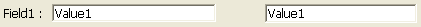

---

## Glissable

Contrôlez si l'utilisateur peut faire glisser l'objet et comment il peut le faire. Par défaut, aucune opération de glisser n'est autorisée.

Deux modes de glisser-déposer sont proposés dans 4D :

- Un mode **personnalisé**, dans lequel le glisser déclenche l'événement formulaire `Sur début glisser` dans le contexte de l'objet. <strong x-id="1">Custom</strong>: In this mode, any drag operation performed on the object triggers the <code>On Begin Drag</code> form event in the context of the object.\
  You then manage the drag action using a method. Ce mode vous permet de mettre en place des interfaces basées sur le glisser-déposer, y compris des interfaces qui ne déplacent pas nécessairement des données mais qui peuvent effectuer tout type d'action, telle que l'ouverture de fichiers ou le lancement d'un calcul. Ce mode est basé sur un ensemble de propriétés, d'événements et de commandes spécifiques à partir du thème `Conteneur de données`.
- Un mode **automatique**, dans lequel 4D **copie** du texte ou des images directement à partir de l'objet formulaire. Il peut alors être utilisé dans la même zone 4D, entre deux zones 4D, ou entre 4D et une autre application. For example, automatic drag (and drop) lets you copy a value between two fields without using programming:\
  \
  
  In this mode, the `On Begin Drag` form event is NOT generated. Si vous souhaitez "forcer" l'utilisation du glissement personnalisé alors que le glissement automatique est activé, maintenez la touche **Alt** (Windows) ou **Option** (macOS) enfoncée pendant l'action. Cette option n'est pas disponible pour les images.

Pour plus d'informations, reportez-vous à [Glisser-déposer](https://doc.4d.com/4Dv18/4D/18/Drag-and-Drop.300-4505037.en.html) dans le manuel _Langage 4D_.

#### Grammaire JSON

| Nom      | Type de données | Valeurs possibles                                                                                |
| -------- | --------------- | ------------------------------------------------------------------------------------------------ |
| dragging | text            | "none" (par défaut), "custom", "automatic" (hors list box) |

#### Objets pris en charge

[Zones 4D Write Pro](writeProArea_overview.md) - [Zone de saisie](input_overview.md) - [Liste hiérarchique](list_overview.md#overview) - [List Box](listbox_overview.md#overview) - [Zone de plug-in](pluginArea_overview.md#overview)

#### Voir également

[Droppable](#droppable)

---

## Déposable

Contrôlez si et comment l'objet peut être la destination d'une opération de glisser-déposer.

Deux modes de glisser-déposer sont proposés dans 4D :

- Un mode **personnalisé**, dans lequel le déposer déclenche les événements formulaire `Sur glisser` et `Sur déposer` dans le contexte de l'objet. Un mode <strong x-id="1">personnalisé</strong>, dans lequel le déposer déclenche les événements formulaire <code>Sur glisser</code> et <code>Sur déposer</code> dans le contexte de l'objet.\
  You then manage the drag action using a method. Ce mode vous permet de mettre en place des interfaces basées sur le glisser-déposer, y compris des interfaces qui ne déplacent pas nécessairement des données mais qui peuvent effectuer tout type d'action, telle que l'ouverture de fichiers ou le lancement d'un calcul. Ce mode est basé sur un ensemble de propriétés, d'événements et de commandes spécifiques à partir du thème `Conteneur de données`.
- Un mode **automatique**, dans lequel 4D gère automatiquement — si possible — l’insertion des données glissées de type texte ou image et déposées sur l’objet (les données sont collées dans l’objet). Les événements `Sur glisser` et `Sur déposer` ne sont pas générés. En revanche, les événements `Sur après modification` (lors du déposer) et `Sur données modifiées` (lorsque l'objet perd le focus) sont générés.

Pour plus d'informations, reportez-vous à [Glisser-déposer](https://doc.4d.com/4Dv18/4D/18/Drag-and-Drop.300-4505037.en.html) dans le manuel _Langage 4D_.

#### Grammaire JSON

| Nom      | Type de données | Valeurs possibles                                                                                |
| -------- | --------------- | ------------------------------------------------------------------------------------------------ |
| dropping | text            | "none" (par défaut), "custom", "automatic" (hors list box) |

#### Objets pris en charge

[Zones 4D Write Pro](writeProArea_overview.md) - [Bouton](button_overview.md) - [Zone de saisie](input_overview.md) - [Liste hiérarchique](list_overview.md#overview) - [List Box](listbox_overview.md#overview) - [Zone de plug-in](pluginArea_overview.md#ove

#### Voir également

[Draggable](#draggable)

---

## Exécuter méthode objet

Lorsque cette option est activée, la méthode objet est exécutée avec l'événement `Sur données modifiées` _au même moment_ où l'utilisateur change la valeur de l'indicateur. Lorsque l'option est désactivée, la méthode est exécutée _après_ la modification.

#### Grammaire JSON

| Nom                 | Type de données | Valeurs possibles |
| ------------------- | --------------- | ----------------- |
| continuousExecution | boolean         | true, false       |

#### Objets pris en charge

[Indicateur de progression](progressIndicator.md) - [Règle](ruler.md) - [Stepper](stepper.md)

---

## Méthode

Référence d'une méthode attachée à l'objet. Les méthodes d'objet "gèrent" généralement l'objet pendant que le formulaire est affiché ou imprimé. Vous n'appelez pas de méthode objet - 4D l'appelle automatiquement lorsqu'un événement implique l'objet auquel la méthode objet est rattachée.

Plusieurs types de références de méthode sont pris en charge :

- a standard object method file path, i.e. that uses the following pattern:\
  `ObjectMethods/objectName.4dm`\
  ... where `objectName` is the actual [object name](properties_Object.md#object-name). Ce type de référence indique que le fichier de méthode se trouve à l'emplacement par défaut ("sources/forms/_formName_/ObjectMethods/"). Dans ce cas, 4D gère automatiquement la méthode objet lorsque des opérations sont exécutées sur l'objet formulaire (renommage, duplication, copier/coller, etc.)

- a project method name: name of an existing project method without file extension, i.e.: `myMethod` In this case, 4D does not provide automatic support for object operations.

- a custom method file path including the .4dm extension, e.g.:\
  `../../CustomMethods/myMethod.4dm`
  You can also use a filesystem:\
  `/RESOURCES/Buttons/bOK.4dm`
  In this case, 4D does not provide automatic support for object operations.

#### Grammaire JSON

| Nom    | Type de données | Valeurs possibles                                                                          |
| ------ | --------------- | ------------------------------------------------------------------------------------------ |
| method | text            | Chemin de fichier standard ou personnalisé de la méthode objet ou nom de la méthode projet |

#### Objets pris en charge

[4D View Pro Area](viewProArea_overview.md) - [4D Write Pro Area](writeProArea_overview.md) - [Button](button_overview.md) - [Button Grid](buttonGrid_overview.md) - [Check Box](checkbox_overview.md) - [Combo Box](comboBox_overview.md) - [Dropdown list](dropdownList_Overview.md) - [Forms](FormEditor/forms.md) - [Hierarchical List](list_overview.md#overview) - [Input](input_overview.md) - [List Box](listbox_overview.md#overview) - [List Box Column](listbox_overview.md#list-box-columns) - [Picture Button](pictureButton_overview.md) - [Picture Pop up menu](picturePopupMenu_overview.md) - [Plug-in Area](pluginArea_overview.md#overview) - [Progress Indicators](progressIndicator.md) - [Radio Button](radio_overview.md) - [Ruler](ruler.md) - [Spinner](spinner.md) - [Splitter](splitters.md) - [Stepper](stepper.md) - [Subform](subform_overview.md) - [Tab control](tabControl.md) - [Web Area](webArea_overview.md#overview)

---

## Lignes déplaçables

`Array type list boxes`

Autorise le déplacement des lignes pendant l'exécution. Cette option est sélectionnée par défaut. Il n'est pas disponible pour les [list box de type sélection](listbox_overview.md#selection-list-boxes) ni pour les [list box en mode hiérarchique](properties_Hierarchy.md#hierarchical-list-box).

#### Grammaire JSON

| Nom         | Type de données | Valeurs possibles |
| ----------- | --------------- | ----------------- |
| movableRows | boolean         | true, false       |

#### Objets pris en charge

[List Box](listbox_overview.md#overview)

---

## Multi-sélectionnable

Allows the selection of multiple records/options in a [hierarchical list](list_overview.md).

#### Grammaire JSON

| Nom           | Type de données | Valeurs possibles            |
| ------------- | --------------- | ---------------------------- |
| selectionMode | text            | "multiple", "single", "none" |

#### Objets pris en charge

[Hierarchical List](list_overview.md)

---

## Triable

Permet de trier les données de colonne en cliquant sur un en-tête de [Listbox](listbox_overview.md). Cette option est sélectionnée par défaut. Les tableaux de types d'image (colonnes) ne peuvent pas être triés à l'aide de cette fonction.

Dans les list box basées sur une sélection d'enregistrements, la fonction de tri standard est disponible uniquement :

- Lorsque la source de données est _Sélection courante_,
- Avec des colonnes associées à des champs (de type Alpha, Numérique, Date, Heure ou Booléen).

Dans d'autres cas (list box basées sur des sélections nommées, colonnes associées à des expressions), la fonction de tri standard n'est pas disponible. Un tri de list box standard modifie l'ordre de la sélection courante dans la base de données. Cependant, les enregistrements en surbrillance et l'enregistrement courant ne sont pas modifiés. Un tri standard synchronise toutes les colonnes de la list box, y compris les colonnes calculées.

#### Grammaire JSON

| Nom      | Type de données | Valeurs possibles |
| -------- | --------------- | ----------------- |
| sortable | boolean         | true, false       |

#### Objets pris en charge

[List Box](listbox_overview.md)

---

## Action standard

Typical activities to be performed by active objects (_e.g._, letting the user accept, cancel, or delete records, move between records or from page to page in a multi-page form, etc.) have been predefined by 4D as standard actions. Elles sont décrites en détail dans la section [Actions standard](https://doc.4d.com/4Dv17R5/4D/17-R5/Standard-actions.300-4163633.en.html) du _manuel de développement_.

Vous pouvez associer à la fois une action standard et la méthode projet d'un objet. Dans ce cas, l'action standard est généralement exécutée après la méthode et 4D utilise cette action pour activer/désactiver l'objet en fonction du contexte courant. Lorsqu’un objet est désactivé, la méthode projet associée ne peut être exécutée.

Vous pouvez également définir cette propriété à l'aide de la commande `OBJECT SET ACTION`.

#### Grammaire JSON

| Nom    | Type de données | Valeurs possibles                                                                                                                |
| ------ | --------------- | -------------------------------------------------------------------------------------------------------------------------------- |
| action | string          | Le nom d'une [action standard valide](https://doc.4d.com/4Dv17R5/4D/17-R5/Standard-actions.300-4163633.en.html). |

#### Objets pris en charge

[Button](button_overview.md) - [Button Grid](buttonGrid_overview.md) - [Check Box](checkbox_overview.md) - [Drop-down List](dropdownList_Overview.md) - [List Box](listbox_overview.md) - [Picture Button](pictureButton_overview.md) - [Picture Pop-up Menu](picturePopupMenu_overview.md) - [Tab control](tabControl.md)
