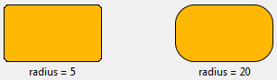
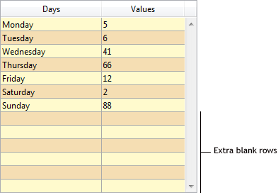
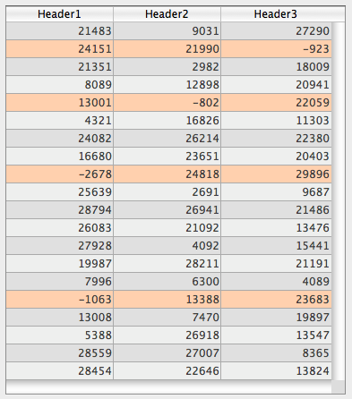

## Couleur de fond alternée

Permet de définir une couleur d'arrière-plan différente pour les lignes / colonnes impaires dans une list box. Permet de définir une couleur d'arrière-plan différente pour les lignes / colonnes impaires dans une list box.

Vous pouvez également définir cette propriété à l'aide de la commande [`OBJECT SET RGB COLORS`](../commands/object-set-rgb-colors).

#### Grammaire JSON

| Nom           | Type de données | Valeurs possibles                                                        |
| ------------- | --------------- | ------------------------------------------------------------------------ |
| alternateFill | string          | toutes les valeurs css; "transparent"; "automatic"; "automaticAlternate" |

#### Objets pris en charge

[List Box](listbox_overview.md) - [Colonne de List Box](listbox-column.md)

#### Commandes

[`OBJECT GET RGB COLORS`](../commands/object-get-rgb-colors) - [`OBJECT SET RGB COLORS`](../commands/object-set-rgb-colors)

---

## Couleur de fond

See [**Fill Color**](#fill-color). "Background color" is used in the Property list for [List Box](listbox_overview.md), [List Box Column](listbox-column.md) and [List Box Footer](listbox-header-footer.md#footers) objects.

---

## Expression couleur de fond {#background-color-expression}

`List box de type collection et entity selection`

Une expression ou une variable (les variables de tableau ne peuvent pas être utilisées) pour appliquer une couleur d'arrière-plan personnalisée à chaque ligne de la list box. L'expression ou la variable sera évaluée pour chaque ligne affichée et doit retourner une valeur de couleur RGB. For more information, refer to the description of the [`OBJECT SET RGB COLORS`](../commands/object-set-rgb-colors) command.

Vous pouvez également définir cette propriété en utilisant la commande [`LISTBOX SET PROPERTY`](../commands/listbox-set-property) avec la constante `lk background color expression`.

> Avec les list box de type collection ou sélection d'entité, cette propriété peut également être définie à l'aide d'une [Meta Info Expression](properties_Text.md#meta-info-expression).

#### Grammaire JSON

| Nom           | Type de données | Valeurs possibles                                   |
| ------------- | --------------- | --------------------------------------------------- |
| rowFillSource | string          | Une expression retournant une valeur de couleur RGB |

#### Objets pris en charge

[List Box](listbox_overview.md) - [Colonne de List Box](listbox-column.md)

#### Commandes

[`LISTBOX Get property`](../commands/listbox-get-property) - [`LISTBOX SET PROPERTY`](../commands/listbox-set-property)

---

## Border Color {#border-color}

Allows defining the color of the inner border for:

- [custom buttons](./button_overview.md#custom) with the ["custom" Border Line Style](#border-line-style),
- [custom check boxes](./checkbox_overview.md#custom),
- [custom radio buttons](./radio_overview.md#custom).

In other contexts, the property is ignored.

Note that the border is only displayed when its [width](#border-width) is > 0.

#### Grammaire JSON

| Nom         | Type de données | Valeurs possibles                          |
| ----------- | --------------- | ------------------------------------------ |
| borderColor | string          | une valeur css; "transparent"; "automatic" |

#### Objets pris en charge

[Custom Button](./button_overview.md#custom) (with ["custom" Border Line Style](#border-line-style)) - [Custom Check Box](checkbox_overview.md#custom) - [Custom Radio Button](radio_overview.md#custom)

#### Commandes

[`OBJECT GET RGB COLORS`](../commands/object-get-rgb-colors) - [`OBJECT SET RGB COLORS`](../commands/object-set-rgb-colors)

## Style de la bordure {#border-line-style}

Permet de définir un style standard pour la bordure de l'objet.

:::note

For [custom buttons](./button_overview.md#custom), the **custom** border line style enables the inner frame design, that includes a set of extra properties: [Fill color](#fill-color), [Frame color](#frame-color), [Frame width](#frame-width), and [Corner radius](./properties_BackgroundAndBorder.md#corner-radius).


:::

:::tip Article(s) de blog sur le sujet

[Customize Buttons, Radio Buttons, and Check Boxes with Background and Border Properties](https://blog.4d.com/customize-buttons-radio-buttons-and-check-boxes-with-background-and-border-properties).

:::

#### Grammaire JSON

| Nom         | Type de données | Valeurs possibles                                                           |
| ----------- | --------------- | --------------------------------------------------------------------------- |
| borderStyle | text            | "system", "none", "solid", "dotted", "raised", "sunken", "double", "custom" |

#### Objets pris en charge

[4D View Pro Area](viewProArea_overview.md) - [4D Write Pro areas](writeProArea_overview.md) - [Buttons](button_overview.md) - [Button Grid](buttonGrid_overview.md) - [Hierarchical List](list_overview.md) - [Input](input_overview.md) - [List Box](listbox_overview.md) - [Picture Button](pictureButton_overview.md) - [Picture Pop-up Menu](picturePopupMenu_overview.md) - [Plug-in Area](pluginArea_overview.md) - [Progress Indicator](progressIndicator.md) - [Ruler](ruler.md) - [Spinner](spinner.md) - [Stepper](stepper.md) - [Subform](subform_overview.md) - [Text Area](text.md) - [Web Area](webArea_overview.md)

#### Commandes

[`OBJECT Get border style`](../commands/object-get-border-style) - [`OBJECT SET BORDER STYLE`](../commands/object-set-border-style)

---

## Border Width {#border-width}

Allows defining the width of the inner border for:

- [custom buttons](./button_overview.md#custom) with the ["custom" Border Line Style](#border-line-style),
- [custom check boxes](./checkbox_overview.md#custom),
- [custom radio buttons](./radio_overview.md#custom).

In other contexts, the property is ignored.

The value is expressed in pixels.

#### Grammaire JSON

| Nom         | Type de données | Valeurs possibles                                                            |
| ----------- | --------------- | ---------------------------------------------------------------------------- |
| borderWidth | number          | Integer value (pixels). Minimum value = 0 |

#### Objets pris en charge

[Custom Button](./button_overview.md#custom) (with ["custom" Border Line Style](#border-line-style)) - [Custom Check Box](checkbox_overview.md#custom) - [Custom Radio Button](radio_overview.md#custom)

---

## Rayon d'arrondi

<details><summary>Historique</summary>

| Release | Modifications                                                    |
| ------- | ---------------------------------------------------------------- |
| 21 R5   | Support for custom-styled buttons, radio buttons and check boxes |
| 19 R7   | Prise en charge pour les zones de saisie et de texte             |

</details>

Définit l'arrondi des coins (en pixels) de l'objet. Par défaut, la valeur du rayon est de 0 pixel. Vous pouvez modifier cette propriété pour dessiner des objets arrondis avec des formes personnalisées :



La valeur minimale est de 0. Dans ce cas, un rectangle d'objet standard non arrondi est dessiné.
La valeur maximale dépend de la taille du rectangle (elle ne peut pas dépasser la moitié de la taille du côté le plus court du rectangle) et est calculée dynamiquement.

In [text areas](./text.md) and [inputs](./input_overview.md):

- the corner radius property is only available with "none", "solid", or "dotted" [border line styles](#border-line-style),
- the corner roundness is drawn **outside** the area of the object (the object appears larger in the form but its [width](./properties_CoordinatesAndSizing.md#width) and [height](./properties_CoordinatesAndSizing.md#height) are not extended).


In [custom buttons](./button_overview.md#custom) (with a ["custom" Border Line Style](#border-line-style)), [custom check boxes](checkbox_overview.md#custom) and [custom radio buttons](radio_overview.md#custom), the corner radius is drawn **inside** the area of the object.

#### Grammaire JSON

| Nom          | Type de données | Valeurs possibles           |
| ------------ | --------------- | --------------------------- |
| borderRadius | integer         | minimum : 0 |

#### Objets pris en charge

[Custom Button](./button_overview.md#custom) (with ["custom" Border Line Style](#border-line-style)) - [Custom Check Box](checkbox_overview.md#custom) - [Input](input_overview.md) - [Rectangle](shapes_overview.md#rectangle) - [Text Area](text.md) - [Custom Radio Button](radio_overview.md#custom)

#### Commandes

[OBJECT GET CORNER RADIUS](../commands/object-get-corner-radius) - [OBJECT SET CORNER RADIUS](../commands/object-set-corner-radius)

---

## Type de pointillé {#dotted-line-type}

Décrit le type de ligne en pointillé comme une séquence de points noirs et blancs.

#### Grammaire JSON

| Nom             | Type de données            | Valeurs possibles                                                                                                                                                     |
| --------------- | -------------------------- | --------------------------------------------------------------------------------------------------------------------------------------------------------------------- |
| strokeDashArray | tableau numérique ou texte | Ex : Ex : "6 1" ou \[6,1\] pour une séquence de 6 points noirs et 1 point blanc |

#### Objets pris en charge

[Rectangle](shapes_overview.md#rectangle) - [Ovale](shapes_overview.md#oval) - [Ligne](shapes_overview.md#line)

---

## Fill Color {#fill-color}

Defines the fill color / background color of an object. It can be defined for some standard objects (`fill` JSON property) or ["custom style" objects](#custom-style-button-check-box-or-radio-button) (`borderFillColor` JSON property).

### Standard objects

:::note

This property is named [**Background color**](#background-color) with [List Box](listbox_overview.md), [List Box Column](listbox-column.md) and [List Box Footer](listbox-header-footer.md#footers) objects.

:::

Dans le cas d'une list box, par défaut *Automatique* est sélectionné : la colonne utilise la couleur de fond définie au niveau de la list box.

#### Grammaire JSON

| Nom  | Type de données | Valeurs possibles                          |
| ---- | --------------- | ------------------------------------------ |
| fill | string          | une valeur css; "transparent"; "automatic" |

#### Objets pris en charge

[Hierarchical List](list_overview.md) - [Input](input_overview.md) - [List Box](listbox_overview.md) - [List Box Column](listbox-column.md) - [List Box Footer](listbox-header-footer.md#footers) - [Oval](shapes_overview.md#oval) - [Rectangle](shapes_overview.md#rectangle) - [Text Area](text.md)

#### Commandes

[`LISTBOX Get row color`](../commands/listbox-get-row-color) - [`LISTBOX SET ROW COLOR`](../commands/listbox-set-row-color) - [`OBJECT GET RGB COLORS`](../commands/object-get-rgb-colors) - [`OBJECT SET RGB COLORS`](../commands/object-set-rgb-colors)

### Custom button, custom check box, or custom radio button

This property allows you to assign a fill color attribute to [custom buttons](./button_overview.md#custom), [custom check boxes](./checkbox_overview.md#custom), or [custom radio buttons](./radio_overview.md#custom). In addition, [custom buttons](./button_overview.md#custom) must have the ["custom" Border Line Style](#border-line-style). In other contexts, the property is ignored.

#### Grammaire JSON

| Nom             | Type de données | Valeurs possibles                          |
| --------------- | --------------- | ------------------------------------------ |
| borderFillColor | string          | une valeur css; "transparent"; "automatic" |

#### Objets pris en charge

[Custom Button](./button_overview.md#custom) (with ["custom" Border Line Style](#border-line-style)) - [Custom Check Box](checkbox_overview.md#custom) - [Custom Radio Button](radio_overview.md#custom)

#### Commandes

[`OBJECT GET RGB COLORS`](../commands/object-get-rgb-colors) - [`OBJECT SET RGB COLORS`](../commands/object-set-rgb-colors)

#### Voir également

[Transparent](#transparent)

## Masquer lignes vides finales

Contrôle l'affichage des lignes vides supplémentaires ajoutées au bas d'un objet list box. Par défaut, 4D ajoute ces lignes supplémentaires pour remplir la zone vide :



Vous pouvez supprimer ces lignes vides en sélectionnant cette option. Le bas de l'objet list box est alors laissé vide :


#### Grammaire JSON

| Nom                | Type de données | Valeurs possibles |
| ------------------ | --------------- | ----------------- |
| hideExtraBlankRows | boolean         | true, false       |

#### Objets pris en charge

[List Box](listbox_overview.md)

#### Commandes

[`LISTBOX Get property`](../commands/listbox-get-property) - [`LISTBOX SET PROPERTY`](../commands/listbox-set-property)

---

## Couleur du trait

Désigne la couleur des lignes de l'objet.
La couleur peut être spécifiée par :

- un nom de couleur - comme "red"
- une valeur HEX - comme "# ff0000"
- une valeur RVB - comme "rgb (255,0,0)"

Vous pouvez également définir cette propriété à l'aide de la commande [`OBJECT SET RGB COLORS`](../commands/object-set-rgb-colors).

#### Grammaire JSON

| Nom    | Type de données | Valeurs possibles                          |
| ------ | --------------- | ------------------------------------------ |
| stroke | string          | une valeur css; "transparent"; "automatic" |

> Cette propriété est également disponible pour les objets à base de texte, auquel cas elle désigne à la fois la couleur de la police et les lignes de l'objet, voir [Couleur de la police](properties_Text.md#font-color).

#### Objets pris en charge

[Ligne](shapes_overview.md#line) - [Ovale](shapes_overview.md#oval) - [Rectangle](shapes_overview.md#rectangle)

#### Commandes

[`OBJECT GET RGB COLORS`](../commands/object-get-rgb-colors) - [`OBJECT SET RGB COLORS`](../commands/object-set-rgb-colors)

---

## Epaisseur du trait

Désigne l'épaisseur d'une ligne.

#### Grammaire JSON

| Nom         | Type de données | Valeurs possibles                                                                                                |
| ----------- | --------------- | ---------------------------------------------------------------------------------------------------------------- |
| strokeWidth | number          | 0 pour la plus petite largeur dans un formulaire imprimé, ou toute valeur d'entier < 20 |

#### Objets pris en charge

[Ligne](shapes_overview.md#line) - [Ovale](shapes_overview.md#oval) - [Rectangle](shapes_overview.md#rectangle)

---

## Tableau couleurs de fond {#row-background-color-array}

`List box de type tableau`

Le nom d'un tableau pour appliquer une couleur d'arrière-plan personnalisée à chaque ligne ou colonne de la list box.

Le nom d'un tableau Entier long doit être saisi. Chaque élément de ce tableau correspond à une ligne de la zone de list box (si elle est appliquée à la liste box) ou à une cellule de la colonne (si elle est appliquée à une colonne), le tableau doit donc avoir la même taille que le tableau associé à la colonne. Vous pouvez utiliser les constantes décrites dans la commande [`OBJECT SET RGB COLORS`](../commands/object-set-rgb-colors). Si vous souhaitez que la cellule hérite de la couleur d'arrière-plan définie au niveau supérieur, passez la valeur -255 à l'élément de tableau correspondant.

Par exemple, considérons une list box où les lignes ont une couleur alternée gris/gris clair, définie dans les propriétés de la list box. Un tableau de couleurs d'arrière-plan a également été défini pour la list box afin de changer en orange clair la couleur des lignes où au moins une valeur est négative :

```4d
 <>_BgndColors{$i}:=0x00FFD0B0 // orange
 <>_BgndColors{$i}:=-255 // default value
```



Vous souhaitez ensuite colorer les cellules avec des valeurs négatives en orange foncé. Vous souhaitez ensuite colorer les cellules avec des valeurs négatives en orange foncé. Les valeurs de ces tableaux ont la priorité sur celles définies dans les propriétés de list box ainsi que sur celles du tableau de couleurs d'arrière-plan général :

```4d
 <>_BgndColorsCol_3{2}:=0x00FF8000 // dark orange
 <>_BgndColorsCol_2{5}:=0x00FF8000
 <>_BgndColorsCol_1{9}:=0x00FF8000
 <>_BgndColorsCol_1{16}:=0x00FF8000
```


Vous pouvez obtenir le même résultat en utilisant les commandes [`LISTBOX SET ROW FONT STYLE`](../commands/listbox-set-row-font-style) et [`LISTBOX SET ROW COLOR`](../commands/listbox-set-row-color). Elles ont l'avantage de vous permettre d'éviter d'avoir à prédéfinir des tableaux de style/couleur pour les colonnes : ils sont créés dynamiquement par les commandes.

#### Grammaire JSON

| Nom           | Type de données | Valeurs possibles                             |
| ------------- | --------------- | --------------------------------------------- |
| rowFillSource | string          | Nom d'un tableau entier long. |

#### Objets pris en charge

[List Box](listbox_overview.md) - [Colonne de List Box](listbox-column.md)

#### Commandes

[`LISTBOX Get array`](../commands/listbox-get-array) - [`LISTBOX GET ARRAYS`](../commands/listbox-get-arrays)

---

## Transparent

Définit l'arrière-plan de la list box sur "Transparent". Lorsqu'elle est définie, toute [autre couleur d'arrière-plan](#alternate-background-color) ou [couleur d'arrière-plan](#background-color--fill-color) définie pour la colonne est ignorée.

#### Grammaire JSON

| Nom  | Type de données | Valeurs possibles |
| ---- | --------------- | ----------------- |
| fill | text            | "transparent"     |

#### Objets pris en charge

[List Box](listbox_overview.md)

#### Commandes

[`OBJECT GET RGB COLORS`](../commands/object-get-rgb-colors) - [`OBJECT SET RGB COLORS`](../commands/object-set-rgb-colors)

#### Voir également

[Couleur de fond](#background-color--fill-color)

