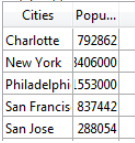
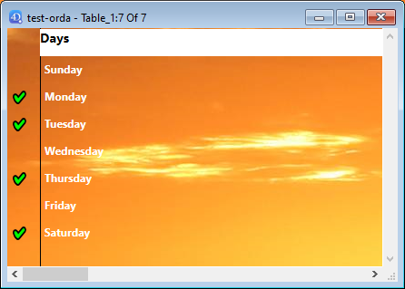

---

## Format Alpha

Les formats Alpha contrôlent l'apparence des champs et des variables alphanumériques (strings) lorsqu'ils sont affichés ou imprimés. Voici une liste des formats proposés pour les champs alphanumériques :

Vous pouvez choisir un format dans cette liste ou utiliser n'importe quel format personnalisé. La liste par défaut contient des formats pour certains des champs alpha les plus courants qui nécessitent des formats: numéros de téléphone américains (local et longue distance), numéros de sécurité sociale et codes postaux. Vous pouvez également saisir un nom de format personnalisé défini dans l'éditeur Filtres et formats de la boîte à outils. Dans ce cas, le format ne peut pas être modifié dans les propriétés de l'objet.
Tous les formats ou filtres personnalisés que vous avez créés sont automatiquement disponibles, précédés d'une barre verticale (|).

Le signe dièse (#) est le placeholder pour un format d'affichage alphanumérique. Vous pouvez inclure des tirets, les traits d'union, les espaces et tout autre signe de ponctuation que vous souhaitez afficher. Vous utilisez les signes de ponctuation réels que vous souhaitez et le symbole dièse pour chaque caractère que vous souhaitez afficher.

Par exemple, considérez un numéro de pièce avec un format tel que "RB-1762-1".

Le format alpha serait :

\##-####-#

Lorsque l'utilisateur entre "RB17621," le champ affiche :

RB-1762-1

Le champ contient en fait "RB17621".

Si l'utilisateur saisit plus de caractères que ce que le format le permet, 4D affiche les derniers caractères. Par exemple, si le format est :

(#######)

et si l'utilisateur saisit "proportion", le champ s'affiche:

(portion)

Le champ contient en fait "proportion". 4D accepte et stocke la saisie complète, quel que soit le format d’affichage. Aucune information n'est perdue.

#### Grammaire JSON

| Nom        | Type de données | Valeurs possibles                                                                                              |
| ---------- | --------------- | -------------------------------------------------------------------------------------------------------------- |
| textFormat | string          | "### ####", "(###) ### ####", "### ### ####", "### ## ####", "00000", formats personnalisés |

#### Objets pris en charge

[Liste déroulante](dropdownList_Overview.md) - [Combo Box](comboBox_overview.md) - [Colonne de List box](listbox_overview.md#list-box-columns) - [Footer List Box](listbox_overview.md#list-box-footers)

---

## Format Date

Les formats de date contrôlent la façon dont les dates apparaissent lorsqu'elles sont affichées ou imprimées. Pour la saisie des données (FR), vous entrez les dates dans le format JJ/MM/AAAA, quel que soit le format d'affichage que vous avez choisi.

Les formats d'affichage pour les dates peuvent être définis :

- en utilisant un format 4D intégré,
- en utilisant un modèle personnalisé.

### Formats intégrés

Le tableau ci-dessous montre les choix disponibles :

| Nom du format                                | Chaine JSON                                 | Exemple (système US)                       |
| -------------------------------------------- | ------------------------------------------- | ------------------------------------------------------------- |
| Système date court                           | systemShort (par défaut) | 03/25/20                                                      |
| Système date abrégé _(1)_ | systemMedium                                | Wed, Mar 25, 2020                                             |
| Système date long                            | systemLong                                  | Wednesday, March 25, 2020                                     |
| RFC 822                                      | rfc822                                      | Tue, 25 Mar 2020 22:00:00 GMT |
| Siècle court                                 | shortCentury                                | 03/25/20 but 04/25/2032 _(2)_              |
| Interne date long                            | long                                        | March 25, 2020                                                |
| Interne date abrégé _(1)_ | abbreviated                                 | Mar 25, 2020                                                  |
| Interne date court                           | short                                       | 03/25/2020                                                    |
| ISO Date Heure _(3)_      | iso8601                                     | 2020-03-25T00:00:00           |

_(1)_ Pour éviter toute ambiguïté et conformément à la pratique actuelle, les formats de date abrégés affichent "jun" pour juin et "jul" pour juillet. Cette particularité ne s'applique qu'aux versions françaises de 4D.

_(2)_ L'année est affichée avec deux chiffres lorsqu'elle appartient à l'intervalle (1930;2029), sinon elle est affichée avec quatre chiffres. Ceci est par défaut mais cela peut être modifié en utilisant la commande [SET DEFAULT CENTURY](https://doc.4d.com/4dv20/help/command/fr/page392.html).

_(3)_ Le format `ISO Date Time` correspond à la norme XML de représentation de la date et de l'heure (ISO8601). Il est principalement destiné à être utilisé lors de l'import/export de données au format XML et dans les services Web.

> Quel que soit le format d'affichage, si l'année est saisie avec deux chiffres, 4D considère que le siècle est le 21ème si l'année appartient à l'intervalle (00;29) et le 20e si elle appartient à l'intervalle (30;99). Ceci est le paramètre par défaut mais il peut être modifié en utilisant la commande [SET DEFAULT CENTURY](https://doc.4d.com/4dv20/help/command/fr/page392.html).

### Formats personnalisés

Des formats de date personnalisés peuvent être construits en utilisant plusieurs motifs décrits dans la page [**Formats de date et d'heure**](../Project/date-time-formats.md) . Par exemple :

| Motif                    | Exemple (système US) |
| ------------------------ | --------------------------------------- |
| "eeee, dd"               | Wednesday, 29                           |
| "'Day' #D 'of the year'" | Day #333 of the year                    |

#### Grammaire JSON

| Nom        | Type de données | Valeurs possibles                                                                                                                                                                                                                                                                                          |
| ---------- | --------------- | ---------------------------------------------------------------------------------------------------------------------------------------------------------------------------------------------------------------------------------------------------------------------------------------------------------- |
| dateFormat | string          | <li>Formats intégrés : "systemShort", "systemMedium", "systemLong", "iso8601", "rfc822", "short", "shortCentury", "abbreviated", "long" + " blankIfNull"</li><li>Formats personnalisés : tout format construit à l'aide d'un [motif pris en charge](../Project/date-time-formats.md) + " blankIfNull"</li> |

:::note blankIfNull

- Par défaut, une date nulle est affichée avec des zéros, par exemple 00/00/00. Avec l'option "blankIfNull", une date nulle est affichée comme une zone vide. La chaîne "blankIfNull" (sensible à la casse) doit être combinée avec la valeur de format sélectionnée. Ex : "systemShort blankIfNull" ou "ee dd LL blankIfNull".
- [List box columns](listbox_overview.md#list-box-columns) and [list box footers](listbox_overview.md#list-box-footers) of type date always use the "blank if null" behavior (it cannot be disengaged).

:::

#### Objets pris en charge

[Combo Box](comboBox_overview.md) - [Drop-down List](dropdownList_Overview.md) - [Input](input_overview.md) - [List Box Column](listbox_overview.md#list-box-columns) - [List Box Footer](listbox_overview.md#list-box-footers)

---

## Format numérique

> Les champs numériques comprennent les types Entier, Entier long, Entier 64 bits, Réel et Float.

Les formats numériques contrôlent la façon dont les nombres apparaissent lorsqu'ils sont affichés ou imprimés. Pour la saisie des données, vous saisissez uniquement les chiffres (y compris un point décimal ou un signe négatif si nécessaire), quel que soit le format d'affichage que vous avez choisi.

4D fournit différents formats numériques par défaut.

### Caractères de substitution (placeholders)

Dans chacun des formats d'affichage numériques, le signe dièse (#), zéro (0), le caret (^) et l'astérisque (\*) sont utilisés comme placeholders. Vous créez vos propres formats numériques en utilisant un placeholder pour chaque chiffre que vous souhaitez afficher.

| Placeholder | Effet pour les zéros de début ou de fin  |
| ----------- | ---------------------------------------- |
| #           | N'affiche rien                           |
| 0           | Affiche 0                                |
| ^           | Affiche un espace (1) |
| -           | Affiche un astérisque                    |

(1) Le caractère caret (^) génère un espace qui occupe la même largeur qu'un chiffre dans la plupart des polices de caractères.

Par exemple, si vous souhaitez afficher des numéros à trois chiffres, vous pouvez utiliser le format ###. Si l'utilisateur saisit plus de chiffres que le format le permet, 4D affiche <<< dans le champ pour indiquer que plus de chiffres ont été saisis que le nombre de chiffres spécifié dans le format d'affichage.

Si l'utilisateur saisit un nombre négatif, le caractère le plus à gauche est affiché sous forme de signe moins (sauf si un format d'affichage négatif a été spécifié). Si ##0 est le format, -26 est affiché comme –26 et -260 est affiché comme <<< car le signe moins occupe un espace réservé et il n'y a que trois espaces réservés.

> Quel que soit le format d’affichage, 4D accepte et stocke le nombre saisi dans le champ. Aucune information n'est perdue.

Chaque caractère de substitution a un effet différent sur l'affichage des zéros en tête ou en fin. Un zéro initial est un zéro qui commence un nombre avant la virgule ; un zéro final est un zéro qui termine un nombre après la virgule.

Supposons que vous utilisiez le format ##0 pour afficher trois chiffres. Si l'utilisateur ne saisit rien dans le champ, le champ affiche 0. Si l'utilisateur saisit 26, le champ affiche 26.

### Caractères séparateurs

Les formats d'affichage numérique (à l'exception des notations scientifiques) sont automatiquement basés sur les paramètres régionaux du système. 4D remplace les caractères «.» et «,» par, respectivement, le séparateur décimal et le séparateur de milliers définis dans le système d'exploitation. Le point et la virgule sont donc considérés comme des caractères de substitution, à l'instar de 0 ou #.

> Sur Windows, lors de l'utilisation de la touche de séparateur décimal du pavé numérique, 4D fait une distinction en fonction du type de champ où se trouve le curseur :
>
> - dans un champ de type Réel, l'utilisation de cette touche insérera le séparateur décimal défini dans le système,
> - dans n'importe quel autre type de champ, cette touche insère le caractère associé à la touche, généralement un point (.) ou une virgule (,).

### Points décimaux et autres caractères d'affichage

Vous pouvez utiliser un point décimal dans un format d'affichage numérique. Si vous voulez que le point décimal s'affiche, que l'utilisateur le saisisse ou non, il doit être placé entre des zéros.

Vous pouvez utiliser d'autres caractères dans le format. Lorsqu'ils sont utilisés seuls, ou placés avant ou après les placeholders, les caractères apparaissent toujours. Par exemple, si vous utilisez le format suivant :

$##0

un symbole dollar apparaît toujours car il est placé avant les placeholders.

Si des caractères sont placés entre des placeholders, ils n'apparaissent que si des chiffres sont affichés des deux côtés. Par exemple, si vous définissez le format :

\###.##0

le point apparaît uniquement si l'utilisateur saisit au moins quatre chiffres.

Les espaces sont traités comme des caractères dans les formats d'affichage numériques.

### Formats pour les nombres positifs, négatifs et nuls

Un format d'affichage numérique peut avoir jusqu'à trois parties vous permettant de spécifier des formats d'affichage pour les valeurs positives, négatives et nulles. Vous spécifiez les trois parties en les séparant par des points-virgules comme ci-dessous:

Positif;Négatif;Zéro

Vous n'avez pas à spécifier forcément toutes les parties du format. Si vous utilisez seulement une partie, 4D l'utilise pour tous les nombres, en plaçant un signe moins devant les nombres négatifs.

Si vous utilisez deux parties, 4D utilise la première partie pour les nombres positifs et zéro et la deuxième partie pour les nombres négatifs. Si vous utilisez trois parties, la première est pour les nombres positifs, la deuxième pour les nombres négatifs et la troisième pour zéro.

> La troisième partie (zéro) n'est pas interprétée et n'accepte pas les caractères de substitution. Si vous entrez `###;###;#`, la valeur zéro sera affichée “#”. En d'autres termes, ce que vous entrez réellement est ce qui sera affiché pour la valeur zéro.

Voici un exemple d'un format d'affichage numérique qui affiche des signes dollar et des virgules, place les valeurs négatives entre parenthèses, et n'affiche pas les zéros :

$###,##0.00;($###,##0.00);

Notez que la présence du deuxième point-virgule indique à 4D de ne rien utiliser pour afficher zéro. Le format suivant est similaire, sauf que l'absence du deuxième point-virgule indique à 4D d'utiliser le format de nombre positif pour zéro :

$###,##0.00;($###,##0.00)

Dans ce cas, l'affichage pour zéro serait $0.00.

### Notation scientifique

Si vous souhaitez afficher des nombres en notation scientifique, utilisez l'**esperluette** (&) suivie d'un nombre pour spécifier le nombre de chiffres que vous souhaitez afficher. Par exemple, le format :

&3

afficherait 759.62 comme :

7.60e+2

Le format de notation scientifique est le seul format qui arrondira automatiquement le nombre affiché. Notez dans l'exemple ci-dessus que le nombre est arrondi à 7.60e+2 au lieu d'être tronqué à 7.59e+2.

### Formats hexadécimaux

Vous pouvez afficher un nombre en hexadécimal en utilisant les formats d'affichage suivants :

- `&x`: Ce format affiche les nombres hexadécimaux en utilisant le format “0xFFFF”.
- `&$`: Ce format affiche les nombres hexadécimaux en utilisant le format “$FFFF”.

### Notation XML

Le format `&xml` rendra un nombre conforme aux règles standard XML. En particulier, le caractère séparateur décimal sera un point "." dans tous les cas, indépendamment des paramètres du système.

### Affichage d'un nombre en tant qu'heure

Vous pouvez afficher un nombre sous forme d'heure (avec un format heure) en utilisant `&/` suivi d'un chiffre. Le temps est déterminé en calculant le nombre de secondes que cette valeur représente à partir de minuit. Le chiffre dans le format représente la position dans le menu déroulant Format du format heure à utiliser.

Par exemple, le format :

&/5

correspond au 5e format d'heure dans le menu contextuel, plus précisément l'heure h: mn: s. Un champ numérique avec ce format afficherait 25000 comme suit :

6:56 du matin

### Exemples

Le tableau suivant montre comment les différents formats affectent l'affichage des nombres. Les trois colonnes — Positif, Négatif et Zéro — montrent comment 1 234,50, 1 234,50 et 0 seraient affichées.

| Format saisi                                                                          | Positif                    | Négatif                                        | Zéro                           |
| ------------------------------------------------------------------------------------- | -------------------------- | ---------------------------------------------- | ------------------------------ |
| ###                                                                                   | <<<                        | <<<                                            |                                |
| ####                                                                                  | 1234                       | <<<<                                           |                                |
| #######                                                                               | 1234                       | -1234                                          |                                |
| #####.##                                                              | 1234.5     | -1234.5                        |                                |
| ####0.00                                                              | 1234.50    | -1234.50                       | 0.00           |
| #####0                                                                                | 1234                       | -1234                                          | 0                              |
| +#####0;–#####0;0                                                                     | +1234                      | -1234                                          | 0                              |
| #####0DB;#####0CR;0                                                                   | 1234DB                     | 1234CR                                         | 0                              |
| #####0;(#####0)                                                    | 1234                       | (1234)                      | 0                              |
| ###,##0                                                                               | 1,234                      | -1,234                                         | 0                              |
| ##,##0.00                                                             | 1,234.50   | -1,234.50                      | 0.00           |
| \^\^\^\^\^\^\^                                                                 | 1234                       | -1234                                          |                                |
| \^\^\^\^\^\^0                                                                   | 1234                       | -1234                                          | 0                              |
| \^\^\^,\^\^0                                                                     | 1,234                      | -1,234                                         | 0                              |
| \^\^,\^\^0.00                                                     | 1,234.50   | -1,234.50                      | 0.00           |
| \*\*\*\*\*\*\*                                                                        | \*\*\*1234                 | \*\*-1234                                      | \*\*\*\*\*\*\*                 |
| \*\*\*\*\*\*0                                                                         | \*\*\*1234                 | \*\*-1234                                      | \*\*\*\*\*\*0                  |
| \*\*\*,\*\*0                                                                          | \*\*1,234                  | \*-1,234                                       | \*\*\*\*\*\*0                  |
| \*\*,\*\*0.00                                                         | \*1,234.50 | -1,234.50                      | \*\*\*\*\*0.00 |
| $\*,\*\*0.00;–$\*,\*\*0.00                            | $1,234.50  | -$1,234.50                     | $\*\*\*\*0.00  |
| $\^\^\^\^0                                                                        | $ 1234                     | $–1234                                         | $    0                         |
| $\^\^\^0;–$\^\^\^0                                                              | $1234                      | –$1234                                         | $   0                          |
| $\^\^\^0 ;($\^\^\^0)                                         | $1234                      | ($1234)                     | $   0                          |
| $\^,\^\^0.00 ;($\^,\^\^0.00) | $1,234.50  | ($1,234.50) | $    0.00      |
| &2                                                                | 1.2e+3     | -1.2e+3                        | 0.0e+0         |
| &5                                                                | 1.23450e+3 | -1.23450e+3                    | 0.00000        |
| &xml                                                              | 1234.5     | -1234.5                        | 0                              |

#### Grammaire JSON

| Nom          | Type de données | Valeurs possibles                                                                |
| ------------ | --------------- | -------------------------------------------------------------------------------- |
| numberFormat | string          | Nombres (y compris un signe décimal ou négatif si nécessaire) |

#### Objets pris en charge

[Combo Box](comboBox_overview.md) - [Liste déroulante](dropdownList_Overview.md) - [Input](input_overview.md) - [Colonne de List box](listbox_overview.md#list-box-columns) - [Pied List Box](listbox_overview.md#list-box-footers) - [Progress Indicators](progressIndicator.md)

---

## Format image

Les formats d'images contrôlent la façon dont les images apparaissent lorsqu'elles sont affichées ou imprimées. Pour la saisie des données, l'utilisateur saisit toujours les images en les collant depuis le Presse-papiers ou en les faisant glisser-déposer, quel que soit le format d'affichage.

Les options de troncature et de mise à l'échelle n'affectent pas l'image elle-même. Le contenu d'un champ Image est toujours enregistré. Seul l'affichage dans le formulaire est affecté par le format d'affichage de l'image.

### Image non tronquée

`Grammaire JSON : "scaled"`

Le format **Non tronquée** permet à 4D de redimensionner l'image pour qu'elle corresponde aux dimensions de la zone.

### Image tronquée (centrée et non centrée)

`Grammaire JSON : "truncatedCenter" / "truncatedTopLeft"`

Avec le format **Image tronquée (centrée)**, 4D centre l'image dans la zone et rogne toute partie qui ne rentre pas dans la zone. 4D rogne de manière égale à partir de chaque bord et du haut et du bas.

Avec le format **Image tronquée (non centrée)**, 4D place le coin supérieur gauche de l'image dans le coin supérieur gauche de la zone et rogne toute partie qui ne rentre pas dans la zone. 4D rogne à partie de la droite et du bas.

> Lorsque le format de l'image est **tronquée (non centrée)**, il est possible d'ajouter des barres de défilement à la zone de saisie.

### Image proportionnelle et Image proportionnelle centrée

`Grammaire JSON: "proportionnalTopLeft" / "proportionnalCenter"`

Lorsque vous utilisez **Image proportionnelle**, l'image est réduite proportionnellement de tous les côtés pour s'adapter à la zone créée pour l'image. L'option **Image proportionnelle centrée** fait la même chose, mais centre l'image dans la zone de l'image.

Si l'image est plus petite que la zone définie dans le formulaire, elle ne sera pas modifiée. Si l'image est plus grande que la zone définie dans le formulaire, elle est réduite proportionnellement. Étant donné qu'elle est réduite de manière proportionnelle, l'image n'apparaîtra pas déformée.

Si vous avez appliqué le format **Image proportionnelle centrée**, l'image est également centrée dans la zone :

### Mosaïque

Grammaire JSON : "tiled"

Lorsque la zone qui contient une image avec le format **Mosaïque** est agrandie, l'image n'est pas déformée mais est répliquée autant de fois que nécessaire pour remplir entièrement la zone.

Si le champ est réduit à une taille plus petite que celle de l'image d'origine, l'image est tronquée (non centrée).

#### Grammaire JSON

| Nom           | Type de données | Valeurs possibles                                                                                     |
| ------------- | --------------- | ----------------------------------------------------------------------------------------------------- |
| pictureFormat | string          | "truncatedTopLeft", "scaled", "truncatedCenter", "tiled", "proportionalTopLeft", "proportionalCenter" |

#### Objets pris en charge

[Input](input_overview.md) - [Colonne de List box](listbox_overview.md#list-box-columns) - [Pied List Box](listbox_overview.md#list-box-footers)

---

## Format heure

Les formats heure contrôlent la façon dont les heures apparaissent lorsqu'elles sont affichées ou imprimées. Pour la saisie des données, vous entrez les heures dans le format 24 heures HH:MM:SS ou dans le format 12 heures HH:MM:SS AM/PM, quel que soit le format d'affichage que vous avez choisi.

Les formats d'affichage des heures peuvent être définis :

- en utilisant un format 4D intégré,
- en utilisant un modèle personnalisé.

### Formats intégrés

Le tableau ci-dessous montre les formats d'affichage du champ Heure et donne des exemples :

| Nom du format                            | Chaine JSON                                        | Commentaires                                                                                                                                                                                                  | Exemple pour 04:30:25     |
| ---------------------------------------- | -------------------------------------------------- | ------------------------------------------------------------------------------------------------------------------------------------------------------------------------------------------------------------- | --------------------------------------------------------- |
| HH:MM:SS | hh_mm_ss |                                                                                                                                                                                                               | 04:30:25                  |
| hh:mn                    | hh_mm                         |                                                                                                                                                                                                               | 04:30                                     |
| Heures Minutes Secondes                  | HH_MM_SS |                                                                                                                                                                                                               | 4 heures 30 minutes 25 secondes                           |
| Heures Minutes                           | HH_MM                         |                                                                                                                                                                                                               | 4 heures 30 minutes                                       |
| h:mn Matin/Après-midi    | hh_mm_am |                                                                                                                                                                                                               | 4:30 a.m. |
| ms s                                     | mm_ss                         | Heure exprimée sous forme de durée à partir de 00:00:00                                                                                                                       | 270:25                                    |
| Minutes Secondes                         | MM_SS                         | Heure exprimée sous forme de durée à partir de 00:00:00                                                                                                                       | 270 Minutes 25 Secondes                                   |
| ISO Date Heure                           | iso8601                                            | Correspond à la norme XML pour représenter des données liées au temps. Il est principalement destiné à être utilisé lors de l'import/export de données au format XML et dans les services Web | 0000-00-00T04:30:25       |
| Système heure court                      | - (default)                     | Format heure standard défini dans le système                                                                                                                                                                  | 04:30:25                  |
| Système heure long abrégé                | systemMedium                                       | macOS seulement : Format d'heure abrégé défini dans le système.  Windows : ce format est le même que le format système heure court                        | 4•30•25 AM                                                |
| Système heure long                       | systemLong                                         | macOS seulement : Format d'heure long défini dans le système.  Windows : ce format est le même que le format système heure court                          | 4:30:25 AM HNEC           |

### Formats personnalisés

Des formats d'heure personnalisés peuvent être construits en utilisant plusieurs motifs décrits dans la page [**Formats de date et d'heure**](../Project/date-time-formats.md) . Par exemple :

| Motif                                   | Exemple (système US) |
| --------------------------------------- | --------------------------------------- |
| "HH 'heures' mm 'minutes' ss 'secondes' | 13 heures 25 minutes 12 secondes        |
| "hh:mm aa"              | 01:25 PM                |

#### Grammaire JSON

| Nom        | Type de données | Valeurs possibles                                                                                                                                                                                                                                                                                                          |
| ---------- | --------------- | -------------------------------------------------------------------------------------------------------------------------------------------------------------------------------------------------------------------------------------------------------------------------------------------------------------------------- |
| timeFormat | string          | <li>Formats intégrés : "systemShort", "systemMedium", "systemLong", "iso8601", "hh_mm_ss", "hh_mm", "hh_mm_am", "mm_ss", "HH_MM_SS", "HH_MM", "MM_SS" + " blankIfNull"</li><li>Formats personnalisés : tout format construit en utilisant [un modèle pris en charge](../Project/date-time-formats.md) + "blankIfNull"</li> |

:::note blankIfNull

Par défaut, une heure nulle est affichée avec des zéros, par exemple "00:00:00". Avec l'option "blankIfNull", une heure nulle est affichée comme une zone vide. La chaîne "blankIfNull" (sensible à la casse) doit être combinée avec la valeur de format sélectionnée. Ex : "MM_SS blankIfNull" ou "hh:mm aa blankIfNull"

:::

#### Objets pris en charge

[Combo Box](comboBox_overview.md) - [Drop-down List](dropdownList_Overview.md) - [Input](input_overview.md) - [List Box Column](listbox_overview.md#list-box-columns) - [List Box Footer](listbox_overview.md#list-box-footers)

---

## Texte si Faux / Texte si Vrai

Lorsqu'une [expression booléenne](properties_Object.md#expression-type) est affichée comme :

- un texte dans un [input](input_overview.md)
- une ["popup"](properties_Display.md#display-type) dans une [colonne de list box](listbox_overview.md#list-box-columns),

... vous pouvez sélectionner le texte à afficher pour chaque valeur :

- **Texte si vrai** - le texte à afficher lorsque la valeur est "true"
- **Texte si faux** - le texte à afficher lorsque la valeur est "false"

#### Grammaire JSON

| Nom           | Type de données | Valeurs possibles                                                               |
| ------------- | --------------- | ------------------------------------------------------------------------------- |
| booleanFormat | string          | "\<_textWhenTrue_\>;\<_textWhenFalse_\>", par exemple "Assigné;Non assigné" |

#### Objets pris en charge

[Colonne de list box](listbox_overview.md#list-box-columns) - [Input](input_overview.md)

---

## Type d'affichage

Utilisé pour associer un format d'affichage aux données de la colonne. Les formats fournis dépendent du type de variable (list box de type tableau) ou du type de données/de champ (list box de type sélection et collection).

Les colonnes booléennes et numériques (réel ou entier) peuvent être affichées sous forme de cases à cocher. Dans ce cas, la propriété [Titre](#titre) peut être définie.

Les colonnes booléennes peuvent également être affichées sous forme de pop up menus. Dans ce cas, les propriétés [Texte si Faux et Texte si Vrai](#texte-si-faux-texte-si-vrai) doivent être définies.

#### Grammaire JSON

| Nom         | Type de données | Valeurs possibles                                                                                                                                                       |
| ----------- | --------------- | ----------------------------------------------------------------------------------------------------------------------------------------------------------------------- |
| controlType | string          | <li>**colonnes numériques**: "automatique" (par défaut) ou "case à cocher"</li><li>**colonnes booléennes**: "case à cocher" (par défaut) ou "fenêtre contextuelle"</li> |

#### Objets pris en charge

[Colonne de list box](listbox_overview.md#list-box-columns)

---

## Non représenté

Lorsque cette propriété est activée, l'objet n'est pas affiché sur le formulaire, mais il peut toujours être activé.

En particulier, cette propriété permet de mettre en œuvre des boutons "invisibles".  Des boutons non représentés peuvent être placés par-dessus des objets graphiques. Ils restent invisibles et ne se mettent pas en surbrillance lorsqu'ils sont cliqués, cependant leur action est déclenchée dans ce cas.

#### Grammaire JSON

| Nom     | Type de données | Valeurs possibles |
| ------- | --------------- | ----------------- |
| display | boolean         | true, false       |

#### Objets pris en charge

[Bouton](button_overview.md) - [Liste déroulante](dropdownList_Overview.md)

---

## Trois États

Permet à un objet case à cocher d'accepter un troisième état. La variable associée à la case à cocher retourne la valeur 2 lorsque celle-ci se trouve dans le troisième état.

#### Cases à cocher à trois états dans des colonnes de list box

Les colonnes de list box avec un [type de données](properties_Object.md#expression-type) numérique peuvent être affichées sous forme de cases à cocher à trois états. Si choisi, les valeurs suivantes sont affichées :

- 0 = case non cochée,
- 1 = case cochée,
- 2 (ou toute valeur >0) = case partiellement cochée (troisième état). Pour la saisie des données, cet état renvoie la valeur 2.
- -1 = case à cocher invisible,
- -2 = case non cochée, non modifiable,
- -3 = case cochée, non modifiable,
- -4 = case semi-cochée, non modifiable

Dans ce cas également, la propriété [Titre](#titre) est également disponible afin que le libellé de la case à cocher puisse être saisi.

#### Grammaire JSON

| Nom        | Type de données | Valeurs possibles |
| ---------- | --------------- | ----------------- |
| threeState | boolean         | true, false       |

#### Objets pris en charge

[Case à cocher](checkbox_overview.md) - [Colonne de list box](listbox_overview.md#list-box-columns)

---

## Titre

Cette propriété est disponible pour une colonne de list box si :

- le [type de la colonne](properties_Object.md#expression-type) est **boolean** et son [type d'affichage](properties_Display.md#display-type) est "Case à cocher"
- le [type de la colonne](properties_Object.md#expression-type) est **numérique** (réel ou entier) et son [type d'affichage](properties_Display.md#display-type) est "Case à cocher trois états".

Dans ces cas, le titre de la case à cocher peut être saisi en utilisant cette propriété.

#### Grammaire JSON

| Nom          | Type de données | Valeurs possibles                                         |
| ------------ | --------------- | --------------------------------------------------------- |
| controlTitle | string          | N'importe quel libellé personnalisé pour la case à cocher |

#### Objets pris en charge

[Colonne de list box](listbox_overview.md#list-box-columns)

---

## Tronquer avec ellipse

Contrôle l'affichage des valeurs lorsque les colonnes de la list box sont trop étroites pour afficher leur contenu complet.

Cette option est disponible pour les colonnes avec n'importe quel type de contenu, sauf les images et les objets.

- Lorsque la propriété est activée (par défaut), si le contenu d'une cellule de list box dépasse la largeur de la colonne, il est tronqué et une ellipse est affichée :

> La position de l'ellipse dépend de l'OS. Dans l'exemple ci-dessus (Windows), il est ajouté sur le côté droit du texte. Sur macOS, les points de suspension sont ajoutés au milieu du texte.

- Lorsque la propriété est désactivée, si le contenu d'une cellule dépasse la largeur de la colonne, il est simplement coupé sans ajout d'une ellipse :

L'option Tronquer avec ellipse est activée par défaut et peut être spécifiée pour les list box de type tableau, sélection ou collection.

> Lorsqu'elle est appliquée aux colonnes de type texte, l'option Tronquer avec ellipse est disponible seulement si l'option [Wordwrap](#wordwrap) n'est pas sélectionnée. Lorsque la propriété Wordwrap est sélectionnée, les contenus supplémentaires dans les cellules sont gérés à travers les fonctions de retour à la ligne automatique, donc la propriété Tronquer avec ellipse n'est pas disponible.

La propriété Tronquer avec ellipse peut être appliquée aux colonnes de type booléen ; cependant, le résultat diffère en fonction du [format de la cellule](#display-type) :

- Pour les formats booléens de type Pop-up, les libellés sont tronqués avec une ellipse,
- Pour les formats booléens de type case à cocher, les libellés sont toujours coupés.

#### Grammaire JSON

| Nom          | Type de données | Valeurs possibles      |
| ------------ | --------------- | ---------------------- |
| truncateMode | string          | "withEllipsis", "none" |

#### Objets pris en charge

[List Box Column](listbox_overview.md#list-box-columns) - [List Box Footer](listbox_overview.md#list-box-footers)

---

## Visibilité

Cette propriété permet de masquer l'objet dans l'environnement Application.

Vous pouvez gérer la propriété Visibilité pour la plupart des objets de formulaire. Cette propriété est principalement utilisée pour simplifier le développement d'interface dynamique. Dans ce contexte, il est souvent nécessaire de masquer les objets de manière programmée lors de l'événement `On load` du formulaire, puis d'afficher certains objets par la suite. La propriété Visibilité permet d'inverser cette logique en rendant certains objets invisibles par défaut. Le développeur peut ensuite programmer son affichage en utilisant la commande [`OBJECT SET VISIBLE`](https://doc.4d.com/4dv20/help/command/fr/page603.html) lorsque nécessaire.

#### Visibilité automatique dans les formulaires liste

Dans le contexte des [formulaires liste](FormEditor/properties_FormProperties.md#form-type), la propriété Visibilité prend en charge deux valeurs spécifiques :

- **Si enregistrement sélectionné** (nom JSON : "selectedRows")
- **Si enregistrement non sélectionné** (nom JSON : "unselectedRows")

Cette propriété est utilisée uniquement lors du dessin d'objets situés dans le corps d'un formulaire liste. Elle indique à 4D s'il faut ou non dessiner l'objet en fonction de la sélection/non-sélection de l'enregistrement en cours de traitement. Cela vous permet de représenter une sélection d'enregistrements en utilisant des attributs visuels autres que les couleurs de surbrillance :

4D ne tient pas compte de cette propriété si l'objet était masqué à l'aide de la commande [`OBJECT SET VISIBLE`](https://doc.4d.com/4dv20/help/command/fr/page603.html); dans ce cas, l'objet reste invisible indépendamment de la sélection de l'enregistrement.

#### Grammaire JSON

| Nom        | Type de données | Valeurs possibles                                                                                                                                         |
| ---------- | --------------- | --------------------------------------------------------------------------------------------------------------------------------------------------------- |
| visibility | string          | "visible", "hidden", "selectedRows" (formulaires liste uniquement), "unselectedRows" (formulaires liste uniquement) |

#### Objets pris en charge

[Zone 4D View Pro](viewProArea_overview.md) - [Zone 4D Write Pro](writeProArea_overview.md) - [Bouton](button_overview.md) - [Grille de boutons](buttonGrid_overview.md) - [Case à cocher](checkbox_overview.md) - [Combo Box](comboBox_overview.md) - [Liste déroulante](dropdownList_Overview.md) - [Zone de groupe](groupBox.md) - [Liste hiérarchique](list_overview.md) - [List Box](listbox_overview.md) - [Colonne de list box](listbox_overview.md#list-box-columns) - [Pied de list box](listbox_overview.md#list-box-footers) - [En-tête de list box](listbox_overview.md#list-box-headers) - [Bouton image](pictureButton_overview.md) - [Pop up menu image](picturePopupMenu_overview.md) - [Zone de Plug-in](pluginArea_overview.md) - [Indicateur de progression](progressIndicator.md) - [Bouton radio](radio_overview.md) - [Spinner](spinner.md) - [Splitter](splitters.md) - [Image statique](staticPicture.md) - [Stepper](stepper.md) - [Sous-formulaire](subform_overview.md) - [Onglet](tabControl.md) - [Zone de texte](text.md) - [Zone Web](webArea_overview.md)

---

## Retour à la ligne

> Pour les [input](input_overview.md), disponibles lorsque la propriété [Multiligne](properties_Entry.md#multiline) est définie sur "oui".

Gère l'affichage du contenu lorsque celui-ci dépasse la largeur de l'objet.

#### Coché pour list box/Oui pour input

`Grammaire JSON : "normal"`

Lorsque cette option est sélectionnée, le texte passe automatiquement à la ligne suivante chaque fois que sa largeur dépasse celle de la colonne/zone, si la hauteur de la colonne/zone le permet.

- Dans les colonnes/zones à une seule ligne, seul le dernier mot pouvant être affiché entièrement est affiché. 4D insère des sauts de ligne ; il est possible de faire défiler le contenu de la zone en appuyant sur la touche de flèche vers le bas.

- Dans les colonnes/zones multi-lignes, 4D effectue des retours à la ligne automatiques.

#### Non cochée pour list box/Non pour input

`Grammaire JSON : "none"`

Lorsque cette option est sélectionnée, 4D ne fait aucune retour automatique à la ligne et le dernier mot qui peut être affiché peut être tronqué. Dans les zones de type texte, les retours chariots sont pris en charge :

Dans les listes déroulantes, tout texte trop long est tronqué et affiché avec une ellipse (...). Dans l'exemple suivant, l'option Retour à la ligne est **cochée pour la colonne de gauche** et **décochée pour la colonne de droite** :

Notez que quelle que soit la valeur de l'option de renvoi à la ligne automatique, la hauteur de la ligne n'est pas modifiée. Si le texte avec des sauts de ligne ne peut pas être entièrement affiché dans la colonne, il est tronqué (sans ellipse). Dans le cas des list box affichant une seule ligne, seule la première ligne de texte est affichée :

#### Automatique pour l'input (option par défaut)

`Grammaire JSON : "automatique"`

- Dans les zones mono-lignes, les mots situés en fin de ligne sont tronqués et il n’y a pas de retours à la ligne.
- Dans les zones multi-lignes, 4D effectue des retours à la ligne automatiques.

#### Grammaire JSON

| Nom      | Type de données | Valeurs possibles                                                            |
| -------- | --------------- | ---------------------------------------------------------------------------- |
| wordwrap | string          | "automatic" (à l'exception de list box), "normal", "none" |

#### Objets pris en charge

[Input](input_overview.md) - [Colonne de List box](listbox_overview.md#list-box-columns) - [Pied List Box](listbox_overview.md#list-box-footers)
