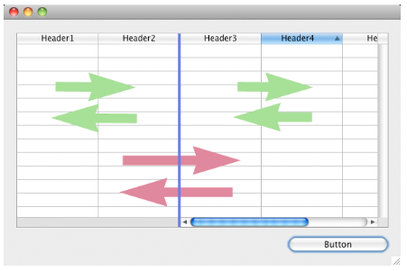
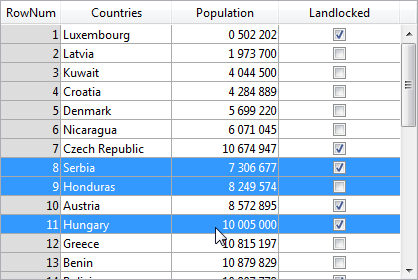

---

## Colonnes

Collection de colonnes de la list box.

#### Grammaire JSON

| Nom      | Type de données             | Valeurs possibles                                |
| -------- | --------------------------- | ------------------------------------------------ |
| colonnes | collection d'objets colonne | Contient les propriétés des colonnes de list box |

For a list of properties supported by column objects, please refer to the [Column Specific Properties](listbox_overview.md#column-specific-properties) section.

#### Objets pris en charge

[List Box](listbox_overview.md)

---

## Nom formulaire détaillé

`Liste box sélection`

Indique le formulaire à utiliser pour modifier ou afficher les enregistrements individuels de la list box.

Le formulaire spécifié est affiché :

- when using `Add Subrecord` and `Edit Subrecord` standard actions applied to the list box (see [Using standard actions](https://doc.4d.com/4Dv20/4D/20/Using-standard-actions.300-6263819.en.html)),
- when a row is double-clicked and the [Double-click on Row](#double-click-on-row) property is set to "Edit Record" or "Display Record".

#### Grammaire JSON

| Nom        | Type de données | Valeurs possibles                                                                                                                                  |
| ---------- | --------------- | -------------------------------------------------------------------------------------------------------------------------------------------------- |
| detailForm | string          | <li>Name (string) of table or project form</li><li>POSIX path (string) to a .json file describing the form</li><li>Object describing the form</li> |

#### Objets pris en charge

[List Box](listbox_overview.md)

---

## Double-clic sur ligne

`Liste box sélection`

Définit l'action à réaliser lorsqu'un utilisateur double-clique sur une ligne dans la list box. Les options disponibles sont :

- **Do nothing** (default): Double-clicking a row does not trigger any automatic action.
- **Edit Record**: Double-clicking a row displays the corresponding record in the detail form defined [for the list box](#detail-form-name). L'enregistrement est ouvert en lecture-écriture afin qu'il puisse être modifié.
- **Display Record**: Identical to the previous action, except that the record is opened in read-only mode so it cannot be modified.

> Le double-clic sur une ligne vide est ignoré dans les listbox.

Regardless of the action selected/chosen, the `On Double clicked` form event is generated.

For the last two actions, the On `Open Detail` form event is also generated. The `On Close Detail` is then generated when a record displayed in the detail form associated with the list box is about to be closed (regardless of whether or not the record was modified).

#### Grammaire JSON

| Nom                    | Type de données | Valeurs possibles                   |
| ---------------------- | --------------- | ----------------------------------- |
| doubleClickInRowAction | string          | "editSubrecord", "displaySubrecord" |

#### Objets pris en charge

[List Box](listbox_overview.md)

---

## Ensemble surlignage

`Liste box sélection`

This property is used to specify the set to be used to manage highlighted records in the list box (when the **Arrays** data source is selected, a Boolean array with the same name as the list box is used).

4D creates a default set named _ListBoxSetN_ where _N_ starts at 0 and is incremented according to the number of list boxes in the form. Si nécessaire, vous pouvez modifier la configuration par défaut. It can be a local, process or interprocess set (we recommend using a local set, for example _$LBSet_, in order to limit network traffic). Il est ensuite maintenu automatiquement par 4D. Si l'utilisateur sélectionne une ou plusieurs lignes dans la list box, l'ensemble est immédiatement mis à jour. Si vous souhaitez sélectionner une ou plusieurs lignes par programmation, vous pouvez appliquer les commandes du thème "Ensembles" à cet ensemble.

> - L'état de surbrillance des lignes de la list box et l'état de surbrillance des enregistrements de la table sont totalement indépendants.
> - Si la propriété "Highlight Set" ne contient pas de nom, il ne sera pas possible d'effectuer des sélections dans la list box.

#### Grammaire JSON

| Nom          | Type de données | Valeurs possibles |
| ------------ | --------------- | ----------------- |
| highlightSet | string          | Nom de l'ensemble |

#### Objets pris en charge

[List Box](listbox_overview.md)

---

## Colonnes verrouillées et colonnes statiques

Les colonnes verrouillées et les colonnes statiques sont deux fonctionnalités distinctes et indépendantes dans les list box :

- Les colonnes verrouillées restent toujours affichées à gauche de la list box ; elles ne défilent pas horizontalement.
- Les colonnes statiques ne peuvent pas être déplacées par glisser-déposer dans la list box.

> Vous pouvez définir des colonnes statiques et verrouillées par programmation, voir la section "List Box" dans le manuel _4D Language Reference_ .

Ces propriétés interagissent comme suit :

- Si vous définissez des colonnes qui sont uniquement statiques, elles ne peuvent pas être déplacées.

- Si vous définissez des colonnes verrouillées mais non statiques, vous pouvez toujours modifier leur position librement à l'intérieur de la zone verrouillée. Toutefois, une colonne verrouillée ne peut pas être déplacée en dehors de cette zone verrouillée.



- Si vous définissez toutes les colonnes de la zone verrouillée comme statiques, vous ne pouvez pas déplacer ces colonnes à l'intérieur de la zone verrouillée.


- Vous pouvez combiner des colonnes verrouillées et statiques en fonction de vos besoins. Par exemple, si vous définissez trois colonnes verrouillées et une colonne statique, l'utilisateur peut permuter les deux colonnes les plus à droite dans la zone verrouillée (puisque seule la première colonne est statique).

### Nombre de colonnes verrouillées

Nombre de colonnes qui doivent rester affichées en permanence dans la partie gauche de la list box, même lorsque l'utilisateur fait défiler les colonnes horizontalement.

#### Grammaire JSON

| Nom               | Type de données | Valeurs possibles           |
| ----------------- | --------------- | --------------------------- |
| lockedColumnCount | integer         | minimum : 0 |

#### Objets pris en charge

[List Box](listbox_overview.md)

### Nombre de colonnes statiques

Nombre de colonnes qui ne peuvent pas être déplacées pendant l'exécution.

#### Grammaire JSON

| Nom               | Type de données | Valeurs possibles           |
| ----------------- | --------------- | --------------------------- |
| staticColumnCount | integer         | minimum : 0 |

#### Objets pris en charge

[List Box](listbox_overview.md)

---

## Nombre de colonnes

Définit le nombre de colonnes de la list box.

> You can add or remove columns dynamically by programming, using commands such as [`LISTBOX INSERT COLUMN`](https://doc.4d.com/4dv20/help/command/en/page829.html) or [`LISTBOX DELETE COLUMN`](https://doc.4d.com/4dv20/help/command/en/page830.html).

#### Grammaire JSON

| Nom         | Type de données | Valeurs possibles          |
| ----------- | --------------- | -------------------------- |
| columnCount | integer         | minimum: 1 |

#### Objets pris en charge

[List Box](listbox_overview.md)

---

## Tableau de contrôle des lignes

`Array type list box`

Un tableau 4D contrôlant l'affichage des lignes de la list box.

Ce tableau permet de définir les propriétés d'interface "masquée", "désactivée" et "sélectionnable" pour chaque ligne d'une list box basée sur un tableau. It can also be designated using the `LISTBOX SET ARRAY` command.

Le tableau de contrôle des lignes doit être de type Longint et comprendre le même nombre de lignes que la list box. Each element of the _Row Control Array_ defines the interface status of its corresponding row in the list box. Trois propriétés d'interface sont disponibles à l'aide de constantes dans le thème de constantes "List Box" :

| Constante                | Valeur | Commentaire                                                                                                                                                                                                                                                                                                                                                                                                                                                                                                                                                                                                                                                                                                                                                                                                                                                                                                      |
| ------------------------ | ------ | ---------------------------------------------------------------------------------------------------------------------------------------------------------------------------------------------------------------------------------------------------------------------------------------------------------------------------------------------------------------------------------------------------------------------------------------------------------------------------------------------------------------------------------------------------------------------------------------------------------------------------------------------------------------------------------------------------------------------------------------------------------------------------------------------------------------------------------------------------------------------------------------------------------------- |
| lk row is disabled       | 2      | La ligne correspondante est désactivée. Le texte et les contrôles tels que les cases à cocher sont atténués ou grisés. Les zones de saisie de texte ne sont plus saisissables. Valeur par défaut : Enabled                                                                                                                                                                                                                                                                                                                                                                                                                                                                                                                                                                                                                                       |
| lk row is hidden         | 1      | La ligne correspondante est masquée. Le masquage des lignes n'affecte que l'affichage de la list box. Les lignes masquées sont toujours présentes dans les tableaux et peuvent être gérées par programmation. The language commands, more particularly `LISTBOX Get number of rows` or `LISTBOX GET CELL POSITION`, do not take the displayed/hidden status of rows into account. For example, in a list box with 10 rows where the first 9 rows are hidden, `LISTBOX Get number of rows` returns 10. Du point de vue de l'utilisateur, la présence de lignes masquées dans une zone de liste n'est pas décelable. Seules les lignes visibles peuvent être sélectionnées (par exemple à l'aide de la commande Tout sélectionner). Valeur par défaut : Visible |
| lk row is not selectable | 4      | La ligne correspondante n'est pas sélectionnable (le surlignage n'est pas possible). Enterable text input areas are no longer enterable unless the [Single-Click Edit](properties_Entry.md#single-click-edit) option is enabled. Les contrôles tels que les cases à cocher et les listes sont toutefois toujours fonctionnels. Ce paramètre est ignoré si le mode de sélection de la listbox est "None". Valeur par défaut : Sélectionnable                                                                                                                                                                                                                                                                                                                                                                   |

Pour modifier l'état d'une ligne, il suffit d'affecter la ou les constante(s) appropriée(s) à l'élément de tableau correspondant. Par exemple, si vous ne voulez pas que la ligne n° 10 soit sélectionnable, vous pouvez écrire :

```4d
 aLControlArr{10}:=lk row is not selectable
```



Vous pouvez définir plusieurs propriétés d'interface à la fois :

```4d
 aLControlArr{8}:=lk row is not selectable + lk row is disabled
```


Notez que le paramétrage des propriétés d'un élément remplace toutes les autres valeurs de cet élément (si non réinitialisées). Par exemple :

```4d
 aLControlArr{6}:=lk row is disabled + lk row is not selectable 
 //sets row 6 as disabled AND not selectable
 aLControlArr{6}:=lk row is disabled 
 //sets row 6 as disabled but selectable again
```

#### Grammaire JSON

| Nom              | Type de données | Valeurs possibles                     |
| ---------------- | --------------- | ------------------------------------- |
| rowControlSource | string          | Nom du tableau de contrôle des lignes |

#### Objets pris en charge

[List Box](listbox_overview.md)

---

## Mode de sélection

Désigne l'option permettant aux utilisateurs de sélectionner des lignes :

- **None**: Rows cannot be selected if this mode is chosen. Clicking on the list will have no effect unless the [Single-Click Edit](properties_Entry.md#single-click-edit) option is enabled. The navigation keys only cause the list to scroll; the `On Selection Change` form event is not generated.
- **Single**: One row at a time can be selected in this mode. Un clic sur une ligne la sélectionne. A **Ctrl+click** (Windows) or **Command+click** (macOS) on a row toggles its state (between selected or not).\
  The Up and Down arrow keys select the previous/next row in the list. Les autres touches de navigation font défiler la liste. The `On Selection Change` form event is generated every time the current row is changed.
- **Multiple**: Several rows can be selected simultaneously in this mode.

#### Grammaire JSON

| Nom           | Type de données | Valeurs possibles            |
| ------------- | --------------- | ---------------------------- |
| selectionMode | string          | "multiple", "single", "none" |

#### Objets pris en charge

[List Box](listbox_overview.md)
