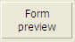

---

## Type

`PARAMETRAGE OBLIGATOIRE`

Cette propriété désigne le type [objet de formulaire actif ou inactif](formObjects_overview.md).

#### Grammaire JSON

| Nom  | Type de données | Valeurs possibles                                                                                                                                                                                                                                                                                        |
| ---- | --------------- | -------------------------------------------------------------------------------------------------------------------------------------------------------------------------------------------------------------------------------------------------------------------------------------------------------- |
| type | string          | "button", "buttonGrid", "checkbox", "combo", "dropdown", "groupBox", "input", "line", "list", "listbox", "oval", "picture", "pictureButton", "picturePopup", "plugin", "progress", "radio", "rectangle", "ruler", "spinner", "splitter", "stepper", "subform", "tab", "text", "view", "webArea", "write" |

#### Objets pris en charge

[4D View Pro area](viewProArea_overview.md) - [4D Write Pro area](writeProArea_overview.md) - [Button](button_overview.md) - [Button Grid](buttonGrid_overview.md) - [Check Box](checkbox_overview.md) - [Combo Box](comboBox_overview.md) - [Drop-down List](dropdownList_Overview.md) - [Group Box](groupBox.md) - [Hierarchical List](list_overview.md) - [List Box](listbox_overview.md) - [List Box Column](listbox_overview.md#list-box-columns) - [List Box Footer](listbox_overview.md#list-box-footers) - [List Box Header](listbox_overview.md#list-box-headers) - [Picture Button](pictureButton_overview.md) - [Picture Pop-up Menu](picturePopupMenu_overview.md) - [Plug-in Area](pluginArea_overview.md) - [Progress indicator](progressIndicator.md) - [Radio Button](radio_overview.md) -[Spinner](spinner.md) - [Splitter](splitters.md) - [Static Picture](staticPicture.md) - [Stepper](stepper.md) - [Subform](subform_overview.md) - [Tab control](tabControl.md) - [Text Area](text.md) - [Web Area](webArea_overview.md)

---

## Nom d'objet

Chaque objet de formulaire actif est associé à un nom d'objet. Chaque nom d'objet doit être unique.

> Les noms d'objets sont limités à une taille de 255 octets.

When using 4D’s language, you can refer to an active form object by its object name (see [Object (Forms) commands](../category/object-forms)).

For more information about naming rules for form objects, refer to [Identifiers](Concepts/identifiers.md) section.

#### Grammaire JSON

| Nom  | Type de données | Valeurs possibles                                               |
| ---- | --------------- | --------------------------------------------------------------- |
| name | string          | Tout nom autorisé qui n'appartient pas à un objet déjà existant |

#### Objets pris en charge

[4D View Pro area](viewProArea_overview.md) - [4D Write Pro area](writeProArea_overview.md) - [Button](button_overview.md) - [Button Grid](buttonGrid_overview.md) - [Check Box](checkbox_overview.md) - [Combo Box](comboBox_overview.md) - [Drop-down List](dropdownList_Overview.md) - [Group Box](groupBox.md) - [Hierarchical List](list_overview.md) - [List Box](listbox_overview.md) - [List Box Column](listbox_overview.md#list-box-columns) - [List Box Footer](listbox_overview.md#list-box-footers) - [List Box Header](listbox_overview.md#list-box-headers) - [Picture Button](pictureButton_overview.md) - [Picture Pop-up Menu](picturePopupMenu_overview.md) - [Plug-in Area](pluginArea_overview.md) - [Progress indicator](progressIndicator.md) - [Spinner](spinner.md) - [Splitter](splitters.md) - [Static Picture](staticPicture.md) - [Stepper](stepper.md) - [Radio Button](radio_overview.md) - [Subform](subform_overview.md) - [Tab control](tabControl.md) - [Text Area](text.md) - [Web Area](webArea_overview.md)

---

## Mémoriser valeur

This property is available when the [Save Geometry](FormEditor/properties_FormProperties.md#save-geometry) option is checked for the form.

Cette fonction n'est disponible que pour les objets qui contribuent à la géométrie globale du formulaire. Par exemple, cette option est disponible pour les cases à cocher car leur valeur peut être utilisée pour masquer ou afficher des zones supplémentaires dans la fenêtre.

Voici la liste des objets dont la valeur peut être mémorisée :

| Object                                     | Valeur mémorisée                                                                                         |
| ------------------------------------------ | -------------------------------------------------------------------------------------------------------- |
| [Check Box](checkbox_overview.md)          | Valeur de la variable associée (0, 1, 2)                                              |
| [Drop-down List](dropdownList_Overview.md) | Numéro de la ligne sélectionnée                                                                          |
| [Radio Button](radio_overview.md)          | Valeur de la variable associée (1, 0, True ou False pour les boutons selon leur type) |
| [Tab control](tabControl.md)               | Numéro de l'onglet sélectionné                                                                           |

#### Grammaire JSON

| Nom           | Type de données | Valeurs possibles |
| ------------- | --------------- | ----------------- |
| memorizeValue | boolean         | true, false       |

#### Objets pris en charge

[Check Box](checkbox_overview.md) - [Drop-down List](dropdownList_Overview.md) - [Radio Button](radio_overview.md) - [Tab control](tabControl.md)

---

## Variable ou expression

> Voir également **[Expression](properties_DataSource.md#expression)** pour les colonnes de list box de type sélection et collection.

Cette propriété spécifie la source des données. Chaque objet de formulaire actif est associé à un nom d'objet et à un nom de variable. Le nom de la variable peut être différent du nom de l'objet. In the same form, you can use the same variable several times while each [object name](#object-name) must be unique.

> La taille du nom de la variable est limitée à 31 octets. See [Identifiers](Concepts/identifiers.md) section for more information about naming rules.

Les variables d'objet de formulaire vous permettent de contrôler et de piloter les objets. Par exemple, lorsqu'un bouton est cliqué, sa variable est fixée à 1 ; à tout autre moment, elle est fixée à 0. L'expression associée à un indicateur de progression permet de lire et de modifier le réglage en cours.

Les variables ou expressions peuvent être saisissables ou non saisissables et peuvent recevoir des données de type Texte, Entier, Reél, Date, Heure, Image, Booléen ou Objet.

#### Grammaire JSON

| Nom        | Type de données             | Valeurs possibles                                                                                                                                                                                                                                         |
| ---------- | --------------------------- | --------------------------------------------------------------------------------------------------------------------------------------------------------------------------------------------------------------------------------------------------------- |
| dataSource | texte, ou tableau de textes | <li>4D variable, field name, or any expression.</li><li>Empty string for [dynamic variables](#dynamic-variables).</li><li>String array (collection of array names) for a [hierarchical listbox](listbox_overview.md#hierarchical-list-boxes) column]</li> |

### Expressions

Vous pouvez utiliser une [expression](Concepts/quick-tour.md#expressions) comme source de données pour un objet. Toute expression 4D valide est autorisée : expression simple, propriété d'objet, formule, fonction 4D, nom de méthode projet ou champ utilisant la syntaxe standard `[Table]Field`. L'expression est évaluée lors de l'exécution du formulaire et réévaluée à chaque événement du formulaire. Note that expressions can be [assignable or non-assignable](Concepts/quick-tour.md#expressions).

> Si la valeur saisie correspond à la fois à un nom de variable et à un nom de méthode, 4D considère que vous indiquez la méthode.

### Variables dynamiques

You can leave it up to 4D to create variables associated with your form objects (buttons, enterable variables, check boxes, etc.) dynamically and according to your needs. To do this, simply leave the "Variable or Expression" property (or `dataSource` JSON field) blank.

Lorsqu'une variable n'est pas nommée, au chargement du formulaire, 4D crée une nouvelle variable pour l'objet, avec un nom calculé qui est unique dans l'espace des variables de process de l'interpréteur (ce qui signifie que ce mécanisme peut être utilisé même en mode compilé). Cette variable temporaire sera détruite à la fermeture du formulaire.
Pour que ce principe fonctionne en mode compilé, il est impératif que les variables dynamiques soient explicitement typées. Il existe deux façons de procéder :

- You can set the type using the [Expression type](#expression-type) property.
- You can use a specific initialization code when the form is loaded that uses, for example, the `VARIABLE TO VARIABLE` command:

```4d
 If(Form event code=On Load)
    var $init : Text
    $Ptr_object:=OBJECT Get pointer(Object named;"comments")
    $init:=""
    VARIABLE TO VARIABLE(Current process;$Ptr_object->;$init)
 End if
```

In the 4D code, dynamic variables can be accessed using a pointer obtained with the `OBJECT Get pointer` command. Par exemple :

```4d
  // assign the time 12:00:00 to the variable for the "tstart" object
 $p :=OBJECT Get pointer(Object named;"tstart")
 $p->:=?12:00:00?
```

Ce mécanisme présente deux avantages :

- D'une part, il permet de développer des composants de type "sous-formulaire" qui peuvent être utilisés plusieurs fois dans le même formulaire hôte. Prenons l'exemple d'un sous-formulaire de type datepicker qui est inséré deux fois dans un formulaire hôte pour définir une date de début et une date de fin. Ce sous-formulaire utilisera des objets pour choisir le mois et l'année de la date. Il sera nécessaire que ces objets fonctionnent avec des variables différentes pour la date de début et la date de fin. Laisser 4D créer sa variable avec un nom unique est un moyen de résoudre cette difficulté.
- D'autre part, il peut être utilisé pour limiter l'utilisation de la mémoire. En fait, les objets formulaires ne fonctionnent qu'avec des variables process ou interprocess. Cependant, en mode compilé, une instance de chaque variable process est créée dans tous les process, y compris les process serveur. Cette instance occupe de la mémoire, même si le formulaire n'est pas utilisé durant la session. Par conséquent, le fait de laisser 4D créer des variables de manière dynamique lors du chargement des formulaires permet d'économiser de la mémoire.

### List box tableau

For an array list box, the **Variable or Expression** property usually holds the name of the array variable defined for the list box, and for each column. However, you can use a string array (containing arrays names) as _dataSource_ value for a list box column to define a [hierarchical list box](listbox_overview.md#hierarchical-list-boxes).

#### Objets pris en charge

[4D View Pro area](viewProArea_overview.md) - [4D Write Pro area](writeProArea_overview.md) - [Button](button_overview.md) - [Button Grid](buttonGrid_overview.md) - [Check Box](checkbox_overview.md) - [Combo Box](comboBox_overview.md) - [Drop-down List](dropdownList_Overview.md) - [Hierarchical List](list_overview.md#overview) - [List Box](listbox_overview.md#overview) - [List Box Column](listbox_overview.md#list-box-columns) - [List Box Header](listbox_overview.md#list-box-headers) - [List Box Footer](listbox_overview.md#list-box-footers) - [Picture Pop-up Menu](picturePopupMenu_overview.md) - [Plug-in Area](pluginArea_overview.md#overview) - [Progress indicator](progressIndicator.md) - [Radio Button](radio_overview.md) - [Spinner](spinner.md) - [Splitter](splitters.md) - [Stepper](stepper.md) - [Subform](subform_overview.md#overview) - [Tab control](tabControl.md) - [Web Area](webArea_overview.md)

---

## Type d’expression

> This property is called [**Data Type**](properties_DataSource.md#data-type-expression-type) in the Property List for [selection](listbox_overview.md#selection-list-boxes) and [collection](listbox_overview.md#collection-or-entity-selection-list-boxes) type list box columns and for [Drop-down Lists](dropdownList_Overview.md) associated to an [object](FormObjects/dropdownList_Overview.md#using-an-object) or an [array](FormObjects/dropdownList_Overview.md#using-an-array).

Spécifie le type de données pour l'expression ou la variable associée à l'objet. Notez que l'objectif principal de ce paramètre est de configurer les options (telles que les formats d'affichage) disponibles pour le type de données. Il ne type pas la variable elle-même. En vue d'une compilation de projet, vous devez [déclarer la variable](Concepts/variables.md#declaring-variables).

Toutefois, cette propriété a une fonction de typage dans les cas spécifiques suivants :

- **[Dynamic variables](#dynamic-variables)**: you can use this property to declare the type of dynamic variables.
- **[List Box Columns](listbox_overview.md#list-box-columns)**: this property is used to associate a display format with the column data. Les formats fournis dépendent du type de variable (list box de type tableau) ou du type de données/de champ (list box de type sélection et collection). Les formats 4D standard qui peuvent être utilisés sont les suivants : Alpha, Numérique, Date, Heure, Image et Booléen. Le type Texte n'a pas de format d'affichage spécifique. Tous les formats personnalisés existants sont également disponibles.
- **[Picture variables](input_overview.md)**: you can use this menu to declare the variables before loading the form in interpreted mode. Des mécanismes natifs spécifiques régissent l'affichage des variables image dans les formulaires. These mechanisms require greater precision when configuring variables: from now on, they must have already been declared before loading the form — i.e., even before the `On Load` form event — unlike other types of variables. To do this, you need either for the statement `var varName : Picture` to have been executed before loading the form (typically, in the method calling the `DIALOG` command), or for the variable to have been typed at the form level using the expression type property.
  Sinon, la variable image ne sera pas affichée correctement (uniquement en mode interprété).

#### Grammaire JSON

| Nom                | Type de données | Valeurs possibles                                                                                                                                                                                                                                                                                                                    |
| ------------------ | --------------- | ------------------------------------------------------------------------------------------------------------------------------------------------------------------------------------------------------------------------------------------------------------------------------------------------------------------------------------ |
| dataSourceTypeHint | string          | <li>**standard objects:** "integer", "boolean", "number", "picture", "text", date", "time", "arrayText", "arrayDate", "arrayTime", "arrayNumber", "collection", "object", "undefined"</li><li>**list box columns:** "boolean", "number", "picture", "text", date", "time". *Array/selection list box only*: "integer", "object"</li> |

#### Objets pris en charge

[Check Box](checkbox_overview.md) - [Combo Box](comboBox_overview.md) - [Drop-down List](dropdownList_Overview.md) - [Input](input_overview.md) - [List Box Column](listbox_overview.md#list-box-columns) - [List Box Footer](listbox_overview.md#list-box-footers) - [Plug-in Area](pluginArea_overview.md#overview) - [Progress indicator](progressIndicator.md) - [Radio Button](radio_overview.md) - [Ruler](ruler.md) - [Spinner](spinner.md) - [Stepper](stepper.md) - [Subform](subform_overview.md) - [Tab Control](tabControl.md)

---

## CSS Class

A list of space-separated words used as class selectors in [css files](FormEditor/createStylesheet.md#style-sheet-files).

#### Grammaire JSON

| Nom   | Type de données | Valeurs possibles                                                                                                                   |
| ----- | --------------- | ----------------------------------------------------------------------------------------------------------------------------------- |
| class | string          | Une chaîne avec le(s) nom(s) CSS séparé(s) par des caractères d'espacement |

#### Objets pris en charge

[4D View Pro area](viewProArea_overview.md) - [4D Write Pro area](writeProArea_overview.md) - [Button](button_overview.md) - [Button Grid](buttonGrid_overview.md) - [Check Box](checkbox_overview.md) - [Combo Box](comboBox_overview.md) - [Drop-down List](dropdownList_Overview.md) - [Group Box](groupBox.md) - [Hierarchical List](list_overview.md#overview) - [List Box](listbox_overview.md#overview) - [Picture Button](pictureButton_overview.md) - [Picture Pop-up Menu](picturePopupMenu_overview.md) - [Plug-in Area](pluginArea_overview.md#overview) - [Radio Button](radio_overview.md) - [Static Picture](staticPicture.md) - [Subform](subform_overview.md#overview) - [Text Area](text.md) - [Web Area](webArea_overview.md#overview)

---

## Collection ou entity selection

Pour utiliser des éléments de collection ou des entités afin de définir le contenu des lignes de la list box.

Saisissez une expression qui renvoie une collection ou une entity selection. En général, vous saisissez le nom d'une variable, d'un élément de collection ou d'une propriété qui contient une collection ou une entity selection.

La collection ou l'entity selection doit être disponible pour le formulaire lors de son chargement. Each element of the collection or each entity of the entity selection will be associated to a list box row and will be available as an object through the [`This`](../Concepts/classes.md#this) keyword:

- if you used a collection of objects, you can call **This** in the datasource expression to access each property value, for example `This.<propertyPath>`.
- if you used an entity selection, you can call **This** in the datasource expression to access each attribute value, for example `This.<attributePath>`.

> Si vous avez utilisé une collection de valeurs scalaires (et non des objets), 4D vous permet d'afficher chaque valeur en appelant **This.value** dans l'expression datasource. Cependant, dans ce cas, vous ne pourrez pas modifier les valeurs ou accéder à l'objet courant (voir ci-dessous).

#### Grammaire JSON

| Nom        | Type de données | Valeurs possibles                                                              |
| ---------- | --------------- | ------------------------------------------------------------------------------ |
| dataSource | string          | Expression qui renvoie une collection ou une entity selection. |

#### Objets pris en charge

[List Box](listbox_overview.md)

---

## Source de données

Spécifie le type de list box.


- **Arrays**(default): use array elements as the rows of the list box.
- **Current Selection**: use expressions, fields or methods whose values will be evaluated for each record of the current selection of a table.
- **Named Selection**: use expressions, fields or methods whose values will be evaluated for each record of a named selection.
- **Collection or Entity Selection**: use collection elements or entities to define the row contents of the list box. Note that with this list box type, you need to define the [Collection or Entity Selection](properties_Object.md#collection-or-entity-selection) property.

#### Grammaire JSON

| Nom         | Type de données | Valeurs possibles                                           |
| ----------- | --------------- | ----------------------------------------------------------- |
| listboxType | string          | "array", "currentSelection", "namedSelection", "collection" |

#### Objets pris en charge

[List Box](listbox_overview.md)

---

## Type de Plug-in

Name of the [plug-in external area](pluginArea_overview.md) associated to the object. Les noms des zones externes de plug-in sont publiés dans le fichier manifest.json du plug-in.

#### Grammaire JSON

| Nom            | Type de données | Valeurs possibles                                                                  |
| -------------- | --------------- | ---------------------------------------------------------------------------------- |
| pluginAreaKind | string          | Nom de la zone externe du plug-in (commence par un caractère %) |

#### Objets pris en charge

[Plug-in Area](pluginArea_overview.md)

---

## Groupe de boutons radio

Permet d'utiliser les boutons radio dans des ensembles coordonnés : un seul bouton à la fois peut être sélectionné dans l'ensemble.

#### Grammaire JSON

| Nom        | Type de données | Valeurs possibles   |
| ---------- | --------------- | ------------------- |
| radioGroup | string          | Nom du groupe radio |

#### Objets pris en charge

[Radio Button](radio_overview.md)

---

## Titre

Permet d'insérer un libellé sur un objet. La police et le style de ce libellé peuvent être spécifiés.

Vous pouvez forcer un retour chariot dans le libellé en utilisant le caractère \ (barre oblique inverse).



Pour insérer un \ dans le libellé, entrez "\\".

Par défaut, le libellé est placé au centre de l'objet. When the object also contains an icon, you can modify the relative location of these two elements using the [Title/Picture Position](properties_TextAndPicture.md#titlepicture-position) property.

For application translation purposes, you can enter an XLIFF reference in the title area of a button (see [Appendix B: XLIFF architecture](https://doc.4d.com/4Dv17R5/4D/17-R5/Appendix-B-XLIFF-architecture.300-4163748.en.html)).

#### Grammaire JSON

| Nom  | Type de données | Valeurs possibles |
| ---- | --------------- | ----------------- |
| text | string          | tout texte        |

#### Objets pris en charge

[Button](button_overview.md) - [Check Box](checkbox_overview.md) - [List Box Header](listbox_overview.md#list-box-headers) - [Radio Button](radio_overview.md) - [Text Area](text.md)

---

## Calcul de la variable

This property sets the type of calculation to be done in a [column footer](listbox_overview.md#list-box-footers) area.

> The calculation for footers can also be set using the [`LISTBOX SET FOOTER CALCULATION`](https://doc.4d.com/4dv19/help/command/en/page1140.html) 4D command.

Il existe plusieurs types de calculs. Le tableau suivant montre quels calculs peuvent être utilisés en fonction du type de données présentes dans chaque colonne et indique le type automatiquement affecté par 4D à la variable de pied de colonne (si elle n'est pas typée par le code) :

| Calcul                                    | Num | Text | Date | Time | Bool | Pict | type var pied de page        |
| ----------------------------------------- | --- | ---- | ---- | ---- | ---- | ---- | ---------------------------- |
| Minimum                                   | X   | X    | X    | X    | X    |      | Identique au type de colonne |
| Maximum                                   | X   | X    | X    | X    | X    |      | Identique au type de colonne |
| Sum                                       | X   |      |      | X    | X    |      | Identique au type de colonne |
| Count                                     | X   | X    | X    | X    | X    | X    | Integer                      |
| Average                                   | X   |      |      | X    |      |      | Real                         |
| Standard deviation(\*) | X   |      |      | X    |      |      | Real                         |
| Variance(\*)           | X   |      |      | X    |      |      | Real                         |
| Sum squares(\*)        | X   |      |      | X    |      |      | Real                         |
| Custom ("none")        | X   | X    | X    | X    | X    | X    | Tous                         |

(\*) Uniquement pour les list box de type tableau.

> Seules les [variables](Concepts/variables.md) déclarées ou dynamiques peuvent être utilisées pour afficher les calculs des pieds de listbox. Les autres types d'[expressions](Concepts/quick-tour.md#expressions) telles que `Form.sortValue` ne sont pas pris en charge.

Les calculs automatiques ne tiennent pas compte de l'état affiché/masqué des lignes de list box. Si vous souhaitez limiter un calcul aux seules lignes visibles, vous devez utiliser un calcul personnalisé.

_Null_ values are not taken into account for any calculations.

Si la colonne contient différents types de valeurs (colonne basée sur une collection par exemple) :

- Les fonctions Average et Sum ne prennent en compte que les éléments numériques (les autres types d'éléments sont ignorés).
- Minimum and Maximum return a result according to the usual type list order as defined in the [collection.sort()](API/CollectionClass.md#sort) function.

L'utilisation de calculs automatiques dans les pieds de colonnes basées sur des expressions présente les limitations suivantes :

- it is **supported** with all list box types when the expression is "simple" (such as `[table]field` or `this.attribute`),
- it is **supported but not recommended** for performance reasons with collection/entity selection list boxes when the expression is "complex" (other than `this.attribute`) and the list box contains a large number of rows,
- it is **not supported** with current selection/named selection list boxes when the expression is "complex". Vous devez utiliser des calculs personnalisés.

When **Custom** ("none" in JSON) is set, no automatic calculations are performed by 4D and you must assign the value of the variable in this area by programming.

#### Grammaire JSON

| Nom                 | Type de données | Valeurs possibles                                                                                     |
| ------------------- | --------------- | ----------------------------------------------------------------------------------------------------- |
| variableCalculation | string          | "none", "minimum", "maximum", "sum", "count", "average", "standardDeviation", "variance", "sumSquare" |

#### Objets pris en charge

[List Box Footer](listbox_overview.md#list-box-footers)
