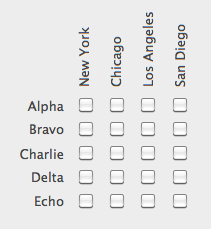

Un objet texte vous permet d'afficher du contenu écrit statique (*ex :* instructions, titres, étiquettes, etc.) dans un formulaire. Ces zones de texte statique peuvent devenir dynamiques lorsqu'elles incluent des références dynamiques. Pour plus d'informations, reportez-vous à la section [Utiliser des références dans les textes statiques](https://doc.4d.com/4Dv17R5/4D/17-R5/Using-references-in-static-text.300-4163725.en.html).

#### Exemple JSON :

```4d
    "myText": {
                "type": "text",
                "text": "Hello World!",
                "textAlign": "center",
                "left": 60,         
                "top": 160, 
                "width": 100,
                "height": 20,
                "stroke": "#ff0000"     //couleur texte
                "fontWeight": "bold"
                }
```


## Rotation

4D vous permet d’effectuer des rotations de zones de texte dans vos formulaires à l'aide de la propriété [Orientation](properties_Text.md#orientation).



> La fonctionnalité de rotation de texte est disponible via la commande `OBJECT SET TEXT ORIENTATION`.

Une fois qu’un texte a été orienté, il reste possible de modifier sa taille ou sa position ainsi que toutes ses propriétés. A noter que les propriétés de hauteur et de largeur de la zone de texte ne sont pas dépendantes de l’orientation :


- Si l’objet est redimensionné dans la direction A, sa [largeur](properties_CoordinatesAndSizing.md#width) sera modifiée ;
- Si l’objet est redimensionné dans la direction C, sa [hauteur](properties_CoordinatesAndSizing.md#height) sera modifiée ;
- Si l’objet est redimensionné dans la direction B, sa [largeur](properties_CoordinatesAndSizing.md#width) et sa [hauteur](properties_CoordinatesAndSizing.md#height) seront modifiées.


## Propriétés prises en charge
[Gras](properties_Text.md#bold) - [Style de la bordure](properties_BackgroundAndBorder.md#border-line-style) - [Bas](properties_CoordinatesAndSizing.md#bottom) - [Css Class](properties_Object.md#css-class) - [Couleur de fond](properties_BackgroundAndBorder.md#fill-color) - [Police](properties_Text.md#font) - [Couleur de la police](properties_Text.md#font-color) - [Taille](properties_Text.md#font-size) [Hauteur](properties_CoordinatesAndSizing.md#height) - [Alignement horizontal](properties_Text.md#horizontal-alignment) - [Dim. horizontal](properties_ResizingOptions.md#horizontal-sizing) - [Italique](properties_Text.md#italic) - [Gauche](properties_CoordinatesAndSizing.md#left) - [Nom](properties_Object.md#object-name) - [Orientation](properties_Text.md#orientation) - [Droite](properties_CoordinatesAndSizing.md#right) - [Titre](properties_Object.md#title) -[Haut](properties_CoordinatesAndSizing.md#top) - [Type](properties_Object.md#type) - [Souligné](properties_Text.md#underline) - [Dim. vertical](properties_ResizingOptions.md#vertical-sizing) - [Visibilité](properties_Display.md#visibility) - [Largeur](properties_CoordinatesAndSizing.md#width) 
