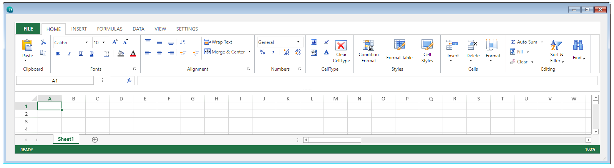

4D View Pro vous permet d'insérer et d'afficher une zone de tableur dans vos formulaires 4D. Un tableur est une application contenant une grille de cellules dans lesquelles vous pouvez saisir des informations, effectuer des calculs ou afficher des images.

Une fois que vous utilisez les zones 4D View Pro dans vos formulaires, vous pouvez importer et exporter des feuilles de calcul.

## Utiliser des zones 4D View Pro

Les zones 4D View Pro sont documentées dans [la section 4D View Pro](ViewPro/getting-started.md).

## Propriétés prises en charge

[Border Line Style](properties_BackgroundAndBorder.md#border-line-style) - [Bottom](properties_CoordinatesAndSizing.md#bottom) - [Class](properties_Object.md#css-class) - [Height](properties_CoordinatesAndSizing.md#height) - [Horizontal Sizing](properties_ResizingOptions.md#horizontal-sizing) - [Left](properties_CoordinatesAndSizing.md#left) - [Method](properties_Action.md#method) - [Object Name](properties_Object.md#object-name) - [Right](properties_CoordinatesAndSizing.md#right) - [Show Formula Bar](properties_Appearance.md#show-formula-bar) - [Type](properties_Object.md#type) - [User Interface](properties_Appearance.md#user-interface) - [Vertical Sizing](properties_ResizingOptions.md#vertical-sizing) - [Visibility](properties_Display.md#visibility) - [Width](properties_CoordinatesAndSizing.md#width)

## Événements pris en charge

[On After Edit](../Events/onAfterEdit.md) - [On Clicked](../Events/onClicked.md) - [On Column Resize](../Events/onColumnResize.md) - [On Double Clicked](../Events/onDoubleClicked.md) - [On Getting focus](../Events/onGettingFocus.md) - [On Header Click](../Events/onHeaderClick.md) - [On Load](../Events/onLoad.md) - [On Losing focus](../Events/onLosingFocus.md) - [On Row Resize](../Events/onRowResize.md) - [On Selection Change](../Events/onSelectionChange.md) - [On Unload](../Events/onUnload.md) - [On VP Range Changed](../Events/onVpRangeChanged.md) - [On VP Ready](../Events/onVpReady.md)
