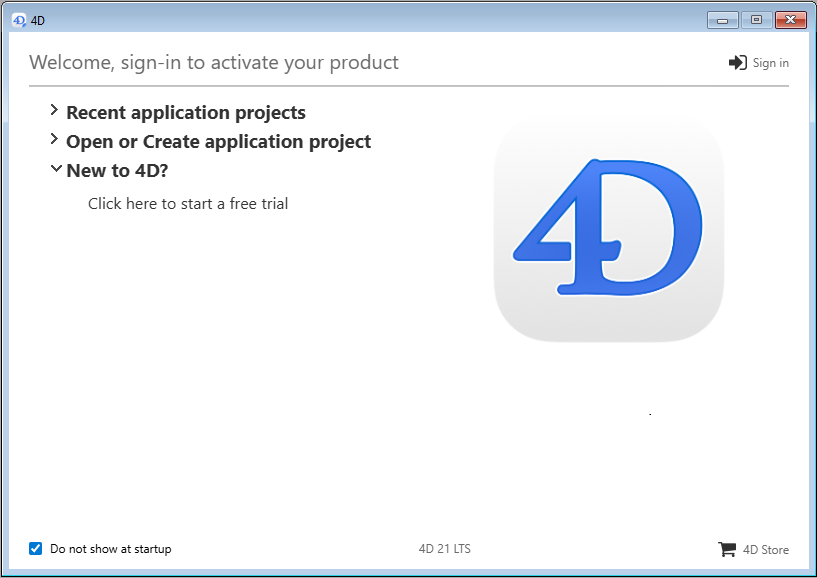

Bienvenue dans 4D ! Cette page regroupe toutes les informations nécessaires sur l'installation et le lancement de votre produit 4D.

## Configuration requise

La page [Téléchargements](https://us.4d.com/product-download) dut site de 4D fournit des informations sur les pré-requis macOS / Windows nécessaires à la gamme 4D.

Des détails techniques supplémentaires sont disponibles sur la [page Ressources](https://us.4d.com/resources/feature-release) du site web de 4D.

## Installation sur disque

Les produits 4D sont installés à partir du site web de 4D :

1. Connectez-vous au site internet de 4D puis consultez la page [Téléchargements](https://us.4d.com/product-download).

2. Cliquez sur le lien de téléchargement du produit 4D de votre choix, puis suivez les instructions qui s'affichent à l'écran.

## Connexion

Une fois l'installation terminée, vous pouvez lancer 4D et vous connecter. Pour ce faire, double-cliquez sur l'icône du produit 4D.

Apparaît ensuite l'assistant de bienvenue :

- Si vous souhaitez découvrir et explorer 4D, cliquez sur le lien **essai gratuit**. Il vous sera demandé de vous connecter ou de créer un compte 4D.

- Si vous possédez déjà un compte 4D, cliquez sur le lien **Se connecter** sur le côté supérieur droit de l'assistant d'installation et saisissez les informations relatives à votre compte. Toute licence 4D préalablement enregistrée est automatiquement mise à jour (ou les packs d'extension supplémentaires sont chargés) sur votre machine.

Élargissez la zone **Ouvrir ou créer un projet d'application** et sélectionnez l'action que vous souhaitez exécuter :

- **Connectez-vous au 4D Server** - utilisez 4D en tant que client et connectez--vous à une application déjà chargée par 4D Server.

- **Ouvrez un projet d'application local** - chargez un projet d'application existant stocké sur votre disque.

- **Créez un nouveau projet d'application** - créez un nouveau projet d'application vide sur votre disque.

Nous vous souhaitons une excellente expérience 4D !

:::info

Vous avez besoin d'activer des licences spécifiques ? Visitez la page [Gestion des licences 4D](../Admin/licenses.md).

:::
