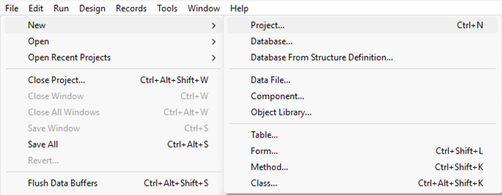

## Créer un projet

Les nouveaux projets d'application 4D peuvent être créés à partir de **4D** ou de **4D Server**. Dans les deux cas, les fichiers de projet sont stockés sur la machine locale.

Pour créer un nouveau projet :

1. Lancez 4D ou 4D Server.
2. Effectuez l'une des opérations suivantes :
   - Sélectionnez **Nouveau > Projet...** dans le menu **Fichier** : 
   - (4D only) Select **Project...** from the **New** toolbar button:
    
     A standard **Save** dialog appears so you can choose the name and location of the 4D project's main folder.

:::note

The **Database...** and **Database From Structure Definition...** items are only available if you have selected the [**Enable binary database creation** option](../Preferences/general.md#enable-binary-database-creation) in your Preferences (disabled by default).

:::

3. Saisissez le nom du dossier de projet et cliquez sur **Sauvegarder**. Ce nom sera utilisé :

   - comme nom du dossier du projet,
   - comme nom du fichier .4DProject au premier niveau du [dossier "Project"](../Project/architecture.md#project-folder).

Vous pouvez choisir n'importe quel nom autorisé par votre système d'exploitation. Toutefois, si votre projet est destiné à fonctionner sur d'autres systèmes ou à être enregistré via un outil de source control, vous devez tenir compte de leurs recommandations de dénomination spécifiques.

Lorsque vous validez la boîte de dialogue **Nouveau projet**, 4D ferme le projet en cours (le cas échéant), crée un dossier de projet à l'emplacement indiqué et y place tous les fichiers nécessaires au projet. Pour plus d'informations, voir [Architecture d'un projet 4D](Project/architecture.md).

Vous pouvez alors commencer à développer votre projet.

## Ouvrir un projet

Pour ouvrir un projet existant depuis 4D :

1. Effectuez l'une des opérations suivantes :

   - Sélectionnez **Ouvrir > Projet local...** à partir du menu **Fichier** ou du bouton **Ouvrir** de la barre d'outils.
   - Sélectionnez **Ouvrir un projet d'application local** dans la boîte de dialogue de l'assistant de bienvenue

La boîte de dialogue standard Ouvrir apparaît.

2. Sélectionnez le fichier `.4dproject` du projet (situé dans le [dossier "Project" du projet](../Project/architecture.md#project-folder)) et cliquez sur **Ouvrir**.

   Par défaut, le projet est ouvert avec son fichier de données courant. D'autres types de fichiers sont suggérés :

   - *Fichiers Packed project* : extension `.4dz` - projets de déploiement
   - *Fichiers de raccourcis* : extension `.4DLink` - stocke des paramètres supplémentaires nécessaires à l'ouverture de projets ou d'applications (adresses, identifiants, etc.)
   - *Fichiers binaires* : extension `.4db` ou `.4dc` - anciens formats de base de données 4D

:::note

Vous pouvez également ouvrir des projets 4D sans aucune interface graphique via l'[interface  en ligne de commande](../Admin/cli.md) (CLI).

:::

### Options

Outre les options standard du système, la boîte de dialogue *Ouvrir* de 4D propose deux menus avec des options spécifiques disponibles via le bouton **Ouvrir** et le menu **Data file**.

- **Ouvrir** - mode d'ouverture du projet :
  - **Interprété** ou **Compilé** : Ces options sont disponibles lorsque le projet sélectionné contient à la fois [du code interprété et du code compilé](Concepts/interpreted.md).
  - **[Maintenance Security Center](MSC/overview.md)**: Ouverture en mode sécurisé permettant d'accéder aux projets endommagés afin d'effectuer les réparations nécessaires.

- **Fichier de données** - spécifie le fichier de données à utiliser avec le projet. Par défaut, l'option **Fichier de données courant** est sélectionnée. This menu includes two additional options since 4D allows you to use the same project with different data files. Data and structure files must however correspond. In order to preserve data integrity, 4D does not allow a data file to be opened if it has not been created by the current project file. The program automatically assigns internal link numbers (UUID) to the data and project files when they are created or when the project is converted. These numbers are verified when the data file is opened.

  - **Choose another data file**: Opens the project with an existing data file other than the current one. When you select this option and then click on **Open**, the standard Open data file dialog box appears so that you can designate a data file.
  - **Create a new data file**: Creates a blank data file for the project. When you select this option and then click on **Open**, the standard Save data file dialog box appears.

  Once you have changed the current data file, 4D opens it by default subsequently.  
  If you move or rename the data file, you will need to locate it again. It is possible to change the data file using a keyboard shortcut on startup. You can view the current data file at any time on the [Information page of the MSC](../MSC/information.md#data).

### Startup Maintenance Dialog

If you need to interrupt the startup sequence, for example if the project isn't launching properly or if you want to switch to a different data file, hold down the **Alt** (Windows) or **Option** (macOS) key during database startup to display the startup maintenance dialog box:

The following maintenance options are available:

- **Open the application with the default data file**: continues the standard opening process.
- **Select another data file** / **Create a new data file**: allows you to change of data file (see above).
- **Restore a backup file**: opens standard Open file dialog box, so that you can select a backup file (.4bk) or a log backup file (.4bl) to [restore](../Backup/restore.md#manually-restoring-a-backup-standard-dialog).
- **Open the Maintenance and Security Center**: opens the project in [maintenance mode](../MSC/overview.md#display-in-maintenance-mode).

## Raccourcis d’ouverture des projets

4D offre plusieurs façons d'ouvrir des projets directement sans devoir utiliser la boîte de dialogue Ouvrir :

- via the **Open Recent Projects / {project name}** submenu of the **File** menu or **Open** toolbar button.  
  
- double-click or drag and drop a `.4DLink` file onto the 4D application (see below).
- by setting the **At startup** general preference to [**Open last used project**](../Preferences/general.md#at-startup).

:::note Notes

- Sous Windows, un projet 4D Server peut être lancé automatiquement au démarrage de la session s'il est [enregistré en tant que Service](../server/service.md).
- A [built 4D application](../Desktop/building.md) can be launched by a double-click on the application icon.

:::

## À propos des fichiers 4DLink

Les fichiers portant l'extension `.4DLink` sont des fichiers XML contenant des paramètres destinés à automatiser et à simplifier l'ouverture de projets 4D locaux ou distants.

Les fichiers `.4DLink` peuvent enregistrer l'adresse d'un projet 4D ainsi que ses identifiants de connexion et son mode d'ouverture, ce qui permet de gagner du temps lors de l'ouverture des projets.

4D génère automatiquement un fichier `.4DLink` lors de la première ouverture d'un projet local ou lors de la première connexion à un serveur. Le fichier est stocké dans le dossier des préférences locales à l'emplacement suivant :

- Windows: C:\Users\UserName\AppData\Roaming\4D\Favorites vXX\
- macOS : Users/UserName/Library/Application Support/4D/Favorites vXX/

XX représente le numéro de version de l'application. Par exemple, "Favoris v19" pour 4D v19.

Ce dossier est divisé en deux sous-dossiers :

- le dossier **Local** contient les fichiers `.4DLink` qui peuvent être utilisés pour ouvrir des projets locaux
- le dossier **Remote** contient les fichiers `.4DLink` des projets distants récents

Les fichiers `.4DLink` peuvent également être créés à l'aide d'un éditeur XML.

4D fournit une DTD décrivant les clés XML qui peuvent être utilisées pour construire un fichier `.4DLink` . Cette DTD est nommée database_link.dtd et se trouve dans le sous-dossier `\Resources\DTD\` de l'application 4D.

