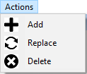
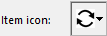

Vous pouvez définir plusieurs propriétés à partir des lignes de menu, telles que des actions, des styles de police, les lignes de séparation, des raccourcis clavier ou des icônes.

## Titre de menu

The **Title** property contains the label of a menu or menu item as it will be displayed on the application interface.

Dans l'éditeur de menus, vous pouvez saisir directement le libellé "en dur". Vous pouvez également saisir une référence pour une variable ou un élément XLIFF, ce qui facilitera la mise à jour et la traduction des applications. Vous pouvez utiliser types de références suivants :

- Une référence à une ressource XLIFF, du type :xliff:MonLibellé. For more information about XLIFF references, refer to _XLIFF Architecture_ section in _4D Design Reference_.
- An interprocess variable name followed by a number, for example: `:<>vlang,3`. Il suffit de changer le contenu de cette variable pour modifier le libellé du menu lors de son affichage. Dans ce cas, le libellé fera appel à une ressource XLIFF. The value contained in the `<>vlang` variable corresponds to the _id_ attribute of the _group_ element. The second value (3 in this example) designates the _id_ attribute of the _trans-unit_ element.

Using the 4D language, you set the title property through the _itemText_ parameter of the `APPEND MENU ITEM`, `INSERT MENU ITEM`, and `SET MENU ITEM` commands.

### Caractères de contrôle

Il est possible de définir les propriétés des lignes de menus en insérant des caractères de contrôle (“métacaractères”) directement dans les libellés des commandes de menus. Par exemple, vous pouvez associer le raccourci-clavier Ctrl+G (ou Commande+G sous macOS) à une ligne de menu en plaçant les caractères "/G" dans son libellé.

Les caractères de contrôle n’apparaissent pas dans les libellés des commandes de menus. Vous devez donc les éviter afin de ne pas obtenir d’effets indésirables. Ces caractères sont les suivants :

| Caractère            | Description                   | Utilisation                                                                                                      |
| -------------------- | ----------------------------- | ---------------------------------------------------------------------------------------------------------------- |
| ( | parenthèse ouvrante           | Désactiver la ligne                                                                                              |
| \<B                  | inférieur à B                 | Gras                                                                                                             |
| \<I                  | inférieur à I                 | Italique                                                                                                         |
| \<U                  | inférieur à U                 | Souligné                                                                                                         |
| !+caractère          | point d'exclamation+caractère | Caractère d'ajout sous forme de coche (macOS); ajouter une coche (Windows) |
| /+caractère          | slash+caractère               | Ajouter un caractère comme raccourci                                                                             |

## Paramètres

Il est possible d’associer un paramètre personnalisé à chaque ligne de menu. Un paramètre de ligne de menu est une chaîne de caractères dont le contenu est libre. It can be set in the Menu editor, or through the `SET MENU ITEM PARAMETER` command.

Menu item parameters are useful with programmed management of menus, in particular when using the `Dynamic pop up menu`, `Get menu item parameter` and `Get selected menu item parameter` commands.

## Action

Chaque commande de menu peut avoir une méthode projet ou une action standard qui lui est associée. Lorsqu’une ligne de menu est sélectionnée, 4D exécute l’action standard ou la méthode projet qui lui est associée. For example, a **Monthly Report** menu command can call a project method that prepares a monthly report from a table containing financial data. The **Cut** menu command usually calls the `cut` standard action in order to move the selection to the clipboard and erase it from the window in the foreground.

Si aucune méthode ou action standard n'est affectée à une commande de menu, le choix de cette commande provoquera la fermeture du mode Application et l'ouverture du mode Développement. Si seul le mode Application est disponible, ce qui signifie un retour au Desktop.

Standard actions can be used to carry out various current operations linked to system functions (copy, quit, etc.) or to those of the database (add record, select all, etc.).

Vous pouvez associer à la fois une action standard et une méthode projet à une commande de menu. Dans ce cas, l’action standard n’est jamais exécutée ; toutefois, 4D utilise cette action pour activer/inactiver la commande de menu en fonction du contexte et pour associer une opération spécifique en fonction de la plateforme. Lorsqu’une commande de menu est inactivée, la méthode projet associée ne peut être exécutée.

Vous choisissez d’associer une action standard ou une méthode projet à la commande de menu en fonction du type de résultat attendu. En principe, il est préférable de choisir une action standard lorsque cela est possible car les actions standard mettent en oeuvre des mécanismes optimisés, notamment l'activation/inactivation de la ligne en fonction du contexte.

### Associer une méthode projet ou une action standard

Pour associer une méthode projet et/ou une action standard à une commande de menu sélectionnée dans l'éditeur de menu :

- **Method Name**: Select an existing project method name in the combo box. If the project method does not exist, enter its name in the "Method Name" combo box then click on the [...] bouton. 4D affiche une boîte de dialogue de création de méthode de projet qui permet d'accéder à l'éditeur de code.
- **Associated Standard Action**: Choose or write the action you want to assign in the "Associated Standard Action" combo box. Vous pouvez saisir toute action prise en charge et (optionnellement) tout paramètre dans la zone. For a comprehensive list of standard actions, please refer to the **Standard actions** section in the _Design Reference_.
  **Note for macOS:** Under macOS, the custom menu commands associated with the _Quit_ action are automatically placed in the application menu, in compliance with the platform interface standards.

Using the 4D language, you can associate a project method using the `SET MENU ITEM METHOD` command, and a standard action using the `SET MENU ITEM PROPERTY` command.

### Démarrer un process

The **Start a New Process** option is available for menu commands associated to methods. It can be set through a check box in the Menu editor, or through the _property_ parameter of the `SET MENU ITEM PROPERTY` command.

When the **Start a New Process** option is enabled, a new process is created when the menu command is chosen.
Normalement, une méthode associée à une commande de menu est exécutée dans le process courant, à moins que vous n'appeliez explicitement un autre process dans votre code. The **Start a New Process** option makes it easier to start a new process. Si vous la sélectionnez, 4D créera un nouveau process lorsque la commande de menu sera sélectionnée.

Dans la liste des process, 4D affecte au nouveau process un nom par défaut “ML_NumeroProcess”.
Les noms des process lancés à partir d’une ligne de menu sont créés en combinant le préfixe “ML_” avec le numéro de process.

### Exécuter sans valider

The **Execute without validating** option is available for menu commands associated to standard actions in the Menu editor only.

Lorsque cette option est cochée, 4D ne provoquera pas la “validation” du champ dans lequel se trouve le curseur avant d’exécuter l’action associée.
This option is mainly intended for **Edit** menu commands. By default, 4D processes and "validates" the contents of a field before executing a standard action (via a menu command or a shortcut), which has the effect of generating an `On Data Change` form event. This can disrupt the functioning of copy or paste type commands because when they are called, the `On Data Change` form event is generated unexpectedly. In this case, it is useful to check the **Execute without validating** option.

## Privilèges d'accès à distance

Cette option de l'éditeur de menus permet de définir un groupe pour une commande de menu afin que seuls les utilisateurs de ce groupe puissent utiliser la commande de menu depuis un 4D distant (voir Utilisateurs et groupes).

## Options

### Ligne de séparation

Les groupes de commandes de menus peuvent être séparés par un filet. Cette fonctionnalité est utile pour rassembler les commandes de menus par fonction.

Vous ajoutez un filet de séparation en créant une commande de menu.

In the Menu editor, instead of entering the menu command’s text in the title area, you simply select the **Separator Line** option. La ligne apparaît alors dans la zone de la commande courante. Lorsque cette option est cochée, les autres propriétés sont sans effet.
**Note:** Under macOS, if you use the dash “-” as the first character of a menu item, it will appear as a separator line.

In the 4D language, you insert a separator line by entering `-` or `(-` as itemText for `APPEND MENU ITEM`, `INSERT MENU ITEM`, or `SET MENU ITEM` commands.

### Raccourcis clavier

Vous pouvez affecter des raccourcis clavier à toute commande de menu. Lorsqu’une commande de menu se voit affecter un raccourci clavier, il s’affiche en face de son libellé. For example, "Ctrl+C" (Windows) or "Command+C" (macOS) appears next to the **Copy** menu command in the **Edit** menu.

You can also add the **Shift** key as well as the **Alt** key (Windows) or **Option** key (macOS) to the shortcut associated with a menu command. Cette possibilité multiplie le nombre de raccourcis clavier utilisables dans les barres de menus. Les raccourcis clavier définis peuvent donc être de différents types :

- Sous Windows :
  - Ctrl+lettre
  - Ctrl+Maj+lettre
  - Ctrl+Alt+lettre
  - Ctrl+Maj+Alt+lettre

- Sous macOS :
  - Commande+lettre
  - Commande+Maj+lettre
  - Commande+Option+lettre
  - Commande+Maj+Option+lettre

> Lorsque vous utilisez des actions standard, il est conseillé de conserver les raccourcis clavier qui leur sont associés par défaut.

You can use any alphanumeric keys as a keyboard shortcut, except for the keys reserved by standard menu commands that appear in the **Edit** and **File** menus, and the keys reserved for 4D menu commands.

Les combinaisons réservées sont décrites dans le tableau suivant :

| Clé (Windows)                  | Clé (macOS)                        | Opération               |
| ------------------------------------------------- | ----------------------------------------------------- | ----------------------- |
| Ctrl+C                                            | Commande+C                                            | Copier                  |
| Ctrl+Q                                            | Commande+Q                                            | Quitter                 |
| Ctrl+V                                            | Commande+V                                            | Coller                  |
| Ctrl+X                                            | Commande+X                                            | Couper                  |
| Ctrl+Z                                            | Commande+Z                                            | Annuler                 |
| Ctrl+. (point) | Commande+. (point) | Arrêter action en cours |

Pour affecter un raccourci clavier dans l'éditeur de menus :

Sélectionnez la ligne de menu à laquelle vous souhaitez affecter un raccourci clavier.
Click on the [...] button to the right of the "Shortcut" entry area. La fenêtre suivante apparaît :

Enter the character to use then (optional) click the **Shift** and/or **Alt** (**Option**) checkboxes according to the combination desired.
You can also directly press the keys that make up the desired combination (do not press the **Ctrl/Command** key).

> Il n’est pas possible de désélectionner la touche Ctrl/Commande, elle est obligatoire dans les raccourcis clavier des menus.
> To start over, click on **Clear**. Click **OK** to validate the changes. Le raccourci défini est représenté dans la zone “Raccourci clavier” .

To assign a keyboard shortcut using the 4D language, use the `SET ITEM SHORTCUT` command.

> Un objet actif peut aussi avoir un raccourci clavier. If the **Ctrl/Command** key assignments conflict, the active object takes precedence.

### Ligne active

Dans l'éditeur de menus, vous pouvez spécifier si une ligne est activée ou désactivée. Une commande de menu activée peut être choisie par l’utilisateur ; une commande de menu désactivée est grisée et ne peut pas être choisie. When the **Enabled Item** check box is unchecked, the menu command appears dimmed, indicating that it cannot be chosen.

Par défaut, 4D active automatiquement toute commande de menu ajoutée à un menu personnalisé. You can disable an item in order, for example, to enable it only using programming with `ENABLE MENU ITEM` and `DISABLE MENU ITEM` commands.

### Coche

Cette option de l'éditeur de menus permet d’associer par défaut une coche système à la ligne de menu. You can then manage the display of the check mark using language commands (`SET MENU ITEM MARK` and `Get menu item mark`).

Les coches sont généralement utilisées pour des menus à action permanente et indiquent que l’action est en cours.

### Styles des polices

4D vous permet de personnaliser les menus en appliquant différents styles de caractères aux commandes de menus. You can customize your menus with the Bold, Italic or Underline styles through options in the Menu editor, or using the `SET MENU ITEM STYLE` language command.

En règle générale, les styles de police doivent être appliqués à vos menus avec parcimonie, afin d’éviter de conférer une apparence confuse à votre application.

> You can also apply styles by inserting special characters in the menu title (see [Using control characters](properties.md#using-control-characters) above).

### Icône ligne

Vous pouvez associer une icône à une ligne de menu. Elle sera affichée directement dans le menu, à côté de la ligne :

To define the icon in the Menu editor, click on the "Item icon" area and select **Open** to open a picture from the disk. Lorsque vous sélectionnez un fichier image qui n'est pas stocké dans le dossier Resources du projet, il est automatiquement copié dans ce dossier. Une fois définie, l’icône de ligne apparaît dans la zone d’aperçu :

To remove the icon from the item, choose the **No Icon** option from the "Item Icon" area.

To define item icons using the 4D language, call the `SET MENU ITEM ICON` command.
