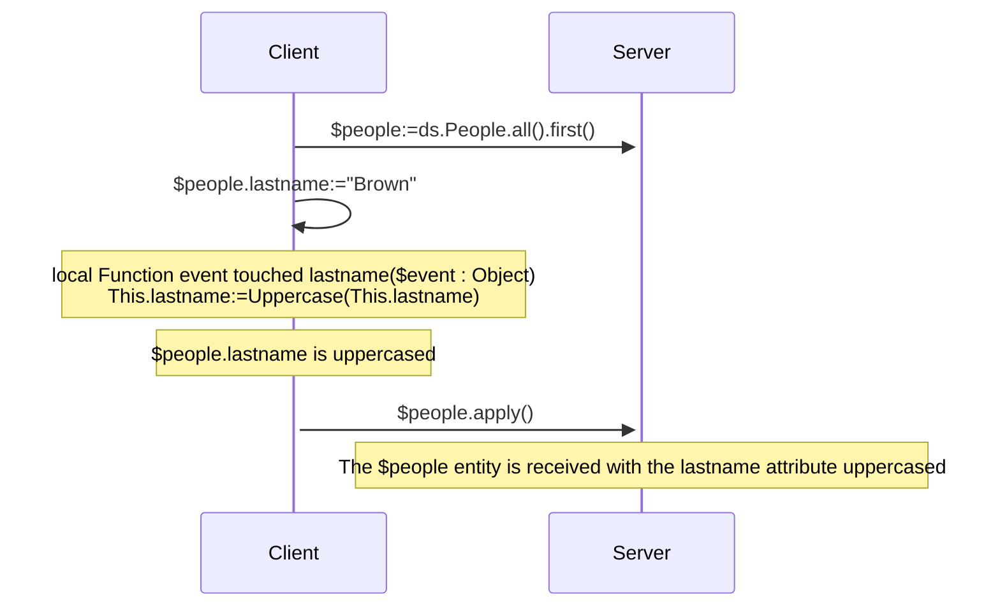
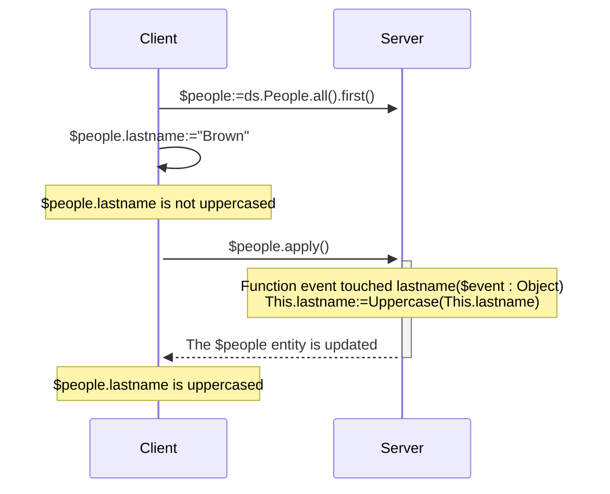
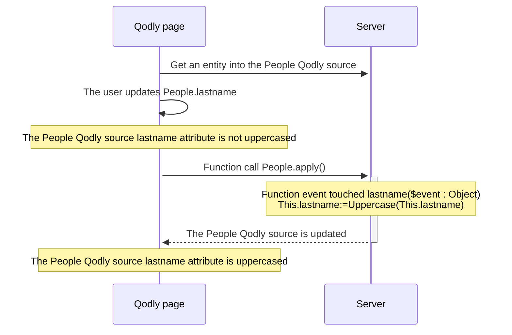

<details><summary>Historique</summary>

| Release | Modifications                                                                                                |
| ------- | ------------------------------------------------------------------------------------------------------------ |
| 21      | Événements ajoutés : validateSave / saving / afterSave / validateDrop / dropping / afterDrop |
| 20 R10  | ajout événement touched                                                                                      |

</details>

Les événements ORDA sont des fonctions qui sont automatiquement invoquées par ORDA chaque fois que des entités et des attributs d'entités sont manipulés (ajoutés, supprimés ou modifiés). Vous pouvez écrire des événements très simples, puis les rendre plus sophistiqués.

Vous ne pouvez pas déclencher directement l'exécution d'une fonction d'événement. Les événements sont appelés automatiquement par ORDA en fonction des actions de l'utilisateur ou des opérations effectuées par le code sur les entités et leurs attributs.

:::tip Article(s) de blog sur le sujet

[ORDA - Gérer une logique événementielle lors des actions de persistance des données](https://blog.4d.com/orda-handle-an-event-driven-logic-during-data-persistence-actions)

:::

:::info Note de compatibilité

Les événements d'entité ORDA dans le datastore sont équivalents aux triggers dans la base de données 4D. Cependant, les actions déclenchées au niveau de la base de données 4D à l'aide des commandes du langage classique 4D ou des actions standard ne déclenchent pas les événements ORDA.

:::

## Vue d’ensemble

### Niveau de l'événement

Une fonction d'événement d'entité est toujours définie dans la [classe Entity](../ORDA/ordaClasses.md#entity-class).

Un événement peut être défini au niveau de l'**entité** et/ou de l'**attribut** (y compris les [**attributs calculés**](../ORDA/ordaClasses.md#computed-attributes)). Dans le premier cas, il sera déclenché pour tous les attributs de l'entité ; dans l'autre cas, il ne sera déclenché que pour l'attribut ciblé.

Pour un même événement, vous pouvez définir différentes fonctions pour différents attributs.

Vous pouvez également définir le même événement au niveau de l'attribut et de l'entité. L'événement attribut est appelé en premier, puis l'événement entité.

### Exécution en configuration distante

En général, les événements ORDA sont exécutés sur le serveur.

Cependant, dans une configuration client/serveur, la fonction d'événement `touched()` peut être exécutée sur **le serveur ou le client**, en fonction de l'utilisation du mot-clé [`local`](./ordaClasses.md#local-functions). Une implémentation spécifique côté client permet de déclencher l'événement sur le client.

:::note

Les fonctions ORDA [`constructor()`](./ordaClasses.md#class-constructor) sont toujours exécutées sur le client.

:::

Avec d'autres configurations distantes (i.e. applications Qodly, [requêtes via l'API REST](../REST/REST_requests.md), ou requêtes via [`Open datastore`](../commands/open-datastore.md)), la fonction d'événement `touched()` est toujours exécutée **côté serveur**. Cela signifie que vous devez vous assurer que le serveur peut "voir" qu'un attribut a été touché pour déclencher l'événement (voir ci-dessous).

### Tableau de synthèse

Le tableau suivant liste les événements d'entité ORDA ainsi que leurs règles.

| Evénement                             | Niveau   | Nom de la fonction                                      |                 (C/S) Exécuté sur                | Peut arrêter l'action en renvoyant une erreur |
| :------------------------------------ | :------- | :------------------------------------------------------ | :-----------------------------------------------------------------: | --------------------------------------------- |
| Instanciation d'entité                | Entity   | [`constructor()`](./ordaClasses.md#class-constructor-1) |                                client                               | non                                           |
| Attribut touched                      | Attribut | `event touched <attrName>()`                            | Dépend du mot-clé [`local`](../ORDA/ordaClasses.md#local-functions) | non                                           |
|                                       | Entity   | `event touched()`                                       | Dépend du mot-clé [`local`](../ORDA/ordaClasses.md#local-functions) | non                                           |
| Avant l'enregistrement d'une entité   | Attribut | `validateSave <attrName>()`                             |                               serveur                               | oui                                           |
|                                       | Entity   | `validateSave()`                                        |                               serveur                               | oui                                           |
| Pendant l'enregistrement d'une entité | Attribut | `saving <attrName>()`                                   |                               serveur                               | oui                                           |
|                                       | Entity   | `saving()`                                              |                               serveur                               | oui                                           |
| Après l'enregistrement d'une entité   | Entity   | `afterSave()`                                           |                               serveur                               | non                                           |
| Avant la suppression d'une entité     | Attribut | `validateDrop <attrName>()`                             |                               serveur                               | oui                                           |
|                                       | Entity   | `validateDrop()`                                        |                               serveur                               | oui                                           |
| Pendant la suppression d'une entité   | Attribut | `dropping <attrName>()`                                 |                               serveur                               | oui                                           |
|                                       | Entity   | `dropping()`                                            |                               serveur                               | oui                                           |
| Après la suppression d'une entité     | Entity   | `afterDrop()`                                           |                               serveur                               | non                                           |

:::note

La fonction [`constructor()`](./ordaClasses.md#class-constructor-1) n'est pas en soi une fonction d'événement, mais elle est toujours appelée lorsqu'une nouvelle entité est instanciée.

:::

## Paramètre *event*

Les fonctions d'événement acceptent un seul objet *event* comme paramètre. Lorsque la fonction est appelée, le paramètre est rempli avec diverses propriétés :

| Nom de propriété    | Disponibilité                                                                                                                            | Type                  | Description                                                                                                                    |   |
| :------------------ | :--------------------------------------------------------------------------------------------------------------------------------------- | :-------------------- | :----------------------------------------------------------------------------------------------------------------------------- | - |
| "kind"              | Toujours                                                                                                                                 | String                | Nom de l'événement : "touched", "validateSave", "saving", "afterSave", "validateDrop", "dropping", "afterDrop" |   |
| *attributeName*     | Uniquement pour les événements définis au niveau des attributs ("validateSave", "saving", "validateDrop", "dropping") | String                | Nom de l'attribut (*ex.* "firstname")                                                       |   |
| *dataClassName*     | Toujours                                                                                                                                 | String                | Nom du verre de données (*ex.* "Company")                                                   |   |
| "savedAttributes"   | Uniquement dans [`afterSave()`](#function-event-aftersave)                                                                               | Collection de chaînes | Noms des attributs correctement enregistrés                                                                                    |   |
| "droppedAttributes" | Uniquement dans [`afterDrop()`](#function-event-afterdrop)                                                                               | Collection de chaînes | Noms des attributs correctement supprimés                                                                                      |   |
| "saveStatus"        | Uniquement dans [`afterSave()`](#function-event-aftersave)                                                                               | String                | "success" si l'enregistrement a réussi, "failed" sinon                                                                         |   |
| "dropStatus"        | Uniquement dans [`afterDrop()`](#function-event-afterdrop)                                                                               | String                | "success" si la suppression a réussi, "failed" sinon                                                                           |   |

## Objet error

[Certaines fonctions d'événement](#summary-table) peuvent renvoyer un **objet error** pour déclencher une erreur et arrêter l'action en cours.

Lorsqu'une erreur survient dans un événement, les autres événements sont stoppés à la première erreur signalée et l'action (enregistrement pu suppression) est également arrêtée. Cette erreur est envoyée avant d'autres erreurs potentielles telles que [stamp has changed, entity locked](../API/EntityClass.md#save), etc.

### Propriétés de l'objet error

| Propriété          | Type    | Description                                                                                                                                                                                                                                                                                                                                                                                                                                                                                                                                                                                                    | Fixé par le développeur                                     |
| ------------------ | ------- | -------------------------------------------------------------------------------------------------------------------------------------------------------------------------------------------------------------------------------------------------------------------------------------------------------------------------------------------------------------------------------------------------------------------------------------------------------------------------------------------------------------------------------------------------------------------------------------------------------------- | ----------------------------------------------------------- |
| errCode            | Integer | Identique à la commande [`Last errors`](../commands/last-errors.md)                                                                                                                                                                                                                                                                                                                                                                                                                                                                                                                                            | Oui                                                         |
| message            | Text    | Identique à la commande [`Last errors`](../commands/last-errors.md)                                                                                                                                                                                                                                                                                                                                                                                                                                                                                                                                            | Oui                                                         |
| extraDescription   | Object  | Informations libres à définir                                                                                                                                                                                                                                                                                                                                                                                                                                                                                                                                                                                  | Oui                                                         |
| seriousError       | Boolean | Utilisé uniquement avec les événements de validation (voir ci-dessous). <li>`True` : crée une [erreur critique (imprévisible)](../Concepts/error-handling.md#predictable-vs-unpredictable-errors) et déclenche une exception. Ajoute le statut `dk status serious validation error`</li><li>ne crée qu'une [erreur silencieuse (prévisible)](../Concepts/error-handling.md#predictable-vs-unpredictable-errors). Ajoute le statut `dk status validation failed`.</li> | Oui (par défaut : False) |
| componentSignature | Text    | Toujours "DBEV"                                                                                                                                                                                                                                                                                                                                                                                                                                                                                                                                                                                                | Non                                                         |

- Les [erreurs critiques](../Concepts/error-handling.md#predictable-vs-unpredictable-errors) sont empilées dans la collection de la propriété `errors` de l'objet **Result** renvoyé par les fonctions [`save()`](../API/EntityClass.md#save) ou [`drop()`](../API/EntityClass.md#drop).
- Dans le cas d'une erreur déclenchée par un événement **validate**, la propriété `seriousError` permet de choisir le niveau d'erreur à générer :
  - Si **true** : une erreur critique est déclenchée et doit être traitée par le [code de traitement des erreurs](../Concepts/error-handling.md#predictable-vs-unpredictable-errors), tel qu'un ["try catch"](../Concepts/error-handling.md#trycatchend-try). Dans l'objet résultat de la fonction appelante, `status` vaut `dk status serious validation error` et `statusText` vaut "Serious Validation Error". L'erreur est levée à la fin de l'événement et parvient au client qui demande l'action d'enregistrement/suppression (client REST par exemple).
  - Si **false** (défaut) : une [erreur silencieuse (prévisible) est générée](../Concepts/error-handling.md#predictable-vs-unpredictable-errors). Elle ne déclenche aucune exception et n'est pas empilée dans les erreurs retournées par la commande [`Last errors`](../commands/last-errors.md). Dans l'objet résultat de la fonction appelante, `status` vaut `dk status validation failed` et `statusText` vaut "Mild Validation Error".
- Dans le cas d'une erreur déclenchée par un événement **saving/dropping**, lorsqu'un objet d'erreur est renvoyé, l'erreur est toujours définie comme critique, quelle que soit la valeur de la propriété `seriousError`.

## Description des fonctions

### `Function event touched`

#### Syntaxe

```4d
{local} Function event touched($event : Object)
{local} Function event touched <attributeName>($event : Object)
// code
```

Cet événement est déclenché chaque fois qu'une valeur est modifiée dans l'entité.

- Si vous avez défini la fonction au niveau de l'entité (première syntaxe), elle est déclenchée pour des modifications sur n'importe quel attribut de l'entité.
- Si vous avez défini la fonction au niveau de l'attribut (deuxième syntaxe), elle n'est déclenchée que pour les modifications sur cet attribut.

Cet événement est déclenché dès que le moteur de 4D Server / 4D détecte une modification de la valeur de l'attribut qui peut être due aux actions suivantes :

- en **client/serveur avec le [mot-clé `local`](../ORDA/ordaClasses.md#local-functions)** ou en **4D mono-utilisateur** :
  - l'utilisateur saisit une valeur dans un formulaire 4D,
  - le code 4D effectue une assignation avec l'opérateur `:=`. L'événement est également déclenché en cas d'auto-assignation (`$entity.attribute:=$entity.attribute`).
- en **client/serveur sans le mot-clé `local`** : du code 4D effectue une assignation avec l'opérateur `:=` est [exécuté sur le serveur](../commands-legacy/execute-on-server.md).
- en **client/serveur sans le mot-clé `local`**, une **[application Qodly](https://developer.qodly.com/docs)** ou **[datastore distant](../commands/open-datastore.md)** : l'entité est reçue sur le serveur 4D lors de l'appel d'une fonction ORDA (sur l'entité ou avec l'entité en tant que paramètre). Cela signifie que vous devrez peut-être mettre en place une fonction *refresh* ou *preview* sur l'application distante qui envoie une requête ORDA au serveur et déclenche l'événement.
- avec le serveur REST : la valeur est reçue sur le serveur REST avec une [requête REST](../REST/$method.md#methodupdate) (`$method=update`)

The function receives an [*event* object](#event-parameter) as parameter.

If this function [throws](../commands/throw) an error, it will not stop the undergoing action.

:::note

This event is also triggered:

- when attributes are assigned by the [`constructor()`](./ordaClasses.md#class-constructor-1) event,
- when attributes are edited through the [Data Explorer](../Admin/dataExplorer.md).

:::

#### Exemple 1

You want to uppercase all text attributes of an entity when it is updated.

```4d
    //ProductsEntity class
Function event touched($event : Object)
	
	If (Value type(This[$event.attributeName])=Is text)
		This[$event.attributeName]:=Uppercase(This[$event.attributeName])
	End if 
```

#### Exemple 2

The "touched" event is useful when it is not possible to write indexed query code in [`Function query()`](./ordaClasses.md#function-query-attributename) for a [computed attribute](./ordaClasses.md#computed-attributes).

This is the case for example, when your [`query`](./ordaClasses.md#function-query-attributename) function has to compare the value of different attributes from the same entity with each other. You must use formulas in the returned ORDA query -- which triggers sequential queries.

To fully understand this case, let's examine the following two calculated attributes:

```4d
Function get onGoing() : Boolean
        return ((This.departureDate<=Current date) & (This.arrivalDate>=Current date))

Function get sameDay() : Boolean
        return (This.departureDate=This.arrivalDate)
```

Even though they are very similar, these functions cannot be associated with identical queries because they do not compare the same types of values. The first compares attributes to a given value, while the second compares attributes to each other.

- For the *onGoing* attribute, the [`query`](./ordaClasses.md#function-query-attributename) function is simple to write and uses indexed attributes:

```4d
Function query onGoing($event : Object) : Object
    var $operator : Text
    var $myQuery : Text
    var $onGoingValue : Boolean
    var $parameters : Collection
    $parameters:=New collection()

    $operator:=$event.operator
    Case of 
            : (($operator="=") | ($operator="==") | ($operator="==="))
                $onGoingValue:=Bool($event.value)
            : (($operator="!=") | ($operator="!=="))
                $onGoingValue:=Not(Bool($event.value))
            Else 
                return {query: ""; parameters: $parameters}
    End case 

    $myQuery:=($onGoingValue) ? "departureDate <= :1 AND arrivalDate >= :1" : "departureDate > :1 OR arrivalDate < :1"
        // the ORDA query string uses indexed attributes, it will be indexed
    $parameters.push(Current date)
    return {query: $myQuery; parameters: $parameters}
```

- For the *sameDay* attribute, the [`query`](./ordaClasses.md#function-query-attributename) function requires an ORDA query based on formulas and will be sequential:

```4d
Function query sameDay($event : Object) : Text
    var $operator : Text
    var $sameDayValue : Boolean

    $operator:=$event.operator
    Case of 
        : (($operator="=") | ($operator="==") | ($operator="==="))
            $sameDayValue:=Bool($event.value)
        : (($operator="!=") | ($operator="!=="))
            $sameDayValue:=Not(Bool($event.value))
        Else 
            return ""
        End case 

    return ($sameDayValue) ? "eval(This.departureDate = This.arrivalDate)" : "eval(This.departureDate != This.arrivalDate)"
        // the ORDA query string uses a formula, it will not be indexed

```

- Using a **scalar** *sameDay* attribute updated when other attributes are "touched" will save time:

```4d
    //BookingEntity class

Function event touched departureDate($event : Object) 

    This.sameDay:=(This.departureDate = This.arrivalDate) 
//
//
Function event touched arrivalDate($event : Object) 

    This.sameDay:=(This.departureDate = This.arrivalDate)

```

#### Example 3 (diagram): Client/server with the `local` keyword:



#### Example 4 (diagram): Client/server without the `local` keyword



#### Example 5 (diagram): Qodly application



### `Function event validateSave`

#### Syntaxe

```4d
Function event validateSave($event : Object)
Function event validateSave <attributeName>($event : Object)
// code
```

This event is triggered each time an entity is about to be saved.

- if you defined the function at the entity level (first syntax), it is called for any attribute of the entity.
- if you defined the function at the attribute level (second syntax), it is called only for this attribute. This function is **not** executed if the attribute has not been touched in the entity.

The function receives an [*event* object](#event-parameter) as parameter.

This event is triggered by the following functions:

- [`entity.save()`](../API/EntityClass.md#save)
- [`dataClass.fromCollection()`](../API/DataClassClass.md#fromcollection)

This event is triggered **before** the entity is actually saved and lets you check data consistency so that you can stop the action if needed. For example, you can check in this event that "departure date" < "arrival date".

To stop the action, the code of the function must return an [error object](#error-object).

:::note

It is not recommended to update the entity within this function (using `This`).

:::

#### Exemple

In this example, the user is not allowed to save a product with a margin lower than the average. In case of an invalid price attribute, you return an error object and thus, stop the save action.

```4d
// ProductsEntity class
Function event validateSave margin($event : Object) : Object
	
var $result : Object
var $marginAverage : Real
	
$marginAverage:=ds.Products.query("category= :1"; This.category).average("margin")
		
If (This.margin<$marginAverage)
	$result:={\
    errCode: 1; \
    message: "The margin of this product ("+String(This.margin)+") is under the average"; \
	extraDescription: {\
        info: "For the "+This.category+" category the margin average is: "+String($marginAverage)};\
    fatalError: False}
End if 
	
return $result

```

### `Function event saving`

#### Syntaxe

```4d
Function event saving($event : Object)
Function event saving <attributeName>($event : Object)
// code
```

This event is triggered each time an entity is being saved.

- If you defined the function at the entity level (first syntax), it is called for any attribute of the entity. The function is executed even if no attribute has been touched in the entity (e.g. in case of sending data to an external app each time a save is done).
- If you defined the function at the attribute level (second syntax), it is called only for this attribute. The function is **not** executed if the attribute has not been touched in the entity.

The function receives an [*event* object](#event-parameter) as parameter.

This event is triggered by the following functions:

- [`entity.save()`](../API/EntityClass.md#save)
- [`dataClass.fromCollection()`](../API/DataClassClass.md#fromcollection)

This event is triggered **while** the entity is actually saved. If a [`validateSave()`](#function-event-validatesave) event function was defined, the `saving()` event function is called if no error was triggered by `validateSave()`. For example, you can use this event to create a document on a Google Drive account.

:::note

The business logic should raise errors which can't be detected during the `validateSave()` events, e.g. a network error

:::

During the save action, 4D engine errors can be raised (index, stamp has changed, not enough space on disk).

To stop the action, the code of the function must return an [error object](#error-object).

#### Exemple

When a product is saved, some information is logged to an external system which may be unavailable.

```4d
Function event saving($event : Object) : Object
	
var $result; $status : Object
var $log : cs.Entity
var $remote : 4D.DataStoreImplementation
		
Try	 
	$remote:=Open datastore({hostname: "events@acme.com"}; "logs")	
	$log:=$remote.Logs.new()
	$log.productId:=This.ID
	$log.stamp:=Timestamp
	$log.event:="Created by "+Current user()
	$status:=$log.save()
Catch
	$result:={\
    errCode: Last errors.last().errCode;\
    message: Last errors.last().message; \
    extraDescription: {info: "The external Logs can't be reached"}}
End try
	
return $result


```

### `Function event afterSave`

#### Syntaxe

```4d
Function event afterSave($event : Object)
// code
```

This event is triggered just after an entity is saved in the data file, when at least one attribute was modified. It is not executed if no attribute has been touched in the entity.

This event is useful after saving data to propagate the save action outside the application or to execute administration tasks. For example, it can be used to send a confirmation email after data have been saved. Or, in case of error while saving data, it can make a rollback to restore a consistent state of data.

The function receives an [*event* object](#event-parameter) as parameter.

- To avoid infinite loops, calling a [`save()`](../API/EntityClass.md#save) on the current entity (through `This`) in this function is **not allowed**. It will raise an error.
- Throwing an [error object](#error-object) is **not supported** by this function.

#### Exemple 1

If an error occurred in the above saving event, the product is recorded in the ProductsInFailure dataclass so an employee can review it later.

```4d
// ProductsEntity class
Function event afterSave($event : Object)
	
var $failure : cs.ProductsInFailureEntity
var $status : Object

    // $event.status.errors is filled if the error comes from a validateSave event
If (($event.status.success=False) && ($event.status.errors=Null))  
	$failure:=ds.ProductsInFailure.new()
	$failure.name:=This.name
	$failure.category:=This.category
	$failure.costPrice:=This.costPrice
	$failure.retailPrice:=This.retailPrice
	$failure.reason:="Error during the save action"
	$failure.stamp:=Timestamp
	$status:=$failure.save()
End if

```

### `Function event validateDrop`

#### Syntaxe

```4d
Function event validateDrop($event : Object)
Function event validateDrop <attributeName>($event : Object)
// code
```

This event is triggered each time an entity is about to be dropped.

- If you defined the function at the entity level (first syntax), it is called for any attribute of the entity.
- If you defined the function at the attribute level (second syntax), it is called only for this attribute.

The function receives an [*event* object](#event-parameter) as parameter.

This event is triggered by the following features:

- [`entity.drop()`](../API/EntityClass.md#drop)
- [`entitySelection.drop()`](../API/DataClassClass.md#fromcollection)
- [deletion control rules](https://doc.4d.com/4Dv20/4D/20.2/Relation-properties.300-6750290.en.html#107320) that can be defined at the database structure level.

This event is triggered **before** the entity is actually dropped, allowing you to check data consistency and if necessary, to stop the drop action.

To stop the action, the code of the function must return an [error object](#error-object).

#### Exemple 1

Products can be deleted only if they have been flagged TO DELETE.

```4d
    //ProductsEntity class
Function event validateDrop status($event : Object) : Object

If (This.status != "TO DELETE")
        
    var $result:= New object()
    $result.errCode:=1
    $result.message:="The record can't be deleted"
    $result.extraDescription:={attribute; $event.attributeName; info: "The status must be TO DELETE"}
    $result.fatalError:=False
    return $result
End if 
```

#### Exemple 2

The user can delete products if they are flagged as "TO DELETE" and if their creation year is < current year -3.

```4d
    //ProductsEntity class
Function event validateDrop($event : Object) : Object

var $yearOffSet : Integer
$yearOffSet:=Year of(Current date)-3

If ((This.status != "TO DELETE") || (Year of(This.creationDate) >=  $yearOffSet))
    var $result:=New object()
    $result.errCode:=1
    $result.message:="The record can't be deleted"
    $result.extraDescription:={info: "The status must be TO DELETE and the creation year must be lower than " + String($yearOffSet)}
    $result.fatalError:=False
    return $result
End if 
```

### `Function event dropping`

#### Syntaxe

```4d
Function event dropping($event : Object)
Function event dropping <attributeName>($event : Object)
// code
```

This event is triggered each time an entity is being dropped.

- If you defined the function at the entity level (first syntax), it is called for any attribute of the entity.
- If you defined the function at the attribute level (second syntax), it is called only for this attribute.

The function receives an [*event* object](#event-parameter) as parameter.

This event is triggered by the following features:

- [`entity.drop()`](../API/EntityClass.md#drop)
- [`entitySelection.drop()`](../API/DataClassClass.md#fromcollection)
- [deletion control rules](https://doc.4d.com/4Dv20/4D/20.2/Relation-properties.300-6750290.en.html#107320) that can be defined at the database structure level.

This event is triggered **while** the entity is actually dropped. If a [`validateDrop()`](#function-event-validatedrop) event function was defined, the `dropping()` event function is called if no error was triggered by `validateDrop()`.

:::note

The business logic should raise errors which cannot be detected during the `validateDrop()` events, e.g. a network error.

:::

To stop the action, the code of the function must return an [error object](#error-object).

#### Exemple 1

When dropping an order with *totalPrice >= 500*, a log file is updated.

```4d
    //OrderEntity class
Function event dropping totalPrice ($event : Object)

var $log : cs.LogEntity
var $status: Object

If (This.totalPrice >= 500)

    $log:=ds.Log.new()
    $log.orderID:=This.ID
    $log.orderPrice:=This.totalPrice
    $log.event:="Drop"
    $log.creationDate:=Current date()
    $status:=$log.save()

    If($status.success=False)
        throw ({errCode: 1; message: "Error while updating the log file"})
    End if
End if

```

#### Exemple 2

When a product is dropped, a log file is updated.

```4d
    //ProductsEntity class
Function event dropping ($event : Object) 

var $log : cs.LogEntity
var $status: Object

$log:=ds.Log.new()
$log.productID:=This.ID
$log.productPrice:=This.price
$log.event:="Drop"
$log.creationDate:=Current date()
$status:=$log.save()

If($status.success=False)
    throw ({errCode: 1; message:"Error while updating the log file"})
End if
```

### `Function event afterDrop`

#### Syntaxe

```4d
Function event afterDrop($event : Object)
// code
```

This event is triggered just after an entity is dropped.

This event is useful after dropping data to propagate the drop action outside the application or to execute administration tasks. For example, it can be used to send a cancellation email after data have been dropped. Or, in case of error while dropping data, it can log an information for the administrator to check data consistency.

The function receives an [*event* object](#event-parameter) as parameter.

- To avoid infinite loops, calling a [`drop()`](../API/EntityClass.md#drop) on the current entity (through `This`) in this function is **not allowed**. It will raise an error.
- Throwing an [error object](#error-object) is **not supported** by this function.

:::note

The dropped entity is referenced by `This` and still exists in memory.

:::

#### Exemple 1

Send a mail to the customer with the details of the dropped order.

```4d
    //OrderEntity class
Function event afterDrop ($event : Object) 

var $oAuth2 : cs.NetKit.OAuth2Provider
var $google : cs.NetKit.Google

    //$param contains clientId, secretId...
$oAuth2:=cs.NetKit.OAuth2Provider.new($param)
$google:=cs.NetKit.Google.new($oAuth2; {mailType: "JMAP"})

    //Email creation
$email:=New object
$email.from:="youremail@gmail.com"
$email.to:="destinationmail@mail.com"
$email.subject:="Your order is cancelled"
$email.textBody:="Products numbers: " + This.products.number.join("-")

    //Email sending
$status:=$google.mail.send($email)
```

#### Exemple 2

Create an action to do because there were errors in the [`dropping()`](#function-event-dropping) event.

```4d
    //ProductEntity class
Function event afterDrop ($event : Object) 

var $action: cs.ActionEntity
var $status: Object

    // The drop action failed   
If($event.dropStatus = "failed")
    $action:=ds.Action.new()
    $action.label:=Last errors.first().message //message is "Error while dropping product XXX"
    $action.status:="TO CHECK"
    $status:=$action.save()
End if

```

