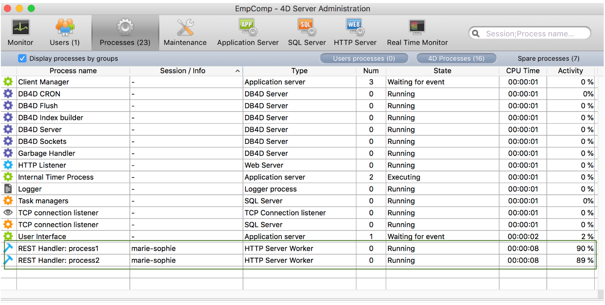

A **remote datastore** is a reference, on a local 4D application (4D or 4D Server), to a [datastore](dsMapping.md#datastore) stored in another 4D application.

The local 4D application connects to and references the remote datastore through a call to the [`Open datastore`](../API/DataStoreClass.md#open-datastore) command.

On the remote machine, 4D opens a [session](../WebServer/sessions.md) to handle requests from the application that call `Open datastore`. Requests internally use the [REST API](../REST/gettingStarted.md), which means that they might require [available licenses](../REST/authUsers.md).

## Using web sessions

When you work with a remote datastore referenced through calls to the [`Open datastore`](../API/DataStoreClass.md#open-datastore) command, the connection with the requesting processes is handled via [web sessions](../WebServer/sessions.md) on the remote machine.

The web session created on the remote datastore is identified using a internal session ID which is associated to the `localID` on the 4D application side. Cette session gère automatiquement l'accès aux données, aux sélections d'entités ou aux entités.

Le `localID` est local à la machine qui se connecte au datastore distant, ce qui signifie :

*   Que si d'autres process de la même application doivent accéder au même datastore distant, ils peuvent utiliser le même `localID` et partager alors la même session.
*   Que si un autre process de la même application ouvre le même datastore distant, mais avec un autre `localID`, il créera une nouvelle session sur le datastore distant.
*   Que si un autre poste se connecte au même datastore distant avec le même `localID`, il créera une autre session avec un autre cookie.

Ces principes sont illustrés dans les graphiques suivants :

### Visualiser les sessions

Les process qui gèrent les sessions d'accès aux datastore apparaissent dans la fenêtre d'administration de 4D Server :

*   nom : "REST Handler : \<nom du process\>"
*   type : type Worker Server HTTP
*   session : le nom de session est le nom d'utilisateur passé à la commande `Open datastore`.

Dans l'exemple suivant, deux process sont en cours d'exécution pour la même session :

## Fermeture des sessions

As described in the [session lifetime](../WebServer/sessions.md#session-lifetime) paragraph, a web session is automatically closed by 4D when there has been no activity during its timeout period. Le timeout par défaut est de 60 mn mais cette valeur peut être paramétrée à l'aide du paramètre *connectionInfo* de la commande `Open datastore`.

Si une demande est envoyée au datastore distant après la fermeture de la session, elle est automatiquement recréée si possible (licence disponible, serveur non arrêté, etc.). However, keep in mind that the context of the session regarding locks and transactions is lost (see below).

## Verrouillage et transactions

Les fonctionnalités ORDA relatives au verrouillage d'entité et aux transactions sont gérées au niveau du process dans les datastore distants, tout comme en mode client/serveur ORDA :

*   Si un process verrouille une entité à partir d'un datastore distant, l'entité est verrouillée pour tous les autres process, même lorsque ces process partagent la même session (voir [Verrouillage d'entités](entities.md#entity-locking)). Si plusieurs entités pointant vers le même enregistrement ont été verrouillées dans un process, elles doivent toutes être déverrouillées dans le process pour supprimer le verrou. Si un verrou a été mis sur une entité, il est supprimé lorsqu'il n'existe plus de référence à cette entité en mémoire.
*   Les transactions peuvent être lancées, validées ou annulées séparément sur chaque datastore distant à l'aide des méthodes `dataStore.startTransaction( )`, `dataStore.cancelTransaction( )`, et `dataStore.validateTransaction( )`. Elles n’ont pas d’incidences sur les autres datastore.
*   Les commandes classiques du langage 4D (`START TRANSACTION`, `VALIDATE TRANSACTION`, `CANCEL TRANSACTION`) s'appliquent uniquement au datastore principal (renvoyé par `ds`). Si une entité d'un datastore distant est verrouillée par une transaction dans un process, les autres process ne peuvent pas la mettre à jour, même si ces process partagent la même session.
*   Les verrous sur les entités sont supprimés et les transactions sont annulées :
    *   lorsque le process est tué.
    *   quand la session est fermée sur le serveur
    *   lorsque la session est arrêtée à partir de la fenêtre d’administration du serveur.
 
