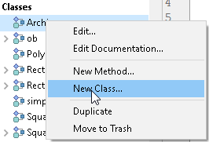
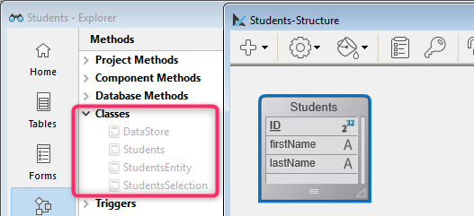

Le code 4D utilisé dans votre projet est écrit dans des [méthodes](../Concepts/methods.md) et des [classes](../Concepts/classes.md).

L'IDE de 4D vous offre diverses fonctionnalités pour créer, modifier, exporter ou supprimer votre code. Vous utiliserez généralement l'[éditeur intégré de code 4D](../code-editor/write-class-method.md) pour travailler avec votre code. Vous pouvez également utiliser d'autres éditeurs tels que **VS Code**, pour lesquels l'extension [4D-Analyzer](https://github.com/4d/4D-Analyzer-VSCode) est disponible.

## Créer des méthodes

Une méthode dans 4D est stockée dans un fichier **.4dm** situé dans le dossier approprié du dossier [`/Project/Sources/`](../Project/architecture.md#sources).

Vous pouvez créer [plusieurs types de méthodes](../Concepts/methods.md#method-types) :

- Tous les types de méthodes peuvent être créés ou ouverts à partir de la fenêtre de l'**Explorateur** (à l'exception des méthodes objet qui sont gérées à partir de l'[éditeur de formulaires](../FormEditor/formEditor.md)).
- Les méthodes projet peuvent également être créées ou ouvertes à partir du menu **Fichier** ou de la barre d'outils (**Nouveau/Méthode...** ou **Ouvrir/Méthode...**) ou à l'aide de raccourcis dans la [fenêtre de l'éditeur de code](../code-editor/write-class-method.md#shortcuts).
- **Triggers** can also be created or opened from the [Structure editor](../Develop-legacy/triggers.md#activating-and-creating-a-trigger).
- Les méthodes formulaire peuvent également être créées ou ouvertes à partir de l'[éditeur de formulaires](../FormEditor/formEditor.md).

## Créer des classes

### User classes

Une classe utilisateur dans 4D est définie par un fichier de méthode spécifique (**.4dm**), stocké dans le dossier [`/Project/Sources/Classes/`](../Project/architecture.md#sources). Le nom du fichier est le nom de la classe. For example, a class named "Polygon" will be stored in the following file:

```
Project folder Project Sources Classes Polygon.4dm
```

You can create a class file from the **File** menu or toolbar (**New > Class...**) or in the **Methods** page of the **Explorer** window. Vous pouvez également utiliser le raccourci **Ctrl+Maj+Alt+k**.

Dans la **page Méthodes** de l'Explorateur, les classes sont regroupées dans la catégorie **Classes**.

Pour créer une nouvelle classe, vous pouvez :

- sélectionner la catégorie **Classes** et cliquez sur le bouton  .
- sélectionner **Nouvelle classe...** dans le menu d'actions en bas de la fenêtre de l'Explorateur ou dans le menu contextuel du groupe Classes.
  
- sélectionnez **Nouveau> Classe...** dans le menu contextuel de la page d'accueil de l'Explorateur.

Lorsque vous nommez des classes, gardez à l'esprit les règles suivantes :

- A [class name](../Concepts/identifiers.md#classes) must be compliant with [property naming rules](../Concepts/identifiers.md#object-properties).
- Les noms de classe sont sensibles à la casse.
- Il n'est pas recommandé de donner le même nom à une classe et à une table de base de données, afin d'éviter tout conflit.

### ORDA classes

[ORDA data model user classes](../ORDA/ordaClasses.md) are high-level class functions created above the data model.

An ORDA data model class is defined by adding, at the same location as regular class files (*i.e.* in the `/Sources/Classes` folder of the project folder), a .4dm file with the name of the class. Par exemple, une classe d'entité pour la dataclass `Utilities` sera définie via un fichier `UtilitiesEntity.4dm`.

4D crée préalablement et automatiquement des classes vides en mémoire pour chaque objet de modèle de données disponible.



Par défaut, les classes ORDA vides ne sont pas affichées dans l'Explorateur. Pour les afficher, vous devez sélectionner **Afficher toutes les dataclasses** dans le menu d'options de l'Explorateur :


Les classes utilisateurs ORDA ont une icône différente des autres classes. Les classes vides sont grisées :


Pour créer un fichier de classe ORDA, il vous suffit de double-cliquer sur la classe prédéfinie correspondante dans l'Explorateur. 4D creates the class file and add the [`extends`](../Concepts/classes.md#class-extends-classname) code. Par exemple, pour une classe Entity :

```
Class extends Entity
```

Une fois qu'une classe est définie, son nom n'est plus grisé dans l'Explorateur.

Pour ouvrir une classe ORDA définie dans l'éditeur de code de 4D, sélectionnez ou double-cliquez sur un nom de classe ORDA et utilisez **Edit...** depuis le menu contextuel/options de la fenêtre de l'Explorateur:


Pour les classes ORDA basées sur le datastore local (`ds`), vous pouvez accéder directement au code de la classe depuis la fenêtre de structure de 4D :


### Prise en charge dans l'IDE 4D

Dans les différentes fenêtres 4D (éditeur de code, compilateur, débogueur, explorateur d'exécution), le code de classe est essentiellement géré comme une méthode projet avec quelques spécificités :

- Dans l'éditeur de code :
  - une classe ne peut pas être exécutée
  - une fonction de classe est un bloc de code
  - **Aller à définition...** sur un objet membre permet de rechercher des déclarations de fonction de classe; par exemple, "$o.f()" donnera comme résultat de recherche "Function f".
  - **Chercher les références...** sur la déclaration de fonction de classe recherche la fonction utilisée comme membre d'objet; par exemple, "Function f" donnera comme résultat "$o.f()".
  - variables typed as a user or ORDA class automatically benefit from autocompletion features. Exemple avec une variable de classe Entity :


- Dans l'explorateur d'exécution et le débogueur, les fonctions de classe sont affichées avec le constructeur `<ClassName>` ou le format `<ClassName>.<FunctionName>`.

## Supprimer des méthodes ou des classes

Pour supprimer une méthode ou une classe existante, vous pouvez :

- sur votre disque, supprimer le fichier *.4dm* du dossier "Sources",
- dans l'explorateur de 4D, sélectionnez la méthode ou la classe et cliquez sur  ou choisissez **Déplacer vers la corbeille** dans le menu contextuel.

> Pour supprimer une méthode objet, choisissez **Supprimer la méthode objet** dans l'[éditeur de formulaires](../FormEditor/formEditor.md) (menu **Objet** ou menu contextuel).

## Design Object Access commands

You can access the contents and paths of all methods in your applications by programming, thanks to the [**"Design Object Access" command theme**](../commands/theme/Design_Object_Access.md). This source toolkit facilitates the integration into your applications of code control tools and more particularly version control systems (VCS). It also lets you implement advanced systems for [code documentation](../Project/documentation.md), for building a custom explorer or for organizing scheduled backups of the code saved as disk files.

The following principles are implemented:

- Each method and form in a 4D application has its own address in the form of a pathname. For example, the trigger method for table 1 can be found at "[trigger]/table_1". Each object pathname is unique in an application.
- You can access objects in the 4D application using the commands of the **"Design Object Access"** command theme, for example [`METHOD GET NAMES`](../commands/method-get-names) or [`METHOD GET PATHS`](../commands/method-get-paths).
- Most of the commands in this theme work in both [interpreted and compiled](../Concepts/interpreted.md) mode. However, commands that modify properties or access contents executable from methods can only be used in interpreted mode (see the table below).
- You can use all the commands of this theme with 4D in local or remote mode. However, keep in mind that you cannot use certain commands in compiled mode: the purpose of this theme is to create custom development support tools. You must not use these commands to dynamically change the functioning of a database that is running. For example, you cannot use [`METHOD SET ATTRIBUTE`](../commands/method-set-attribute) to change a method attribute according to the status of the current user.
- When a command of this theme is called from a [component](../Project/components.md), by default it accesses the component objects. In this case, to access objects of the host, you just pass a `*` as the last parameter.

### Use in compiled mode

For reasons related to the principle of the compilation process, only certain commands in this theme can be used in compiled mode. The following table indicates the available of the commands in compiled mode:

| Command                                                                  | Can be used in compiled mode |
| ------------------------------------------------------------------------ | ---------------------------- |
| [Current method path](../commands/current-method-path)                   | Oui                          |
| [FORM GET NAMES](../commands/form-get-names)                             | Oui                          |
| [METHOD Get attribute](../commands/method-get-attribute)                 | Oui                          |
| [METHOD GET ATTRIBUTES](../commands/method-get-attributes)               | Oui                          |
| [METHOD GET CODE](../commands/method-get-code)                           | Non                          |
| [METHOD GET COMMENTS](../commands/method-get-comments)                   | Oui                          |
| [METHOD GET FOLDERS](../commands/method-get-folders)                     | Oui                          |
| [METHOD GET MODIFICATION DATE](../commands/method-get-modification-date) | Oui                          |
| [METHOD GET NAMES](../commands/method-get-names)                         | Oui                          |
| [METHOD Get path](../commands/method-get-path)                           | Oui                          |
| [METHOD GET PATHS](../commands/method-get-paths)                         | Oui                          |
| [METHOD GET PATHS FORM](../commands/method-get-paths-form)               | Oui                          |
| [METHOD OPEN PATH](../commands/method-open-path)                         | Non                          |
| [METHOD RESOLVE PATH](../commands/method-resolve-path)                   | Oui                          |
| [METHOD SET ACCESS MODE](../commands/method-set-access-mode)             | Oui                          |
| [METHOD SET ATTRIBUTE](../commands/method-set-attribute)                 | Non                          |
| [METHOD SET ATTRIBUTES](../commands/method-set-attributes)               | Non                          |
| [METHOD SET CODE](../commands/method-set-code)                           | Non                          |
| [METHOD SET COMMENTS](../commands/method-set-comments)                   | Non                          |

:::note

The error -9762 "The command cannot be executed in a compiled database." is generated when the command is executed in compiled mode.

:::

### Creation of pathnames

Pathnames generated for 4D objects must be compatible with the file management of the operating system. Characters that are forbidden at the OS level such as ":" are automatically encoded in method names, so that generated files may be integrated automatically in a version control system.

Here are the encoded characters:

| Caractère                    | Encoding |
| ---------------------------- | -------- |
| "                            | %22      |
| \*                           | %2A      |
| /                            | %2F      |
| :            | %3A      |
| \< | %3C      |
| \>                          | %3E      |
| ?                            | %3F      |
| \|                           | %7C      |
| \\                         | %5C      |
| %                            | %25      |

#### Exemples

`Form?1` is encoded `Form%3F1`  
`Button/1` is encoded `Button%2F1`