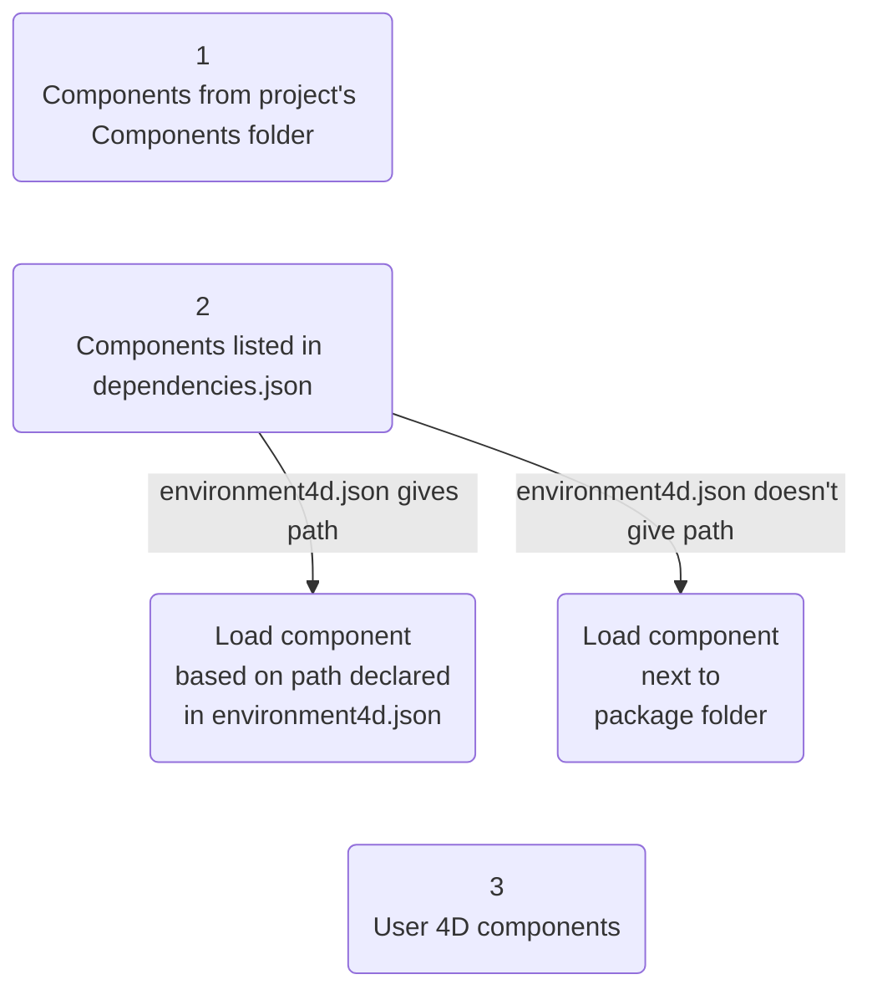
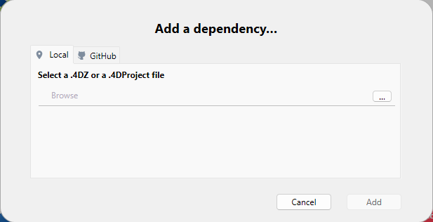
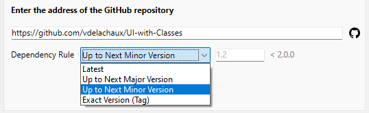
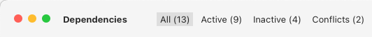

A 4D component is a set of 4D code and/or 4D forms representing one or more functionalities that you can add and use in your projects. For example, the [4D SVG](https://github.com/4d/4D-SVG) component adds advanced commands and an integrated rendering engine that can be used to display SVG files.

You can [develop](../Extensions/develop-components.md) and [build](../Desktop/building.md) your own 4D components, or download public components shared by the 4D community that [can be found on GitHub](https://github.com/search?q=4d-component\&type=Repositories).

When developing in 4D, the component files can be transparently stored in your computer or on a Github repository.

## Interpreted and compiled components

Components can be interpreted or [compiled](../Desktop/building.md).

- A 4D project running in interpreted mode can use either interpreted or compiled components.
- A 4D project running in compiled mode cannot use interpreted components. Dans ce cas, seuls les composants compilés peuvent être utilisés.

### Package folder

The package folder of a component (_MyComponent.4dbase_ folder) can contain:

- for **interpreted components**: a standard [Project folder](../Project/architecture.md)
- for **compiled components**:
  - either a "Contents" folder containing a .4DZ file, a _Resources_ folder, an _Info.plist_ file (recommended architecture)
  - or directly a .4DZ file with other folders such as _Resources_.

:::note

The "Contents" folder architecture is recommended for components if you want to [notarize](../Desktop/building.md#about-notarization) your applications on macOS.

:::

## Loading components

:::note

This page describes how to work with components in the **4D** and **4D Server** environments. In other environments, components are managed differently:

- in [4D in remote mode](../Desktop/clientServer.md), components are loaded by the server and sent to the remote application.
- in merged applications, components are [included at the build step](../Desktop/building.md#plugins--components-page).

:::

### Vue d’ensemble

To load a component in your 4D project, you can either:

- copy the component files in the [**Components** folder of your project](architecture.md#components),
- or, declare the component in the **dependencies.json** file of your project; this is done automatically for local files when you [**add a dependency using the Dependency manager interface**](#adding-a-dependency).

Components declared in the **dependencies.json** file can be stored at different locations:

- at the same level as your 4D project's package folder: this is the default location,
- anywhere on your machine: the component path must be declared in the **environment4d.json** file
- on a GitHub repository: the component path can be declared in the **dependencies.json** file or in the **environment4d.json** file, or in both files.

If the same component is installed at different locations, a [priority order](#priority) is applied.

### dependencies.json and environment4d.json

#### dependencies.json

The **dependencies.json** file references all components required in your 4D project. This file must be located in the **Sources** folder of the 4D project folder, e.g.:

```
	/MyProjectRoot/Project/Sources/dependencies.json
```

It can contain:

- names of components [stored locally](#declaring-local-components) (default path or path defined in an **environment4d.json** file),
- names of components [stored on GitHub repositories](#declaring-components-stored-on-github) (their path can be defined in this file or in an **environment4d.json** file).

#### environment4d.json

The **environment4d.json** file is optional. It allows you to define **custom paths** for some or all components declared in the **dependencies.json** file. This file can be stored in your project package folder or in one of its parent folders, at any level (up to the root).

The main benefits of this architecture are the following:

- you can store the **environment4d.json** file in a parent folder of your projects and decide not to commit it, allowing you to have your local component organization.
- if you want to use the same GitHub repository for several of your projects, you can reference it in the **environment4d.json** file and declare it in the **dependencies.json** file.

### Priority

Since components can be installed in different ways, a priority order is applied when the same component is referenced at several locations:

**Higest priority**

1. Components stored in the [**Components** folder of the project](architecture.md#components).
2. Components declared in the **dependencies.json** file (the **environment4d.json** declared path overrides the **dependencies.json** path to configure a local environment).
3. Internal User 4D components (e.g. 4D NetKit, 4D SVG...)

**Lowest priority**



When a component cannot be loaded because of another instance of the same component located at a higher priority level, both get a specific [status](#dependency-status): the non-loaded component is given the _Overloaded_ status, while the loaded component has the _Overloading_ status.

### Local components

You declare a local component in the [**dependencies.json** file](#dependencyjson) in the following way:

```json
{
    "dependencies": {
        "myComponent1" : {},
        "myComponent2" : {}
    }
}
```

... where "myComponent1" and "myComponent2" are the name of the components to be loaded.

By default, if "myComponent1" and "myComponent2" are not declared in an [**environment4d.json**](#environment4djson) file, 4D will look for the component's package folder (_i.e._ the project root folder of the component) at the same level as your 4D project's package folder, e.g.:

```
	/MyProjectRoot/
	/MyProjectComponentRoot/
```

Thanks to this architecture, you can simply copy all your components at the same level as your projects and reference them in your **dependencies.json** files.

:::note

If you do not want to use the **dependencies.json** architecture, you can install local components by copying their files in the [**Components** folder of your project](architecture.md#components).

:::

#### Customizing component paths

If you want to customize the location of local components, you declare the paths for the dependencies that are not stored at the same level as the project folder in the [**environment4d.json**](#environment4djson) file.

You can use **relative** or **absolute** paths (see below).

Exemples :

```json
{
	"dependencies": {
		"myComponent1" : "MyComponent1",
		"myComponent2" : "../MyComponent2",
    "myComponent3" : "file:///Users/jean/MyComponent3"
    }
}
```

:::note

If a component path declared in the **environment4d.json** file is not found when the project is started, the component is not loaded and gets the _Not found_ [status](dependency-status), even if a version of the component exists next to the project's package folder.

:::

#### Relative paths vs absolute paths

Paths are expressed in POSIX syntax as described in [this paragraph](../Concepts/paths#posix-syntax).

Relative paths are relative to the [`environment4d.json`](#environment4djson) file. Absolute paths are linked to the user's machine.

Using relative paths is **recommended** in most cases, since they provide flexibility and portability of the components architecture, especially if the project is hosted in a source control tool.

Absolute paths should only be used for components that are specific to one machine and one user.

### Components stored on GitHub

4D components available as GitHub releases can be referenced and automatically loaded in your 4D projects.

:::note

Regarding components stored on GitHub, both [**dependencies.json**](#dependenciesjson) and [**environment4d.json**](#environment4djson) files support the same contents.

:::

#### Configuring the GitHub repository

To be able to directly reference and use a 4D component stored on GitHub, you need to configure the GitHub component's repository:

- Compress the component files in ZIP format.
- Name this archive with the same name as the GitHub repository.
- Integrate the archive into a [GitHub release](https://docs.github.com/en/repositories/releasing-projects-on-github/managing-releases-in-a-repository) of the repository.

These steps can easily be automated, with 4D code or using GitHub Actions, for example.

#### Declaring paths

You declare a component stored on GitHub in the [**dependencies.json** file](#dependencyjson) in the following way:

```json
{
	"dependencies": {
		"myGitHubComponent1": {
			"github" : "JohnSmith/myGitHubComponent1"
		},
		"myGitHubComponent2": {}
	}
}
```

... where "myGitHubComponent1" is referenced and declared for the project, although "myGitHubComponent2" is only referenced. You need to declare it in the [**environment4d.json**](#environment4djson) file:

```json
{
	"dependencies": {
		"myGitHubComponent2": {
			"github" : "JohnSmith/myGitHubComponent2"
		}
	}
}
```

"myGitHubComponent2" can be used by several projects.

#### Tags and versions

When you create a release in GitHub, you specify a **tag** and a **version**.

- **Tags** are texts that uniquely reference a release. In the [**dependencies.json** file](#dependencyjson) and [**environment4d.json**](#environment4djson) files, you can indicate the release tag you want to use in your project. For example :

```json
{
	"dependencies": {
		"myFirstGitHubComponent": {
			"github": "JohnSmith/myFirstGitHubComponent",
			"tag": "beta2"
		}
	}
}
```

- A release is also identified by a **version**. The versioning system used is based on the _Semantic Versioning_ concept, which is the most commonly used. Each version number is identified as follows: `majorNumber.minorNumber.pathNumber`. In the same way as for tags, you can indicate the version of the component you wish to use in your project, as in this example:

```json
{
	"dependencies": {
		"myFirstGitHubComponent": {
			"github": "JohnSmith/myFirstGitHubComponent",
			"version": "2.1.3"
		}
	}
}
```

The version is used to define which versions can be used. A [standard semantic version](https://regex101.com/r/Ly7O1x/3/) is used. A range is defined by two semantic versions, a min and a max, with operators '\< | > | >= | <= | ='. The `*` can be used as a placeholder for all versions. ~ and ^ prefixes define versions starting at a number, and up to respectively the next major and minor version.

Here are a few examples:

- "latest": the version having the “latest” badge in GitHub releases.
- "\*": the latest version released.
- "1.\*": all version of major version 1.
- "1.2.\*": all patches of minor version 1.2.
- ">=1.2.3": the latest version, starting with the 1.2.3 version.
- ">1.2.3": the latest version, starting with the version just after the 1.2.3.
- "^1.2.3": the latest version 1, starting with the 1.2.3 version and strictly lower than version 2.
- "~1.2.3": the latest version 1.2, starting with the 1.2.3 version and strictly lower than version 1.3.
- "<=1.2.3": the latest version until the 1.2.3 one.
- "1.0.0 – 1.2.3" or ">=1.0.0 <=1.2.3": version between 1.0.0 and 1.2.3.
- "`<1.2.3 || >=2`": version that is not between 1.2.3 and 2.0.0.

If you do not specify a tag or a version, 4D automatically retrieves the "latest" version.

#### Private repositories

If you want to integrate a component located in a private repository, you need to tell 4D to use a connection token to access it.

To do this, in your GitHub account, create a **classic** token with access rights to **repo**.

:::note

For more information, please refer to the [GitHub token interface](https://github.com/settings/tokens).

:::

Then insert the "github" key in your [**environment4d.json**](#environment4djson) file:

```json
{
	"github": {
		"token": "ghpXXXXXXXXXXXXUvW8x9yZ"
	},
	"dependencies": {

		"mySecondGitHubComponent": {
			"github": "JohnSmith/mySecondGitHubComponent"
		}
	}
}
```

#### Local cache for dependencies

Referenced GitHub components are downloaded in a local cache folder then loaded in your environment. The local cache folder is stored at the following location:

- on macOs: `$HOME/Library/Caches/<app name>/Dependencies`
- on Windows: `C:\Users\<username>\AppData\Local\<app name>\Dependencies`

...where `<app name>` can be "4D", "4D Server", or "tool4D".

#### dependency-lock.json

A `dependency-lock.json` file is created in the [`userPreferences` folder](architecture.md#userpreferencesusername) of your project.

This file logs information such as the state of dependencies, paths, urls, loading errors, as well as other information. It could be useful for component loading management or troubleshooting.

## Monitoring Project Dependencies

In an opened project, you can add, remove, and get information about dependencies and their current loading status in the **Dependencies** panel.

To display the Dependencies panel:

- with 4D, select the **Design/Project Dependencies** menu item (Development environment),<br/>
  

- with 4D Server, select the **Window/Project Dependencies** menu item.<br/>
  

The Dependencies panel is then displayed. Dependencies are sorted by name in alphabetical order:


The Dependencies panel interface allows you to manage dependencies (on 4D single-user and 4D Server). You can add or remove **local** and **GitHub** dependencies.

### Adding a local dependency

To add a local dependency, click on the **+** button in the footer area of the panel. La fenêtre suivante s'affiche :



Make sure the **Local** tab is selected and click on the **...** button. A standard Open file dialog box is displayed, allowing you to select the component to add. You can select a [**.4DZ**](../Desktop/building.md#build-component) or a [**.4DProject**](architecture.md##applicationname4dproject-file) file.

If the selected item is valid, its name and location are displayed in the dialog box.


If the selected item is not valid, an error message is displayed.

Click **Add** to add the dependency to the project.

- If you select a component located next to the project package folder (default location), it is declared in the [**dependencies.json**](#dependenciesjson) file.
- If you select a component that is not located next to the project package folder, it is declared in the [**dependencies.json**](#dependenciesjson) file and its path is declared in the [**environment4d.json**](#environmen4djson) file (see note). The Dependencies panel asks if you want to save a [relative or absolute path](#relative-paths-vs-absolute-paths).

:::note

If no [**environment4d.json**](#environmen4djson) file is already defined for the project at this step, it is automatically created in the project package folder (default location).

:::

The dependency is added to the [inactive dependency list](#dependency-status) with the **Available after restart** status. It will be loaded once the application restarts.

### Adding a GitHub dependency

To add a [GitHub dependency](#components-stored-on-github), click on the **+** button in the footer area of the panel and select the **GitHub** tab.


Enter the path of the GitHub repository of the dependency. It could be a **repository URL** or a **github-account/repository-name string**, for example:


Once the connection is established, the GitHub icon  is displayed on the right side of the entry area. You can click on this icon to open the repository in your default browser.

:::note

If the component is stored on a [private GitHub repository](#private-repositories) and your personal token is missing, an error message is displayed and a  **Add a personal access token...** button is displayed (see [Providing your GitHub access token](#providing-your-github-access-token)).

:::

You can then define the [tag or version](#tags-and-versions) option for the dependency:



- **Latest**: Selected by default and allows to download the release that is tagged as the latest (stable) version.
- **Up to Next Major Version**: Define a [semantic version range](#tags-and-versions) to restrict updates to the next major version.
- **Up to Next Minor Version**: Similarly, restrict updates to the next minor version.
- **Exact Version (Tag)**: Select or manually enter a [specific tag](#tags-and-versions) from the available list.

Click on the **Add** button to add the dependency to the project.

The GitHub dependency declared in the [**dependencies.json**](#dependenciesjson) file and added to the [inactive dependency list](#dependency-status) with the **Available at restart** status. It will be loaded once the application restarts.

#### Providing your GitHub access token

If the component is stored on a [private GitHub repository](#private-repositories), you need to provide your personal access token to the Dependency manager. To do this, you can either:

- click on **Add a personal access token...** button that is displayed in the "Add a dependency" dialog box after you entered a private GitHub repository path.
- or, select **Add a GitHub personal access token...** in the Dependency manager menu at any moment.


You can then enter your personal access token:


You can only enter one personal access token. Once a token has been entered, you can edit it.

### Removing a dependency

To remove a dependency from the Dependencies panel, select the dependency to remove and click on the **-** button of the panel or select **Remove the dependency...** from the contextual menu. You can select several dependencies, in which case the action is applied to all selected dependencies.

:::note

Only dependencies declared in the [**dependencies.json**](#dependenciesjson) file can be removed using the Dependencies panel. If a selected dependency cannot be removed, the **-** button is disabled and the **Remove the dependency...** menu item is hidden.

:::

Une boîte de dialogue de confirmation s'affiche. If the dependency was declared in the **environment4d.json** file, an option allows you to remove it:


If you confirm the dialog box, the removed dependency [status](#dependency-status) is automatically flagged "Unload after restart". It will be unloaded once the application restarts.

### Dependency Origin

The Dependencies panel lists all project dependencies, whatever their origin, i.e. wherever they come from. The dependency origin is provided by the tag under its name:


The following origins are possible:

| Origin tag                        | Description                                                                    |
| --------------------------------- | ------------------------------------------------------------------------------ |
| 4D Component                      | Built-in 4D component, stored in the `Components` folder of the 4D application |
| dependencies.json | Component declared in the [`dependencies.json`](#dependenciesjson) file        |
| Environment                       | Component declared in the [`environnement4d.json`](#environment4djson) file    |
| Project Component                 | Component located in the [`Components`](architecture.md#components) folder     |

**Right-click** in a dependency line and select **Show on disk** to reveal the location of a dependency:


:::note

This item is not displayed if the dependency is inactive because its files are not found.

:::

Component icon and location logo provide additional information:

- The component logo indicates if it is provided by 4D or a third-party developer.
- Local components can be differentiated from GitHub components by a small icon.


### Filtering Dependencies

By default, all dependencies identified by the Dependency manager are listed, whatever their [status](#dependency-status). You can filter the displayed dependencies according to their status by selecting the appropriate tab at the top of the Dependencies panel:



- **Active**: Dependencies that are loaded and can be used in the project. It includes _overloading_ dependencies, which are actually loaded. _Overloaded_ dependencies are listed in the **Conflicts** panel, along with all conflicting dependencies.
- **Inactive**: Dependencies that are not loaded in the project and are not available. There are many possible reasons for this status: missing files, version incompatibility...
- **Conflict**: Dependencies that are loaded but that overloads at least one other dependency at lower [priority level](#priority). Overloaded dependencies are also displayed so that you can check the origin of the conflict and take appropriate actions.

### Dependency Status

Dependencies requiring the developer's attention are indicated by a **status label** at the right side of the line and a specific background color:


The following status labels are available:

- **Overloaded**: The dependency is not loaded because it is overloaded by another dependency with the same name at a higher [priority level](#priority).
- **Overloading**: The dependency is loaded and is overloading one or more other dependencies with the same name at a lower [priority level](#priority).
- **Not found**: The dependency is declared in the dependencies.json file but is not found.
- **Inactive**: The dependency is not loaded because it is not compatible with the project (e.g. the component is not compiled for the current platform).
- **Duplicated**: The dependency is not loaded because another dependency with the same name exists at the same location (and is loaded).
- **Available after restart**: The dependency reference has just been added [using the interface](#monitoring-project-dependencies), it will be loaded once the application restarts.
- **Unloaded after restart**: The dependency reference has just been removed [using the interface](#removing-a-dependency), it will be unloaded once the application restarts.

A tooltip is displayed when you hover over the dependency line, provding additional information about the status:


