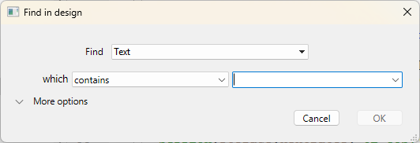
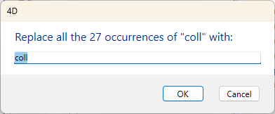

4D propose plusieurs fonctions de recherche et de remplacement d'éléments dans l'ensemble de l'environnement de développement.

- Vous pouvez rechercher une chaîne de caractères ou un type d'objet (variable, commentaire, expression, etc.) parmi une partie ou la totalité du développement sur la base de critères paramétrables ("commence par”, “contient”...). Par exemple, vous pouvez rechercher toutes les variables contenant la chaîne "MaVar", uniquement dans les méthodes dont le nom commence par "HR_".
- Les résultats sont affichés dans une fenêtre de résultat, à partir de laquelle il est possible d'effectuer des remplacements dans le contenu. Vous pouvez aussi exporter ces résultats dans un fichier texte qui peut être importé dans une feuille de calcul.
- Vous pouvez détecter les variables et les méthodes qui ne sont pas utilisées dans votre code et les supprimer pour libérer de la mémoire.
- Vous pouvez renommer une méthode projet ou une variable dans tout l'environnement de développement en une seule opération.

:::note

Vous disposez également de fonctions de recherche parmi les méthodes de votre base, accessibles via le menu contextuel de la page Méthodes de l'Explorateur : **Chercher les appelants** (également disponible dans l'[Éditeur de code](../code-editor/write-class-method.md#search-callers) et **Chercher les dépendances**. Les deux fonctions affichent les éléments trouvés dans une [fenêtre de résultat](#results-window).

:::

## Emplacements de recherche

Une recherche dans l'environnement de développement effectue par défaut une recherche parmi les objets suivants :

- Noms des méthodes projet et des classes
- Contenu de toutes les méthodes et classes
- Noms des tables, champs et formulaires
- Contenu des formulaires :
  - noms et titres des objets
  - noms des infobulles, images, variables, feuilles de style,
  - chaînes de formatage de caractères
  - expressions
- Menus (noms et éléments) et commandes associées aux éléments de menu
- Enumérations (noms et éléments)
- Infobulles (noms et contenu)
- Formats / filtres (noms et contenu)
- Commentaires dans l'Explorateur et dans le code

## Chercher dans le développement

### Lancer une recherche

Vous définissez vos critères de recherche dans la fenêtre "Chercher dans le développement" :

1. Cliquez sur le bouton de recherche () dans la barre d'outils 4D.
   OU
   Sélectionnez la commande **Chercher dans le développement...** dans le menu **Edition**.

La fenêtre de recherche dans le développement apparaît :



Les zones de la "Recherche dans le développement" varient dynamiquement en fonction des sélections effectuées dans les menus. Vous pouvez déployer cette fenêtre pour que toutes les options soient visibles :


2. Construisez votre recherche en utilisant les différents menus et zones de saisie de la boîte de dialogue et, si nécessaire, saisissez la chaîne de caractères à rechercher. Ces éléments sont décrits dans les sections suivantes.

3. Définissez les [options de recherche](#search-options) (si nécessaire).

4. Cliquez sur **OK** ou appuyez sur la touche **Entrée**.
   Lorsque la recherche est terminée, la [fenêtre de résultat](#results-window) s'affiche, répertoriant les éléments trouvés.

:::note

Vous pouvez interrompre une recherche en cours en cliquant sur le bouton **x** (qui apparaît pour les recherches de longue durée uniquement) ; cela ne ferme pas la fenêtre et ne supprime pas les résultats trouvés.

:::

Une fois la recherche effectuée, la valeur saisie dans la zone de recherche est sauvegardée en mémoire. Cette valeur, ainsi que toutes les autres valeurs saisies au cours de la même session, sont sélectionnables dans la liste déroulante.

### Chercher

Vous spécifiez le type d'élément à rechercher à l'aide du menu **Chercher**. Les choix suivants sont possibles :

- **Le texte** : Dans ce cas, 4D recherche une chaîne de caractères dans tout l'environnement de developpement. La recherche est effectuée en mode texte brut, sans tenir compte du contexte. Par exemple, vous pouvez rechercher le texte "ALERT("Erreur numéro :"+" ou "bouton27". Dans ce mode, il n’est pas possible d’utiliser de caractère joker. Le "@" est considéré comme un caractère standard.
- **Le commentaire** : Une recherche de ce type équivaut à la précédente mais est restreinte au contenu des commentaires dans le code (lignes débutant par //) et dans la fenêtre de l'Explorateur. Par exemple, vous pouvez rechercher tous les commentaires contenant la chaîne "A vérifier".

:::note

Le résultat final de ces deux types de recherches dépend étroitement du paramétrage du [menu de mode de recherche (qui)](#search-mode).

:::

- **L’expression de langage** : Permet de rechercher toute expression 4D valide ; la recherche est effectuée en mode "contient". La notion de validité est importante car 4D doit pouvoir évaluer l’expression pour la rechercher. Par exemple, une recherche sur l’expression "[clients" n’aboutira pas (expression invalide) alors que "[clients]" est correct. Cette option est particulièrement adaptée aux recherches des affectations et des comparaisons de valeurs. Par exemple :
  - Recherche de "myvar:=" (affectation)
  - Recherche de "myvar=" (comparaison)
- **Un élément du langage** : Permet de rechercher précisément un élément de langage via son nom. 4D distingue les éléments suivants :
  - **N'importe quel élément du langage** : Tout élément de la liste ci-dessous.
  - **Méthode projet ou classe** : Nom d'une méthode ou d'une classe projet, par exemple "M_Add" ou "EmployeeEntity".
  - **Formulaire :** Nom de formulaire, par exemple "Saisie". La commande effectue une recherche parmi les formulaires projet et les formulaires table.
  - **Champ ou Table** : Nom d'une table ou d'un champ, par exemple "Clients".
  - **Variable** : Tout nom de variable, par exemple "$myvar".
    **constante 4D** : Toute constante, telle que "Is Picture".
    **Chaîne entre guillemets** : Constante de texte littérale, c'est-à-dire toute valeur entre guillemets dans l'éditeur de code ou insérée dans les zones de texte de l'éditeur de formulaires (texte statique ou zones de groupe). Par exemple, la recherche de "Martin" donnera des résultats si votre code contient la ligne : `ds.Customer.query("name = :1" ; "Martin")`
  - **Commande 4D** : Toute commande 4D, par exemple "Alert".
  - **Commande de plug-in** : Commande de plug-in installée dans l'application.
  - \*\*Propriété \*\* : Nom d'une propriété d'objet (y compris les noms d'attributs ORDA). Par exemple, "lastname" permet de trouver "$o.lastname" et "ds.Employee.lastname".
- **N'importe quel objet** : Cette option permet d'effectuer une recherche parmi tous les éléments de l'environnement de développement. Dans ce cas, seul le menu de date de modification est disponible. Utilisez cette option, par exemple, pour rechercher "tout ce qui a été modifié aujourd'hui".

### Mode de recherche

Le menu de mode de recherche (c'est-à-dire "qui", "qui est" ou "dont le nom") spécifie comment rechercher la valeur saisie. Le contenu de ce menu varie en fonction du type d'élément à rechercher, tel que sélectionné dans la liste déroulante **Chercher**.

- Options de recherche pour Texte ou Commentaire :
  - **contient** : recherche la chaîne parmi les textes de l'environnement de développement. La recherche de "var" trouvera "mavar", "variable1" ou "avarie".
  - **contient le mot** : recherche la chaîne en tant que mot parmi les textes de l'environnement de développement. La recherche de "var" ne trouvera que les occurrences exactes de "var". Elle ne trouvera pas "mavar", en revanche, elle trouvera "var:=10" ou "ID+var" car les symboles : ou + sont des séparateurs de mots.
  - **commence par / se termine par** : recherche la chaîne au début ou à la fin du mot (recherche de texte) ou au début ou à la fin de la ligne de commentaire (recherche de commentaire). En mode "Texte se termine par", la recherche de "var" trouvera "mavar".
- Options de recherche pour élément du langage : le menu propose des options standard (est exactement, contient, commence par, se termine par). A noter que vous pouvez utiliser le joker de recherche (@) avec l’option "est exactement" (retourne tous les objets du type défini).

### Search in components

When your current project references [editable components](../Extensions/develop-components.md#editing-components), you can designate one or all your components as a target for the search. By default, a search is executed in the host only. To modify the target for a search, deploy the **in the project** menu:


You can select as target:

- the **host project** (default option, top of the list): the search will only be executed within the host project code and forms, excluding components.
- the **host project and all its components**: the search will be executed in the host project and in all its loaded components.
- a **specific component**, among the list of all searchable components: the search will be restricted to this component only, excluding the host and other components.

:::note

When no searchable component is found, no menu is available.

:::

The **in the folder** menu (see below) is updated when you select a project since the availability of folders depends on the selected search target(s). The menu is hidden when you select the "host project and all its components" option.

### Folder

The **in the folder** menu restricts the search to a specific folder of the project. By default ("Top Level" option), the search takes place in all the folders.

:::note

Folders are defined on the Home Page of the Explorer.

:::

### Modification date of the parent

This menu restricts the search with respect to the creation/modification date of its parent (for example, the method containing the string being searched for). In addition to standard date criteria (is, is before, is after, is not), this menu also contains several options to let you quickly specify a standard search period:

- **is today**: Period beginning at midnight (00:00 h) of the current day.
- **is since yesterday**: Period including the current day and the previous one.
- **is this week**: Period beginning on Monday of the current week.
- **is this month**: Period beginning on the 1st day of the current month.

### Searching options

You can select options that can help speed up your searches:

- **Search in forms**: When this option is deselected, the search is done throughout the project, except in forms.
- **Search in methods**: When this option is deselected, the search is done throughout the project, except in methods.
- **Case Sensitive**: When this option is selected, the search uses the case of the characters as they have been entered in the Find area.

## Results window

The Results window lists all elements found that match the search criteria set using different types of searches:

- [standard search](#starting-a-search)
- [search for unused elements](#find-unused-methods-and-global-variables)
- [search for callers](../code-editor/write-class-method.md#search-callers)
- search for dependencies
- [renaming of project methods and variables](#renaming-project-methods-and-variables)

It shows the results as a hierarchical list organized by type of elements found. You can expand or collapse all the hierarchical items in the list using the options menu (found at the bottom left of the window) or in the context menu.


You can double-click on a line in this window to view the element in its editor, such as the [code editor](../code-editor/write-class-method.md). If you do several searches, each search opens its own result window, leaving previous result windows open.

When more than one occurrence has been found, the list indicates their **count** next to the element name.

Each line can display a tip that provides additional information, for example the element property that matches the criteria, or the number of the form page that contains the occurrence.

When an element found belongs to a component, the **component name** is displayed in parenthesis at the right side of the element name:


Once a search is completed, you can use the  button to perform the search again with the same criteria and options.

### Options menu

You can perform various actions using the options menu:


- **Remove from list**: removes selected item(s) from the results window. More specifically, this lets you keep only items targeted by a replacement operation in the contents or used for drag and drop between applications.
- **Remove all items from list except selection**: clears everything from the results window except for the selected item(s).
- [**Replace in content**](#replace-in-contents): replaces a character string within the selected item(s).
- **Select >**: selects one type of item (project methods, object names, and so on) from among all the items found in the Results window. The hierarchical sub-menu also provides commands to select (All) or deselect (None) all the items at once.
- **Collapse all/Expand all**: expands or collapses all the hierarchical items in the list of results.
- **Export Results**: exports information about the search criteria and elements listed in the Results window. This text file can then be imported into a spreadsheet such as Excel, for example. For each item, the following information is exported as tab-separated values in a text file:
  - Host project or component name
  - Type (method, Class, formObject, trigger...)
  - Path
  - Property (if accurate): provides the property of the object that matches the criteria. For example, a string could be found in a variable name (variable property) and an object name (name property) within in the same form. This field is empty when the matching element is the object itself.
  - Contents (if accurate): provides the contents that actually matches the criteria; for example, the code line that contains the requested string.
  - Line number (for code) or page number (for form objects)

## Replace in content

The Replace in content function allows you to replace one character string with another within the listed objects in the Results window. It is available in the [options menu](#options-menu) of the window.

:::note

The **Replace in content** menu item is disabled if you work in a read-only database (e.g. in a .4dz file).

:::

When you select this command, a dialog box appears where you enter the character string that will replace all the occurrences found by the initial search:



Replacing operations work as follows:

- Replacing is always carried out among all items found in the list and not just for a selection. However, it is possible to narrow the replacing operation by first reducing the contents of the list using the **Remove from list** or **Remove all items from list except selection** commands in the [options menu](#options-menu) or the contextual menu.
- If the Results window includes elements from components, the replacing will be done in the component(s) also.
- Only the occurrences shown in the list will be replaced and only after checking the initial search criteria for cases where objects were modified between the initial search and the replacing operation.
- Replacing is done in the code, properties of form objects, contents of help messages, entry filters, menu items (item text and method calls), choice lists, comments.
- For each object modified, 4D checks whether it is already loaded by another machine or in another window. In the case of conflict, a standard dialog box appears indicating that the object is locked. You can close the object and then try again or cancel its replacement. The replacing operation will then continue with the other objects in the list.
- If a method or form concerned by a "replace in content" operation is currently being edited by the same 4D application, it will be modified directly in the open editor (no warning appears). Forms and methods modified in this way are not saved automatically: you will need to use the **Save** or **Save All** command explicitly to validate the changes.
- After a replacement is made in a list item, it will appear in italics. A count of replacements made in real time appears at the bottom of the window.
- Elements are never renamed themselves by the **Replace in content** feature, except for form objects. Hence it is possible that certain items in the list may not be affected by the replacing operation. This can occur when only the item name corresponds to the initial search criteria. In this case, the list items do not necessarily all appear in italics and the final replacement count may be less than the number of occurrences found by the initial search.

## Renaming project methods and variables

4D provides a dedicated renaming function with distribution throughout the entire project for project methods and variables.

The **Rename...** command is available from the [Code editor] (for project methods and variables) and the Explorer context menu (for project methods).


When you select this command, a dialog box appears where you enter the new name for the object:


The new name must comply with [naming rules](../Concepts/identifiers.md); otherwise a warning appears when you validate the dialog box. For example, you cannot rename a method with a command name such as "Alert".

Depending on the type of object you are renaming (project method or variable), the renaming dialog box may also contain a distribution option:

- Project method: The **Update callers in whole database** option renames the method in all the project code that references it. You can also uncheck this option in order, for example, to rename the method only in the Explorer itself.
- Process variable: The **Rename variable in whole database** option renames the variable in all the project code that references it. If you uncheck this option, the variable is only renamed in the current method.
- Local variable: No distribution option for this object; the variable is only renamed in the current method or class.

## Searching for unused elements

Two specific search commands allow you to detect variables and methods that are not used in the code of your host project. You can then remove them to free up memory. These commands are found in the **Edit** menu of the Design environment.

### Find Unused Methods and Global Variables

This command looks for project methods as well as "global" variables (process and interprocess variables) that are declared but not used. The search results appear in a standard [Results window](#results-window).

A project method is considered to be unused when:

- it is not in the Trash,
- it is not called anywhere in the 4D code,
- it is not called by a menu command,
- it is not called as a string constant in the 4D code (4D detects a method name in a string even when it is followed by parameters in parentheses).

A process or interprocess variable is considered to be unused when:

- it is [declared](../Concepts/variables.md#declaring-variables) in the 4D code,
- it is not used anywhere else in the 4D code,
- it is not used in any form object.

Note that certain uses cannot be detected by the function - i.e. an element considered unused may in fact be used. This is the case in the following code:

```4d
var v : Text :="method"
EXECUTE FORMULA("my"+v+String(42))
```

This code builds a method name. The *mymethod42* project method is considered unused when in fact it is called. Therefore, it is advisable to check that the elements declared as unused are in fact unnecessary before you remove them.

### Find Unused Local Variables

This command looks for local variables that are declared but not used. The search results appear in a standard [Results window](#results-window).

A local variable is considered to be unused when:

- it is [declared](../Concepts/variables.md#declaring-variables) in the 4D code,
- it is not used anywhere else within the same method.
