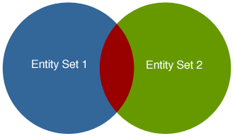

Après avoir [créé un ensemble d'entités]($method.md#methodentityset) à l'aide de `$method=entityset`, vous pouvez ensuite l'utiliser ultérieurement.

## Syntaxe

| Syntaxe                                                                                                    | Exemple                                                                            | Description                                                                                  |
| ---------------------------------------------------------------------------------------------------------- | ---------------------------------------------------------------------------------- | -------------------------------------------------------------------------------------------- |
| [**$entityset/{entitySetID}**](#entitysetentitySetID)                                                      | `/People/$entityset/0ANUMBER`                                                      | Récupère un ensemble d'entités existant                                                      |
| [**$entityset/{entitySetID}?$operator...&$otherCollection**](#entitysetentitysetidoperatorothercollection) | `/Employee/$entityset/0ANUMBER?$logicOperator=AND &$otherCollection=C0ANUMBER` | Crée un nouvel ensemble d'entités à partir de la comparaison d'ensembles d'entités existants |

## $entityset/{entitySetID}

Récupère un ensemble d'entités existant (*e.g.*, `People/$entityset/0AF4679A5C394746BFEB68D2162A19FF`)

### Description

Cette syntaxe vos permet d'exécuter toute opération sur un ensemble d'entités défini.

Étant donné que les ensembles d'entités sont limités par le temps (par défaut ou bien après avoir appelé `$timeout` pour définir la limite souhaitée), vous pouvez appeler `$savedfilter` et `$savedorderby` pour sauvegarder le filtre et trier par instructions lorsque vous créez un ensemble d'entités.

When you retrieve an existing entity set stored in 4D Server's cache, you can also apply any of the following to the entity set: [`$expand`]($expand.md), [`$filter`]($filter.md), [`$orderby`]($orderby.md), [`$skip`]($skip.md), and [`$top/$limit`]($top_$limit.md).

### Exemple

Après avoir créé un ensemble d'entités, l'ID de l'ensemble d'entités est retourné avec les données. Vous appelez cet ID de la manière suivante :

 `GET  /rest/Employee/$entityset/9718A30BF61343C796345F3BE5B01CE7`

## $entityset/{entitySetID}?$operator...&$otherCollection

Créez un autre ensemble d'entités basé sur des ensembles d'entités préalablement créés

| Paramètres       | Type   | Description                                                           |
| ---------------- | ------ | --------------------------------------------------------------------- |
| $operator        | String | L'un des opérateurs logiques à tester avec l'autre ensemble d'entités |
| $otherCollection | String | ID de l'ensemble d'entités                                            |

### Description

Après avoir créé un ensemble d'entités (ensemble d'entités n°1) à l'aide de `$method=entityset`, vous pouvez ensuite créer un autre ensemble d'entités en utilisant la syntaxe `$entityset/{entitySetID}?$operator... &$otherCollection`, la propriété `$operator` (dont les valeurs sont indiquées ci-dessous), et un autre ensemble d'entités (jeu d'entités n°2) défini par la propriété `$otherCollection`. Les deux ensembles d'entités doivent être dans la même dataclass.

Vous pouvez ensuite créer un autre ensemble d'entités contenant les résultats de cet appel en utilisant le `$method=entityset` à la fin de la requête REST.

Voici les opérateurs logiques :

| Opérateur | Description                                                                                                                                                                         |
| --------- | ----------------------------------------------------------------------------------------------------------------------------------------------------------------------------------- |
| AND       | Retourne les entités communes aux deux ensembles d'entités                                                                                                                          |
| OU        | Retourne les entités contenues dans les deux ensembles d'entités                                                                                                                    |
| EXCEPT    | Retourne les entités de l'ensemble d'entités #1 moins celles de l'ensemble d'entités #2                                                                                             |
| INTERSECT | Retourne true ou false s'il existe une intersection des entités dans les deux ensembles d'entités (ce qui signifie qu'au moins une entité est commune aux deux ensembles d'entités) |
> Les opérateurs logiques ne sont pas sensibles à la casse, vous pouvez donc écrire "AND" ou "and".

Vous trouverez ci-dessous une représentation des opérateurs logiques basés sur deux ensembles d'entités. La section rouge correspond à ce qui est retourné.

**AND**

**OU**

**EXCEPT**

La syntaxe est la suivante :

 `GET  /rest/dataClass/$entityset/entitySetID?$logicOperator=AND&$otherCollection=entitySetID`

### Exemple
Dans l'exemple ci-dessous, nous retournons les entités qui se trouvent dans les deux ensembles d'entités puisque nous utilisons l'opérateur logique AND :

 `GET  /rest/Employee/$entityset/9718A30BF61343C796345F3BE5B01CE7?$logicOperator=AND&$otherCollection=C05A0D887C664D4DA1B38366DD21629B`

Si nous souhaitons savoir si les deux ensembles d'entités se croisent, nous pouvons écrire ce qui suit :

 `GET  /rest/Employee/$entityset/9718A30BF61343C796345F3BE5B01CE7?$logicOperator=intersect&$otherCollection=C05A0D887C664D4DA1B38366DD21629B`

S'il existe une intersection, cette requête retourne true. .

Dans l'exemple suivant, nous créons un nouvel ensemble d'entités qui combine toutes les entités des deux ensembles d'entités :

`GET  /rest/Employee/$entityset/9718A30BF61343C796345F3BE5B01CE7?$logicOperator=OR&$otherCollection=C05A0D887C664D4DA1B38366DD21629B&$method=entityset`
