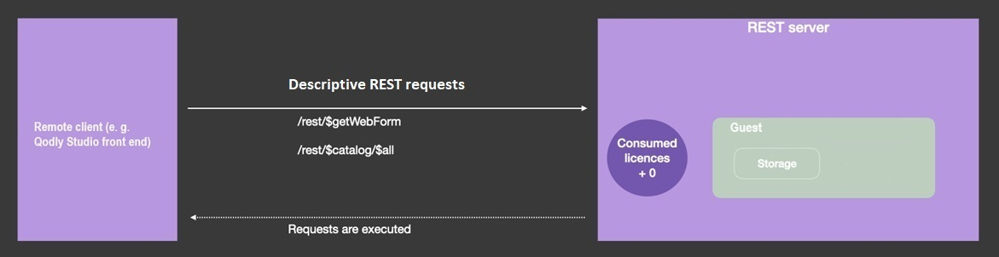

## Sessions

Lorsque les [sessions évolutives sont activées](WebServer/sessions.md#activer-les-sessions) (recommandé), les requêtes REST peuvent créer et utiliser des [sessions utilisateur web](WebServer/sessions.md), offrant des fonctionnalités supplémentaires telles que la gestion de requêtes multiples, le partage de données entre les process web clients et le contrôle des privilèges utilisateur.

Lorsqu'une session utilisateur web est ouverte, vous pouvez la gérer via l'objet `Session` et l'[API de session](API/SessionClass.md). Les requêtes REST ultérieures réutilisent le même cookie de session.

Une session est ouverte après que l'utilisateur a été connecté avec succès (voir ci-dessous).

> - Sur 4D Server, l'ouverture d'une session REST nécessite une licence client 4D disponible.<br/>
> - Sur 4D mono-utilisateur, vous pouvez ouvrir jusqu'à trois sessions REST à des fins de test.

## Mode Force login

:::note Compatibilité

L'ancien mode de connexion basé sur la méthode base `On REST Authentication` est **déprécié** à partir de 4D 20 R6. Il est maintenant recommandé d'[utiliser le **mode Force login**](../ORDA/privileges.md#fichier-rolesjson) (automatiquement activé dans les nouveaux projets) et de mettre en œuvre la fonction [`ds.authentify()`](#dsauthentify). Dans les projets convertis, [un bouton dans la boîte de dialogue des Paramètres](../settings/web.md#activate-rest-authentication-through-dsauthentify-function) vous aide à mettre à niveau votre configuration. Dans Qodly Studio for 4D, le mode peut être défini en utilisant l'option [**Force login**](../WebServer/qodly-studio.md#force-login) dans l'onglet Privileges.

:::

La séquence de connexion d'un utilisateur est la suivante :

1. Lors de la première requête REST (pour un appel de page Qodly par exemple), une session utilisateur web "guest" est créée. Elle n'a aucun privilège, aucun droit d'exécuter des requêtes autres que des [requêtes REST descriptives](#descriptive-rest-requests), aucune licence n'est consommée.\
   Les requêtes REST descriptives sont toujours traitées par le serveur, même si aucune session utilisateur web utilisant une licence n'est ouverte. Dans ce cas, elles sont traitées à travers des sessions "guest".

2. Vous appelez votre fonction [`authentify()`](#authentify) (créée au préalable), dans laquelle vous vérifiez les informations d'identification de l'utilisateur et appelez [`Session.setPrivileges()`](../API/SessionClass.md#setprivileges) avec les privilèges appropriés. `authentify()` doit être une [fonction de datastore class](../ORDA/ordaClasses.md#datastore-class) exposée.

3. La requête `/rest/$catalog/authentify` est envoyée au serveur avec les informations d'identification de l'utilisateur. Cette étape nécessite seulement un formulaire de connexion basique qui n'accède pas aux données ; cela peut être une [page Qodly](../WebServer/qodly-studio.md) (appelée via la requête `/rest/$getWebForm`).

4. Si l'utilisateur est authentifié avec succès, une licence 4D est consommée sur le serveur et toutes les requêtes REST sont acceptées.


Dans la phase de connexion de l'utilisateur, l'utilisation des licences est déconnectée des sessions utilisateur web. Une licence est requise uniquement lorsque la fonction [`Session.setPrivileges()`](../API/SessionClass.md#setprivileges) est exécutée, ce qui vous permet de contrôler le nombre de licences utilisées.

Toutes les autres requêtes REST (manipulant des données ou exécutant une fonction) ne seront traitées que si elles sont exécutées dans une session web avec les privilèges appropriés, sinon elles retournent une erreur. Pour attribuer des privilèges à une session web, vous devez exécuter la fonction [`Session.setPrivileges()`](../API/SessionClass.md#setprivileges) pour la session. L'exécution de cette fonction déclenche la consommation de la licence 4D.

### Requêtes REST descriptives

Les requêtes REST descriptives peuvent être traitées dans des sessions d'utilisateurs web qui ne nécessitent pas de licences (sessions "guest"). Ces requêtes sont :

- requêtes [`/rest/$catalog`]($catalog.md) (par exemple `/rest/$catalog/$all`) - accès aux dataclass disponibles
- `/rest/$catalog/authentify` - la fonction datastore utilisée pour connecter l'utilisateur
- `/rest/$getWebForm` - le rendu d'une page Qodly



## `Function authentify`

### Syntaxe

```4d
exposed Function authentify({params : type}) {-> result : type}
	// code
```

La fonction `authentify()` doit être implémentée dans la [classe DataStore](../ORDA/ordaClasses.md#datastore-class) du projet et doit être appelée par une requête REST.

Cette fonction est le seul point d'entrée disponible à partir des sessions guest REST lorsque le mode "force login" est activé : tout autre appel de fonction ou d'accès aux données est rejeté jusqu'à ce que la session acquière les privilèges appropriés.

:::note

La fonction `authentify()` peut toujours être exécutée par une session guest REST, quelle que soit la configuration du fichier [`roles.json`](../ORDA/privileges.md#rolesjson-file).

:::

La fonction peut recevoir toute information d'authentification ou contextuelle en tant que [paramètre(s)](ClassFunctions.md#parameters) et peut renvoyer n'importe quelle valeur. Étant donné que cette fonction ne peut être appelée que depuis une requête REST, les paramètres doivent être transmis dans le body de la requête POST.

Cette fonction doit contenir deux parties :

- un code pour identifier et authentifier l'expéditeur de la demande REST,
- si l'authentification réussit, un appel à [`Session.setPrivileges()`](../API/SessionClass.md#setprivileges) qui attribue les privilèges appropriés à la session.

Si la fonction ne fait pas appel à [`Session.setPrivileges()`](../API/SessionClass.md#setprivileges), aucun privilège n'est attribué, aucune licence n'est consommée et les requêtes REST non descriptives ultérieures sont rejetées.

### Exemple

Vous voulez simplement savoir quels utilisateurs ont ouvert une session Web sur le serveur. Vous avez créé la fonction `authentify()` suivante dans la classe datastore :

```4d
exposed Function authentify($credentials : Object) : Text

var $users : cs.UsersSelection
var $user : cs.UsersEntity

$users:=ds.Users.query("name = :1"; $credentials.name)
$user:=$users.first()

If ($user#Null) //l'utilisateur est connu
	If (Verify password hash($credentials.password; $user.password))
		Session.setPrivileges("vip")
	Else

		return "Wrong password"
	End if
Else
        return "Wrong user"
End if
```

Pour appeler la fonction `authentify()` :

**POST** `127.0.0.1:8111/rest/$catalog/authentify`

Body de la requête :

```json
[{"name":"Henry",
"password":"123"}]
```
