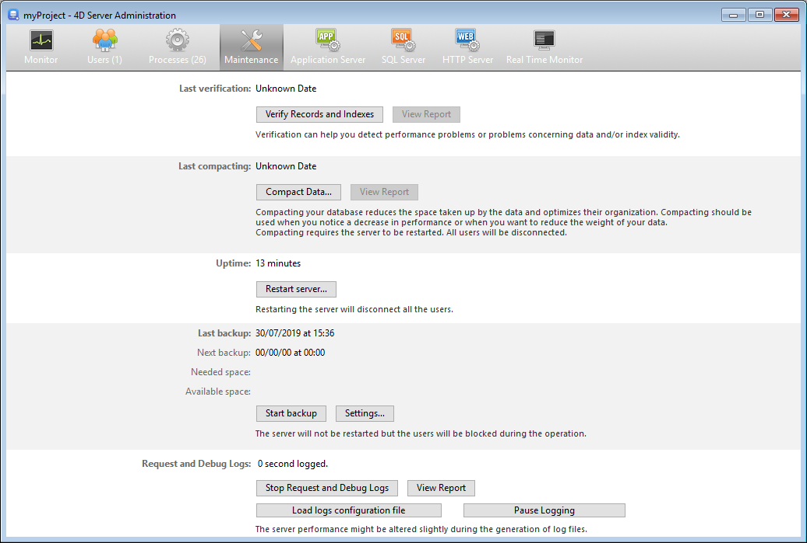

The **Maintenance** page of the 4D Server Administration window provides information concerning the current operation of the application. Elle donne également accès aux fonctions de maintenance élémentaires :

## Dernière vérification/dernier compactage

These areas indicate the date, time and status of the last [data verification](MSC/verify.md) and [compacting operation](MSC/compact.md) carried out on the database.

### Vérifier enregistrements et index

Ce bouton permet de lancer directement l’opération de vérification, sans interruption du serveur. A noter que le serveur peut être sensiblement ralenti durant l’opération.

Tous les enregistrements et tous les index de la base sont vérifiés. If you want to be able to target the verification or have additional options available, you will need to use the [Maintenance and Security Center](MSC/overview.md) (MSC).

After verification, a report file is generated in XML format on the server in the [maintenance Logs](Project/architecture.md#logs) folder. The **View Report** button (named **Download Report** if the operation was carried out from a remote machine) lets you display the file in your browser.

### Compacter les données...

Ce bouton permet de lancer directement une opération de compactage des données. Cette opération nécessite de stopper le serveur : lorsque vous cliquez sur le bouton, la boîte de dialogue de fermeture de la base 4D Server apparaît, vous permettant de choisir le mode d’interruption de l’exploitation :

Après l’interruption effective de la base, 4D Server effectue un compactage standard des données de la base. If you want to have additional options available, you will need to use the [MSC](MSC/overview.md).

Une fois le compactage terminé, 4D Server relance automatiquement l'application. Les utilisateurs 4D peuvent alors se reconnecter.

> Si la demande de compactage a été effectuée depuis un client 4D distant, ce poste est automatiquement reconnecté par 4D Server.

After verification, a report file is generated in XML format on the server in the [maintenance Logs](Project/architecture.md#logs) folder. The **View Report** button (named **Download Report** if the operation was carried out from a remote machine) lets you display the file in your browser.

## Durée de fonctionnement

Cette zone indique la durée de fonctionnement du serveur depuis son dernier démarrage (jours, heures et minutes).

### Redémarrer le serveur...

Ce bouton vous permet de provoquer un redémarrage immédiat du serveur. Lorsque vous cliquez sur ce bouton, la boîte de dialogue de fermeture de la base 4D Server apparaît, vous permettant de choisir le mode d’interruption de l’exploitation. Après le redémarrage, 4D Server relance automatiquement la base. Les utilisateurs 4D peuvent alors se reconnecter.

> Si la demande de redémarrage a été effectuée depuis un client 4D distant, ce poste est automatiquement reconnecté par 4D Server.

## Dernière sauvegarde

This area indicates the date and time of the [last backup](MSC/backup.md) of the database and provides information about the next scheduled automatic backup (if any). Automatic backups are configured using the **Scheduler** page of the structure settings.

- **Last backup**: date and time of last backup.
- **Next backup**: date and time of next scheduled backup.
- **Needed space**: estimated space needed for the backup. The actual size of the backup file may vary according to the settings (compression, etc.) and according to variations of the data file.
- **Available space**: space available on the backup volume.

The **Start backup** button can be used to backup the database immediately using the current backup parameters (files backed up, location of archives, options, etc.). You can view these parameters by clicking on the **Settings...** button. Pendant une sauvegarde sur le serveur, les postes clients sont "bloqués" (mais pas déconnectés) et il n’est pas possible à de nouveaux clients de se connecter.

## Requêtes et débogage

Cette zone indique la durée d’enregistrement des fichiers d'historique (lorsqu’ils sont activés) et vous permet de gérer leur activation.

Refer to the [**Description of log files**](Debugging/debugLogFiles.md) section for details on log files.

### Start/Stop Request and Debug Logs

The **Start Request and Debug Logs** button starts log files. Ce mode pouvant dégrader sensiblement les performances du serveur, il est à réserver à la phase de mise au point de l’application.

> Ce bouton enregistre uniquement les opérations exécutées sur le serveur.

When the logs have been activated, the button title changes to **Stop Request and Debug Logs**, so that you can stop recording requests at any time. A noter qu’une reprise de l’enregistrement après un arrêt "écrase" le fichier précédent.

### Voir le compte rendu

The **View Report** button (named **Download report** if the operation was carried out from a remote desktop client) lets you open a system window displaying the request log file.

### Load logs configuration file

This button allows you to load a special server [log configuration file](Debugging/debugLogFiles.md#using-a-log-configuration-file) (`.json` file). Such a file can be provided by 4D technical services to monitor and study specific cases.

### Pause logging

This button suspends all currently logging operations started on the server. This feature can be useful to temporarily lighten the server tasks.

When the logs have been paused, the button title changes to **Resume logging**, so that you can resume the logging operations.

> You can pause and resume logging using the [SET DATABASE PARAMETER](https://doc.4d.com/4dv19/help/command/en/page642.html) command.
