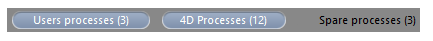

La page **Process** liste les process en cours d’exécution.

Le bouton "Process" indique entre parenthèses le nombre total de process en cours d’exécution sur le serveur (ce nombre ne tient pas compte des éventuels filtres d’affichage appliqués à la fenêtre ni de l’état de l’option \*\*Afficher les process par groupe

Vous pouvez modifier l’ordre des colonnes par simple glisser-déposer de la zone d’en-tête des colonnes. Vous pouvez également trier la liste sur les valeurs d’une colonne en cliquant sur son en-tête.

Tout comme la Page Utilisateurs, cette page contient une [zone de recherche/filtrage](users.md#searchfiltering-area) dynamique, permettant de réduire le nombre de lignes affichées dans la liste à celles qui correspondent au texte saisi dans la zone de rec La recherche/le filtrage est effectué(e) dans les colonnes Session et Nom de process.

Vous disposez également de trois boutons-raccourcis permettant de filtrer par famille les process affichés dans la fenêtre :

- **Process utilisateurs** : Process générés par et pour les sessions utilisateurs. Ces process sont précédés d’une icône en forme de personnage.
- **Process 4D** : Process générés par le moteur de 4D Server. Ces process sont précédés d’une icône en forme de roue crantée.
- **Process en attente** : Process inactifs mais conservés temporairement et pouvant être réutilisés à tout moment. Ce mécanisme permet d’optimiser la réactivité de 4D Server. Ces process sont précédés d’une icône grisée en forme de personnage.

L’option **Afficher les process par groupes** vous permet de regrouper les process internes de 4D Server ainsi que les process clients, pour plus de lisibilité. Lorsque vous cochez cette option :

- les process clients 4D "jumeaux" (Process client 4D principal et Process base 4D client, cf. paragraphe [Type du process](#process-type)) sont groupés en un seul,
- le groupe "Gestionnaires de tâches" est créé ; il inclut les process internes dédiés à la répartition des tâches (Shared balancer, Net session manager, Exclusive pool worker),
- le groupe "Gestionnaires clients" est créé ; il inclut les différents process internes clients.

La zone inférieure de la fenêtre permet d’afficher la représentation graphique de l’activité du ou des process sélectionné(s).

> Vous pouvez sélectionner plusieurs lignes en appuyant sur la touche **Maj** pour une sélection continue ou **Ctrl** (Windows) / **Commande** (macOS) pour une sélection discontinue.

L’activité du process est le pourcentage du temps que 4D Server a consacré à ce process (ratio). La fenêtre fournit les informations suivantes pour chaque process :

- Type de process (cf. ci-dessous),
- Session:
  - Process 4D - vide,
  - Process utilisateur - nom de l'utilisateur 4D,
  - Process web - chemin URL,
- Nom du process,
- Number of the process (as returned by the [`New process`](https://doc.4d.com/4dv19/help/command/en/page317.html) command for example). Le numéro du process est le numéro attribué sur le serveur. Dans le cas d’un process global, ce numéro peut être différent de celui attribué sur le poste client.
- Etat courant du process,
- Temps (en secondes) d'exécution du process depuis sa création,
- Pourcentage du temps que 4D Server a consacré à ce process (ratio).

## Type du process

Chaque process est identifié par une icône et un type. La couleur et la forme de l’icône indiquent la famille du process :

| icône                                      | type                                                                                                                                                                                                                   |
| ------------------------------------------ | ---------------------------------------------------------------------------------------------------------------------------------------------------------------------------------------------------------------------- |
|   | Serveur d’application                                                                                                                                                                                                  |
|   | Serveur SQL                                                                                                                                                                                                            |
|   | Serveur DB4D (moteur de base de données)                                                                                                                                                            |
|   | Serveur Web                                                                                                                                                                                                            |
|   | Serveur SOAP                                                                                                                                                                                                           |
|   | Process client 4D protégé (process développement d’un 4D connecté)                                                                                                                                  |
|   | Main process of a connected 4D client or process created with `New process` on a connected 4D client (Collaborative process, equivalent on the server of the process created on the client machine) |
|   | Process de base client 4D (process parallèle à un process client 4D. Process préemptif chargé de contrôler le process client 4D principal correspondant)                            |
|   | Process en attente (ancien ou futur "Process client 4D base de données")                                                                                                                            |
|  | Worker serveur SQL                                                                                                                                                                                                     |
|  | Worker serveur HTTP                                                                                                                                                                                                    |
|  | Procédure stockée (process coopératif lancé par un 4D connecté et tournant sur le serveur)                                                                                                          |
|  | Méthode Web (lancée par un 4DACTION par exemple)                                                                                                                                                    |
|  | Méthode Web (process préemptif)                                                                                                                                                                     |
|  | Méthode SOAP (lancée par un Web Service)                                                                                                                                                            |
|  | Méthode SOAP (process préemptif)                                                                                                                                                                    |
|  | Logger                                                                                                                                                                                                                 |
|  | Listener connexion TCP                                                                                                                                                                                                 |
|  | Manager session TCP                                                                                                                                                                                                    |
|  | Autre process                                                                                                                                                                                                          |
|  | Process worker (coopératif)                                                                                                                                                                         |
|  | Process 4D client (préemptif)                                                                                                                                                                       |
|  | Procédure stockée (process préemptif)                                                                                                                                                               |
|  | Process worker (préemptif)                                                                                                                                                                          |

> Chaque process client 4D principal et son process base 4D client "jumeau" sont regroupés lorsque l’option **Afficher les process par groupes** est cochée.

## Boutons d’administration

La page comporte cinq boutons de commande permettant d’agir sur le ou les process sélectionné(s). A noter que vous ne pouvez agir que sur les process utilisateurs.

- **Tuer process** : permet de tuer le ou les process sélectionné(s). Lorsque vous cliquez sur ce bouton, une boîte de dialogue d’alerte apparaît, vous permettant de confirmer ou d’annuler l’opération.

> Vous pouvez également interrompre le(s) processus sélectionné(s) directement sans afficher la boîte de dialogue de confirmation en maintenant la touche **Alt** enfoncée tout en cliquant sur ce bouton, ou en utilisant la commande [`ABORT PROCESS BY ID`](https://doc.4d.com/4dv19/help/command/fr/page6315.html).

- **Endormir process** : permet d’endormir le ou les process sélectionné(s).
- **Réactiver process** : permet de réactiver le ou les process sélectionné(s). Les process doivent avoir été auparavant endormis (via le bouton précédent ou par programmation) sinon le bouton est sans effet.
- **Tracer process** : permet d’ouvrir sur le poste serveur une ou plusieurs fenêtre(s) du débogueur pour le ou les process sélectionné(s). Lorsque vous cliquez sur ce bouton, une boîte de dialogue d’alerte apparaît, vous permettant de confirmer ou d’annuler l’opération. A noter que la fenêtre du débogueur ne s’affiche que lorsque du code 4D est effectivement exécuté sur le poste serveur (par exemple dans le cadre d’un trigger ou de l’exécution d’une méthode ayant l’attribut "Exécuter sur serveur").

> Vous pouvez déboguer un process directement, sans afficher la boîte de dialogue de confirmation : pour cela, appuyez sur la touche **Alt** avant de cliquer sur le bouton.

- **Voir utilisateurs** : permet d’afficher dans la [page Utilisateurs](users.md) tous les process du ou des utilisateur(s) sélectionné(s). Le bouton est actif lorsqu’un process utilisateur au moins est sélectionné.
