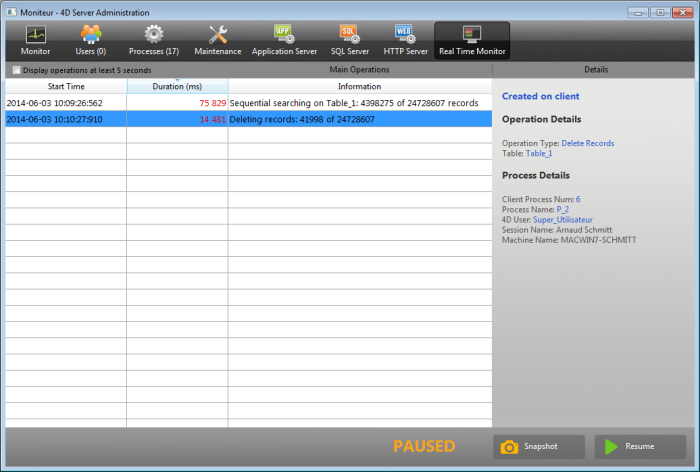

La page Moniteur temps réel permet de surveiller en temps réel le déroulement des opérations "longues" effectuées par l’application. Ces opérations sont par exemple les recherches séquentielles, l’exécution de formules, etc.

> Cette page est disponible dans la fenêtre d’administration du poste serveur et également depuis un poste 4D distant. Dans le cas d’un poste distant, la page affiche les données des opérations effectuées sur le poste serveur.

Chaque opération longue sur les données entraîne l’ajout d’une ligne. La ligne disparaît automatiquement lorsque l’opération est terminée (l'option **Afficher opérations au moins 5 secondes** permet de conserver à l'écran les opérations exécutées rapidement, cf. ci-dessous).

Les informations suivantes sont fournies pour chaque ligne :

- **Heure début** : heure de démarrage de l’opération au format "jj/mm/aaaa - hh:mm:ss"
- **Durée** (ms) : durée en cours de l’opération en millisecondes
- **Informations** : libellé de l’opération.
- **Détails** : cette zone affiche un ensemble d'informations détaillées dont le contenu varie en fonction du type d'opération sélectionné. En particulier :
  - **Créée sur** : indique si l'opération résulte d'une action d'un client (Créée sur client) ou si elle a été démarrée explicitement sur le serveur via une procédure stockée ou l'option "Exécuter sur serveur" (Créée sur serveur).
  - **Détails de l'opération** : décrit le type d'opération ainsi que (pour les opérations de recherche) le plan de recherche.
  - **Sous-opérations** (le cas échéant) : affiche les opérations dépendantes de l'opération sélectionnée (par exemple, suppression des enregistrements liés avant suppression de l'enregistrement parent).
  - **Détails du process** : fournit des informations supplémentaires concernant la table, le champ, le process ou le client, en fonction du type d'opération

> Real-time monitoring page uses the [`ACTIVITY SNAPSHOT`](https://doc.4d.com/4dv19/help/command/en/page1277.html) command internally. More information can be found in this command description.

La page est active et mise à jour en permanence dès qu’elle est affichée. Il est à noter que son fonctionnement peut ralentir sensiblement l’exécution de l’application. Il est possible de suspendre la mise à jour de la page d’une des manières suivantes :

- en cliquant sur le bouton **Pause**,
- en cliquant dans la liste,
- en appuyant sur la barre d’espace.

Lorsque la page est en pause, le message "SUSPENDU" est affiché et le libellé du bouton devient **Reprendre**.
Il est possible de reprendre l’observation des opérations en effectuant la même action que pour la mise en pause.

## Mode avancé

La page MTR peut afficher des informations supplémentaires, si nécessaire, pour chaque opération listée.

Pour accéder au mode avancé pour une opération, appuyez sur la touche **Maj** et sélectionnez l'opération. All available information is then displayed in the "Process Details" area without any filtering (as returned by the `ACTIVITY SNAPSHOT` command). Les informations disponibles dépendent de l'opération sélectionnée.

Voici un exemple d'information affichée en mode standard :

En mode avancé (**Maj+Clic** sur la ligne de l'opération), des informations supplémentaires sont affichées :

## Bouton Instantané

Le bouton **Instantané** vous permet de copier dans le presse-papiers toutes les opérations affichées dans le panneau du MTR, ainsi que les détails associés (informations sur les process et les sous-opérations) :

## Afficher opérations au moins 5 secondes

Si vous cochez l'option **Afficher opérations au moins 5 secondes**, toutes les opérations listées seront affichées dans la page pendant au moins cinq secondes, même après que l'exécution de l'opération soit terminée. Les opérations terminées restant affichées sont grisées dans la liste. Cette fonction est utile lorsque vous voulez observer des opérations dont l'exécution est très rapide.
