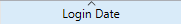

The **Sessions** page lists all active sessions connected to the server, including Client, Web, REST, and SOAP sessions.


The **Sessions** button indicates, in parentheses, the total number of active sessions (this number does not take into account any display filters applied to the window).

The page contains a dynamic search area, filtering controls, and administration buttons. Vous pouvez modifier l’ordre des colonnes par simple glisser-déposer de la zone d’en-tête des colonnes.

You can also sort the list by clicking a column header. Click repeatedly to toggle between ascending and descending order.



## List of Sessions

Each row represents one active session.

The list provides the following information:

- Icon representing the type of session (Apple for macOS Client sessions, Windows for Windows Client sessions, globe for Web, REST, and SOAP sessions). And an additional visual indicator shows whether the session is authenticated.
- **Origin**: Type of session (Client, Web, REST, or SOAP).
- **User Name**: Name of the connected 4D user, or the alias defined using the [`SET USER ALIAS`](../commands/set-user-alias) command when applicable. For Web, REST, or SOAP sessions, no user name is displayed unless one has been associated with the session using the `userName` property of the [`setPrivileges()`](../API/SessionClass.md#setprivileges) function.
- **Login Date**: Date and time when the session was established.
- **CPU Time**: CPU time consumed by the session since it was created.
- **Activity**: Percentage of server activity currently devoted to the session (dynamic value).
- **Status**: Status of the session. Client sessions can be **Online**, **[Sleeping](../Desktop/clientServer.md#management-of-sleeping-client-sessions)**, or **[Unreachable](../Desktop/clientServer.md#management-of-unreachable-peer)**. Web, REST, and SOAP sessions always have the **Online** status.

Additional information is available in the detail panel when a session is selected.

## Session detail panel

Selecting a session displays additional information in the lower panel.

### Client sessions

The following information is available:

- **System username**: Name of the operating system session opened on the remote machine.
- **IP address**: IP address of the remote machine that opened the session.
- **Nom de machine** : Nom de la machine distante.
- **4D Write Pro**: Indicates whether the session user belongs to a group that grants access to 4D Write Pro.
- **4D View Pro**: Indicates whether the session user belongs to a group that grants access to 4D View Pro.

### REST, Web, and SOAP sessions

The detail panel displays information such as:

- **Guest status**: Indicates whether the session is a Guest session. Guest sessions are unauthenticated Web sessions.
- **Privileges**: List of privileges associated with the session.
- **IP address**: IP address of the remote machine that opened the session.
- **User agent**: Identifies the client application, browser, or service that initiated the session.

### IP Lookup button

IP Lookup button is enabled when a public IP address is displayed. You can click on the button to retrieve the geolocation of the selected session.

If the information is available, the location is displayed next to the IP Lookup button in the format **City, Country**. Otherwise **Not found** is displayed.

## Search and Filtering

### Search bar

The search field can be used to reduce the number of rows displayed in the list to those that correspond to the text entered. The search is performed on the **User Name**, **Machine name**, **Session name**, and **IP address** columns.

The list is updated in real time as you enter text.

You can search for multiple values by separating them with a semicolon (`;`). In this case, the values are combined using the **OR** operator.

For example, if you enter:

```
John;Mary;REST
```

only rows containing **John**, **Mary**, or **REST** in the searchable columns are displayed.

### Session Type Filters

The Sessions page also provides quick filters to display only specific session types.

The following filters are available:

- **Counted sessions**:  includes only sessions counted for floating license consumption.
- **Clients**: includes only desktop client sessions.
- **Web**: includes only Web and SOAP sessions.
- **REST**: includes only REST sessions.

Filters can be enabled or disabled independently, or combined with other filters, and are applied immediately to the session list.

## Boutons d’administration

There are three administration buttons: **Send message** is available when one or more Client sessions are selected. **Watch Processes** is available when a single session of any type is selected, and **Drop session** is available when one or more sessions of any type are selected.
You can select several rows by holding down the **Shift** key for an adjacent selection or the **Ctrl** (Windows) / **Command** (macOS) key for a non-adjacent selection.

### Envoyer message

This button can be used to send a message to the selected **Client** session(s). If no Client session is selected, the button is not active. When you click this button, a dialog box appears that lets you enter the message. The dialog box also indicates the number of Client sessions that will receive the message:


The message is displayed as an alert on the corresponding remote machines.

You can perform the same action programmatically using the [`SEND MESSAGE TO REMOTE USER`](../commands/send-message-to-remote-user) command.

### Visualiser process

This button can be used to directly show the processes associated with the selected session on the [**Processes** page](processes.md).

The process list is automatically filtered using the selected session UUID.

When multiple sessions are selected, this button is disabled.

### Drop session

This button can be used to force the selected Client session(s) to disconnect.

A confirmation dialog is displayed before the session is disconnected to confirm or cancel this operation (Hold down the **Alt** key while clicking **Drop user** to disconnect immediately without displaying the confirmation dialog).

You can perform the same action programmatically using the [`DROP REMOTE USER`](../commands/drop-remote-user) command.
