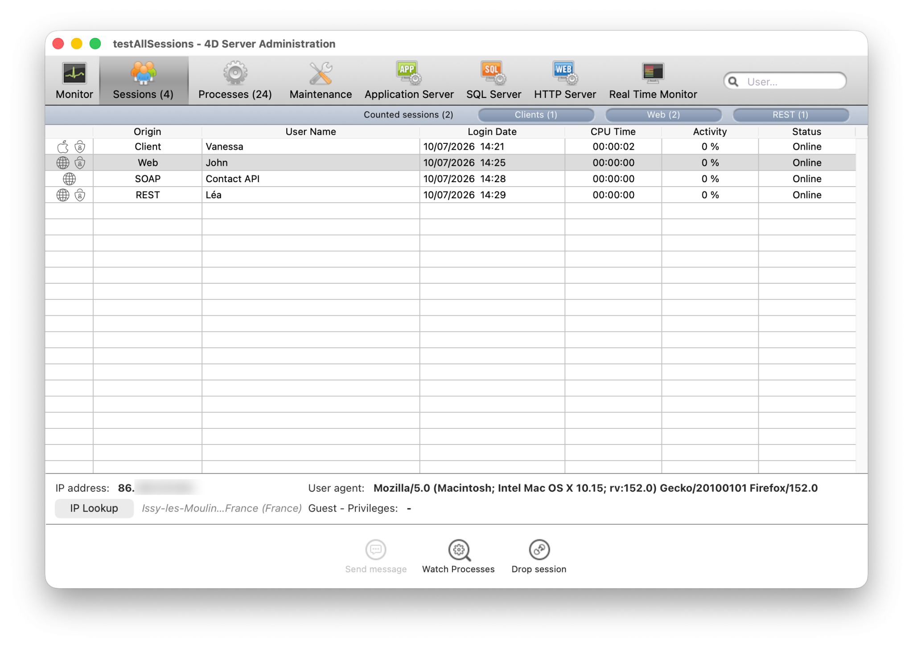
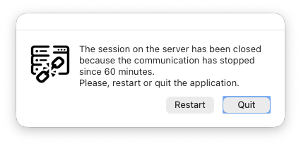

La page **Sessions** répertorie toutes les sessions actives connectées au serveur, y compris les sessions Client, Web, REST et SOAP.



Le bouton **Sessions** indique, entre parenthèses, le nombre total de sessions actives (ce nombre ne tient pas compte des filtres d'affichage appliqués à la fenêtre).

La page comporte un champ de recherche dynamique, des commandes de filtrage et des boutons d'administration. Vous pouvez modifier l’ordre des colonnes par simple glisser-déposer de la zone d’en-tête des colonnes.

Vous pouvez également trier la liste en cliquant sur l'en-tête d'une colonne. Cliquez plusieurs fois pour basculer entre l'ordre ascendant et l'ordre descendant.


## Liste des sessions

Chaque ligne correspond à une session active.

La liste fournit les informations suivantes :

- Icône représentant le type de session (logo Apple pour les sessions client macOS, logo Windows pour les sessions client Windows, globe pour les sessions Web, REST et SOAP). De plus, un indicateur visuel supplémentaire permet de savoir si la session est authentifiée.
- **Origine** : type de session (Client, Web, REST ou SOAP).
- **Nom d'utilisateur** : nom de l'utilisateur 4D connecté, ou l'alias défini à l'aide de la commande [`SET USER ALIAS`](../commands/set-user-alias) le cas échéant. Pour les sessions Web, REST ou SOAP, aucun nom d'utilisateur n'est affiché, sauf si un nom a été associé à la session à l'aide de la propriété `userName` de la fonction [`setPrivileges()`](../API/SessionClass.md#setprivileges).
- **Date de connexion** : date et heure auxquelles la session a été établie.
- **Temps CPU** : temps CPU consommé par la session depuis sa création.
- **Activité** : pourcentage de l'activité du serveur actuellement consacré à la session (valeur dynamique).
- **Statut** : statut de la session. Les sessions client peuvent être **Online**, **[Sleeping](../Desktop/clientServer.md#management-of-sleeping-client-sessions)** ou **[Unreachable](../Desktop/clientServer.md#management-of-unreachable-peer)**. Les sessions Web, REST et SOAP ont toujours le statut **Online**.

Des informations supplémentaires sont disponibles dans le volet de détails lorsqu'une session est sélectionnée.

## Zone détails de la session

Lorsque vous sélectionnez une session, des informations supplémentaires s'affichent dans la zone inférieure.

### Sessions client

Les informations suivantes sont disponibles :

- **Nom utilisateur système** : nom de la session du système d'exploitation ouverte sur la machine distante.
- **Adresse IP** : adresse IP de la machine distante qui a ouvert la session.
- **Nom de machine** : Nom de la machine distante.
- **4D Write Pro** : indique si l'utilisateur de la session appartient à un groupe ayant accès à 4D Write Pro.
- **4D View Pro** : indique si l'utilisateur de la session appartient à un groupe ayant accès à 4D View Pro.

### Sessions REST, Web et SOAP

La zone de détails affiche des informations telles que :

- **Statut Guest** : indique si la session est une session Guest. Les sessions Guest sont des sessions Web non authentifiées.
- **Privilèges** : liste des privilèges associés à la session.
- **Adresse IP** : adresse IP de la machine distante qui a ouvert la session.
- **User agent** : identifie l'application cliente, le navigateur ou le service à l'origine de la session.

### Bouton IP Lookup

Le bouton IP Lookup est activé lorsqu'une adresse IP publique s'affiche. Vous pouvez cliquer sur le bouton pour obtenir la géolocalisation de la session sélectionnée.

Si cette information est disponible, la localisation s'affiche à côté du bouton IP Lookup sous la forme **Ville, Pays**. Sinon, le message **Introuvable** s'affiche.

## Recherche et filtrage

### Barre de recherche

La zone de recherche permet de limiter le nombre de lignes affichées dans la liste à celles qui correspondent au texte saisi. La recherche porte sur les colonnes **Nom utilisateur**, **Origine**, **Nom de la session** et **Adresse IP**.

La liste est mise à jour en temps réel au fur et à mesure que vous saisissez du texte.

Vous pouvez rechercher plusieurs valeurs en les séparant par un point-virgule (`;`). Dans ce cas, les valeurs sont combinées à l'aide de l'opérateur **OU**.

Par exemple, si vous écrivez :

```
John;Mary;REST
```

Seules les lignes contenant **John**, **Mary** ou **REST** dans les colonnes pouvant faire l'objet d'une recherche sont affichées.

### Filtres par type de session

La page Sessions propose également des filtres rapides permettant d'afficher uniquement certains types de sessions.

Les filtres suivants sont disponibles :

- **Sessions comptées**: afficher uniquement les sessions comptabilisées pour la consommation flottante de licences.
- **Clients** : afficher uniquement les sessions client desktop.
- **Web** : afficher uniquement les sessions Web et SOAP.
- **REST** : afficher uniquement les sessions REST.

Les filtres peuvent être activés ou désactivés individuellement, ou combinés avec d'autres filtres, et sont immédiatement appliqués à la liste des sessions.

## Boutons d’administration

Trois boutons d'administration sont disponiles : **Envoyer message** est activé lorsqu'une ou plusieurs sessions Client sont sélectionnées. **Visualiser process** est disponible lorsqu'une seule session, quel que soit son type, est sélectionnée, tandis que l'option **Déconnecter la session** est disponible lorsqu'une ou plusieurs sessions, quel que soit leur type, sont sélectionnées.
Vous pouvez sélectionner plusieurs lignes en appuyant sur la touche **Maj** pour une sélection continue ou **Ctrl** (Windows) / **Commande** (macOS) pour une sélection discontinue.

### Envoyer message

Ce bouton permet d'envoyer un message à la ou aux session(s) **Client** sélectionnée(s). Si aucune session client n'est sélectionnée, le bouton n'est pas actif. Lorsque vous cliquez sur le bouton, une boîte de dialogue apparaît, vous permettant saisir le message. La boîte de dialogue indique également le nombre de sessions client qui recevront le message :


Le message s'affiche sous forme d'alerte sur les machines distantes concernées.

Vous pouvez effectuer la même action par programmation à l'aide de la commande [`SEND MESSAGE TO REMOTE USER`](../commands/send-message-to-remote-user).

### Visualiser process

Ce bouton permet d'afficher directement dans la [**page Process**](processes.md) les process associés à la session sélectionnée.

La liste des process est automatiquement filtrée en fonction de l'UUID de la session sélectionnée.

Lorsque plusieurs sessions sont sélectionnées, ce bouton est désactivé.

### Déconnecter la session

Ce bouton permet de forcer la déconnexion de la ou des sessions client(s) sélectionnée(s).

Une boîte de dialogue de confirmation s'affiche avant la déconnexion de la session afin de confirmer ou d'annuler cette opération (maintenez la touche **Alt** enfoncée tout en cliquant sur **Déconnecter l'utilisateur** pour vous déconnecter immédiatement sans afficher la boîte de dialogue de confirmation).

Vous pouvez effectuer la même opération par programmation à l'aide de la commande [`DROP REMOTE USER`](../commands/drop-remote-user).

## Gestion des sessions de clients en veille

4D Server gère spécifiquement le cas où la machine d'une application distante 4D passe en mode veille alors que la connexion au serveur est toujours active.

Dans ce cas, l'application distante avertit 4D Server avant de passer en mode veille. La session client correspondante passe au statut **Sleeping**.


Ce statut libère les ressources du serveur tout en préservant le contexte de la session.

Lorsque la machine distante sort du mode veille, l'application se reconnecte automatiquement et rétablit la session en cours.

Une session client inactive est automatiquement fermée après 48 heures d'inactivité.

Vous pouvez modifier ce délai d'expiration à l'aide de la commande [`SET DATABASE PARAMETER`](../commands/set-database-parameter) avec le sélecteur `Remote connection sleep timeout`.

## Gestion d'un pair injoignable

Lorsque la [couche réseau QUIC est utilisée](../settings/client-server.md#network-layer), les sessions client/serveur bénéficient d'une **fonctionnalité de reconnexion automatique** en cas de déconnexions imprévues. Parmi les déconnexions imprévues, on peut citer par exemple :

- le débranchement/rebranchement d'un câble LAN,
- le transfert à une connexion mobile,
- le redémarrage du commutateur,
- une erreur réseau minime.

Cette fonctionnalité prend en charge la gestion tant côté serveur que côté client en cas de perte de connexion avec un pair, et inclut des délais d'attente configurables ainsi que des informations en temps réel.

:::tip Article(s) de blog sur le sujet

[Fatigué des erreurs réseau perturbant vos utilisateurs ? 4D 21 R4 a la réponse](https://blog.4d.com/tired-of-network-errors-disrupting-your-users-4d-21-r4-has-the-answer)

:::

### Événement Unreachable

La couche réseau QUIC envoie automatiquement un événement "Unreachable" ("Injoignable") à 4D Server lorsqu'un 4D distant cesse inopinément de répondre ; inversement, elle envoie automatiquement un événement "Unreachable" à un 4D distant lorsque 4D Server cesse inopinément de répondre. Lorsque l'événement "Unreachable" est reçu de l'un ou l'autre côté, il est immédiatement pris en compte dans l'interface et dans l'objet [`Session`](./sessions.md) de la machine.

#### Le client distant ne répond plus

Lorsqu'un 4D distant cesse inopinément de répondre, sur la [fenêtre d'administration du serveur](../ServerWindow/overview.md), le [statut de la session distante](../ServerWindow/sessions.md#list-of-users) devient **Unreachable**.


#### Le serveur ne répond plus

Si 4D Server arrête inopinément de répondre, une boîte de dialogue de reconnexion s'affiche sur la machine distante :


#### Objet Session mis à jour

Lorsque l'événement "Unreachable" est reçu de l'un ou l'autre côté, une propriété [`info.unreachableSince`](../API/SessionClass.md#info) est créée dans la session sur la machine qui reçoit l'événement (sur le serveur, elle est accessible via la propriété [`Process activity.sessions`](../commands/process-activity)), et elle commence à compter les secondes écoulées depuis la dernière communication. Vous pouvez utiliser cette propriété pour implémenter votre propre interface de déconnexion.

### Rétablir ou fermer la connexion

Le délai d'expiration de la session QUIC est de 900 secondes (15 minutes) par défaut ; il peut être modifié à l'aide du sélecteur `QUIC session timeout` de la commande [`SET DATABASE PARAMETER`](../commands/set-database-parameter).

Un délai d'expiration de la session QUIC est automatiquement utilisé pour gérer les déconnexions :

- Si la connexion est rétablie avant l'expiration du délai de la session QUIC, la propriété [`info.unreachableSince`](../API/SessionClass.md#info) est automatiquement supprimée de l'objet de session.
- Si la connexion n'est pas rétablie avant l'expiration du délai de la session QUIC, celle-ci est fermée.
  - Dans le cas d'une session distante fermée depuis le serveur, une ligne de warning est enregistrée dans le [journal de diagnostic](../Debugging/debugLogFiles.md#4ddiagnosticlogtxt).
  - Dans le cas d'une session serveur fermée à partir d'une machine distante, une boîte de dialogue d'avertissement est affichée afin que l'utilisateur puisse redémarrer l'application distante ou quitter :  
    

