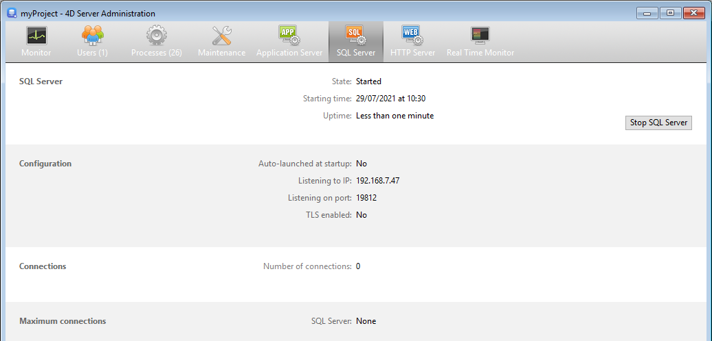

La page **SQL Server** regroupe les informations relatives au serveur SQL intégré de 4D Server. Elle comporte également un bouton permettant de contrôler l’activation du serveur.

La partie supérieure de la page fournit des informations sur le statut courant du serveur SQL de 4D Server.

- **Etat** : Démarré ou Arrêté
- **Date de démarrage** : Date et heure du dernier lancement du serveur SQL.
- **Durée de fonctionnement** : Délai écoulé depuis le dernier démarrage du serveur SQL.

## Démarrer / Arrêter le serveur SQL

Ce bouton fonctionne en bascule. Il permet de contrôler l’activation du serveur SQL de 4D Server.

- Lorsque l’état du serveur SQL est "Démarré", le bouton est libellé **Arrêter le serveur SQL**. Si vous cliquez sur ce bouton, le serveur SQL de 4D Server est immédiatement stoppé, il ne répond plus aux requêtes SQL externes reçues sur le port TCP désigné.
- Lorsque l’état du serveur SQL est "Arrêté", le bouton est libellé **Démarrer le serveur SQL**. Si vous cliquez sur ce bouton, le serveur SQL de 4D Server est immédiatement démarré, il répond aux requêtes SQL externes reçues sur le port TCP désigné. A noter que vous devez disposer d’une licence adéquate pour pouvoir exploiter le serveur SQL de 4D.

> Le serveur SQL peut également être lancé automatiquement au démarrage de l’application (option des Préférences) ou par programmation.

## Informations

### Configuration

Cette zone fournit plusieurs informations sur les paramètres de configuration du serveur SQL : lancement automatique au démarrage, adresse IP d’écoute, port TCP (19812 par défaut) et activation du SSL pour les connexions SQL (ne concerne pas les connexions 4D ni HTTP).

Ces paramètres peuvent être modifiés via les Préférences de 4D.

### Connexions

Nombre de connexions SQL actuellement ouvertes sur 4D Server.

### Connexions maximum

Nombre maximum de connexions SQL simultanées autorisées. Cette valeur dépend de la licence installée sur le poste serveur.
