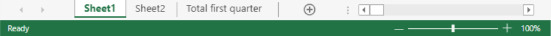

<!-- REF #_method_.VP Get sheet index.Syntax -->

**VP Get sheet index** ( *vpAreaName* : Text ; *name* : Text ) : Integer<!-- END REF -->

<!-- REF #_method_.VP Get sheet index.Params -->

<div class="no-index">

| Paramètres | Type    |                             | Description                             |
| ---------- | ------- | --------------------------- | --------------------------------------- |
| vpAreaName | Text    | ->                          | Nom d'objet formulaire zone 4D View Pro |
| name       | Text    | ->                          | Nom de la feuille                       |
| Résultat   | Integer | <- | Indice de la feuille                    |

</div>
<!-- END REF -->

## Description

La commande `VP Get sheet index` <!-- REF #_method_.VP Get sheet index.Summary -->retourne l'index d'une feuille basé sur son nom dans *vpAreaName*.<!-- END REF -->

Dans *vpAreaName*, passez le nom de la zone 4D View Pro.

Dans *name*, passez le nom de la feuille dont l'index sera retourné. Si aucune feuille nommée *name* n'est trouvée dans le document, la méthode retourne -1.

> La numérotation démarre à 0.

## Exemple

Dans le document suivant :



Lire l'index de la feuille appelée "Total premier trimestre" :

```4d
$index:=VP Get sheet index("ViewProArea";"Total premier trimestre") //retourne 2
```

## Voir également

[VP Get sheet count](vp-get-sheet-count.md)<br/>
[VP Get sheet name](vp-get-sheet-name.md)
