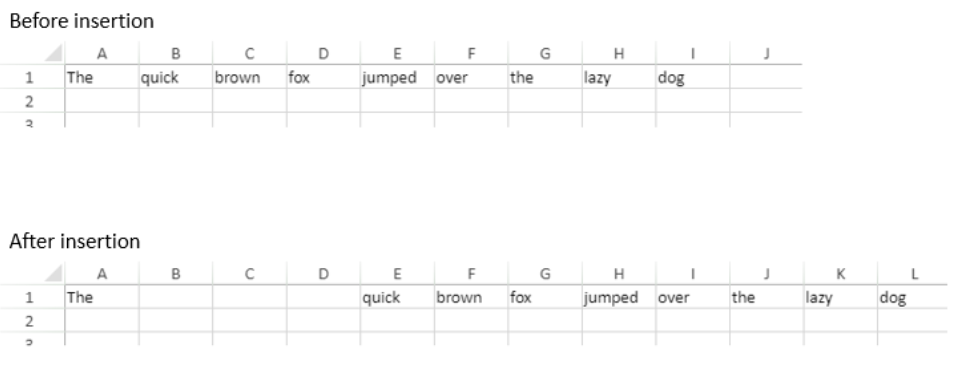

<!-- REF #_method_.VP INSERT COLUMNS.Syntax -->

**VP INSERT COLUMNS** ( *rangeObj* : Object ) <!-- END REF -->

<!-- REF #_method_.VP INSERT COLUMNS.Params -->

| Paramètres | Type   |    | Description |                  |
| ---------- | ------ | -- | ----------- | ---------------- |
| rangeObj   | Object | -> | Objet plage | <!-- END REF --> |

#### Description

The `VP INSERT COLUMNS` command <!-- REF #_method_.VP INSERT COLUMNS.Summary -->inserts columns into the *rangeObj*<!-- END REF -->.

In *rangeObj*, pass an object containing a range of the starting column (the column which designates where the new column will be inserted) and the number of columns to insert. Si le nombre de colonnes à insérer est omis (non défini), une seule colonne est insérée.

New columns are inserted on the left, directly before the starting column in the *rangeObj*.

#### Exemple

Pour insérer 3 colonnes avant la deuxième colonne :

```4d
VP INSERT COLUMNS(VP Column("ViewProArea";1;3))
```

Le résultat est le suivant :



#### Voir également

[VP DELETE COLUMNS](vp-delete-columns.md)<br/>
[VP DELETE ROWS](vp-delete-rows.md)<br/>
[VP INSERT ROWS](vp-insert-rows.md)
