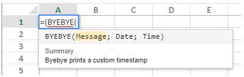

<!-- REF #_method_.VP SET ALLOWED METHODS.Syntax -->

**VP SET ALLOWED METHODS** ( *methodObj* : Object) <!-- END REF -->

<!-- REF #_method_.VP SET ALLOWED METHODS.Params -->

<div class="no-index">

| Paramètres | Type   |    | Description                                    |
| ---------- | ------ | -- | ---------------------------------------------- |
| methodObj  | Object | -> | Méthodes autorisées dans les zones 4D View Pro |

</div>
<!-- END REF -->

> **Compatibilité**

> Pour une plus grande flexibilité, il est recommandé d'utiliser la commande [`VP SET CUSTOM FUNCTIONS`](vp-set-custom-functions.md) qui vous permet de désigner des formules 4D qui peuvent être appelées à partir des zones de 4D View Pro. Dès que `VP SET CUSTOM FUNCTIONS` est appelé, les appels de `VP SET ALLOWED METHODS` sont ignorés. 4D View Pro supporte également la commande générique `SET ALLOWED METHODS` de 4D si ni `VP SET CUSTOM FUNCTIONS` ni `VP SET ALLOWED METHODS` ne sont appelés, Cependant, l'utilisation de la commande générique n'est pas recommandée.

## Description

La commande `VP SET ALLOWED METHODS` <!-- REF #_method_.VP SET ALLOWED METHODS.Summary -->désigne les méthodes projets qui peuvent être appelées dans des formules 4D View Pro<!-- END REF -->. Cette commande s'applique à toutes les zones 4D View Pro qui ont été crées après l'appel de la commande durant la session. Elle peut être appelée à plusieurs reprises dans la même session pour créer différentes configurations.

Par défaut, pour des raisons de sécurité, si vous n'exécutez pas la commande `VP SET ALLOWED METHODS`, aucun appel de méthode n'est autorisé dans les zones de 4D View Pro -- sauf si la commande générique `SET ALLOWED METHODS` de 4D a été utilisée (voir la note de compatibilité). L'utilisation d'une méthode non autorisée dans une formule affiche une erreur #NAME? dans la zone 4D View Pro.

Dans le paramètre *methodObj*, passez un objet dans lequel chaque propriété est le nom d'une fonction à définir dans les zones 4D View Pro:

| Propriété        |            |                                                                                | Type                | Description                                                                                                                                                                                                                                                                                                                                                                                                                                                                                                                                                                                                                                                                                                                                                                    |
| ---------------- | ---------- | ------------------------------------------------------------------------------ | ------------------- | ------------------------------------------------------------------------------------------------------------------------------------------------------------------------------------------------------------------------------------------------------------------------------------------------------------------------------------------------------------------------------------------------------------------------------------------------------------------------------------------------------------------------------------------------------------------------------------------------------------------------------------------------------------------------------------------------------------------------------------------------------------------------------ |
| `<functionName>` |            |                                                                                | Object              | Description de la fonction personnalisée. Le nom de propriété `<functionName>` définit le nom de la fonction personnalisée à afficher dans les formules de 4D View Pro (les espaces ne sont pas autorisés)                                                                                                                                                                                                                                                                                                                                                                                                                                                                                                                                  |
|                  | method     |                                                                                | Text                | (obligatoire) Nom de la méthode projet 4D existante à autoriser                                                                                                                                                                                                                                                                                                                                                                                                                                                                                                                                                                                                                                                                                             |
|                  | parameters |                                                                                | Collection d'objets | Collection de paramètres (dans l'ordre dans lequel ils sont définis dans la méthode). Pour plus d'informations, veuillez vous reporter à la section [Paramètres](../formulas.md#parameters).                                                                                                                                                                                                                                                                                                                                                                                                                                                                                                                                |
|                  |            | \[ ].name | Text                | Nom du paramètre à afficher pour le `<functionName>`.**Note** : les noms de paramètres ne doivent pas contenir d'espaces.                                                                                                                                                                                                                                                                                                                                                                                                                                                                                                                                                                                                      |
|                  |            | \[ ].type | Number              | Type de paramètre. Types pris en charge :<li>`Is Boolean`</li><li>`Is collection`</li><li>`Is date`</li><li>`Is Integer`</li><li>`Is object`</li><li>`Is real`</li><li>`Is text`</li><li>`Is time`</li>Le *type* peut être omis (sauf si au moins un paramètre est de type collection, cas dans lequel la déclaration du type du paramètre est obligatoire). <br/> Si *type* est omis, la valeur est envoyée par défaut avec son type, sauf pour les valeurs de date ou d'heure, qui sont envoyées sous forme d'objet.  Si *type* est `Is object`, l'objet est envoyé dans une propriété `.value`. Voir la section [Paramètres](../formulas.md#parameters). |
|                  | summary    |                                                                                | Text                | Description de la fonction à afficher dans 4D View Pro                                                                                                                                                                                                                                                                                                                                                                                                                                                                                                                                                                                                                                                                                                                         |
|                  | minParams  |                                                                                | Number              | Nombre minimum de paramètres                                                                                                                                                                                                                                                                                                                                                                                                                                                                                                                                                                                                                                                                                                                                                   |
|                  | maxParams  |                                                                                | Number              | Nombre maximum de paramètres. Si vous passez un nombre supérieur à la largeur de parameters, il est possible de déclarer des paramètres "optionnels" avec leur type par défaut                                                                                                                                                                                                                                                                                                                                                                                                                                                                                                                                                                                 |

## Exemple

Vous souhaitez autoriser deux méthodes dans vos zones 4D View Pro :

```4d
var $allowed : Object
$allowed:=New object //paramètre de la commande
 
$allowed.Hello:=New object //Créer une première fonction simple nommée "Hello"
$allowed.Hello.method:="My_Hello_Method" //définit la méthode 4D
$allowed.Hello.summary:="Hello prints hello world"
 
$allowed.Byebye:=New object //créez une deuxième fonction avec des paramètres nommée "Byebye"
$allowed.Byebye.method:="My_ByeBye_Method"
$allowed.Byebye.parameters:=New collection
$allowed.Byebye.parameters.push(New object("name";"Message";"type";Is text))
$allowed.Byebye.parameters.push(New object("name";"Date";"type";Is date))
$allowed.Byebye.parameters.push(New object("name";"Time";"type";Is time))
$allowed.Byebye.summary:="Byebye prints a custom timestamp"
$allowed.Byebye.minParams:=3
$allowed.Byebye.maxParams:=3
 
VP SET ALLOWED METHODS($allowed)
```

Une fois ce code exécuté, les fonctions définies peuvent être utilisées dans des formules 4D View Pro :



> Dans les formules de 4D View Pro, les noms des fonctions sont automatiquement affichés en majuscules.

## Voir également

[4D functions](../formulas.md#4d-functions)<br/>
[VP SET CUSTOM FUNCTIONS](vp-set-custom-functions.md)