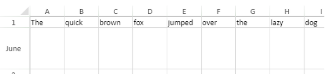

<!-- REF #_method_.VP SET ROW ATTRIBUTES.Syntax -->

**VP SET ROW ATTRIBUTES** ( *rangeObj* : Object ; *propertyObj* : Object  ) <!-- END REF -->

<!-- REF #_method_.VP SET ROW ATTRIBUTES.Params -->

<div class="no-index">

| Paramètres  | Type   |    | Description                                                                                                                                                                                                              |
| ----------- | ------ | -- | ------------------------------------------------------------------------------------------------------------------------------------------------------------------------------------------------------------------------ |
| rangeObj    | Object | -> | Une fois que l'export est terminé, <code>VP EXPORT DOCUMENT</code> exécute automatiquement la méthode définie dans la propriété <em x-id="3">formula</em> de <em x-id="3">paramObj</em>, le cas échéant. |
| propertyObj | Object | -> | Objet contenant des propriétés de lignes                                                                                                                                                                                 |

</div>
<!-- END REF -->

## Description

La commande `VP SET ROW ATTRIBUTES` <!-- REF #_method_.VP SET ROW ATTRIBUTES.Summary -->applique les attributs définis dans *propertyObj* aux lignes de *rangeObj*<!-- END REF -->.

Dans *rangeObj*, passez un objet contenant une plage. Si la plage contient des colonnes et des lignes, les attributs s'appliquent uniquement aux lignes.

Le paramètre *propertyObj* vous permet de spécifier les attributs à appliquer aux lignes dans *rangeObj*. Ces attributs sont :

| Propriété | Type    | Description                                                                       |
| --------- | ------- | --------------------------------------------------------------------------------- |
| height    | number  | Hauteur de la ligne exprimée en pixels                                            |
| pageBreak | boolean | Vrai pour insérer un saut de page avant la première ligne de la plage, sinon faux |
| visible   | boolean | Vrai si la ligne est visible, sinon faux                                          |
| resizable | boolean | Vrai si la ligne peut être redimensionnée, sinon faux                             |
| header    | text    | Texte de l'en-tête de la ligne                                                    |

## Exemple

Pour modifier la taille de la deuxième ligne et définir l'en-tête, saisissez le code suivant :

```4d
var $row; $properties : Object
 
$row:=VP Row("ViewProArea";1)
$properties:=New object("height";75;"header";"June")
 
VP SET ROW ATTRIBUTES($row;$properties)
```



## Voir également

[VP Get row attributes](vp-get-row-attributes.md)<br/>
[VP get column attributes](vp-get-column-attributes.md)<br/>
[VP SET ROW ATTRIBUTES](vp-set-row-attributes.md)
