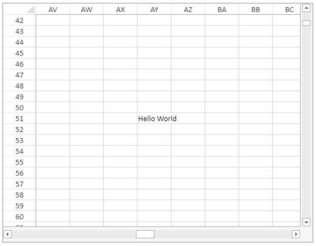
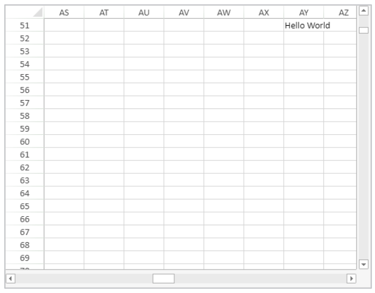

<!-- REF #_method_.VP SHOW CELL.Syntax -->

**VP SHOW CELL** ( *rangeObj* : Object { ; *vPos* : Integer; *hPos* : Integer } ) <!-- END REF -->

<!-- REF #_method_.VP SHOW CELL.Params -->

<div class="no-index">

| Paramètres | Type    |    | Description                                                 |
| ---------- | ------- | -- | ----------------------------------------------------------- |
| rangeObj   | Object  | -> | Objet plage                                                 |
| vPos       | Integer | -> | Position verticale de la vue de la cellule ou de la ligne   |
| hPos       | Integer | -> | Position horizontale de la vue de la cellule ou de la ligne |

</div>
<!-- END REF -->

## Description

La commande VP SHOW CELL <!-- REF #_method_.VP SHOW CELL.Summary -->repositionne verticalement et horizontalement la vue de *rangeObj*<!-- END REF -->.

Dans *rangeObj*, passez un objet plage de cellules que vous souhaitez afficher. La vue de *rangeObj* sera positionnée verticalement ou horizontalement (i.e., là où *rangeObj* apparait) en fonction des paramètres *vPos* et *hPos*. Le paramètre *vPos* définit la position verticale souhaitée pour afficher *rangeObj* et le paramètre *hPos* définit la position horizontale souhaitée pour afficher *rangeObj*.

Les sélecteurs suivants sont disponibles :

| Sélecteur             | Description                                                                                                                                                                                                                                                                                                                                                                                                                                                                                           | Disponible avec *vPos* | Disponible avec *hPos* |
| --------------------- | ----------------------------------------------------------------------------------------------------------------------------------------------------------------------------------------------------------------------------------------------------------------------------------------------------------------------------------------------------------------------------------------------------------------------------------------------------------------------------------------------------- | ---------------------- | ---------------------- |
| `vk position bottom`  | Alignement vertical vers le bas de la cellule ou de la ligne.                                                                                                                                                                                                                                                                                                                                                                                                                         | X                      |                        |
| `vk position center`  | Alignement vers le centre. L'alignement s'effectuera par rapport à la limite de la cellule, de la ligne ou de la colonne, selon la position de vue indiquée :<li>Position de vue verticale : cellule ou ligne ;</li><li>Position de vue horizontale : cellule ou colonne</li>                                                                                                                                                         | X                      | X                      |
| `vk position left`    | Alignement horizontal vers la gauche de la cellule ou de la colonne                                                                                                                                                                                                                                                                                                                                                                                                                                   |                        | X                      |
| `vk position nearest` | Alignement vers la limite la plus proche (haut, bas, gauche, droite, centre). L'alignement s'effectuera par rapport à la limite de la cellule, de la ligne ou de la colonne, selon la position de vue indiquée :<li>Position de vue verticale (haut, milieu, bas) : cellule ou ligne ;</li><li>Position de vue horizontale (gauche, centre, droit) : cellule ou colonne</li> | X                      | X                      |
| `vk position right`   | Alignement horizontal vers la droite de la cellule ou de la colonne                                                                                                                                                                                                                                                                                                                                                                                                                                   |                        | X                      |
| `vk position top`     | Alignement vertical vers le haut de la cellule ou de la ligne                                                                                                                                                                                                                                                                                                                                                                                                                                         | X                      |                        |

> Cette commande n'est efficace que si le repositionnement de la vue est possible. Par example, si *rangeObj* est contenu dans la cellule A1 (la première colonne et la première ligne) de la feuille courante, le repositionnement de la vue n'apportera aucun changement, étant donné que les limites verticales et horizontales ont déjà été atteintes (i.e., il n'est pas possible de faire dérouler davantage vers le haut ou vers la gauche). De même si *rangeObj* est contenu dans la cellule C3 et que la vue est repositionnée au centre ou en bas à droite. La vue demeure inchangée.

## Exemple

Vous souhaitez visualiser la cellule dans la colonne AY, ligne 51, au centre de la zone 4D View Pro.

```4d
$displayCell:=VP Cell("myVPArea";50;50)
 // Déplacez la vue pour afficher la cellule
 VP SHOW CELL($displayCell;vk position center;vk position center)
```

Résultat:



Le même code ainsi que les sélecteurs verticaux et horizontaux ont été modifiés pour afficher la même cellule en haut à droite de la zone 4D View Pro :

```4d
$displayCell:=VP Cell("myVPArea";50;50)
  // Déplacez la vue pour afficher la cellule
 VP SHOW CELL($displayCell;vk position top;vk position right)
```

Résultat:



## Voir également

[VP Cell](vp-cell.md)<br/>
[VP Get active cell](vp-get-active-cell.md)<br/>
[VP Get selection](vp-get-selection.md)<br/>
[VP RESET SELECTION](vp-reset-selection.md)<br/>
[VP SET ACTIVE CELL](vp-set-active-cell.md)<br/>
[VP SET SELECTION](vp-set-selection.md)