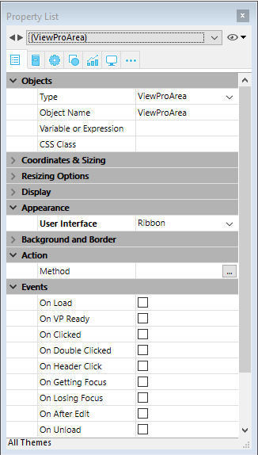

Les propriétés de la zone 4D View Pro peuvent être configurées à l'aide de la liste des propriétés. Les propriétés des feuilles de calcul sont disponibles à l'aide du langage.

## Propriétés de la zone de formulaire

En utilisant la liste des propriétés de la zone, vous pouvez définir des [propriétés de l'objet 4D View Pro](FormObjects/viewProArea_overview.md#supported-properties) comme **Nom de l'objet**, [**Variable ou Expression**](#4d-view-pro-form-object-variable), **Apparence**, **Action** et **Événements**.



### Sélection d'une interface utilisateur

Vous pouvez sélectionner l'interface à utiliser avec vos zones de formulaire 4D View Pro dans la **Liste de propriétés**, dans **Apparence** :


> Vous pouvez également utiliser les propriétés JSON [`userInterface`](FormObjects/properties_Appearance.md#user-interface) et [`withFormulaBar`](FormObjects/properties_Appearance.md#show-formula-bar) (uniquement avec l'interface "toolbar").

Les interfaces permettent d'effectuer des modifications de base et de manipuler des données. Les modifications définies par l'utilisateur sont enregistrées dans l'objet 4D View Pro lorsque l'utilisateur enregistre le document.

#### Ruban


#### Toolbar (Barre d’outils)

L'activation de l'interface de la barre d'outils affiche l'option [**Afficher la barre de formule**](FormObjects/properties_Appearance.md#show-formula-bar). Si la case de l'option est cochée, la barre de formule est visible en-dessous de l'interface Barre d'outils.

Lorsque la barre de formule est visible :


#### Fonctionnalités

Les interfaces de Ruban et de Barre d'outils regroupent les fonctionnalités qui s'y rattachent dans des onglets :

| Onglet     | Actions                             | Interface Ruban | Interface Barre d'outils |
| ---------- | ----------------------------------- | :-------------: | :----------------------: |
| File       | Gestion de fichiers                 |        X        |                          |
| Accueil    | Apparence du texte                  |        X        |             X            |
| Insérer    | Ajouter des éléments                |        X        |             X            |
| Formules   | Calculs de formules et bibliothèque |        X        |             X            |
| Data       | Gestion des données                 |        X        |             X            |
| Affichage  | Présentation visuelle               |        X        |             X            |
| Propriétés | Présentation de la feuille          |        X        |                          |

## Evénements formulaire

Les événements formulaire suivants sont disponibles dans la Liste de propriétés des zones 4D View Pro.

Certains de ces événements sont des événements formulaire standard (disponibles pour tous les objets actifs) et d'autres sont des événements formulaire spécifiques à 4D View Pro. Certains événements formulaire standard fournissent des informations étendues dans l'objet retourné par la commande [`FORM Event`](https://doc.4d.com/4dv19/help/command/en/page1606.html) lorsqu'ils sont générés pour les zones 4D View Pro. Le tableau suivant indique les événements standard et les événements spécifiques ou ceux qui fournissent des informations supplémentaires aux zones 4D View Pro :

| Événements 4D standard                          | Événements 4D View Pro spécifiques et étendus         |
| ----------------------------------------------- | ----------------------------------------------------- |
| [On Load](../Events/onLoad.md)                  | [On VP Ready](../Events/onVpReady.md)                 |
| [On Getting Focus](../Events/onGettingFocus.md) | [On Clicked](../Events/onClicked.md)                  |
| [On Losing Focus](../Events/onLosingFocus.md)   | [On Double Clicked](../Events/onDoubleClicked.md)     |
| [On Unload](../Events/onUnload.md)              | [On Header Click](../Events/onHeaderClick.md)         |
|                                                 | [On After Edit](../Events/onAfterEdit.md)             |
|                                                 | [On Selection Change](../Events/onSelectionChange.md) |
|                                                 | [On Column Resize](../Events/onColumnResize.md)       |
|                                                 | [On Row Resize](../Events/onRowResize.md)             |
|                                                 | [On VP Range Changed](../Events/onVpRangeChanged.md)  |

## Options feuille

L'objet options feuille 4D View Pro vous permet de contrôler plusieurs options pour vos zones 4D View Pro. Cet objet est géré par les commandes suivantes :

- [VP SET SHEET OPTIONS](commands/vp-set-sheet-options.md)
- [VP Get sheet options](commands/vp-get-sheet-options.md)

### Apparence de la feuille

| Propriété            |                        | Type        | Description                                                                                                                                                                                                                                                                                                                                    |
| -------------------- | ---------------------- | ----------- | ---------------------------------------------------------------------------------------------------------------------------------------------------------------------------------------------------------------------------------------------------------------------------------------------------------------------------------------------- |
| allowCellOverflow    |                        | boolean     | Indique si les données peuvent déborder sur des cellules vides adjacentes.                                                                                                                                                                                                                                                     |
| sheetTabColor        |                        | string      | Une chaîne couleur utilisée pour représenter la couleur de l'onglet de la feuille, telle que "red", "#FFFF00", "rgb(255,0,0)", "Accent 5", etc.                                                                                                                                                             |
| frozenlineColor      |                        | string      | Une chaîne couleur utilisée pour représenter la couleur de ligne figée, telle que "red", "#FFFF00", "rgb(255,0,0)", "Accent 5", etc.                                                                                                                                                                        |
| clipBoardOptions     |                        | entier long | L'option presse-papiers. Valeurs disponibles : `vk clipboard paste options all`, `vk clipboard paste options formatting`, `vk clipboard paste options formulas`, `vk clipboard paste options formulas and formatting`, `vk clipboard paste options values`, `vk clipboard paste options values and formatting` |
| gridline             |                        | object      | Les options du quadrillage.                                                                                                                                                                                                                                                                                                    |
|                      | color                  | string      | Une chaîne couleur utilisée pour représenter la couleur du quadrillage, telle que "red", "#FFFF00", "rgb(255,0,0)", "Accent 5", etc.                                                                                                                                                                        |
|                      | showVerticalGridline   | boolean     | Indique s'il affiche le quadrillage vertical.                                                                                                                                                                                                                                                                                  |
|                      | showHorizontalGridline | boolean     | Indique s'il affiche le quadrillage horizontal.                                                                                                                                                                                                                                                                                |
| rowHeaderVisible     |                        | boolean     | Indique si l'en-tête de la ligne est visible.                                                                                                                                                                                                                                                                                  |
| colHeaderVisible     |                        | boolean     | Indique si l'en-tête de la colonne est visible.                                                                                                                                                                                                                                                                                |
| rowHeaderAutoText    |                        | entier long | Indique si l'en-tête de la ligne affiche des lettres ou des chiffres ou s'il n'affiche rien. Valeurs disponibles : `vk header auto text blank`, `vk header auto text letters`, `vk header auto text numbers`                                                                                                   |
| colHeaderAutoText    |                        | entier long | Indique si l'en-tête de la colonne affiche des lettres ou des chiffres ou s'il n'affiche rien. Valeurs disponibles : `vk header auto text blank`, `vk header auto text letters`, `vk header auto text numbers`                                                                                                 |
| selectionBackColor   |                        | string      | La couleur d'arrière-plan de la sélection dans la feuille (de préférence au format Rgba).                                                                                                                                                                                                                   |
| selectionBorderColor |                        | string      | La couleur de bordure de la sélection dans la feuille.                                                                                                                                                                                                                                                                         |
| sheetAreaOffset      |                        | object      | Les options de sheetAreaOffset.                                                                                                                                                                                                                                                                                                |
|                      | left                   | entier long | Le décalage gauche de la feuille à partir de l'hôte.                                                                                                                                                                                                                                                                           |
|                      | top                    | entier long | Le décalage supérieur de la feuille à partir de l'hôte.                                                                                                                                                                                                                                                                        |

> Toutes les propriétés sont optionnelles.

### Protection de la feuille

Pour verrouiller l'intégralité de la feuille, il suffit de mettre la propriété _isProtected_ à **vrai**. Vous pouvez alors déverrouiller les cellules individuellement en définissant la propriété de style de la cellule [verrouillée](#layout).

| Propriété         |                          | Type    | Description                                                                                                                                                                           |
| ----------------- | ------------------------ | ------- | ------------------------------------------------------------------------------------------------------------------------------------------------------------------------------------- |
| isProtected       |                          | boolean | Indique si les cellules protégées de cette feuille peuvent être modifiées ou non.                                                                                     |
| protectionOptions |                          | object  | Une valeur qui indique les éléments que les utilisateurs peuvent modifier. Si null : le paramètre protectionOptions est réinitialisé. |
|                   | allowSelectLockedCells   | boolean | Indique si l'utilisateur peut sélectionner des cellules verrouillées, optionnel. Vrai par défaut.                                                     |
|                   | allowSelectUnlockedCells | boolean | Indique si l'utilisateur peut sélectionner des cellules non verrouillées, optionnel. Vrai par défaut.                                                 |
|                   | allowSort                | boolean | Indique si l'utilisateur peut trier des plages, optionnel. Faux par défaut.                                                                           |
|                   | allowFilter              | boolean | Indique si l'utilisateur peut filtrer des plages, optionnel. Faux par défaut.                                                                         |
|                   | allowEditObjects         | boolean | Indique si l'utilisateur peut modifier des objets flottants, optionnel. Faux par défaut.                                                              |
|                   | allowResizeRows          | boolean | Indique si l'utilisateur peut redimensionner des lignes, optionnel. Faux par défaut.                                                                  |
|                   | allowResizeColumns       | boolean | Indique si l'utilisateur peut redimensionner des colonnes, optionnel. Faux par défaut.                                                                |
|                   | boolean                  | boolean | Indique si l'utilisateur peut effectuer des opérations de glissement pour insérer des lignes, optionnel. Faux par défaut.                             |
|                   | allowDragInsertColumns   | boolean | Indique si l'utilisateur peut effectuer des opérations de glissement pour insérer des colonnes, optionnel. Faux par défaut.                           |
|                   | allowInsertRows          | boolean | Indique si l'utilisateur peut insérer des lignes, optionnel. Faux par défaut.                                                                         |
|                   | allowInsertColumns       | boolean | Indique si l'utilisateur peut insérer des colonnes, optionnel. Faux par défaut.                                                                       |
|                   | allowDeleteRows          | boolean | Indique si l'utilisateur peut supprimer des lignes, optionnel. Faux par défaut.                                                                       |
|                   | allowDeleteColumns       | boolean | Indique si l'utilisateur peut supprimer des colonnes, optionnel. Faux par défaut.                                                                     |

> Toutes les propriétés sont optionnelles.

## Format des cellules

La définition d'un modèle de format garantit que le contenu de vos documents 4D View Pro s'affiche comme souhaité. Les formats peuvent être définis à l'aide de l'[interface](#selecting-a-user-interface) 4D View Pro sélectionnée, ou à l'aide des commandes [VP SET VALUE](commands/vp-set-value.md) ou [VP SET NUM VALUE](commands/vp-set-num-value.md).

4D View Pro dispose de formats intégrés pour les chiffres, les dates, les heures et le texte, mais il vous est possible de créer vos propres modèles pour formater le contenu des cellules à l'aide de caractères et de codes spéciaux.

Par exemple, lors de l'utilisation des commandes [VP SET VALUE](commands/vp-set-value.md) ou [VP SET NUM VALUE](commands/vp-set-num-value.md) pour saisir des montants dans une facture, vous pouvez vouloir utiliser les symboles monétaires ($, €, ¥, etc.) pour être aligné quel que soit l'espace nécessaire par le numéro (c'est-à-dire que le montant soit de 5,00 $ ou 5 000,00 $). Vous pourriez utiliser des caractères de formatage et indiquer le motif _($\* #,##0.00_) qui afficherait les montants comme indiqué:


A noter que lorsque vous créez vos propres modèles, seul l'affichage des données est modifié. La valeur des données reste inchangée.

### Format texte et format numérique

Les formats numériques s'appliquent à tous les types de chiffres (ex : nombres positifs, négatifs, les zéros).

| Caractère                                                     | Description                                                                                                                                                                                                                                                                | Exemple                                                                                                                                                                                                                                                                                                                              |
| ------------------------------------------------------------- | -------------------------------------------------------------------------------------------------------------------------------------------------------------------------------------------------------------------------------------------------------------------------- | ------------------------------------------------------------------------------------------------------------------------------------------------------------------------------------------------------------------------------------------------------------------------------------------------------------------------------------ |
| 0                                                             | Placeholder that displays zeros.                                                                                                                                                                                                                           | #.00 affichera 1.10 au lieu de 1.1                                                                                                                                                                                                                                                   |
| .                                             | Displays a decimal point                                                                                                                                                                                                                                                   | 0.00 affichera 1999.00 au lieu de 1999                                                                                                                                                                                                                                                               |
| ,                                                             | Displays the thousands separator in a number. Thousands are separated by commas if the format contains a comma enclosed by number signs "#" or by zeros. A comma following a digit placeholder scales the number by 1,000. | #,0 affichera 12200000 au lieu de 12,200,000                                                                                                                                                                                                                                                                                         |
| \_                                      | Skips the width of the next character.                                                                                                                                                                                                                     | Usually used in combination with parentheses to add left and right indents, \_( and _) respectively.                                                                                                                                                   |
| @                                                | Formatter for text. Applies the format to all text in the cell                                                                                                                                                                                             | "\[Red]@" applies the red font color for text values.                                                                                                                                                                                              |
| \*                                                            | Repeats the next character to fill the column width.                                                                                                                                                                                                       | 0\*- will include enough dashes after a number to fill the cell, whereas \*0 before any format will include leading zeros.                                                                                                                                                                                           |
| " "                                                           | Displays the text within the quotes without interpreting it.                                                                                                                                                                                               | "8%" sera affiché comme suit : 8%                                                                                                                                                                                                                                                                                    |
| %                                                             | Displays numbers as a percentage of 100.                                                                                                                                                                                                                   | 8% sera affiché comme suit : .08                                                                                                                                                                                                                                                                     |
| \#                                                           | Digit placeholder that does not display extra zeros. If a number has more digits to the right of the decimal than there are placeholders, the number is rounded up.                                                                        | #.# affichera 1.5 au lieu de 1.54                                                                                                                                                                                                                                                    |
| ?                                                             | Digit placeholder that leaves space for extra zeros, but does not display them. Typically used to align numbers by decimal point.                                                                                                          | $?? displays a maximum of 2 decimals and causes dollar signs to line up for varying amounts.                                                                                                                                                                                                                         |
| \                                                            | Displays the character following it.                                                                                                                                                                                                                       | #.00\? affichera 123.00? au lieu de 123                                                                                                                                                                                                                                                             |
| /                                                             | When used with numbers, displays them as fractions. When used with text, date or time codes, displayed "as-is".                                                                                                                            | #/# affichera 3/4 au lieu de .75                                                                                                                                                                                                                                                                                     |
| \[ ]     | Creates conditional formats.                                                                                                                                                                                                                               | \[>100]\[GREEN]#,##0;\[`<=-100`]\[YELLOW]#,##0;\[BLUE]#,##0 |
| E                                                             | Scientific notation format.                                                                                                                                                                                                                                | #E+# - affichera 2E+6 au lieu de 1,500,500                                                                                                                                                                                                                                                                                           |
| \[color] | Formats the text or number in the color specified                                                                                                                                                                                                                          | \[Green]###.##\[Red]-###.###                                                                                                                                                               |

#### Exemple

```4d
//Définir la valeur de la cellule sur $125,571.35
VP SET VALUE(VP Cell("ViewProArea";3;2);New object("value";125571.35;"format";"_($* #,##0.00_)")
```

### Formats date et heure

4D View Pro fournit les constantes suivantes pour les modèles de date et heure au format ISO 8601 :

| Constante                                 | Valeur                               | Commentaire                                                                                                                                                                                                                           |
| ----------------------------------------- | ------------------------------------ | ------------------------------------------------------------------------------------------------------------------------------------------------------------------------------------------------------------------------------------- |
| `vk pattern full date time`               | "_fullDateTimePattern_"              | ISO 8601 format for the full date and time in current localization.USA default pattern: "dddd, dd MMMM yyyy HH:mm:ss"                                                 |
| `vk pattern long date`                    | "_longDatePattern_"                  | ISO 8601 format for the full date in current localization.USA default pattern: "dddd, dd MMMM yyyy"                                                                                                   |
| `vk pattern long time`                    | "_longTimePattern_"                  | ISO 8601 format for the time in current localization.USA default pattern: "HH:mm:ss"                                                                                  |
| `vk pattern month day`                    | "_monthDayPattern_"                  | ISO 8601 format for the month and day in current localization.USA default pattern: "MMMM dd"                                                                                                          |
| `vk pattern short date`                   | "_shortDatePattern_"                 | Abbreviated ISO 8601 format for the date in current localization.USA default pattern: "MM/dd/yyyy"                                                                                                    |
| `vk pattern short time`                   | "_shortTimePattern_"                 | Abbreviated ISO 8601 format for the time in current localization.USA default pattern: "HH:mm"                                                                                         |
| `vk pattern sortable date time`           | "_sortableDateTimePattern_"          | ISO 8601 format for the date and time in current localization which can be sorted.USA default pattern: "yyyy\'-\'MM\'-\'dd\'T\'HH\':\'mm\':\'ss"            |
| `vk pattern universal sortable date time` | "_universalSortableDateTimePattern_" | ISO 8601 format for the date and time in current localization using UTC which can be sorted.USA default pattern: "yyyy\'-\'MM\'-\'dd HH\':\'mm\':\'ss\'Z\'" |
| `vk pattern year month`                   | "_yearMonthPattern_"                 | ISO 8601 format for the month and year in current localization.USA default pattern: "yyyy MMMM"                                                                                                       |

#### Exemple

```4d
//Définir la valeur de la cellule sur une date et une heure spécifique
VP SET VALUE(VP Cell("ViewProArea";3;9);New object("value";!2024-12-18!);"time";?14:30:10?;"format";vk pattern full date time))
```

### Formats date et heure personnalisés

To create your own date and time patterns, in your current localization, you can use combinations of the following codes:

|      | Code<br/>(non sensible à la casse)      | Description                                                                                                         | Exemple                                                         |
| ---- | ---------------------------------------------------------- | ------------------------------------------------------------------------------------------------------------------- | --------------------------------------------------------------- |
| Date |                                                            |                                                                                                                     | (January 1, 2019)                            |
|      | m                                                          | Numéro du mois sans le premier zéro                                                                                 | 1                                                               |
|      | mm                                                         | Numéro du mois avec le zéro en préfixe                                                                              | 01                                                              |
|      | mmm                                                        | Nom du mois, court                                                                                                  | Jan                                                             |
|      | mmmm                                                       | Nom du mois, long                                                                                                   | January                                                         |
|      | d                                                          | Numéro du jour sans le zéro en préfixe                                                                              | 1                                                               |
|      | dd                                                         | Numéro du jour avec le zéro en préfixe                                                                              | 01                                                              |
|      | ddd                                                        | Jour de la semaine, court                                                                                           | Tue                                                             |
|      | dddd                                                       | Jour de la semaine, long                                                                                            | Tuesday                                                         |
|      | yy                                                         | Année, format court                                                                                                 | 19                                                              |
|      | yyyy                                                       | Année, long format                                                                                                  | 2019                                                            |
| Time |                                                            |                                                                                                                     | (2:03:05 PM) |
|      | h                                                          | Heure sans le zéro en préfixe. 0-23                                                                 | 2                                                               |
|      | hh                                                         | Heure avec le zéro en préfixe. 00-23                                                                | 02                                                              |
|      | m                                                          | Minutes sans le zéro en préfixe. 0-59                                                               | 3                                                               |
|      | mm                                                         | Minutes avec le zéro en préfixe. 00-59                                                              | 03                                                              |
|      | s                                                          | Secondes sans le zéro en préfixe. 0-59                                                              | 5                                                               |
|      | ss                                                         | Secondes avec le zéro en préfixe. 00-59                                                             | 05                                                              |
|      | \[h]  | Temps écoulé en heures                                                                                              | 14 (peut aller au delà de 24)                |
|      | \[mm] | Temps écoulé en minutes                                                                                             | 843                                                             |
|      | \[ss] | Temps écoulé en secondes                                                                                            | 50585                                                           |
|      | AM/PM                                                      | Périodes de la journée. S'il est omis, c'est le fomat de 24 heures qui est utilisé. | PM                                                              |

> The code 'm' is interpreted depending on its position in the pattern. If it's immediately after 'h' or 'hh' or immediately before 's' or 'ss', it will be interpreted as minutes, otherwise it will be interpreted as months.

### Symboles supplémentaires

In addition to the special characters and codes described in the previous sections, there are additional characters and symbols that can be used in your format patterns. These additional characters and symbols do not require a \ or "" and do not impact the interpretation of the format pattern. They appear "as-is" within the pattern.

| Caractère              | Description                                                                                        | Exemple                                      |
| ---------------------- | -------------------------------------------------------------------------------------------------- | -------------------------------------------- |
| + et -                 | Plus and minus signs                                                                               | ### + ### = ###,##\#                         |
| ( ) | Left and right parenthesis                                                                         | (-###.##) |
| :      | Colon                                                                                              | hh:mm:ss     |
| ^                      | Caret                                                                                              | #\^#                                        |
| '                      | Apostrophe                                                                                         | '######                                      |
| { }                    | Curly brackets                                                                                     | {###,###,###}                                |
| `< >`                  | Less-than and greater than signs                                                                   | ## >#\#                                      |
| =                      | Equal sign                                                                                         | #+#=##                                       |
| /                      | Forward slash. When used with numbers, displays them as fractions. | mm/dd/yyyy                                   |
| !                      | Exclamation point                                                                                  | $###.00!                     |
| &  | Ampersand                                                                                          | "Hello" & "Welcome"      |
| ~      | Tilde                                                                                              | ~##                          |
|                        | Space character                                                                                    |                                              |
| €                      | Euro                                                                                               | €###.00                      |
| £                      | British Pound                                                                                      | £###.00                      |
| ¥                      | Japanese Yen                                                                                       | ¥###.00                      |
| $                      | Dollar sign                                                                                        | $###.00                      |
| ¢                      | Cent sign                                                                                          | .00¢                         |

## Attributs d'impression

4D View Pro print attributes allow you to control all aspects of printing 4D View Pro areas. These attributes are handled by the following commands:

- [VP SET PRINT INFO](commands/vp-set-print-info.md)
- [VP Get print info](commands/vp-get-print-info.md)

### Colonnes / Lignes

Les attributs de ligne et de colonne sont utilisés pour identifier le début, la fin et la répétition des lignes et colonnes.

| Propriété         | Type        | Description                                                                                                                                   |
| ----------------- | ----------- | --------------------------------------------------------------------------------------------------------------------------------------------- |
| columnEnd         | entier long | The last column to print in a cell range. Default value = -1 (all columns)                                 |
| columnStart       | entier long | The first column to print in a cell range. Default value = -1 (all columns)                                |
| repeatColumnEnd   | entier long | The last column of a range of columns to print on the left of each page. Default value = -1 (all columns)  |
| repeatColumnStart | entier long | The first column of a range of columns to print on the left of each page. Default value = -1 (all columns) |
| repeatRowEnd      | entier long | The last row of a range of rows to print on the top of each page. Default value = -1 (all rows)            |
| repeatRowStart    | entier long | The first row of a range of rows to print at the top of each page. Default value = -1 (all rows)           |
| rowEnd            | entier long | The last row to print in a cell range. Default value = -1 (all rows)                                       |
| rowStart          | entier long | The first row to print in a cell range. Default value = -1 (all rows)                                      |

### Headers / Footers

Header and footer attributes are used to specify text or images in the left, right, and center header/footer sections.

| Propriété         | Type              | Description                                                                |
| ----------------- | ----------------- | -------------------------------------------------------------------------- |
| footerCenter      | text              | The text and format of the center footer on printed pages. |
| footerCenterImage | picture \| text\* | The image for the center section of the footer.            |
| footerLeft        | text              | The text and format of the left footer on printed pages.   |
| footerLeftImage   | picture \| text\* | The image for the left section of the footer.              |
| footerRight       | text              | The text and format of the right footer on printed pages.  |
| footerRightImage  | picture \| text\* | The image for the right section of the footer.             |
| headerCenter      | text              | The text and format of the center header on printed pages. |
| headerCenterImage | picture \| text\* | The image for the center section of the header.            |
| headerLeft        | text              | The text and format of the left header on printed pages.   |
| headerLeftImage   | picture \| text\* | The image for the left section of the header.              |
| headerRight       | text              | The text and format of the right header on printed pages.  |
| headerRightImage  | picture \| text\* | The image for the right section of the header.             |

\* If using text type, pass the filepath (absolute or relative) of the image. If you pass a relative path, the file should be located next to the database structure file. In Windows, the file extension must be indicated. Peu importe le type utilisé pour définir une image, l'image elle-même (pas une référence) est stockée dans la zone 4D View Pro et est retournée par [VP Get print info](commands/vp-get-print-info.md).

### Caractères spéciaux

The following special characters allow the automatic addition or formatting of information in the header and footer when the 4D View Pro area is printed.

| Caractère             | Description                                         | Exemple                                                                                                                                               | Résultat                                                        |   |
| --------------------- | --------------------------------------------------- | ----------------------------------------------------------------------------------------------------------------------------------------------------- | --------------------------------------------------------------- | - |
| & | Escape character                                    | (see examples below)                                                                                                               |                                                                 |   |
| P                     | Current page                                        | printInfo.headerLeft:="This is page &P."                                          | This is page 5.                                 |   |
| N                     | Page count                                          | printInfo.headerLeft:="There are &N pages."                                       | There are 10 pages.                             |   |
| D                     | Current date (yyyy/mm/dd format) | printInfo.headerLeft:="It is &D."                                                 | It is 2015/6/19.                                |   |
| T                     | Heure courante                                      | printInfo.headerLeft:="It is &T."                                                 | It is 16:30:36. |   |
| G                     | Image                                               | printInfo.headerLeftImage:=smiley<br/>printInfo.headerLeft:="&G"  |             |   |
| S                     | Strikethrough                                       | printInfo.headerLeft:="&SThis is text."                                           | ~~This is text.~~                               |   |
| U                     | Souligné                                            | printInfo.headerLeft:="&UThis is text."                                           | This is text. (Underlined)   |   |
| B                     | Souligné                                            | printInfo.headerLeft:="&BThis is text."                                           | **This is text.**                               |   |
| I                     | Italique                                            | printInfo.headerLeft:="&IThis is text."                                           | _This is text._                                 |   |
| "                     | Font prefix                                         | printInfo.headerLeft:="&\"Lucida Console\"&14This is text." |             |   |
| K                     | Text Color prefix                                   | printInfo.headerLeft:="&KFF0000This is text."                                     | This is text (in red).       |   |
| F                     | Workbook name                                       | printInfo.headerLeft:="&F"                                                                        | 2019 Monthly Revenue Forecasts                                  |   |
| A                     | Spreadsheet name                                    | printInfo.headerLeft:="&A"                                                                        | June 2019 revenue forecast                                      |   |

### Margins

Margin attributes are used to specify the 4D View Pro area margins for printing. Expressed in hundreds of an inch.

| Propriété |        | Type        | Description                                                                 |
| --------- | ------ | ----------- | --------------------------------------------------------------------------- |
| margin    |        | object      | The print margins                                                           |
|           | top    | entier long | Top margin, in hundredths of an inch. Default value = 75    |
|           | bottom | entier long | Bottom margin, in hundredths of an inch. Default value = 75 |
|           | left   | entier long | Left margin, in hundredths of an inch. Default value = 70   |
|           | right  | entier long | Right margin, in hundredths of an inch. Default value = 70  |
|           | header | entier long | Header offset, in hundredths of an inch. Default value = 30 |
|           | footer | entier long | Footer offset, in hundredths of an inch. Default value = 30 |

### Orientation

Orientation attributes are used to specify the direction the printed page layout.

> This attribute defines rendering information only.

| Propriété   | Type        | Description                                                                                                                                                                         |
| ----------- | ----------- | ----------------------------------------------------------------------------------------------------------------------------------------------------------------------------------- |
| orientation | entier long | Page orientation. Valeurs disponibles : `vk print page orientation landscape`, `vk print page orientation portrait` (par défaut) |

### Page

Page attributes are used to specify general document print settings.

| Propriété       | Type        | Description                                                                                                                                                                                                                                                           |
| --------------- | ----------- | --------------------------------------------------------------------------------------------------------------------------------------------------------------------------------------------------------------------------------------------------------------------- |
| blackAndWhite   | boolean     | Printing in black and white only. <p>Valeur par défaut = false</p><p>**Note**: Les PDF ne sont pas affectés par cet attribut. Les couleurs en PDF restent.</p>                                        |
| centering       | entier long | How the contents are centered on the printed page. Valeurs disponibles : `vk print centering both`, `vk print centering horizontal`, `vk print centering none` (par défaut), `vk print centering vertical`         |
| firstPageNumber | entier long | The page number to print on the first page.Default value = 1                                                                                                                                                                                          |
| pageOrder       | entier long | The order pages are printed. Valeurs disponibles : `vk print page order auto` (par défaut), `vk print page order down then over`, `vk print page order over then down`.                            |
| pageRange       | text        | The range of pages for printing                                                                                                                                                                                                                                       |
| qualityFactor   | entier long | The quality factor for printing (1 - 8).  Plus le facteur de qualité est élevé, meilleure est la qualité d'impression, cependant les performances d'impression peuvent être affectées.<p>Valeur par défaut = 2</p> |
| useMax          | boolean     | Seules les colonnes et les lignes avec des données sont imprimées.<p>Valeur par défaut = true</p>                                                                                                                                                     |
| zoomFactor      | réel        | Le montant de l'agrandissement ou de la réduction de la page imprimée.<p>Valeur par défaut = 1</p>                                                                                                                                                    |

### Paper Size

Paper size attributes are used to specify the dimensions or model of paper to use for printing. There are two ways to define paper size:

- Custom size - height and width attributes
- Standard size - kind attribute

| Propriété |        | Type        | Description                                                                                                                                                                      |
| --------- | ------ | ----------- | -------------------------------------------------------------------------------------------------------------------------------------------------------------------------------- |
| paperSize |        | object      | Paper dimensions (height, width) or specific format (kind) for printing.                                                   |
|           | height | entier long | Height of the paper, in hundredths of an inch.                                                                                                                   |
|           | width  | entier long | Width of the paper, in hundredths of an inch.                                                                                                                    |
|           | kind   | text        | Nom du format de papier standard (par exemple, A2, A4, legal, etc.) retourné par `Get Print Option`. Default value = "letter" |

- Si le format du papier est spécifié en utilisant les propriétés `height` et `width`, [`VP Get print info`](./commands/vp-get-print-info.md) retourne un format de papier avec `custom` comme valeur pour `kind`.

- Si vous définissez le format du papier à l'aide de la propriété `kind`, vous pouvez utiliser l'une ou l'autre :
  - un des formats dans la [liste des formats SpreadJS](https://developer.mescius.com/spreadjs/api/enums/GC.Spread.Sheets.Print.PaperKind)
  - un des formats retournés par la commande [`PRINT OPTION VALUES`](https://doc.4d.com/4dv19/help/command/fr/page785.html).
    Dans ce cas, [`VP Get print info`](./commands/vp-get-print-info.md) retourne le format correspondant avec la hauteur et la largeur.

### Graduation

Scale attributes are used to specify printing optimization and adjustments.

| Propriété      | Type        | Description                                                                                                                                     |
| -------------- | ----------- | ----------------------------------------------------------------------------------------------------------------------------------------------- |
| bestFitColumns | boolean     | Column width is adjusted to fit the largest text width for printing. Default value = "false"                                    |
| bestFitRows    | boolean     | Row height is adjusted to fit the tallest text height for printing. Default value = "false"                                     |
| fitPagesTall   | entier long | The number of vertical pages (portrait orientation) to check when optimizing printing. Default value = -1    |
| fitPagesWide   | entier long | The number of horizontal pages (landscape orientation) to check when optimizing printing. Default value = -1 |

### Show / Hide

Show / Hide attributes are used to specify the visibility (printing) of 4D View Pro area elements.

| Propriété        | Type        | Description                                                                                                                                                                                                                                |
| ---------------- | ----------- | ------------------------------------------------------------------------------------------------------------------------------------------------------------------------------------------------------------------------------------------ |
| showBorder       | boolean     | Prints the outline border.Default value = "true"                                                                                                                                                                           |
| showColumnHeader | entier long | Column header print settings. Valeurs disponibles : `vk print visibility hide`, `vk print visibility inherit` (par défaut), `vk print visibility show`, `vk print visibility show once` |
| showGridLine     | boolean     | Prints the gridlines. Default value = "false"                                                                                                                                                                              |
| showRowHeader    | entier long | Row headers print settings. Valeurs disponibles : `vk print visibility hide`, `vk print visibility inherit` (par défaut), `vk print visibility show`, `vk print visibility show once`   |

### Watermark

Watermark attributes are used to superimpose text or an image onto the 4D View Pro area.

| Propriété |                                                                                    | Type              | Description                                                                                                                                                                                                                                                                               |
| --------- | ---------------------------------------------------------------------------------- | ----------------- | ----------------------------------------------------------------------------------------------------------------------------------------------------------------------------------------------------------------------------------------------------------------------------------------- |
| watermark |                                                                                    | collection        | Collection of watermark settings.  Default value: undefined                                                                                                                                                                                               |
|           | \[ ].height   | entier long       | The height of the watermark text / image.                                                                                                                                                                                                                                 |
|           | \[ ].imageSrc | picture \| text\* | The watermark text / image.                                                                                                                                                                                                                                               |
|           | \[ ].page     | text              | The page(s) where the watermark is printed. For all pages: "all". For specific pages: page numbers or page ranges separated by commas. Ex.: "1,3,5-12" |
|           | \[ ].width    | entier long       | The width of the watermark text / image.                                                                                                                                                                                                                                  |
|           | \[ ].x        | entier long       | The horizontal coordinate of the top left point of the watermark text / image.                                                                                                                                                                                            |
|           | \[ ].y        | entier long       | The vertical coordinate of the top left point of the watermark text / image.                                                                                                                                                                                              |

\* If using text type, pass the filepath (absolute or relative) of the image. If you pass a relative path, the file should be located next to the database structure file. In Windows, the file extension must be indicated. Peu importe le type utilisé pour définir une image, l'image elle-même (pas une référence) est stockée dans la zone 4D View Pro et est retournée par [VP Get print info](commands/vp-get-print-info.md).

## Style Objects

4D View Pro style objects and style sheets allow you to control the graphical aspects and the look of your 4D View Pro documents.

### Objets de style et feuilles de style

Style objects contain the style settings. They can be used either in a style sheet or on their own. Style objects can also be used in addition to a style sheet so that different settings can be specified for individual cell ranges without affecting the rest of the document. Vous pouvez utiliser les objets de style directement avec les commandes [VP SET CELL STYLE](commands/vp-set-cell-style.md) et [VP SET DEFAULT STYLE](commands/vp-set-default-style.md). Vous pouvez également utiliser des objets de style lors de la définition de thèmes de tableau personnalisés à l'aide des commandes [VP SET TABLE THEME](commands/vp-set-table-theme.md) ou [VP CREATE TABLE](commands/vp-create-table.md).

Une **feuille de style** regroupe une combinaison de propriétés dans un objet de style pour spécifier l'apparence de toutes les cellules de vos documents 4D View Pro. Style sheets saved with the document can be used to set the properties for a single sheet, multiple sheets, or an entire workbook. When created, a 4D View Pro style sheet is given a name which is saved within the style sheet in the "name" property. This allows a style sheet to be easily used and, if thoughtfully selected, can facilitate its identification and purpose (e.g., Letterhead\_internal, Letterhead_external).

Les feuilles de style sont créées avec la commande [VP ADD STYLESHEET](commands/vp-add-stylesheet.md) et appliquées avec les commandes [VP SET DEFAULT STYLE](commands/vp-set-default-style.md) ou [VP SET CELL STYLE](commands/vp-set-cell-style.md). Vous pouvez supprimer une feuille de style avec la commande [VP REMOVE STYLESHEET](commands/vp-remove-stylesheet.md).

La commande [VP Get stylesheet](commands/vp-get-stylesheet.md) peut être utilisée pour retourner l'objet style d'une feuille de style unique ou vous pouvez utiliser la commande [VP Get stylesheets](commands/vp-get-stylesheets.md) pour récupérer une collection d'objets style pour plusieurs feuilles de style.

### Style object properties

Voici un exemple :

```4d
 $style:=New object
 $style.hAlign:=vk horizontal align left
 $style.font:="12pt papyrus"
 $style.backColor:="#E6E6FA" //couleur violet clair
 
 VP SET DEFAULT STYLE("myDoc";$style)
```

#### Arrière-plan & Premier plan

| Propriété             | Type          | Description                                                  | Valeurs possibles                                                                                                                                                                                                                                                                                                                                                                                                                                                                                               |
| --------------------- | ------------- | ------------------------------------------------------------ | --------------------------------------------------------------------------------------------------------------------------------------------------------------------------------------------------------------------------------------------------------------------------------------------------------------------------------------------------------------------------------------------------------------------------------------------------------------------------------------------------------------- |
| backColor             | text          | Defines the color of the background.         | CSS color "#rrggbb" syntax (preferred syntax), CSS color "rgb(r,g,b)" syntax (alternate syntax), CSS color name (alternate syntax)                                                                                                                                                                                                                                                                                                  |
| backgroundImage       | picture, text | Specifies a background image.                | Can be specified directly or via the image path (full path or file name only). If the file name only is used, the file must be located next to the database structure file. No matter how set (picture or text), a picture is saved with the document. This could impact the size of a document if the image is large. Note for Windows: File extension must be included. |
| backgroundImageLayout | entier long   | Defines the layout for the background image. | `vk image layout center`, `vk image layout none`, `vk image layout stretch`, `vk image layout zoom`                                                                                                                                                                                                                                                                                                                                                                                                             |
| foreColor             | text          | Defines the color of the foreground.         | CSS color "#rrggbb" syntax (preferred syntax), CSS color "rgb(r,g,b)" syntax (alternate syntax), CSS color name (alternate syntax)                                                                                                                                                                                                                                                                                                  |

#### Bordures

| Propriété                                                                  |       | Type        | Description                                                                                                                    | Valeurs possibles                                                                                                                                                                                                                                                                                                                                                |
| -------------------------------------------------------------------------- | ----- | ----------- | ------------------------------------------------------------------------------------------------------------------------------ | ---------------------------------------------------------------------------------------------------------------------------------------------------------------------------------------------------------------------------------------------------------------------------------------------------------------------------------------------------------------- |
| borderBottom, borderLeft, borderRight, borderTop, diagonalDown, diagonalUp |       | object      | Defines the corresponding border line                                                                                          |                                                                                                                                                                                                                                                                                                                                                                  |
|                                                                            | color | text        | Defines the color of the border. Default = black.                                              | CSS color "#rrggbb" syntax (preferred syntax), CSS color "rgb(r,g,b)" syntax (alternate syntax), CSS color name (alternate syntax)                                                                                                                                                   |
|                                                                            | style | entier long | Defines the style of the border. Default = empty. Cannot be null or undefined. | `vk line style dash dot`, `vk line style dash dot dot`, `vk line style dashed`, `vk line style dotted`, `vk line style double`, `vk line style empty`, `vk line style hair`, `vk line style medium`, `vk line style medium dash dot`, `vk line style medium dash dot dot`,`vk line style medium dashed`, `vk line style slanted dash dot`, `vk line style thick` |

#### Polices et texte

| Propriété       |            | Type        | Description                                                                                                                                                                                                                                                                                                                                                                                                                                                                                             | Valeurs possibles                                                                                                                                                                                                                                                       |
| --------------- | ---------- | ----------- | ------------------------------------------------------------------------------------------------------------------------------------------------------------------------------------------------------------------------------------------------------------------------------------------------------------------------------------------------------------------------------------------------------------------------------------------------------------------------------------------------------- | ----------------------------------------------------------------------------------------------------------------------------------------------------------------------------------------------------------------------------------------------------------------------- |
| font            |            | text        | Specifies the font characteristics in CSS font shorthand ("font-style font-variant font-weight font-size/line-height font-family"). Example: "14pt Century Gothic". The font-size and font-family values are mandatory. If one of the other values is missing, their default values are used. Note: If a font name contains a space, the name must be within quotes. | A CSS font shorthand. 4D fournit des commandes utilitaires pour gérer les caractéristiques des polices en tant qu'objets : [`VP Font to object`](commands/vp-font-to-object.md) et [`VP Object to font`](commands/vp-object-to-font.md) |
| formatter       |            | text        | Modèle pour la propriété value/time.                                                                                                                                                                                                                                                                                                                                                                                                                                                    | Number/text/date/time formats, special characters. Voir [Format des cellules](#cell-format).                                                                                                                                            |
| isVerticalText  |            | boolean     | Specifies text direction.                                                                                                                                                                                                                                                                                                                                                                                                                                                               | True = vertical text, False = horizontal text.                                                                                                                                                                                                          |
| labelOptions    |            | object      | Defines cell label options (watermark options).                                                                                                                                                                                                                                                                                                                                                                                                                      |                                                                                                                                                                                                                                                                         |
|                 | alignment  | entier long | Specifies the position of the cell label. Optional property.                                                                                                                                                                                                                                                                                                                                                                                                            | `vk label alignment top left`, `vk label alignment bottom left`, `vk label alignment top center`, `vk label alignment bottom center`, `vk label alignment top right`, `vk label alignment bottom right`                                                                 |
|                 | visibility | entier long | Specifies the visibility of the cell label. Optional property.                                                                                                                                                                                                                                                                                                                                                                                                          | `vk label visibility auto`, `vk label visibility hidden`, `vk label visibility visible`                                                                                                                                                                                 |
|                 | foreColor  | text        | Defines the color of the foreground. Optional property.                                                                                                                                                                                                                                                                                                                                                                                                                 | CSS color "#rrggbb" syntax (preferred syntax), CSS color "rgb(r,g,b)" syntax (alternate syntax), CSS color name (alternate syntax)                                                          |
|                 | font       | text        | Specifies the font characteristics with CSS font shorthand ("font-style font-variant font-weight font-size/line-height font-family"). The font-size and font-family values are mandatory.                                                                                                                                                                                                                                                            |                                                                                                                                                                                                                                                                         |
| textDecoration  |            | entier long | Specifies the decoration added to text.                                                                                                                                                                                                                                                                                                                                                                                                                                                 | `vk text decoration double underline`, `vk text decoration line through`, `vk text decoration none`, `vk text decoration overline`, `vk text decoration underline`                                                                                                      |
| textIndent      |            | entier long | Defines the unit of text indention. 1 = 8 pixels                                                                                                                                                                                                                                                                                                                                                                                                                                        |                                                                                                                                                                                                                                                                         |
| textOrientation |            | entier long | Defines the rotation angle of the text in a cell. Number between -90 and 90                                                                                                                                                                                                                                                                                                                                                                                                             |                                                                                                                                                                                                                                                                         |
| watermark       |            | text        | Defines the watermark (cell label) content                                                                                                                                                                                                                                                                                                                                                                                                                                           |                                                                                                                                                                                                                                                                         |
| wordWrap        |            | boolean     | Specifies if text should be wrapped.                                                                                                                                                                                                                                                                                                                                                                                                                                                    | True = wrapped text, False = unwrapped text                                                                                                                                                                                                                             |

#### Affichage

| Propriété   | Type        | Description                                                                                                                                                                                                                                      | Valeurs possibles                                                                                                    |
| ----------- | ----------- | ------------------------------------------------------------------------------------------------------------------------------------------------------------------------------------------------------------------------------------------------ | -------------------------------------------------------------------------------------------------------------------- |
| cellPadding | text        | Defines the cell padding                                                                                                                                                                                                                         |                                                                                                                      |
| hAlign      | entier long | Defines the horizontal alignment of cell contents.                                                                                                                                                                               | `vk horizontal align center`, `vk horizontal align general`, `vk horizontal align left`, `vk horizontal align right` |
| locked      | boolean     | Specifies cell protection status. Notez que ce n'est disponible que si [protection de la feuille](#protection de la feuille) est activée. | True = locked, False = unlocked.                                                                     |
| shrinkToFit | boolean     | Specifies if the contents of the cell should be reduced.                                                                                                                                                                         | True = reduced content, False = no reduction.                                                        |
| tabStop     | boolean     | Specifies if the focus to the cell can be set using the Tab key.                                                                                                                                                                 | True = Tab key sets focus, False = Tab key does not set focus.                                       |
| vAlign      | entier long | Specifies the vertical alignment of cell contents.                                                                                                                                                                               | `vk vertical align bottom`, `vk vertical align center`, `vk vertical align top`                                      |

#### Style information

| Propriété  | Type | Description                                                                                                                                                                                                                                                                                                                                      |
| ---------- | ---- | ------------------------------------------------------------------------------------------------------------------------------------------------------------------------------------------------------------------------------------------------------------------------------------------------------------------------------------------------ |
| name       | text | Defines the name of the style                                                                                                                                                                                                                                                                                                                    |
| parentName | text | Specifies the style that the current style is based on. Values from the parent style will be applied, then any values from the current style are applied. Changes made in the current style will not be refelected in the parent style. Only available when using a style sheet. |

## Objet 4D View Pro

Le 4D View Pro [object](Concepts/dt_object.md) stocke l'ensemble du contenu du tableau. It is automatically handled by 4D View Pro. Vous pouvez configurer ou obtenir cet objet en utilisant les commandes [VP IMPORT FROM OBJECT](commands/vp-import-from-object.md) ou [VP Export to object](commands/vp-export-to-object.md).

Il contient les propriétés suivantes :

| Propriété    | Value type | Description                                  |
| ------------ | ---------- | -------------------------------------------- |
| version      | Integer    | Internal component version                   |
| dateCreation | Timestamp  | Creation date                                |
| dateModified | Timestamp  | Last modification date                       |
| meta         | Object     | Free contents, reserved for the 4D developer |
| spreadJS     | Object     | Reserved for the 4D View Pro component       |

## 4D View Pro Form Object Variable

La variable d'objet du formulaire 4D View Pro est la variable [object](Concepts/dt_object.md) associée à la zone de formulaire 4D View Pro. It manages information used by the 4D View Pro object.

> The 4D View Pro form object variable is for information purposes only (i.e., debugging). Under no circumstances should it be modified.

Il contient les propriétés suivantes :

| Propriété                              | Value type | Description                                                                                                                                                                                                                                                                                                                                                                                                         |
| -------------------------------------- | ---------- | ------------------------------------------------------------------------------------------------------------------------------------------------------------------------------------------------------------------------------------------------------------------------------------------------------------------------------------------------------------------------------------------------------------------- |
| ViewPro.area           | Text       | Nom de la zone 4D View Pro                                                                                                                                                                                                                                                                                                                                                                                          |
| ViewPro.callbacks      | Object     | Stores temporary information necessary for commands requiring callbacks such as importing and exporting.                                                                                                                                                                                                                                                                                            |
| ViewPro.commandBuffers | Collection | Stocke séquentiellement les commandes appelées par la méthode et les exécute en lot (plutôt que individuellement) lors de la sortie de la méthode, lorsque une commande renvoie une valeur, ou lorsque la commande [VP FLUSH COMMANDS](commands/vp-flush-commands.md) est appelée. This mechanism increases performance by reducing the number of requests sent. |
| ViewPro.events         | Object     | Liste des [événements](#form-events).                                                                                                                                                                                                                                                                                                                                                               |
| ViewPro.formulaBar     | Boolean    | Indicates whether or not the formula bar is displayed. Available only for the "toolbar" interface.                                                                                                                                                                                                                                                                                  |
| ViewPro.inited         | Boolean    | Indique si la zone 4D View Pro a été initialisée ou non (voir l'événement [On VP Ready](Events/onVpReady.md)).                                                                                                                                                                                                                                                                   |
| ViewPro.interface      | Text       | Specifies the type of user interface:"ribbon", "toolbar", "none".                                                                                                                                                                                                                                                                                                                   |
