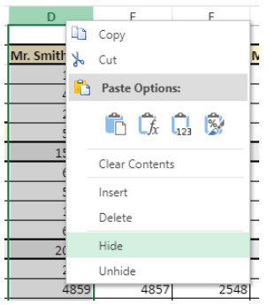

4D View Pro is a [4D component](Concepts/components.md) that includes a [4D form area](FormObjects/viewProArea_overview.md) and specific [commands](commands.md). Il vous permet d'intégrer des fonctionnalités avancées de tableur dans vos projets.


Une tableur est une application contenant une grille de cellules dans lesquelles vous pouvez saisir des informations, effectuer des calculs ou afficher des images. 4D View Pro is powered by the [SpreadJS spreadsheet solution](https://developer.mescius.com/spreadjs) integrated in 4D.

L'intégration de zones 4D View Pro dans vos formulaires vous permet d'importer et d'exporter des documents de type tableur à l'aide des commandes 4D View Pro.

## Installation et activation

Les fonctionnalités de 4D View Pro sont directement inclues dans 4D, ce qui en facilite le déploiement et la gestion. Aucune installation supplémentaire n'est nécessaire.

Cependant, 4D View Pro nécessite une licence. Vous devez activer cette licence dans votre application afin d'utiliser ses fonctionnalités. Lorsque vous utilisez ce composant sans licence, le contenu d'un objet nécessitant une fonctionnalité 4D View Pro ne s'affiche pas au moment de l'exécution; au lieu de cela, un message d'erreur :


## Insertion d'une zone 4D View Pro

4D View Pro documents are displayed and edited manually in a [4D form object](FormObjects/viewProArea_overview.md) named 4D View Pro. Pour sélectionner cet objet, cliquez sur le dernier outil de la barre d'objets :


You can also select a preconfigured 4D View Pro area in the [Object library](FormEditor/objectLibrary.md).

> 4D View Pro areas can also be [created and used offscreen](commands/vp-run-offscreen-area.md).

You can [configure the area](configuring.md) using the Property List and 4D View Pro commands.

## Fondamentaux de la sélection, de la saisie et de la navigation

Les feuilles de calcul sont composées de lignes et de colonnes. Un numéro est associé à chaque ligne. Une lettre (ou un groupe de lettres lorsque le nombre de colonnes est supérieur au nombre de lettres de l'alphabet) est associée à chaque colonne. L'intersection d'une ligne et d'une colonne constitue une cellule. Les cellules peuvent être sélectionnées et leur contenu modifié.

### Sélection des cellules, des colonnes et des lignes

- Pour sélectionner une cellule, il suffit de cliquer dessus ou d'utiliser les flèches de direction du clavier. Son contenu (ou sa formule) s'affiche dans la cellule.

- Pour sélectionner plusieurs cellules continues, faites glisser la souris d'une extrémité à l'autre de la sélection. Vous pouvez également cliquer sur les deux extrémités de la sélection tout en maintenant la touche Maj enfoncée.

- To select all cells in the spreadsheet, click on the cell at the top left of the area:
  

- Pour sélectionner une colonne, cliquez sur la lettre (ou le groupe de lettres) correspondant(e).

- Pour sélectionner une ligne, cliquez sur le chiffre correspondant.

- To select a group of cells that are not continuous, hold down the **Ctrl** key (Windows) or **Command** key (Mac) and click on each cell to be selected.

- Pour désélectionner des cellules, il suffit de cliquer n'importe où dans la feuille de calcul.

### Saisie de données

Un double-clic sur une cellule permet de passer en mode saisie dans la cellule concernée. Si la cellule n'est pas vide, le curseur d'insertion se place après le contenu de la cellule.


Les données peuvent être saisies directement lorsqu'une cellule est déjà sélectionnée, même si le curseur d'insertion n'est pas visible. The input then replaces the content of the cell.

The **Tab** key validates the cell input and selects the cell to its right. Combining the **Shift + Tab** keys validates the cell input and selects the cell to its left.

The **Carriage return** key validates the cell input and selects the cell below it. Combining the **Shift + Carriage return** keys validates the cell input and selects the cell above it.

Les touches de direction (flèches) permettent de déplacer une cellule dans la direction indiquée par la flèche.

### Utilisation du menu contextuel

Les zones 4D View Pro bénéficient d'un menu contextuel automatique qui offre des fonctions d'édition standard telles que le copier-coller, mais aussi des fonctions de base de tableur :



> Les fonctions Copier/Couper et Coller du menu contextuel fonctionnent uniquement dans la zone de la feuille de calcul, elles n'ont pas accès au presse-papiers du système. System shortcuts such as **Ctrl+c/Ctrl+v** works however and can be used to exchange data between the area and other applications.

En fonction de la zone cliquée, les options suivantes sont également disponibles :

- click on a column or row header: **Insert**, **Delete**, **Hide**, or **Unhide** the contents
- cliquez sur une cellule ou une plage de cellules :
  - **Filter**: allows hiding row through filters (see "Filtering rows" in the [SpreadJS documentation](https://developer.mescius.com/spreadjs/docs/)).
  - **Sort**: sorts the column contents.
  - **Insert Comment**: allows user to enter a comment for an area. When a comment has been entered for an area, the top left cell of the area displays a small red triangle:\
    

## Using 4D View Pro commands

4D View Pro commands can be used in the 4D Code Editor, just like 4D language commands.

Since 4D View Pro is a built-in 4D component, you can access its list of commands from the Explorer, in the **Component Methods** section:


For a detailed list, see [Commands](commands.md).

### Traiter une zone 4D View Pro

Une zone 4D View Pro gère plusieurs objets et éléments.


Most of 4D View Pro commands require a _vpAreaName_ parameter, which is the [**4D View Pro form area name**](FormObjects/viewProArea_overview.md) (4D form object). This name is the [object name](FormObjects/properties_Object.md#object-name) property.

Par exemple, si vous souhaitez définir le nombre total de colonnes d'une zone nommée "myVpArea", saisissez le code suivant :

```4d
VP SET COLUMN COUNT("myVpArea";5)
```

> When loading a 4D View Pro object in a form area, 4D generates the [On VP Ready](../Events/onVpReady.md) form event once the whole area is loaded. Vous devez exécuter tout code 4D View Pro manipulant la zone dans cet événement, sinon une erreur est retournée.

### Utilisation d'objets de plage

Some 4D View Pro commands require a _rangeObj_ parameter. Dans 4D View Pro, une plage est un objet qui fait référence à une zone dans une feuille de calcul. Cette zone peut être composée d'une ou plusieurs cellules. Using 4D View Pro commands, you can create ranges and pass them to other commands to read from or write to specific locations in your document.

Par exemple, pour créer un objet plage pour les cellules suivantes :


You can use the [VP Cells](commands/vp-cells.md) method:

```4d
var $myRange : Object
$myRange:=VP Cells("ViewProArea";2;4;2;3) // C5 to D7
```

You can then pass `$myRange` to another 4D View Pro method to modify these cells (for example add a border to the set of cells with [VP SET BORDER](commands/vp-set-border.md)).

Les objets plage 4D View Pro sont composés de plusieurs propriétés :

- area - Le nom de la zone 4D View Pro
- ranges - Une collection d'objet(s) plage. Les propriétés disponibles dans chaque objet de gamme dépendent du type d'objet plage. For example, a column range object will only include the _.column_ and _.sheet_ properties.

| Propriété |                                                                                       | Type       | Description                                                                                                                      | Disponible pour                                                |
| --------- | ------------------------------------------------------------------------------------- | ---------- | -------------------------------------------------------------------------------------------------------------------------------- | -------------------------------------------------------------- |
| area      |                                                                                       | text       | Nom d'objet formulaire zone 4D View Pro                                                                                          | toujours disponible                                            |
| ranges    |                                                                                       | collection | Collection de plage(s)                                                                                        | toujours disponible                                            |
|           | \[ ].name        | text       | Nom de plage                                                                                                                     | name                                                           |
|           | \[ ].sheet       | number     | Indice de la feuille (par défaut, indice de la feuille courante) (le comptage démarre à 0) | cellule, cellules, ligne, lignes, colonne, colonnes, tout, nom |
|           | \[ ].row         | number     | Indice de la ligne (le comptage démarre à 0)                                                                  | cellule, cellules, ligne, lignes                               |
|           | \[ ].rowCount    | number     | Row count                                                                                                                        | cellule, lignes                                                |
|           | \[ ].column      | number     | Indice de la colonne (le comptage démarre à 0)                                                                | cellule, cellules, colonne, colonnes                           |
|           | \[ ].columnCount | number     | Column count                                                                                                                     | cellules, colonnes                                             |

## Import et export de documents

4D View Pro prend en charge l'import et l'export de plusieurs formats de documents :

- .4vp
- .xlsx
- .txt et .csv
- .sjs
- .pdf (à des fins d'export uniquement)

For more details, check out the description of [VP IMPORT DOCUMENT](commands/vp-import-document.md) and [VP EXPORT DOCUMENT](commands/vp-export-document.md).
