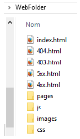

4D Web Server vous permet de personnaliser les pages d'erreur HTTP envoyées aux clients, en fonction du code d'état de la réponse du serveur. Les pages d'erreur font référence à :

- les codes d'état commençant par 4 (erreurs du client), par exemple 404

- les codes d'état commençant par 5 (erreurs du serveur), par exemple 501.

Pour une description complète des codes d'état d'erreur HTTP, vous pouvez vous reporter à la [liste des codes d'état HTTP](https://en.wikipedia.org/wiki/List_of_HTTP_status_codes) (Wikipedia).

## Remplacement des pages par défaut

Pour remplacer les pages d'erreur par défaut de 4D Web Server par vos propres pages, il vous suffit de :

- placer des pages HTML personnalisées au premier niveau du dossier web de l'application,

- name the custom pages "\{statusCode\}.html" (for example, "404.html").

Vous pouvez définir une page d'erreur par code d'état et/ou une page d'erreur générique pour une série d'erreurs, nommée "{number}xx.html". Par exemple, vous pouvez créer "4xx.html" pour les erreurs génériques du client. The 4D Web Server will first look for a \{statusCode\}.html page then, if it does not exist, a generic page.

Par exemple, lorsqu'une réponse HTTP retourne un code d'état 404 :

1. 4D Web Server essaie d'envoyer une page "404.html" située dans le dossier web de l'application.

2. Si elle n'est pas trouvée, 4D Web Server essaie d'envoyer une page "4xx.html" située dans le dossier Web de l'application.

3. Si elle n'est pas trouvée, 4D Web Server utilise alors sa page d'erreur par défaut.

## Exemple

Si vous définissez les pages personnalisées suivantes dans votre dossier web :

- les pages "403.html" ou "404.html" seront servies lorsque des réponses HTTP 403 ou 404 sont retournées respectivement,

- la page "4xx.html" sera servie pour tout autre état d'erreur 4xx (400, 401, etc.),

- la page "5xx.html" sera servie pour tout état d'erreur 5xx.
