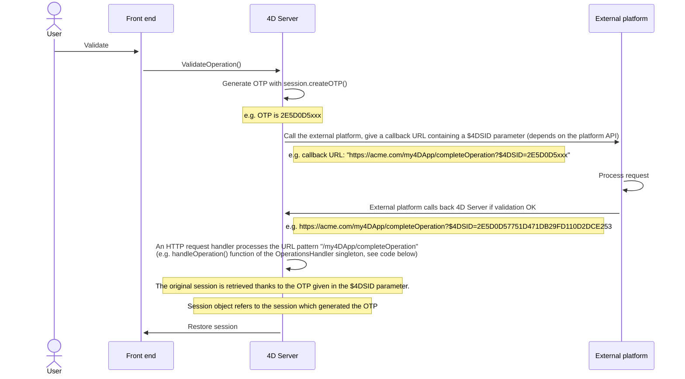
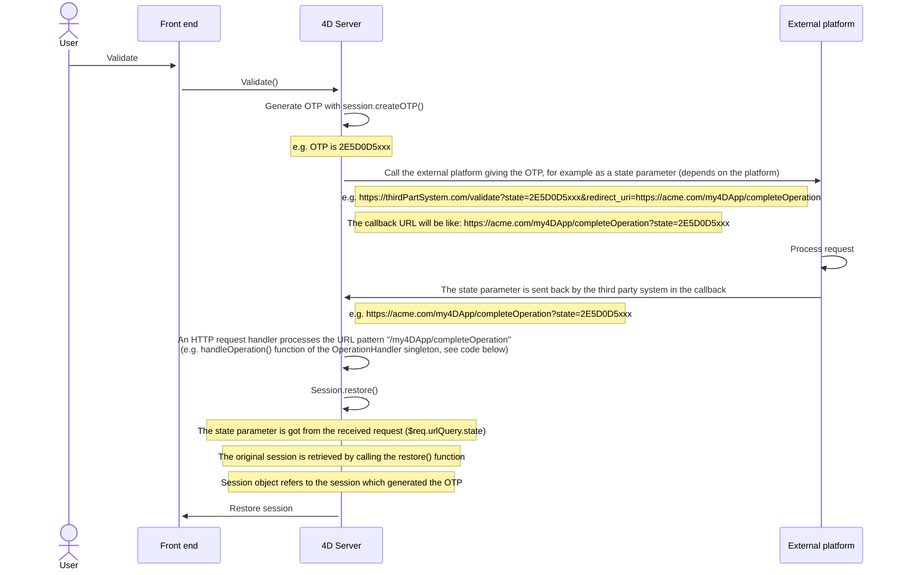

Le serveur Web de 4D offre des fonctions intégrées pour la gestion des **sessions Web**. La création et la maintenance de sessions Web vous permettent de contrôler et d'améliorer l'expérience utilisateur de votre application web. Lorsque les sessions web sont activées, les clients web peuvent réutiliser le même contexte de serveur d'une requête à une autre.

Les sessions Web permettent de :

- gérer simultanément plusieurs requêtes depuis le même client web via un nombre illimité de process préemptifs (les sessions web sont **évolutives**),
- gérer la session à travers un objet `Session` et une [API de session](API/SessionClass.md),
- stocker et partager des données entre les process d'un client web en utilisant le [.storage](../API/SessionClass.md#storage) de la session,
- associer des privilèges à l'utilisateur qui exécute la session.

## Utilisations

Les sessions Web sont utilisées par :

- les [applications web](gettingStarted.md) qui envoient des requêtes http,
- les appels à l'[API REST](../REST/authUsers.md), qui sont effectués par les [datastores distants](../ORDA/remoteDatastores.md) et les [pages Qodly](qodly-studio.md).

## Activation des sessions web

La gestion de session peut être activée et désactivée sur votre serveur Web 4D. Il y a différentes façons d'activer la gestion de session :

- Using the **Scalable sessions** OTPion on the "Web/OTPions (I)" page of the Settings (permanent setting):
  

This OTPion is selected by default in new projects. It can however be disabled by selecting the **No sessions** OTPion, in which case the web session features are disabled (no `Session` object is available).

- En utilisant la propriété [`.scalableSession`](API/WebServerClass.md#scalablession) de l'objet Web Server (à passer dans le paramètre *settings* de la fonction [`.start()`](API/WebServerClass.md#start) ). In this case, this setting overrides the OTPion defined in the Settings dialog box for the Web Server object (it is not stored on disk).

> The [`WEB SET OTPION`](../commands-legacy/web-set-option.md) command can also set the session mode for the main Web server.

Dans tous les cas, ce paramètre est local à la machine ; il peut donc être différent sur le serveur Web 4D Server et les serveurs Web des machines 4D distantes.

> **Compatibility**: A **Legacy sessions** OTPion is available in projects created with a 4D version prior to 4D v18 R6 (for more information, please refer to the [doc.4d.com](https://doc.4d.com) web site).

## Implémentation des sessions

When [sessions are enabled](#enabling-web-sessions), automatic mechanisms are implemented, based upon a private cookie set by 4D itself: "4DSID__AppName_", where *AppName* is the name of the application project. Ce cookie référence la session web courante pour l'application.

:::info

Le nom du cookie peut être obtenu en utilisant la propriété [`.sessionCookieName`](API/WebServerClass.md#sessioncookiename).

:::

1. Dans chaque requête de client web, le serveur Web vérifie la présence et la valeur du cookie privé "4DSID__AppName_".

2. Si le cookie a une valeur, 4D recherche la session qui a créé ce cookie parmi les sessions existantes ; si cette session est trouvée, elle est réutilisée pour l'appel.

3. Si la requête du client ne correspond pas à une session déjà ouverte :

- une nouvelle session avec un cookie privé "4DSID__AppName_" est créée sur le serveur web
- un nouvel objet `Session` Guest est créé et est dédié à la session web évolutive.

:::note

La création d'une session web pour une requête REST peut nécessiter qu'une licence soit disponible, consultez [cette page](../REST/authUsers.md).

:::

The `Session` object of the current session can then be accessed through the [`Session`](commands/session.md) command in the code of any web processes.


:::info

Les process Web ne se terminent généralement pas, ils sont recyclés dans un pool pour des raisons d'optimisation. Lorsqu'un process termine l'exécution d'une requête, il est replacé dans le pool et rendu disponible pour la requête suivante. Puisqu'un process web peut être réutilisé par n'importe quelle session, les [variables process](Concepts/variables.md#process-variables) doivent être effacées par votre code à la fin de son exécution (en utilisant [`CLEAR VARIABLE`](https://doc.4d.com/4dv20/help/command/fe/page89.html) par exemple). Ce nettoyage est nécessaire pour toute information liée au process, comme une référence à un fichier ouvert. C'est la raison pour laquelle **il est recommandé** d'utiliser l'objet [Session](API/SessionClass.md) lorsque vous souhaitez conserver les informations relatives à la session.

:::

## Stockage et partage des informations de session

Chaque objet `Session` fournit une propriété [`.storage`](API/SessionClass.md#storage) qui est un [objet partagé](Concepts/shared.md). Cette propriété vous permet de partager des informations entre tous les process gérés par la session.

## Durée de vie des sessions

Une session web évolutive est fermée lorsque:

- le serveur web est arrêté,
- le délai d'attente du cookie de session a été atteint.

La durée de vie d'un cookie inactif est de 60 minutes par défaut, ce qui signifie que le serveur Web fermera automatiquement les sessions inactives après 60 minutes.

This timeout can be set using the [`.idleTimeout`](API/SessionClass.md#idletimeout) property of the `Session` object (the timeout cannot be less than 60 minutes) or the *connectionInfo* parameter of the [`Open datastore`](../commands/open-datastore.md) command.

When a web session is closed, if the [`Session`](commands/session.md) command is called afterwards:

- l'objet `Session` ne contient pas de privilèges (c'est une session Guest)
- la propriété [`storage`](API/SessionClass.md#storage) est vide
- un nouveau cookie de session est associé à la session

:::info

Vous pouvez fermer une session à partir d'une page Qodly en utilisant la fonction [**logout**](qodly-studio.md#logout).

:::

## Privilèges

Les privilèges sont associés aux sessions utilisateur web. Sur le serveur web, vous pouvez fournir un accès spécifique ou des fonctionnalités en fonction des privilèges de la session.

Vous assignez des privilèges en utilisant la [fonction `.setPrivileges()`](API/SessionClass.md#setprivileges). Dans votre code, vous pouvez vérifier les privilèges de la session pour autoriser ou refuser l'accès à l'aide de la fonction [`.hasPrivilege()`](API/SessionClass.md#hasprivilege). Par défaut, les nouvelles sessions n'ont aucun privilège : ce sont des sessions **Guest** (la fonction [`isGuest()`](API/SessionClass.md#isguest) retourne true).

Voici un exemple :

```4d
If (Session.hasPrivilege("WebAdmin"))
	//Accès autorisé, on ne fait rien
Else
	//Afficher une page d'authentification
End if
```

:::info

Les privilèges sont implémentés au cœur de l'architecture ORDA, fournissant aux développeurs une technologie puissante pour contrôler l'accès aux fonctions du datastore et des dataclass. Pour plus d'informations, veuillez vous reporter à la section [**Privilèges**](../ORDA/privileges.md).

:::

## Exemple

Dans une application CRM, chaque commercial gère son propre portefeuille de clients. Le datastore contient au moins deux dataclass liées : Customers et SalesPersons (un commercial a plusieurs clients).


Nous voulons qu'un(e) commercial(e) s'authentifie, ouvre une session sur le serveur web et que les 3 meilleurs clients soient chargés dans la session.

1. Nous exécutons cette URL pour ouvrir une session :

```
http://localhost:8044/authenticate.shtml
```

> Dans un environnement de production, il est nécessaire d'utiliser une [connexion HTTPS](API/WebServerClass.md#httpsenabled) pour éviter la circulation d'informations non chiffrées sur le réseau.

2. La page `authenticate.shtml` est un formulaire contenant des champs de saisie *userId* et *password* et envoie une action POST 4DACTION :

```html
<!DOCTYPE html>
<html>
<body bgcolor="#ffffff">
<FORM ACTION="/4DACTION/authenticate" METHOD=POST>
	UserId: <INPUT TYPE=TEXT NAME=userId VALUE=""><br/>
	Password: <INPUT TYPE=TEXT NAME=password VALUE=""><br/>
<INPUT TYPE=SUBMIT NAME=OK VALUE="Log In">
</FORM>
</body>
</html>
```


3. La méthode de projet d'authentification recherche la personne *userID* et valide le mot de passe par rapport à la valeur hachée déjà stockée dans la table *SalesPersons* :

```4d
var $indexUserId; $indexPassword; $userId : Integer
var $password : Text
var $userTop3; $sales; $info : Object


ARRAY TEXT($anames; 0)
ARRAY TEXT($avalues; 0)

WEB GET VARIABLES($anames; $avalues)

$indexUserId:=Find in array($anames; "userId")
$userId:=Num($avalues{$indexUserId})

$indexPassword:=Find in array($anames; "password")
$password:=$avalues{$indexPassword}

$sales:=ds.SalesPersons.query("userId = :1"; $userId).first()

If ($sales#Null)
    If (Verify password hash($password; $sales.password))
        $info:=New object()
        $info.userName:=$sales.firstname+" "+$sales.lastname
        Session.setPrivileges($info)
        Use (Session.storage)
            If (Session.storage.myTop3=Null)
                $userTop3:=$sales.customers.orderBy("totalPurchase desc").slice(0; 3)

                Session.storage.myTop3:=$userTop3
            End if
        End use
        WEB SEND HTTP REDIRECT("/authenticationOK.shtml")
    Else
        WEB SEND TEXT("This password is wrong")
    End if
Else
    WEB SEND TEXT("This userId is unknown")
End if
```

:::note

For more examples, please refer to the [Scalable sessions for advanced web applications](https://blog.4d.com/scalable-sessions-for-advanced-web-applications/) bog post.

:::

## Session Token (OTP)

The 4D web server allows you to generate, share, and use OTP (One-Time Passcode) session tokens. OTP session tokens are used to secure communications with third-party applications or websites. For information on OTP, please refer to the [One-time password page](https://en.wikipedia.org/wiki/One-time_password) on Wikipedia.

In 4D, OTP session tokens are useful when calling external URLs and being called back in another browser or device (mobile/computer). Typically, a third-party application sends a confirmation email containing a callback link on which the user has to click. The callback link includes the OTP token, so that the session which triggered the callback is loaded along with its data and privileges. This principle allows you to share the same session on multiple devices. Thanks to this architecture, the [session cookie](#session-implementation) is not exposed on the network, which eliminates the risk of man-in-the-middle attack.

### Vue d’ensemble

The basic sequence of an OTP session token use in a 4D web application is the following:

1. The web user initiates an action that requires a secured third-party connection, for example a validation, from within a specific session.
2. In your 4D code, you create a new OTP for the session using the [`Session.createOTP()`](../API/SessionClass.md#createotp) function.
3. You send a request to the third-party application with the session token included in the callback Uri. Note that the way to provide the callback Uri to a third-party application depends on its API (see below).
4. The third-party application sends back a request to 4D with the pattern you provided in the callback Uri.
5. The request callback is processed in your application.

By definition, an OTP token can only be used once. In this scenario, if a web request is received with a session token as parameter that has already been used, the initial session is not restored.

### Processing the OTP in the callback

Callbacks from third-party applications that include the OTP token can be processed in different ways in your 4D application, depending on your development and the third-party API. Basically, you have two possibilities to handle the token: through the **`$4DSID`** parameter for an automatic processing, or through a custom parameter that you need to process.

#### Using `$4DSID` in the URL

Using the `$4DSID` parameter is the most simple way to process a callback from the third-party application:

- The OTP token is provided as a parameter directly in the callback url using the standard `?$4DSID=XXXX123` syntax.
- In 4D, you implement a dedicated [HTTP Request handler](http-request-handler.md) in your 4D application using [`IncomingMessage`](../API/IncomingMessageClass.md) and [`OutgoingMessage`](../API/OutgoingMessageClass.md) classes.
- If the `$4DSID` token is valid, the related web user session is **automatically restored** in any web process with its storage and privileges.

:::note

A [`4DACTION`](./httpRequests.md#4daction) url can also be used on the 4D side.

:::

#### Using a custom parameter

The OTP token can also be provided as a custom parameter that you need to process specifically to restore the session. You must use this solution if:

- the third-party application does not allow to insert parameters such as a `$4DSID` directly in the redirect Uri, and provides a dedicated API (the implementation depends on the third-party application),
- or, you want to call an ORDA function through REST to process the callback, in which case you need to pass the OTP with the [REST parameter syntax](../REST/ClassFunctions.md#parameters) (e.g. `?$params='["XXX123"]'`).

In both cases, you need to extract the token from the custom parameter and to call the [`Session.restore()`](../API/SessionClass.md#restore) function with the token as parameter.

#### Processing a invalid OTP

The OTP token is considered invalid if:

- the session token has already been used,
- the session token has expired,
- the session token does not exist,
- the original session itself has expired.

In this case, no web user session is restored and the current session (if any) is left unchanged. Usually, you can decide to display a login page or to open a guest session.

Verifying if the received OTP token is valid depends on how it was handled:

- If you used a `$4DSID`, you can store a custom status property in the [session storage](../API/SessionClass.md#storage) at the moment of the token creation, and check this status once the OTP token was received to see if it is the same value (see example).
- If you used the [`Session.restore()`](../API/SessionClass.md#restore) function, it returns true if the session correctly restored.

### Scenario with $4DSID

The scenario using the `$4DSID` key is illustrated in the following diagram:



The 4D HTTP request handler definition:

```json
[
  {
    "class": "OperationsHandler",
    "method": "handleOperation",
    "regexPattern": "/my4DApp/completeOperation",
    "verbs": "get"
  }
]
```

The singleton class:

```4d
//Class OperationsHandler
shared singleton Class constructor()
    function handleOperation($request : 4D.IncomingMessage) 
    $session:=Session
```

### Scenario with `restore` function

The scenario using a custom parameter is illustrated in the following diagram:



The 4D HTTP request handler definition:

```json
[
  {
    "class": "OperationsHandler",
    "method": "handleOperation",
    "regexPattern": "/my4DApp/completeOperation",
    "verbs": "get"
  }
]
```

The singleton class:

```4d
//Class OperationsHandler
shared singleton Class constructor()
    Function handleOperation($req : 4D.IncomingMessage) : 4D.OutgoingMessage
    Session.restore($req.urlQuery.state)
```

### Example of email validation with $4DSID

1. A user account is created in a *Users* dataclass. A *$info* object is received with the email and password. An OTP corresponding to the current session is generated. An URL is then returned with this OTP given in the $4DSID parameter.

```4d
//cs.Users class

Function create($info : Object) : Text
	
var $user : cs.UsersEntity
var $status : Object
var $token : Text
	
$user:=This.new() //create a new user
$user.fromObject($info)
$status:=$user.save()
	
//Store information in the session
//including user creation status
Use (Session.storage)
	Session.storage.status:=New shared object("step"; "Waiting for validation email"; /
    "email"; $user.email; "ID"; $user.ID)
End use 
	
//Generate an OTP corresponding to the session
$token:=Session.createOTP()

// Return an URL with a $4DSID parameter
return "https://my.server.com/tools/validateEmail?$4DSID="+$token`

```

2. The user is sent this URL as a link in an email. The URL prefix `/validateEmail` is handled by a [custom HTTP request handler](./http-request-handler.md):

```json
[
  {
    "class": "RequestHandler",
    "method": "validateEmail",
    "regexPattern": "/validateEmail",
    "verbs": "get"
  }
]
```

The *validateEmail()* function of the RequestHandler singleton:

```4d
//validateEmail class

shared singleton Class constructor()

Function validateEmail() : 4D.OutgoingMessage
	
 var $result:=4D.OutgoingMessage.new()
    //The session which generated the OTP is retrieved 
    //thanks to the $4DSID parameter given in the URL
 If (Session.storage.status.step="Waiting for validation email")
	
  $user:=ds.Users.get(Session.storage.status.ID)
  $user.emailValidated() //set to true
		
  $result.setBody("Congratulations <br>"\
  +"Your email "+Session.storage.status.email+" has been validated")
		
  $result.setHeader("Content-Type"; "text/html"	
  Use (Session.storage.status)
	Session.storage.status.step:="Email validated"
  End use
 Else
  $result.setBody("Invalid token")

 End if 
	
 return $result

```

Since the `$4DSID` parameter contains a valid OTP corresponding to the original session, the `Session` object refers to the session that created the OTP.

A new user is created, and some information is stored in the session, especially the current step of the user account creation process (Waiting for validation email) and the user ID.

### Supported contexts

- Both HTTP and HTTPS schemas are supported.
- Only [scalable sessions](#enabling-web-sessions) can be reused with tokens.
- Only sessions of the host database can be reused (sessions created in component web servers cannot be restored).
- Tokens are not supported with client/server sessions or single-user sessions.

### Lifespan

A session token has a lifespan, and the session itself has a lifespan. The session token lifespan can be set [at the token creation](../API/SessionClass.md#createotp). By default, the token lifespan is the same value as the [`.idleTimeout`](../API/SessionClass.md#idletimeout) value.

A session is only restored by a token if both the session token lifespan and the session lifespan have not expired. In other cases (the session token has expired and/or the session itself has expired), a guest session is created when a web request with a session token is received.

:::note

For more information, please refer to the [Connect Your Web Apps to Third-Party Systems](https://blog.4d.com/connect-your-web-apps-to-third-party-systems/) blog post.

:::
