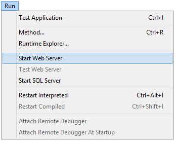

4D offre plusieurs outils intégrés permettant de démarrer, arrêter ou administrer le serveur web intégré.

## Démarrer le Serveur Web 4D

> Une licence 4D Web Application est requise pour pouvoir lancer le serveur web de 4D ou 4D Server. For more information, please refer to the [4D Web site](https://www.4d.com).

Un projet 4D peut démarrer et surveiller un serveur Web pour l'application principale (hôte) ainsi que chaque composant hébergé.

Il y a plusieurs manières de démarrer le serveur Web principal :

- via un bouton/une commande de menu :
  - 4D: **Run\>Start Web Server** menu 
  - 4D Server: **Start HTTP server** button of the HTTP Server page 

- automatiquement à l'ouverture de l'application 4D. To do this, display the **Web\/Configuration** page of the Settings and select the **Launch Web Server at Startup** check box: 

- Programmatically, by calling the [`webServer.start()`](API/WebServerClass.md#start) function or `WEB START SERVER` command.

The web server of any component can be launched by calling the [`webServer.start()`](API/WebServerClass.md#start) function on the component's web server object.

> Il n'est pas nécessaire de relancer l'application 4D pour démarrer ou arrêter le serveur Web.

## Arrêter le Serveur Web 4D

Il y a plusieurs manières d'arrêter le serveur Web principal :

- Using the **Run\>Stop Web Server** menu of 4D or the **Stop HTTP server** button of the HTTP Server page of 4D Server (both items show **Start...** when the server is not already started).

- Programmatically, by calling the [`webServer.stop()`](API/WebServerClass.md#stop) function or `WEB STOP SERVER` command.

The web server of any component can be stopped by calling the `webServer.stop()` function on the component's web server object.

## Tester le Serveur Web 4D

The **Test Web Server** command can be used to make sure the built-in web server is functioning correctly (4D only). This command is accessible in the **Run** menu when the web server is launched:

Lorsque vous sélectionnez cette commande, la page d'accueil du site Web publié par l'application 4D s'affiche dans une fenêtre de votre navigateur par défaut :

Cette commande vous permet de vérifier que le serveur web, l'affichage de la page d'accueil, etc. fonctionnent correctement. The page is called using the _localhost_ URL, which is the standard shortcut designating the IP address of the machine on which the web browser is executed. The command takes into account the [TCP publication port](#http-port) number specified in the settings.

## Vider le cache

À tout moment, vous pouvez vider le cache des pages et des images qu'il contient (si, par exemple, vous avez modifié une page statique et que vous souhaitez la recharger dans le cache).

Pour ce faire, vous pouvez :

- 4D: click on the **Clear Cache** button in the [Web/Options (I) page](../settings/web.md) of the Settings dialog box.
- 4D Server: click on the **Clear Cache** button in the HTTP page of the 4D Server Administration window.

Le cache est alors immédiatement effacé.

> You can also use the [/4DCACHECLEAR](#cacheclear) URL.

## Explorateur d'exécution

The **Watch** page (**Web** heading) in the Runtime Explorer displays web server information, particularly:

- **Web Cache Usage**: indicates the number of pages present in the web cache as well as its use percentage. Cette information n'est disponible que si le serveur web est actif et que la taille du cache est supérieure à 0.

- **Web Server Elapsed Time**: indicates the duration of use (in hours:minutes:seconds format) of the Web server. Ces informations ne sont disponibles que si le serveur web est actif.

- **Web Hits Count**: indicates the total number of HTTP requests received since the web server boot, as well as an instantaneous number of requests per second (measure taken between two Runtime Explorer updates). Ces informations ne sont disponibles que si le serveur web est actif.

## URLs d'administration

Les URL d'administration Web vous permettent de contrôler le site web publié sur votre serveur. 4D Web Server accepts four particular URLs: _/4DSTATS_, _/4DHTMLSTATS_, /_4DCACHECLEAR_ and _/4DWEBTEST_.

> _/4DSTATS_, _/4DHTMLSTATS_ and _/4DCACHECLEAR_ are only available to the Designer and Administrator of the database. Si le système de mot de passe 4D n'a pas été activé, ces URL sont disponibles pour tous les utilisateurs. /4DWEBTEST est toujours disponible.

### /4DSTATS

The **/4DSTATS** URL returns several items of information in an HTML table (displayable in a browser):

| Élément                | Description                                                                  |
| ---------------------- | ---------------------------------------------------------------------------- |
| Cache Current Size     | Taille actuelle du cache du serveur web (en octets)       |
| Cache Max Size         | Taille maximale du cache (en octets)                      |
| Cached Object Max Size | Taille maximale de chaque objet dans le cache (en octets) |
| Cache Use              | Pourcentage de cache utilisé                                                 |
| Cached Objects         | Number of objects found in the cache, **including pictures**                 |

Ces informations peuvent vous permettre de vérifier le fonctionnement de votre serveur et éventuellement d'adapter les paramètres correspondants.

> The `WEB GET STATISTICS` command allows you to also obtain information about how the cache is being used for static pages.

### /4DHTMLSTATS

The _/4DHTMLSTATS_ URL returns, also as an HTML table, the same information as the _/4DSTATS_ URL. The difference is that the **Cached Objects** field only counts HTML pages (without counting picture files). Moreover, this URL returns the **Filtered Objects** field.

| Élément                | Description                                                                      |
| ---------------------- | -------------------------------------------------------------------------------- |
| Cache Current Size     | Taille actuelle du cache du serveur web (en octets)           |
| Cache Max Size         | Taille maximale du cache (en octets)                          |
| Cached Object Max Size | Taille maximale de chaque objet dans le cache (en octets)     |
| Cache Use              | Pourcentage de cache utilisé                                                     |
| Cached Objects         | Number of objects found in the cache, **without pictures**                       |
| Filtered Objects       | Nombre d'objets dans le cache non pris en compte par l'URL, notamment les images |

### /4DCACHECLEAR

The _/4DCACHECLEAR_ URL immediately clears the cache of the static pages and images. Il vous permet donc de "forcer" la mise à jour des pages qui ont été modifiées.

### /4DWEBTEST

The _/4DWEBTEST_ URL is designed to check the web server status. Lorsque cette URL est appelée, 4D renvoie un fichier texte avec les champs HTTP suivants remplis :

| Champ HTTP | Description                                        | Exemple                                                                                                                                                                                                                                                                                                                                            |
| ---------- | -------------------------------------------------- | -------------------------------------------------------------------------------------------------------------------------------------------------------------------------------------------------------------------------------------------------------------------------------------------------------------------------------------------------- |
| Date       | date courante au format RFC 822 format             | Mon, 7 Dec 2020 13:12:50 GMT                                                                                                                                                                                                                                                                                       |
| Server     | 4D/numéro de version                               | 4D/18.5.0 (Build 18R5.257368)                                                                                                                                                                                                                                                   |
| User-Agent | nom et version @ adresse IP du client | Mozilla/5.0 (Windows NT 10.0; Win64; x64) AppleWebKit/537.36 (KHTML, like Gecko) Chrome/86.0.4240.183 Safari/537.36 @ 127.0.0.1 |

## Logs

4D vous permet de générer deux historiques de requêtes Web :

- a debug log, useful in the web server development phase (_HTTPDebugLog.txt_),
- a standardized web request log, rather used for statistic purposes (_logweb.txt_).

Both log files are automatically created in the **Logs** folder of the application project.

### HTTPDebugLog.txt

The [http debug file](webServerConfig.md#debug-log) can be enabled using the [`web server` object](webServerObject.md) or the `WEB SET OPTION` command.

Ce fichier journal enregistre chaque requête HTTP et chaque réponse en mode brut (raw). Les requêtes sont enregistrées dans leur totalité (en-têtes compris). Les parties body peuvent également être enregistrées.

Les champs suivants sont enregistrés pour Requête et Réponse :

| Noms des champs | Description                                                                          |
| --------------- | ------------------------------------------------------------------------------------ |
| SocketID        | ID du socket utilisé pour la communication                                           |
| PeerIP          | Adresse IPv4 de l'hôte (client)                                   |
| PeerPort        | Port utilisé par l'hôte (client)                                  |
| TimeStamp       | Horodatage en millisecondes (depuis le démarrage du système)      |
| ConnectionID    | Connexion UUID (UUID du VTCPSocket utilisé pour la communication) |
| SequenceNumber  | Numéro d'opération séquentiel et unique dans la session de log                       |

### logweb.txt

The [web log recording file](webServerConfig.md#log-recording) can be enabled using the [`web server` object](webServerObject.md), the `WEB SET OPTION` command, or the **Web/Log (type)** page of the settings. Vous devez sélectionner un format d'historique.

#### CLF/DLF

Each line of the file represents a request, such as:
_host rfc931 user \[DD/MMM/YYYY:HH:MM:SS] "request" state length_
Each field is separated by a space and each line ends by the CR/LF sequence (character 13, character 10).

Le format DLF (Distilled Log Format) est similaire au format CLF (Common Log format) et utilise exactement la même structure. Il ajoute simplement deux champs HTTP supplémentaires à la fin de chaque requête : Referer et User-agent. Voici la description des formats CLF/DLF (non personnalisables) :

| Noms des champs                                                      | Description                                                                                                                                                                                                                                                                                                                                                                       |
| -------------------------------------------------------------------- | --------------------------------------------------------------------------------------------------------------------------------------------------------------------------------------------------------------------------------------------------------------------------------------------------------------------------------------------------------------------------------- |
| host                                                                 | Adresse IP du client (ex. 192.100.100.10)                                                                                                                                                                                                                                                      |
| rfc931                                                               | information non générée par 4D, c'est toujours - (le signe moins)                                                                                                                                                                                                                                                                                              |
| user                                                                 | le nom d'utilisateur tel qu'il est authentifié, ou bien - (le signe moins). Si le nom de l’utilisateur contient des espaces, ils sont remplacés par des _ (tiret bas).                                                                                                                 |
| DD/MMM/YYYY:HH:MM:SS | DD : jour, MMM : abréviation de 3 lettres pour le nom du mois (Jan, Feb,...), YYYY : année, HH : heure, MM : minutes, SS : secondes. La date et heure sont locales au serveur. |
| request                                                              | requête envoyée par le client (ex. GET /index.htm HTTP/1.0)                                                                                                                                                                                                                                                    |
| state                                                                | réponse donnée par le serveur                                                                                                                                                                                                                                                                                                                                                     |
| length                                                               | taille des données retournées (HTTP header exclu) ou 0                                                                                                                                                                                                                                                                                                         |
| Referer                                                              | DLF uniquement. Contient l'URL de la page qui pointe vers le document de la requête.                                                                                                                                                                                                                                                              |
| User-agent                                                           | DLF uniquement - Contient le nom et la version du navigateur ou du logiciel du client à l'origine de la demande                                                                                                                                                                                                                                                                   |

#### ELW/WLF

Le format ELF (Extended Log Format) est très répandu dans le monde des navigateurs HTTP. Il peut être utilisé pour construire des historiques sophistiqués qui répondent à des besoins spécifiques. Pour cette raison, le format ELF peut être personnalisé : il est possible de choisir les champs à enregistrer ainsi que leur ordre d'insertion dans le fichier.

Le format WLF (WebStar Log format) a été développé spécifiquement pour le serveur 4D WebSTAR.

##### Configurer les champs

Lorsque vous choisissez le format ELF ou WLF, la zone "Web Log Token Selection" affiche les champs disponibles pour le format choisi. Vous devrez sélectionner chaque champ à inclure dans le journal. Pour ce faire, cochez les champs souhaités.

> Le même champ ne peut pas être sélectionné deux fois.

Le tableau suivant répertorie les champs disponibles pour chaque format (par ordre alphabétique) et décrit leur contenu :

| Champ                                                  | ELF | WLF | Valeur                                                                                                                                                                                                                                          |
| ------------------------------------------------------ | --- | --- | ----------------------------------------------------------------------------------------------------------------------------------------------------------------------------------------------------------------------------------------------- |
| BYTES_RECEIVED                    |     | X   | Nombre d'octets reçus par le serveur                                                                                                                                                                                                            |
| BYTES_SENT                        | X   | X   | Nombre d’octets envoyés par le serveur au client                                                                                                                                                                                                |
| C_DNS                             | X   | X   | Adresse IP du DNS (ELF : champ identique au champ C_IP)                                                                                                                                 |
| C_IP                              | X   | X   | Adresse IP du client (par exemple 192.100.100.10)                                                                                                                            |
| CONNECTION_ID                     |     | X   | Numéro unique de la connexion                                                                                                                                                                                                                   |
| CS(COOKIE)                          | X   | X   | Informations sur les cookies contenus dans la requête HTTP                                                                                                                                                                                      |
| CS(HOST)                            | X   | X   | Champ Host de la requête HTTP                                                                                                                                                                                                                   |
| CS(REFERER)                         | X   | X   | URL de la page pointant vers le document demandé                                                                                                                                                                                                |
| CS(USER_AGENT) | X   | X   | Informations sur le logiciel et le système d’exploitation du client                                                                                                                                                                             |
| CS_SIP                            | X   | X   | Adresse IP du serveur                                                                                                                                                                                                                           |
| CS_URI                            | X   | X   | URI sur lequel la requête est effectuée                                                                                                                                                                                                         |
| CS_URI_QUERY | X   | X   | Paramètres d’interrogation de la requête                                                                                                                                                                                                        |
| CS_URI_STEM  | X   | X   | Partie de la requête sans les paramètres d’interrogation                                                                                                                                                                                        |
| DATE                                                   | X   | X   | DD: jour, MMM: abréviation de 3 lettres pour le mois (Jan, Feb,...), YYYY: année                                             |
| METHOD                                                 | X   | X   | Méthode HTTP utilisée pour la requête adressée au serveur                                                                                                                                                                                       |
| PATH_ARGS                         |     | X   | CGI parameters: string located after the “$” character                                                                                                                                                                          |
| STATUS                                                 | X   | X   | Réponse fournie par le serveur                                                                                                                                                                                                                  |
| TIME                                                   | X   | X   | HH: heure, MM: minutes, SS: secondes                                                                                                                                                            |
| TRANSFER_TIME                     | X   | X   | Délai ayant été nécessaire au serveur pour générer la réponse                                                                                                                                                                                   |
| USER                                                   | X   | X   | Nom d’utilisateur s’il s’est authentifié, sinon - (signe moins). Si le nom d’utilisateur contient des espaces, ils sont remplacés par des _ (traits de soulignement) |
| Variable URL                                           |     | X   | URL demandé par le client                                                                                                                                                                                                                       |

> Les dates et heures sont données au format GMT

#### Fréquence de backup

Since a _logweb.txt_ file can become considerably large, it is possible to set up an automatic archiving mechanism. Le déclenchement d'une backup peut être basé sur une certaine période de temps (exprimée en heures, jours, semaine ou mois), ou sur la taille du fichier ; lorsque le délai fixé (ou la taille du fichier) est atteinte, 4D ferme et archive automatiquement le fichier d'historique en cours et en crée un nouveau.

When the web log file backup is triggered, the log file is archived in a folder named "Logweb Archives," which is created at the same level as the _logweb.txt_ file.

Le fichier archivé est renommé sur le modèle suivant : "DYYYY_MM_DD_Thh_mm_ss.txt". Par exemple, pour un fichier archivé le 4 septembre 2020 à 15h50  et 7 secondes : “D2020_09_04_T15_50_07.txt.”

#### Paramètres de backup

The automatic backup parameters for the logweb.txt are set on the **Web/Log (backup)** page of the Settings:

First you must choose the frequency (days, weeks, etc.) or the file size limit criterion by clicking on the corresponding radio button. Vous devez ensuite spécifier le moment précis du backup si nécessaire.

- **No Backup**: The scheduled backup function is deactivated.

- **Every X hour(s)**: This option is used to program backups on an hourly basis. Vous pouvez entrer une valeur entre 1 et 24.
  - **starting at**: Used to set the time at which the first back up will begin.

- **Every X day(s) at X**: This option is used to program backups on a daily basis. Saisissez 1 si vous souhaitez une sauvegarde hebdomadaire. Lorsque vous cochez cette option, vous devez indiquer l’heure à laquelle la sauvegarde doit être déclenchée.

- **Every X week(s), day at X**: This option is used to program backups on a weekly basis. Saisissez 1 si vous souhaitez une sauvegarde hebdomadaire. Enter 1 if you want to perform a weekly backup. When this option is checked, you must indicate the day(s) of the week and the time when each backup must be started. You can select several days of the week if desired.

- **Every X month(s), Xth day at X**: This option is used to program backups on a monthly basis. Saisissez 1 si vous souhaitez une sauvegarde mensuelle. Lorsque vous cochez cette option, vous devez indiquer le jour de chaque mois auquel la sauvegarde doit être déclenchée, ainsi que l’heure de déclenchement.

- **Every X MB**: This option is used to program backups based on the size of the current request log file. Un backup se déclenche automatiquement quand le fichier atteint la taille spécifiée. La taille limite du fichier peut être fixée à 1, 10, 100 ou 1000 Mo.
