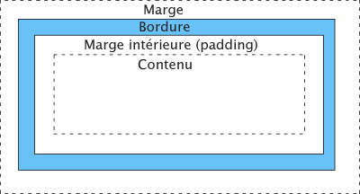

 

Les attributs 4D Write Pro vous permettent de contrôler tous les aspects graphiques du texte et des images contenus dans vos documents. Ces attributs sont gérés par les commandes suivantes :

* [WP SET ATTRIBUTES](../commands/wp-set-attributes.md)
* [WP GET ATTRIBUTES](../commands/wp-get-attributes.md)
* [WP RESET ATTRIBUTES](../commands/wp-reset-attributes.md)


:::note

Vous pouvez également manipuler les attributs des zones 4D Write Pro via la notation objet ou les commandes 4D génériques :

* Notation objet - par exemple, vous pouvez utiliser l'une ou l'autre des instructions suivantes :  
```4d  
 $bcol:=$range[wk background color]  
 $bcol:=$range.backgroundColor //same results  
```
* Commandes [OB SET](../../commands-legacy/ob-set.md) et [OB Get](../../commands-legacy/ob-get.md), par exemple :  
```4d  
 $bcol:=OB Get($range;wk background color)  
```  
:::

### Fond 

Les attributs de fond (*background*) permettent de définir des effets d'arrière-plan dans vos documents. Ces attributs s'appliquent aux cibles 4D Write Pro suivantes :

| Documents | Sections | Paragraphes | Images | Tableaux | Lignes | Colonnes/Cellules | En-têtes/Pieds/Corps | Zones de texte |
| --------- | -------- | ----------- | ------ | -------- | ------ | ----------------- | -------------------- | -------------- |
| X         | X        | X           | X      | X        | X      | X                 | X                    | X              |

| Constante                         | Comment                                                                                                                                                                                                                                                                                                                                                                                                                                                                                                                                                                                                                                                                                                                                                                                                                                                                                                                                                                                                                                                                                                                                                                                                                                                                                                                                                                                                                                                                                           |
| --------------------------------- | ------------------------------------------------------------------------------------------------------------------------------------------------------------------------------------------------------------------------------------------------------------------------------------------------------------------------------------------------------------------------------------------------------------------------------------------------------------------------------------------------------------------------------------------------------------------------------------------------------------------------------------------------------------------------------------------------------------------------------------------------------------------------------------------------------------------------------------------------------------------------------------------------------------------------------------------------------------------------------------------------------------------------------------------------------------------------------------------------------------------------------------------------------------------------------------------------------------------------------------------------------------------------------------------------------------------------------------------------------------------------------------------------------------------------------------------------------------------------------------------------- |
| wk background clip                | Définit la zone de fond. Valeurs possibles :<br/><ul><li>wk border box (défaut) : le fond est jusqu'au bord extérieur de la bordure</li><li>wk content box : le fond est à l'intérieur de la zone "content"</li><li>wk padding box : le fond est jusqu'au bord extérieur du padding (ou jusqu'au bord interne de la bordure, le cas échéant) </li><li>wk paper box : le fond est jusqu'au bord du document ou de la section</li></ul>                                                                                                                                                                                                                                                                                                                                                                                                                                                                                                                                                                                                                                                                                                                                                                                                                                                                                                                                                                                         |
| wk background color               | Définit la couleur de fond d'un élément. Valeurs possibles :<br/><ul><li>une couleur CSS ("#010101" ou "#FFFFFF" ou "red"). </li><li>une valeur de couleur 4D (entier long, voir commande [OBJECT SET RGB COLORS](../../commands-legacy/object-set-rgb-colors.md))</li><li>un tableau entier long contenant un élément pour chaque composante R, G, B (0-255)</li></ul>La valeur par défaut pour les documents est "#FFFFFF" et wk transparent ou "transparent" pour les paragraphes et les images.                                                                                                                                                                                                                                                                                                                                                                                                                                                                                                                                                                                                                                                                                                                                                                                                                                                                                                                                                                                       |
| wk background display mode        | Définit le mode d'affichage des images utilisées comme arrière-plan, sur la base d'un préréglage des valeurs d'attribut "réelles" suivantes : wk background origin, wk background repeat, \[#cst id= "3513252"/\], wk background position vertical, wk background width, wk background height Valeurs possibles : <ul> <li>wk scaled to fit</li> <li>wk truncated</li> <li>wk truncated centered</li> <li>wk proportional</li> <li>wk proportional centered</li> <li>wk replicated (par défaut)</li> <li>wk replicated centered</li> </ul> **Note** : Le rectangle d'origine est défini sur la zone de padding (le rectangle de l'image qui inclut la zone de padding mais qui exclut la zone de bordure). Lorsque vous obtenez la valeur de cet attribut, la valeur retournée est soit : <ul> <li>l'un des modes d'affichage possibles, par exemple wk replicated, si tous les attributs réels ont les valeurs prédéfinies pour ce mode</li> <li>"personnalisée" si au moins la valeur d'un attribut réel diffère des valeurs prédéfinies pour n'importe quel mode. Par exemple, si la valeur prédéfinie de wk background width est modifiée après l'application de wk background display mode, [WP GET ATTRIBUTES](../commands/wp-get-attributes.md)) retourne "personnalisée" au moment d'obtenir la valeur de wk background display mode.</li> </ul> |
| wk background height              | Définit la dimension verticale d'une image de fond. Valeurs possibles :<br/><ul><li>wk auto (défaut) : utilise la hauteur courante de l'image de fond</li><li>wk contain : redimensionne l'image à sa hauteur maximale de manière qu'elle "tienne" entièrement dans la zone "content" tout en préservant ses proportions. Cette option modifie également la valeur de l'autre attribut de dimension.</li><li>wk cover : redimensionne l'image à sa hauteur maximale de manière à ce que le fond soit entièrement recouvert par l'image de fond tout en préservant ses proportions. Certaines parties de l'image peuvent être tronquées. Cette option modifie également la valeur de l'autre attribut de dimension</li><li>Taille définie : définit la largeur de l'image via une valeur de type réel ou chaîne :<br/>Réel : Taille en wk layout unit.Chaîne : Chaîne CSS avec valeur et unité concaténées. Ex. : 12pt pour 12 points, ou 1.5cm pour 1,5 centimètres. Valeur minimum : 0pt, valeur maximum : 10000pt. Il est possible de passer une valeur relative (pourcentage %).</li></ul>                                                                                                                                                                                                                                                                                                                         |
| wk background image               | Définit une référence d'image à utiliser en fond. Peut être toute expression ou variable image 4D valide.<br/><ul><li>Valeur retournée ([WP GET ATTRIBUTES](../commands/wp-get-attributes.md))) : si l'image avait été définie via un URL résau, l'image cible est retournée si elle a déjà été chargée, sinon une image vide est retournée. </li></ul>Utilisez wk background image url si vous souhaitez gérer des images via des URLs ou des URIs locaux.                                                                                                                                                                                                                                                                                                                                                                                                                                                                                                                                                                                                                                                                                                                                                                                                                                                                                                                                                                                                  |
| wk background image url           | Image de fond définie via un URL (chaîne). Peut être un URL réseau ou un data URI, absolu ou relatif au fichier de structure.<br/><ul><li>Valeur retournée ([WP GET ATTRIBUTES](../commands/wp-get-attributes.md))) : URL réseau ou URI de donnée. Cette valeur peut ne pas être égale à l'URL initial pour une image non référencée par un URL réseau (seuls les URLs réseau sont conservés). Pour les URLs de fichiers locaux, le flux d'image (stream) lui-même est conservé dans le document et donc l'URL retourné est un URI de données avec le flux d'image encodé en base64.</li></ul>Utilisez wk background image pour gérer des images de fond via des expressions image.                                                                                                                                                                                                                                                                                                                                                                                                                                                                                                                                                                                                                                                                                                                                                                          |
| wk background origin              | Définit la position de l'image de fond. Valeurs possibles :<ul><li>wk padding box (défaut) : l'image de fond débute au rectangle de padding (ou à l'intérieur de la bordure)</li><li>wk border box : l'image de fond débute au rectangle de la bordure (bord extérieur)</li><li>wk content box : l'image de fond au rectangle "content"</li><li>wk paper box : l'image de fond débute au bord du document ou de la section</li></ul>                                                                                                                                                                                                                                                                                                                                                                                                                                                                                                                                                                                                                                                                                                                                                                                                                                                                                                                                                                                                  |
| wk background position horizontal | Définit la position horizontale de départ d'une image de fond. Valeurs possibles :<br/><ul><li>wk left (défaut) : l'image de fond débute horizontalement à gauche de l'élément</li><li>wk center : l'image de fond débute horizontalement au centre de l'élément</li><li>wk right : l'image de fond débute horizontalement à droite de l'élément</li></ul>                                                                                                                                                                                                                                                                                                                                                                                                                                                                                                                                                                                                                                                                                                                                                                                                                                                                                                                                                                                                                                                                                |
| wk background position vertical   | Définit la position verticale de départ d'une image de fond. Valeurs possibles :<ul><li>wk top (défaut) : l'image de fond débute verticalement en haut de l'élément</li><li>wk middle : l'image de fond débute verticalement au centre de l'élément</li><li>wk bottom : l'image de fond débute verticalement à droite de l'élément</li></ul>                                                                                                                                                                                                                                                                                                                                                                                                                                                                                                                                                                                                                                                                                                                                                                                                                                                                                                                                                                                                                                                                                                      |
| wk background repeat              | Définit si et comment une image de fond est répétée. Valeurs possibles :<br/><ul><li>wk repeat (défaut) : l'image de fond est répétée verticalement et horizontalement</li><li>wk no repeat : l'image de fond n'est pas répétée </li><li>wk repeat x : l'image de fond est répétée horizontalement uniquement </li><li>wk repeat y : l'image de fond est répétée verticalement uniquement</li></ul>                                                                                                                                                                                                                                                                                                                                                                                                                                                                                                                                                                                                                                                                                                                                                                                                                                                                                                                                                                                                                           |
| wk background width               | Définit la dimension horizontale d'une image de fond. Valeurs possibles :<br/><ul><li>wk auto (défaut) : utilise la largeur courante de l'image de fond</li><li>wk contain : redimensionne l'image à sa largeur maximale de manière qu'elle "tienne" entièrement dans la zone "content" tout en préservant ses proportions. Cette option modifie également la valeur de l'autre attribut de dimension.</li><li>wk cover : redimensionne l'image de manière à ce que le fond soit entièrement recouvert par l'image de fond tout en préservant ses proportions. Certaines parties de l'image peuvent être tronquées. Cette option modifie également la valeur de l'autre attribut de dimension</li><li>Taille définie : définit la largeur de l'image via une valeur de type réel ou chaîne :<br/>Réel : Taille en wk layout unit.Chaîne : Chaîne CSS avec valeur et unité concaténées. Ex. : 12pt pour 12 points, ou 1.5cm pour 1,5 centimètres. Valeur minimum : 0pt, valeur maximum : 10000pt. Il est possible de passer une valeur relative (pourcentage %).</li></ul>                                                                                                                                                                                                                                                                                                                                             |

### Bordures 

Les attributs de bordure permettent de définir le style, la largeur et la couleur des bordures. Ces attributs s'appliquent aux éléments suivants :

| Documents | Sections | Paragraphes | Images | Tableaux | Lignes | Colonnes/Cellules | En-têtes/Pieds/Corps | Zones de texte |
| --------- | -------- | ----------- | ------ | -------- | ------ | ----------------- | -------------------- | -------------- |
| X         | X        | X           | X      | X        | X      | X                 | X                    | X              |

| Constante              | Comment                                                                                                                                                                                                                                                                                                                                                                                                                                                                                                                                                                                                                                                                                                                                                                                                                                                                                    |
| ---------------------- | ------------------------------------------------------------------------------------------------------------------------------------------------------------------------------------------------------------------------------------------------------------------------------------------------------------------------------------------------------------------------------------------------------------------------------------------------------------------------------------------------------------------------------------------------------------------------------------------------------------------------------------------------------------------------------------------------------------------------------------------------------------------------------------------------------------------------------------------------------------------------------------------ |
| wk border color        | Définit la couleur pour les quatre bordures. Valeurs possibles :<br/><ul><li>une couleur CSS ("#010101" ou "#FFFFFF" ou "red").</li><li>une valeur de couleur 4D (entier long, voir commande [OBJECT SET RGB COLORS](../../commands-legacy/object-set-rgb-colors.md))</li><li>un tableau entier long contenant un élément pour chaque composante R, G, B (0-255)</li></ul>La valeur par défaut est "#000000" (si valeur chaîne). S'il y a plusieurs couleurs, [WP GET ATTRIBUTES](../commands/wp-get-attributes.md)) retourne une chaîne vide.                                                                                                                                                                                                                                                                                                                                |
| wk border color bottom | Définit la couleur pour la bordure basse. Valeurs possibles :<br/><ul><li>une couleur CSS ("#010101" ou "#FFFFFF" ou "red"). La valeur par défaut est "#000000"</li><li>une valeur de couleur 4D (entier long, voir commande [OBJECT SET RGB COLORS](../../commands-legacy/object-set-rgb-colors.md))</li><li>un tableau entier long contenant un élément pour chaque composante R, G, B (0-255)</li></ul>                                                                                                                                                                                                                                                                                                                                                                                                                                                                         |
| wk border color left   | Définit la couleur pour la bordure gauche. Valeurs possibles :<br/><ul><li>une couleur CSS ("#010101" ou "#FFFFFF" ou "red"). La valeur par défaut est "#000000"</li><li>une valeur de couleur 4D (entier long, voir commande [OBJECT SET RGB COLORS](../../commands-legacy/object-set-rgb-colors.md))</li><li>un tableau entier long contenant un élément pour chaque composante R, G, B (0-255)</li></ul>                                                                                                                                                                                                                                                                                                                                                                                                                                                                        |
| wk border color right  | Définit la couleur pour la bordure droite. Valeurs possibles :<br/><ul><li>une couleur CSS ("#010101" ou "#FFFFFF" ou "red"). La valeur par défaut est "#000000"</li><li>une valeur de couleur 4D (entier long, voir commande [OBJECT SET RGB COLORS](../../commands-legacy/object-set-rgb-colors.md))</li><li>un tableau entier long contenant un élément pour chaque composante R, G, B (0-255)</li></ul>                                                                                                                                                                                                                                                                                                                                                                                                                                                                        |
| wk border color top    | Définit la couleur pour la bordure haute. Valeurs possibles :<br/><ul><li>une couleur CSS ("#010101" ou "#FFFFFF" ou "red"). La valeur par défaut est "#000000"</li><li>une valeur de couleur 4D (entier long, voir commande [OBJECT SET RGB COLORS](../../commands-legacy/object-set-rgb-colors.md))</li><li>un tableau entier long contenant un élément pour chaque composante R, G, B (0-255)</li></ul>                                                                                                                                                                                                                                                                                                                                                                                                                                                                         |
| wk border radius       | Définit l'arrondi des angles de la bordure. Valeurs possibles :<br/><ul><li>wk none (défaut) : la bordure n'a pas d'angles arrondis</li><li>Valeur d'angle exprimée par une valeur de type numérique ou chaîne :<br/>Numérique : Angle en wk layout unit.Chaîne : chaîne CSS avec valeur et unité concaténées. Ex. : "12pt" pour 12 points ou "1.5cm" pour 1,5 centimètres.</li></ul>                                                                                                                                                                                                                                                                                                                                                                                                                                                  |
| wk border style        | Définit le style des quatre bordures. Valeurs possibles :<br/><ul><li>wk none (défaut) : pas de bordure</li><li>wk hidden : équivaut à wk none, sauf en résolution de conflit de bordure</li><li>wk solid : bordure pleine</li><li>wk dotted : bordure en pointillés</li><li>wk dashed : bordure en tirets</li><li>wk double : bordure double </li><li>wk groove : bordure relief 3D (l'effet réel dépend de la couleur de la bordure)</li><li>wk ridge : bordure relief 3D inversé (l'effet réel dépend de la couleur de la bordure)</li><li>wk inset : bordure biseau 3D (l'effet réel dépend de la couleur de la bordure)</li><li>wk outset : bordure biseau 3D inversé (l'effet réel dépend de la couleur de la bordure)</li></ul>         |
| wk border style bottom | Définit le style de la bordure basse. Valeurs possibles :<br/><ul><li>wk none (défaut) : pas de bordure basse</li><li>wk hidden : équivaut à wk none, sauf en résolution de conflit de bordure</li><li>wk solid : bordure pleine</li><li>wk dotted : bordure en pointillés</li><li>wk dashed : bordure en tirets</li><li>wk double : bordure double </li><li>wk groove : bordure relief 3D (l'effet réel dépend de la couleur de la bordure)</li><li>wk ridge : bordure relief 3D inversé (l'effet réel dépend de la couleur de la bordure)</li><li>wk inset : bordure biseau 3D (l'effet réel dépend de la couleur de la bordure)</li><li>wk outset : bordure biseau 3D inversé (l'effet réel dépend de la couleur de la bordure)</li></ul>   |
| wk border style left   | Définit le style de la bordure gauche. Valeurs possibles :<br/><ul><li>wk none (défaut) : pas de bordure gauche</li><li>wk hidden : équivaut à wk none, sauf en résolution de conflit de bordure</li><li>wk solid : bordure pleine</li><li>wk dotted : bordure en pointillés</li><li>wk dashed : bordure en tirets</li><li>wk double : bordure double </li><li>wk groove : bordure relief 3D (l'effet réel dépend de la couleur de la bordure)</li><li>wk ridge : bordure relief 3D inversé (l'effet réel dépend de la couleur de la bordure)</li><li>wk inset : bordure biseau 3D (l'effet réel dépend de la couleur de la bordure)</li><li>wk outset : bordure biseau 3D inversé (l'effet réel dépend de la couleur de la bordure)</li></ul> |
| wk border style right  | Définit le style de la bordure droite. Valeurs possibles :<br/><ul><li>wk none (défaut) : pas de bordure droite</li><li>wk hidden : équivaut à wk none, sauf en résolution de conflit de bordure</li><li>wk solid : bordure pleine</li><li>wk dotted : bordure en pointillés</li><li>wk dashed : bordure en tirets</li><li>wk double : bordure double </li><li>wk groove : bordure relief 3D (l'effet réel dépend de la couleur de la bordure)</li><li>wk ridge : bordure relief 3D inversé (l'effet réel dépend de la couleur de la bordure)</li><li>wk inset : bordure biseau 3D (l'effet réel dépend de la couleur de la bordure)</li><li>wk outset : bordure biseau 3D inversé (l'effet réel dépend de la couleur de la bordure)</li></ul> |
| wk border style top    | Définit le style de la bordure haute. Valeurs possibles :<br/><ul><li>wk none (défaut) : pas de bordure haute</li><li>wk hidden : équivaut à wk none, sauf en résolution de conflit de bordure</li><li>wk solid : bordure pleine</li><li>wk dotted : bordure en pointillés</li><li>wk dashed : bordure en tirets</li><li>wk double : bordure double </li><li>wk groove : bordure relief 3D (l'effet réel dépend de la couleur de la bordure)</li><li>wk ridge : bordure relief 3D inversé (l'effet réel dépend de la couleur de la bordure)</li><li>wk inset : bordure biseau 3D (l'effet réel dépend de la couleur de la bordure)</li><li>wk outset : bordure biseau 3D inversé (l'effet réel dépend de la couleur de la bordure)</li></ul>   |
| wk border width        | Définit la largeur des quatre bordures. Vous devez spécifier le style de la bordure avant sa largeur. Valeurs possibles :<br/><ul><li>Largeur exprimée par une valeur de type numérique ou chaîne :<br/>Numérique : largeur en wk layout unit.Chaîne : chaîne CSS avec la valeur et l'unité concaténées. Ex. : "12pt" pour 12 points ou "1.5cm" pour 1,5 centimètres</li><li>Valeur par défaut : 2pt</li></ul>                                                                                                                                                                                                                                                                                                                                                                                                                         |
| wk border width bottom | Définit la largeur de la bordure basse. Valeurs possibles :<br/><ul><li>Largeur exprimée par une valeur de type numérique ou chaîne :<br/>Numérique : Largeur en wk layout unit.Chaîne : chaîne CSS avec la valeur et l'unité concaténées. Ex. : "12pt" pour 12 points ou "1.5cm" pour 1,5 centimètres</li><li>Valeur par défaut : 2pt</li></ul>                                                                                                                                                                                                                                                                                                                                                                                                                                                                                       |
| wk border width left   | Définit la largeur de la bordure gauche. Valeurs possibles :<br/><ul><li>Largeur exprimée par une valeur de type numérique ou chaîne :<br/>Numérique : Largeur en wk layout unit.Chaîne : chaîne CSS avec la valeur et l'unité concaténées. Ex. : "12pt" pour 12 points ou "1.5cm" pour 1,5 centimètres</li><li>Valeur par défaut : 2pt</li></ul>                                                                                                                                                                                                                                                                                                                                                                                                                                                                                      |
| wk border width right  | Définit la largeur de la bordure droite. Valeurs possibles :<br/><ul><li>Largeur exprimée par une valeur de type numérique ou chaîne :<br/>Numérique : Largeur en wk layout unit.Chaîne : chaîne CSS avec la valeur et l'unité concaténées. Ex. : "12pt" pour 12 points ou "1.5cm" pour 1,5 centimètres</li><li>Valeur par défaut : 2pt</li></ul>                                                                                                                                                                                                                                                                                                                                                                                                                                                                                      |
| wk border width top    | Définit la largeur de la bordure haute. Valeurs possibles :<br/><ul><li>Largeur exprimée par une valeur de type numérique ou chaîne :<br/>Numérique : Largeur en wk layout unit.Chaîne : chaîne CSS avec la valeur et l'unité concaténées. Ex. : "12pt" pour 12 points ou "1.5cm" pour 1,5 centimètres</li><li>Valeur par défaut : 2pt</li></ul>                                                                                                                                                                                                                                                                                                                                                                                                                                                                                       |
| wk inside              | Lorsque la zone sélectionnée contient plusieurs paragraphes, définit que l'attribut doit être appliqué uniquement sur la propriété inter-paragraphes correspondante (et pas à l'extérieur). Peut être utilisé avec les attributs de bordures, padding ou marges, et doit être ajouté à l'attribut spécifié. Voir exemple 2 de la commande [WP SET ATTRIBUTES](../commands/wp-set-attributes.md)).                                                                                                                                                                                                                                                                                                                                                                                                                                                                                     |
| wk outside             | Lorsque la zone sélectionnée contient plusieurs paragraphes, définit que l'attribut doit être appliqué uniquement sur la propriété de paragraphe externe correspondante (et pas à l'intérieur). Peut être utilisé avec les attributs de bordures, padding ou marges, et doit être ajouté à l'attribut spécifié. Voir exemple 2 de la commande [WP SET ATTRIBUTES](../commands/wp-set-attributes.md)).                                                                                                                                                                                                                                                                                                                                                                                                                                                                                 |

### Informations et paramètres du document 

Les attributs d'informations du document sont utilisés pour fixer ou lire des des paramètres ou des informations relatives au document. Ces attributs s'appliquent aux éléments suivants : 

| Documents | Sections | Paragraphes | Images | Tableaux | Lignes | Colonnes/Cellules | En-têtes/Pieds/Corps | Zones de texte |
| --------- | -------- | ----------- | ------ | -------- | ------ | ----------------- | -------------------- | -------------- |
| X         |          |             |        |          |        |                   |                      |                |

**Informations du document**

| Constante        | Comment                                                                                                                                                                                                                                                                                                                                                                                                                                                                                                                                                                                                                                                                                                                                                                                                                                                                                                                                                                                                                                                                                                                                                                                                                                                                                                                                                                                                                                                                                                                                      |
| ---------------- | -------------------------------------------------------------------------------------------------------------------------------------------------------------------------------------------------------------------------------------------------------------------------------------------------------------------------------------------------------------------------------------------------------------------------------------------------------------------------------------------------------------------------------------------------------------------------------------------------------------------------------------------------------------------------------------------------------------------------------------------------------------------------------------------------------------------------------------------------------------------------------------------------------------------------------------------------------------------------------------------------------------------------------------------------------------------------------------------------------------------------------------------------------------------------------------------------------------------------------------------------------------------------------------------------------------------------------------------------------------------------------------------------------------------------------------------------------------------------------------------------------------------------------------------- |
| wk author        | Indique le nom de l'auteur du document (chaîne)                                                                                                                                                                                                                                                                                                                                                                                                                                                                                                                                                                                                                                                                                                                                                                                                                                                                                                                                                                                                                                                                                                                                                                                                                                                                                                                                                                                                                                                                                              |
| wk company       | Définit une entreprise associée au document (chaîne)                                                                                                                                                                                                                                                                                                                                                                                                                                                                                                                                                                                                                                                                                                                                                                                                                                                                                                                                                                                                                                                                                                                                                                                                                                                                                                                                                                                                                                                                                         |
| wk date creation | Retourne la date de création du document (date). Cette valeur est en lecture seulement et ne peut pas être fixée.                                                                                                                                                                                                                                                                                                                                                                                                                                                                                                                                                                                                                                                                                                                                                                                                                                                                                                                                                                                                                                                                                                                                                                                                                                                                                                                                                                                                                            |
| wk date modified | Retourne la date de dernière modification du document (date). Cette valeur est en lecture seulement et ne peut pas être fixée. A noter que cette valeur est mise à jour dynamiquement chaque fois que le contenu du document est modifié, mais pas lorsque le document est ouvert ou sauvegardé.                                                                                                                                                                                                                                                                                                                                                                                                                                                                                                                                                                                                                                                                                                                                                                                                                                                                                                                                                                                                                                                                                                                                                                                                                                             |
| wk dpi           | DPI utilisés pour la conversion interne pixels <->points (entier). Toujours 96 (lecture seulement) Ne pas confondre cet attribut interne avec l'action standard "dpi" qui permet de modifier ou de lire les DPI de la vue courante du document.                                                                                                                                                                                                                                                                                                                                                                                                                                                                                                                                                                                                                                                                                                                                                                                                                                                                                                                                                                                                                                                                                                                                                                                                                                                                                              |
| wk modified      | Indique si le document a été modifié depuis la création de son objet associé (voir ci-dessous). Valeurs possibles : <ul> <li>**True** \- le document a été modifié</li> <li>**False** \- le document n'a pas été modifié (valeur par défaut lorsque l'objet est créé)</li> </ul> Cette propriété est toujours mise à **false** lorsque l'objet contenant le document est créé (c'est-à-dire avec [WP Import document](../commands/wp-import-document.md), [WP New](../commands-legacy/wp-new.md), une copie d'objet ou lorsque le champ/attribut objet est chargé depuis la base de données). Il est automatiquement mis à **true** par 4D Write Pro dès qu'une modification est apportée au contenu du document, quelle que soit l'origine de la modification (action de l'utilisateur ou programmation). **Notes:**  <ul> <li>Une nouvelle valeur évaluée à partir d'une formule ou une nouvelle image chargée depuis une URL n'est pas considérée comme une modification du document (la chaîne source reste intacte). </li> <li>Une fois mise à **true** par 4D Write Pro, cette propriété n'est jamais automatiquement remise à **false**, même si une action "undo" ou "export" est exécutée. Cependant, comme il s'agit d'une propriété en lecture-écriture, elle peut être fixée par votre code.</li> <li>Contrairement à wk date modified, wk modified est *volatile*, c'est-à-dire qu'elle n'est pas stockée dans le document.</li> </ul> |
| wk notes         | Définit des commentaires dans le document (chaîne).                                                                                                                                                                                                                                                                                                                                                                                                                                                                                                                                                                                                                                                                                                                                                                                                                                                                                                                                                                                                                                                                                                                                                                                                                                                                                                                                                                                                                                                                                          |
| wk subject       | Définit le sujet du document (chaîne)                                                                                                                                                                                                                                                                                                                                                                                                                                                                                                                                                                                                                                                                                                                                                                                                                                                                                                                                                                                                                                                                                                                                                                                                                                                                                                                                                                                                                                                                                                        |
| wk title         | Définit le titre du document (chaîne). Par défaut "New 4D Write Pro Document"                                                                                                                                                                                                                                                                                                                                                                                                                                                                                                                                                                                                                                                                                                                                                                                                                                                                                                                                                                                                                                                                                                                                                                                                                                                                                                                                                                                                                                                                |
| wk version       | Retourne le numéro de version 4DWP interne du document (réel). Ce numéro peut uniquement être lu par la commande [WP GET ATTRIBUTES](../commands/wp-get-attributes.md)), il ne peut pas être fixé.                                                                                                                                                                                                                                                                                                                                                                                                                                                                                                                                                                                                                                                                                                                                                                                                                                                                                                                                                                                                                                                                                                                                                                                                                                                                                                                                      |

**Paramètres du document** 

| Constante                       | Comment                                                                                                                                                                                                                                                                                                                                                                                                                                                                                                                                                                                                        |
| ------------------------------- | -------------------------------------------------------------------------------------------------------------------------------------------------------------------------------------------------------------------------------------------------------------------------------------------------------------------------------------------------------------------------------------------------------------------------------------------------------------------------------------------------------------------------------------------------------------------------------------------------------------- |
| wk break paragraphs in formulas | Définit si les retours chariots retournés par des formules sont traités comme des sauts de paragraphe. Valeurs possibles : <ul> <li>wk true \- Interprété comme saut de paragraphe</li> <li>wk false \- (valeur par défaut) Interprété comme saut de ligne </li> </ul> **Note :** Si une formule utilise [This](commands/this.md)*.pageNumber* ou [This](commands/this.md)*.pageCount*, l'attribut est ignoré, les retours chariots sont toujours interprétés commes des sauts de ligne.                                                                                   |
| wk tab decimal separator        | Caractère utilisé comme séparateur décimal par les tabulations décimales (voir wk tabs). Valeurs possibles : <ul> <li>wk point or comma : utilise la première virgule ou le premier point de droite (par défaut pour les nouveaux documents vierges)</li> <li>wk point : utilise le caractère point</li> <li>wk comma : utilise le caractère virgule</li> <li>wk system : utilise le séparateur décimal comme retourné par [GET SYSTEM FORMAT](../../commands-legacy/get-system-format.md) (par défaut pour les anciens documents 4D Write importés)</li> </ul> |

### Police et texte 

Ces attributs définissent la famille de police ainsi que la taille et le style du texte. Ils s'appliquent aux éléments suivants :

| Documents | Sections | Paragraphes | Images | Tableaux | Lignes | Colonnes/Cellules | En-têtes/Pieds/Corps | Zones de texte |
| --------- | -------- | ----------- | ------ | -------- | ------ | ----------------- | -------------------- | -------------- |
| X\*       | X\*      | X\*         | X\*    | X\*      | X\*    | X\*               | X\*                  |                |

\*Appliqué aux caractères des paragraphes dans les éléments

| Constante                 | Comment | 
| ------------------------- |------|
| wk font                   | Définit le nom de police complet avec les styles, comme retourné par la commande [FONT STYLE LIST](../../commands-legacy/font-style-list.md). Si vous passez un nom invalide, la commande ne fait rien. Valeur par défaut : "Times New Roman". |
| wk font bold              | Définit la graisse du texte (dépend des styles de police disponibles). Valeurs possibles :<br/><ul><li>wk true pour passer en style gras les caractères sélectionnés ; avec la commande [WP GET ATTRIBUTES](../commands/wp-get-attributes.md)), wk true est retournée si au moins un des caractères sélectionnés prend en charge le style de police gras. </li><li>wk false (défaut) pour supprimer le style gras des caractères sélectionnés s'il y en a ; avec la commande [WP GET ATTRIBUTES](../commands/wp-get-attributes.md)), wk false est retournée si aucun des caractères sélectionnés ne prend en charge le style de police gras.</li></ul> |
| wk font default           | Objet définissant la ou les polices par défaut de substitution du document (i.e. les polices qui remplacent celles qui ne sont pas disponibles dans le système d'exploitation). Il contient :  <table><tbody><tr><td>**Propriété**</td><td>**Type**</td><td>**Description**</td></tr><tr><td>default</td><td>Chaine \| Collection</td><td>Police(s) de substitution à utiliser par défaut si une police n'est pas prise en charge par le système d'exploitation, indépendamment de la plateforme</td></tr><tr><td>windows</td><td>Chaine \| Collection</td><td>Police(s) de substitution à utiliser par défaut sur la plateforme Windows (avant "default", si défini)</td></tr><tr><td>mac</td><td>Chaine \| Collection</td><td>Police(s) de substitution à utiliser par défaut sur la plateforme macOS (avant "default", si défini)</td></tr></tbody></table> **Notes :** <ul> <li>Chaque propriété peut contenir une chaine (ex : "Arial") ou une collection de chaines (ex : \["Arial","sans-serif"\]). Les noms de police doivent être une famille de polices ou "sans-serif", "serif", "monospace", "cursive" ou "fantasy" pour cibler la famille de police générique, comme dans html/css font-family. </li> <li>Par défaut, si wk font default n'est pas défini, ou si aucune des polices définies n'est disponible sur une plateforme, la police de substitution est déléguée au système d'exploitation.</li> </ul> |
| wk font family            | Spécifie le nom de famille de police tel que défini par wk font. Valeur par défaut : "Times New Roman". Une chaîne vide est retournée par la commande [WP GET ATTRIBUTES](../commands/wp-get-attributes.md)) si les caractères sélectionnés contiennent des propriétés de famille de police différentes.      |
| wk font italic            | Définit le style italique du texte (dépend des styles de police disponibles). Valeurs possibles :<br/><ul><li>wk true pour passer en style italique ou oblique les caractères sélectionnés ; avec la commande [WP GET ATTRIBUTES](../commands/wp-get-attributes.md)), wk true est retournée si au moins un des caractères sélectionnés prend en charge le style de police italique ou oblique. </li><li>wk false (défaut) pour supprimer le style italique ou oblique des caractères sélectionnés s'il y en a ; avec la commande [WP GET ATTRIBUTES](../commands/wp-get-attributes.md)), wk false est retournée si aucun des caractères sélectionnés ne prend en charge le style de police italique ou oblique.</li></ul> |
| wk font size              | Définit la taille de police du texte. Valeurs possibles (en points uniquement) :<br/><ul><li>Réel (défaut = 12)</li><li>Chaîne CSS avec la valeur et l'unité concaténées. Ex. : 12pt pour 12 points.</li></ul> |
| wk text color             | Définit la couleur du texte. Valeurs possibles :<br/><ul><li>une couleur CSS ("#010101" ou "#FFFFFF" ou "red"). La valeur par défaut est "#000000"</li><li>une valeur de couleur 4D (entier long, voir commande [OBJECT SET RGB COLORS](../../commands-legacy/object-set-rgb-colors.md))</li><li>un tableau entier long contenant un élément pour chaque composante R, G, B (0-255)</li></ul>  |
| wk text linethrough color | Définit la couleur de la ligne du texte barré. Valeurs possibles :<br/><ul><li>une couleur CSS ("#010101" ou "#FFFFFF" ou "red"). La valeur par défaut est "#000000"</li><li>une valeur de couleur 4D (entier long, voir commande [OBJECT SET RGB COLORS](../../commands-legacy/object-set-rgb-colors.md))</li><li>un tableau entier long contenant un élément pour chaque composante R, G, B (0-255)</li></ul>Par défaut, "currentColor" si chaîne, ou wk default si entier long. |
| wk text linethrough style | Définit le style du texte barré. Valeurs possibles :<br/><ul><li>wk none (défaut) : pas d'effet texte barré </li><li>wk solid : dessine une ligne pleine sur le texte sélectionné</li><li>wk dotted : dessine une ligne en pointillés sur le texte sélectionné</li><li>wk dashed : dessine une ligne en tirets sur le texte sélectionné</li><li>wk double : dessine une ligne double sur le texte sélectionné</li><li>wk semi transparent : atténue la ligne sur le texte sélectionné. Peut être combiné à un autre style de ligne. </li><li>wk word : dessine une ligne sur les mots uniquement (exclut les blancs). Peut être combiné à un autre style de ligne.</li></ul>  |
| wk text shadow color      | Définit la couleur d'ombre du texte sélectionné. Valeurs possibles :<br/><ul><li>une couleur CSS ("#010101" ou "#FFFFFF" ou "red").</li><li>une valeur de couleur 4D (entier long, voir commande [OBJECT SET RGB COLORS](../../commands-legacy/object-set-rgb-colors.md))</li><li>un tableau entier long contenant un élément pour chaque composante R, G, B (0-255)</li><li>wk transparent (défaut) </li></ul>|
| wk text shadow offset     | Définit le décalage pour l'effet ombré. Valeurs possibles :<br/><ul><li>Taille exprimée en points. Valeur par défaut : 1pt</li></ul> |
| wk text transform         | Définit la casse des lettres dans le texte. Valeurs possibles :<br/><ul><li>wk capitalize : les lettres initiales sont passées en capitales </li><li>wk lowercase : les lettres sont passées en minuscules</li><li>wk uppercase : les lettres sont passées en majuscules</li><li>wk small uppercase : les lettres sont passées en petites majuscules</li><li>wk none (défaut) : pas de transformation</li></ul> |
| wk text underline color   | Définit la couleur du trait de soulignement. Valeurs possibles :<br/><ul><li>une couleur CSS ("#010101" ou "#FFFFFF" ou "red"). La valeur par défaut est "#000000"</li><li>une valeur de couleur 4D (entier long, voir commande [OBJECT SET RGB COLORS](../../commands-legacy/object-set-rgb-colors.md))</li><li>un tableau entier long contenant un élément pour chaque composante R, G, B (0-255)</li></ul>Par défaut, "currentColor" si chaîne, ou wk default si entier long. |
| wk text underline style   | Définit le style du trait de soulignement. Valeurs possibles :<br/><ul><li>wk none (défaut) : pas de soulignement </li><li>wk solid : dessine un trait plein</li><li>wk dotted : dessine un trait en pointillés</li><li>wk dashed : dessine un trait en tirets</li><li>wk double : dessine un trait double</li><li>wk semi transparent : atténue le trait. Peut être combiné à un autre style de ligne. </li><li>wk word : dessine le trait sur les mots uniquement (exclut les blancs). Peut être combiné à un autre style de trait.</li></ul> |
| wk vertical align         | Définit l'alignement vertical d'un élément. Peut être utilisé avec les caractères, les paragraphes et les images. Valeurs possibles :<br/><ul><li>wk baseline (défaut) : aligne la base de l'élément avec la base de l'élément parent</li><li>wk top : aligne le haut de l'élément avec le haut de l'élément le plus grand sur la ligne </li><li>wk bottom : aligne le bas de l'élément avec le bas de l'élément le plus bas sur la ligne</li><li>wk middle : aligne l'élément au milieu de l'élément parent</li><li>wk superscript : aligne l'élément comme s'il était en exposant</li><li>wk subscript : aligne l'élément comme s'il était en indice</li></ul>Pour les caractères, wk top et wk bottom ont le même effet que wk baseline. <br/>Pour les paragraphes, wk baseline, wk superscript et wk subscript ont le même effet que wk top.  |

### Hauteur/Largeur 

Les attributs hauteur/largeur permettent de gérer les dimensions des éléments. Ces attributs s'appliquent aux éléments suivants :

| Documents | Sections | Paragraphes | Images | Tableaux | Lignes | Colonnes/Cellules | En-têtes/Pieds/Corps | Zones de texte |
| --------- | -------- | ----------- | ------ | -------- | ------ | ----------------- | -------------------- | -------------- |
| X         | X        | X           | X\*    | X        | X      |                   |                      |                |

\*Appliqué aux cellules

| Constante     | Comment                                                                                                                                                                                                                                                                                                                                                                                                                                                                                                                                                                                                                                                                                                                                                         |
| ------------- | --------------------------------------------------------------------------------------------------------------------------------------------------------------------------------------------------------------------------------------------------------------------------------------------------------------------------------------------------------------------------------------------------------------------------------------------------------------------------------------------------------------------------------------------------------------------------------------------------------------------------------------------------------------------------------------------------------------------------------------------------------------- |
| wk height     | Définit la hauteur de l'élément. La propriété *height* n'inclut pas le padding, les bordures ou les marges ; elle définit la hauteur de la zone située à l'intérieur du padding, de la bordure et de la marge de l'élément. Valeurs possibles :<br/><ul><li>wk auto (défaut) : la hauteur est basée sur le contenu de l'élément</li><li>Taille définie : taille exprimée par une valeur de type réel ou chaîne :<br/>Réel : Taille en wk layout unit.Chaîne : Chaîne CSS avec valeur et unité concaténées. Ex. : 12pt pour 12 points, ou 1.5cm pour 1,5 centimètres. Valeur minimum : 0pt, valeur maximum : 10000pt. </li></ul>L'attribut wk height est écrasé par l'attribut wk min height (si défini).    |
| wk min height | Définit la hauteur minimum de l'élément. La valeur de la propriété wk height ne peut pas devenir plus petite que wk min height. Valeurs possibles :<br/><ul><li>wk auto (défaut) : la hauteur minimum est basée sur le contenu de l'élément</li><li>Taille définie : taille exprimée par une valeur de type réel ou chaîne :<br/>Réel : Taille en wk layout unit.Chaîne : Chaîne CSS avec valeur et unité concaténées. Ex. : 12pt pour 12 points, ou 1.5cm pour 1,5 centimètres. Valeur minimum : 0pt, valeur maximum : 10000pt. </li></ul>L'attribut wk min height écrase la valeur de l'attribut wk height.**Note :** Cet attribut n'est pas pris en charge par les colonnes, les lignes et les cellules. |
| wk min width  | Définit la largeur minimum de l'élément. La valeur de la propriété wk width ne peut pas devenir plus petite que wk min width. Valeurs possibles :<br/><ul><li>wk auto (défaut) : la largeur minimum est basée sur le contenu de l'élément</li><li>Taille définie : taille exprimée par une valeur de type réel ou chaîne :<br/>Réel : Taille en wk layout unit.Chaîne : Chaîne CSS avec valeur et unité concaténées. Ex. : 12pt pour 12 points, ou 1.5cm pour 1,5 centimètres. Valeur minimum : 0pt, valeur maximum : 10000pt. </li></ul>L'attribut wk min width écrase la valeur de l'attribut wk width.                                                                                                   |
| wk width      | Définit la largeur de l'élément. Valeurs possibles :<br/><ul><li>wk auto (défaut) : la largeur est basée sur le contenu de l'élément</li><li>Taille définie : taille exprimée par une valeur de type réel ou chaîne :<br/>Réel : Taille en wk layout unit.Chaîne : Chaîne CSS avec valeur et unité concaténées. Ex. : 12pt pour 12 points, ou 1.5cm pour 1,5 centimètres. Valeur minimum : 0pt, valeur maximum : 10000pt. </li></ul>L'attribut wk width est écrasé par l'attribut wk min width (si défini).                                                                                                                                                                                                 |

### Image 

Les attributs Image permettent de gérer les images insérées dans la zone ou ajoutées dans la page. Ils s'appliquent aux cibles 4D Write Pro suivantes :

| Documents | Sections | Paragraphes | Images | Tableaux | Lignes | Colonnes/Cellules | En-têtes/Pieds/Corps | Zones de texte |
| --------- | -------- | ----------- | ------ | -------- | ------ | ----------------- | -------------------- | -------------- |
| X         | X\*      | X\*         | X\*    |          |        |                   |                      |                |

\*Appliqué aux images dans les cellules (images insérées dans le texte uniquement)

**Rappel :** Comme indiqué dans la section *Manipuler des images*, 4D Write Pro prend en charge deux types d'images :

* les images insérées dans le texte via les commandes [WP INSERT PICTURE](WritePro/commands/wp-insert-picture.md) ou [ST INSERT EXPRESSION](commands/st-insert-expression.md)
* les images ancrées dans la page via la commande [WP Add picture](WritePro/commands/wp-add-picture.md).

Les attributs suivants sont disponibles aussi bien pour les images insérées que pour les images ancrées :

| Constante               | Comment                                                                                                                                                                                                                                                                                                                                                                                                                                                                                                                                                                                                                                                                                                                                                                                                                                                                                                                                                                                                                                                                                                                                                                                                                                                                                                                                                                                                                                                                                                                                |
| ----------------------- | -------------------------------------------------------------------------------------------------------------------------------------------------------------------------------------------------------------------------------------------------------------------------------------------------------------------------------------------------------------------------------------------------------------------------------------------------------------------------------------------------------------------------------------------------------------------------------------------------------------------------------------------------------------------------------------------------------------------------------------------------------------------------------------------------------------------------------------------------------------------------------------------------------------------------------------------------------------------------------------------------------------------------------------------------------------------------------------------------------------------------------------------------------------------------------------------------------------------------------------------------------------------------------------------------------------------------------------------------------------------------------------------------------------------------------------------------------------------------------------------------------------------------------------- |
| wk image                | Définit une référence d'image. Peut être toute expression ou variable image 4D valide.<br/><ul><li>Valeur retournée ([WP GET ATTRIBUTES](../commands/wp-get-attributes.md))) : si l'image avait été définie via un URL résau, l'image cible est retournée si elle a déjà été chargée, sinon une image vide est retournée. </li></ul>Utilisez wk image url si vous souhaitez gérer des images via des URLs ou des URIs locaux.                                                                                                                                                                                                                                                                                                                                                                                                                                                                                                                                                                                                                                                                                                                                                                                                                                                                                                                                                                                                                                                                     |
| wk image alternate text | Définit un texte alternatif à l'image, si elle ne peut pas être affichée.                                                                                                                                                                                                                                                                                                                                                                                                                                                                                                                                                                                                                                                                                                                                                                                                                                                                                                                                                                                                                                                                                                                                                                                                                                                                                                                                                                                                                                                              |
| wk image display mode   | Définit le mode d'affichage des images ancrées et des images en ligne. Valeurs possibles : <ul> <li>wk scaled to fit (par défaut)</li> <li>wk truncated</li> <li>wk truncated centered</li> <li>wk proportional</li> <li>wk proportional centered</li> <li>wk replicated</li> <li>wk replicated centered</li> </ul> **Note :** Les rectangles d'origine et de découpage sont toujours définis sur la zone de contenu (le rectangle de l'image, à l'exclusion de la zone de padding et de bordure). Utilisez wk background display mode si vous souhaitez définir le mode d'affichage des images utilisées comme arrière-plan.                                                                                                                                                                                                                                                                                                                                                                                                                                                                                                                                                                                                                                                                                                                                                                                                          |
| wk image url            | Image définie via un URL (chaîne). Peut être un URL réseau ou un data URI, absolu ou relatif au fichier de structure.<br/><ul><li>Valeur retournée ([WP GET ATTRIBUTES](../commands/wp-get-attributes.md))) : URL réseau ou URI de donnée). Cette valeur peut ne pas être égale à l'URL initial pour une image non référencée par un URL réseau (seuls les URLs réseau sont conservés). Pour les URLs de fichiers locaux, le flux d'image (stream) lui-même est conservé dans le document et donc l'URL retourné est un URI de données avec le flux d'image encodé en base64.</li></ul>Utilisez wk image pour gérer des images via des expressions image.                                                                                                                                                                                                                                                                                                                                                                                                                                                                                                                                                                                                                                                                                                                                                                                                                                         |
| wk owner                | (Attribut en lecture seule) Possesseur de la plage. Valeur : objet                                                                                                                                                                                                                                                                                                                                                                                                                                                                                                                                                                                                                                                                                                                                                                                                                                                                                                                                                                                                                                                                                                                                                                                                                                                                                                                                                                                                                                                                     |
| wk type                 | Type d'objet 4D Write Pro. Valeurs possibles : <ul> <li>wk type default : Plage ou section sans type défini</li> <li>wk type paragraph : Plage de type paragraphe</li> <li>wk type image : Image (ancrée et en ligne)</li> <li>wk type container : En-tête ou pied, par exemple</li> <li>wk type table : Référence de tableau</li> </ul> Pour les plages de cellules, de colonnes et de lignes uniquement :  <ul> <li>wk type table row : Référence de ligne de tableau</li> <li>wk type table cell : Référence de cellule de tableau</li> <li>wk type table column : Référence de colonne de tableau</li> </ul> Pour les sous-sections uniquement : <ul> <li>wk first page : Sous-section de la première page</li> <li>wk right page : Sous-section de la page de droite</li> <li>wk left page : Sous-section de la page de gauche</li> </ul> Pour les tabulations uniquement, valeur utilisée dans l'objet pour wk tab default ou dans les objets de la collection pour wk tabs : <ul> <li>wk left : Aligne la tabulation à gauche</li> <li>wk right : Aligne la tabulation à droite</li> <li>wk center : Aligne la tabulation au centre</li> <li>wk decimal : Aligne la tabulation à la décimale</li> <li>wk bar : Insère une barre verticale au niveau de la tabulation</li> </ul> |

Les attributs suivants sont disponibles pour les images insérées uniquement :

| Constante         | Comment                                                                                                                                                                                                                                                                                                                                                                                                                                                                                                                                                                                                                                                                                                                                                                                                                                                                                                                                              |
| ----------------- | ---------------------------------------------------------------------------------------------------------------------------------------------------------------------------------------------------------------------------------------------------------------------------------------------------------------------------------------------------------------------------------------------------------------------------------------------------------------------------------------------------------------------------------------------------------------------------------------------------------------------------------------------------------------------------------------------------------------------------------------------------------------------------------------------------------------------------------------------------------------------------------------------------------------------------------------------------- |
| wk end            | (Attribut de plage en lecture seule) Position fin de plage. Valeur : entier long                                                                                                                                                                                                                                                                                                                                                                                                                                                                                                                                                                                                                                                                                                                                                                                                                                                                     |
| wk start          | (Attribut de plage en lecture seule) Position début de plage. Valeur : entier long                                                                                                                                                                                                                                                                                                                                                                                                                                                                                                                                                                                                                                                                                                                                                                                                                                                                   |
| wk vertical align | Définit l'alignement vertical d'un élément. Peut être utilisé avec les caractères, les paragraphes et les images. Valeurs possibles :<br/><ul><li>wk baseline (défaut) : aligne la base de l'élément avec la base de l'élément parent</li><li>wk top : aligne le haut de l'élément avec le haut de l'élément le plus grand sur la ligne </li><li>wk bottom : aligne le bas de l'élément avec le bas de l'élément le plus bas sur la ligne</li><li>wk middle : aligne l'élément au milieu de l'élément parent</li><li>wk superscript : aligne l'élément comme s'il était en exposant</li><li>wk subscript : aligne l'élément comme s'il était en indice</li></ul>Pour les caractères, wk top et wk bottom ont le même effet que wk baseline. <br/>Pour les paragraphes, wk baseline, wk superscript et wk subscript ont le même effet que wk top. |

Les attributs suivants sont disponibles pour les images ancrées uniquement :

| Constante                   | Comment                                                                                                                                                                                                                                                                                                                                                                                                                                                                                                                                                                                                                                                                                                                                                                                                                                                                                                                                                                                                                                                                                                                                                                                                                                                                                                                                                                                                                                                                                                                                           |
| --------------------------- | ------------------------------------------------------------------------------------------------------------------------------------------------------------------------------------------------------------------------------------------------------------------------------------------------------------------------------------------------------------------------------------------------------------------------------------------------------------------------------------------------------------------------------------------------------------------------------------------------------------------------------------------------------------------------------------------------------------------------------------------------------------------------------------------------------------------------------------------------------------------------------------------------------------------------------------------------------------------------------------------------------------------------------------------------------------------------------------------------------------------------------------------------------------------------------------------------------------------------------------------------------------------------------------------------------------------------------------------------------------------------------------------------------------------------------------------------------------------------------------------------------------------------------------------------- |
| wk anchor horizontal align  | Définit l'alignement horizontal d'une image relativement à l'origine (voir wk anchor origin). Valeurs possibles :<br/><ul><li>wk left \- alignement à gauche</li><li>wk center \- alignement au centre *(non compatible HTML, image non affichée sur le web)*</li><li>wk right \- alignement à droite</li></ul>                                                                                                                                                                                                                                                                                                                                                                                                                                                                                                                                                                                                                                                                                                                                                                                                                                                                                                                                                                                                                                                                                                                                                                           |
| wk anchor horizontal offset | Définit le décalage horizontal d'une image exprimé en dimension CSS de type chaîne ou entier long (cm ou pt ou pixel) dans l'unité wk layout unit. Valeurs possibles :<br/><ul><li>Limite gauche ou droite de l'image relativement à wk anchor horizontal align </li><li>Limite gauche ou droite du corps (body) en mode inclus (si wk anchor section \= wk anchor embedded) </li></ul>Valeur par défaut = 0.                                                                                                                                                                                                                                                                                                                                                                                                                                                                                                                                                                                                                                                                                                                                                                                                                                                                                                                                                                                                                                                                                         |
| wk anchor layout            | Définit la position relative d'une image par rapport au texte ou à la page. Valeurs possibles : <ul> <li>wk behind text \- l'image ou la zone de texte est ancrée derrière le texte</li> <li>wk in front of text \- l'image ou la zone de texte est ancrée devant le texte</li> <li>wk text wrap top bottom \- l'image ou la zone de texte est ancrée avec le texte enveloppé au-dessus et au-dessous de l'image ou de la zone de texte avec des côtés vides à sa gauche et à sa droite</li> <li>wk text wrap square \- l'image ou la zone de texte est ancrée avec le texte enveloppé tout autour de l'image ou de la zone de texte</li> <li>wk text wrap square left \- l'image ou la zone de texte est ancrée avec le texte enveloppé à gauche de l'image ou de la zone de texte</li> <li>wk text wrap square right \- l'image ou la zone de texte est ancrée avec le texte enveloppé à droite de l'image ou de la zone de texte</li> <li>wk text wrap square largest \- l'image ou la zone de texte est ancrée avec le texte enveloppé sur le côté le plus large de l'image ou de la zone de texte</li> <li>wk inline with text \- l'image est insérée dans le texte (position par défaut pour les images insérées avec [WP INSERT PICTURE](WritePro/commands/wp-insert-picture.md)). Cet attribut est en lecture seule (les images dans le texte ne peuvent pas être converties en images ancrées par programmation).</li> </ul> |
| wk anchor origin            | Définit si l'image est ancrée dans la page, l'en-tête ou le pied. Valeurs possibles :<br/><ul><li>wk paper box (défaut) - l'image est ancrée en bordure de page</li><li>wk header box \- l'image est ancrée dans l'en-tête du document. Si l'en-tête n'est pas visible, l'image n'est pas affichée.</li><li>wk footer box \- l'image est ancrée dans le pied du document. Si le pied n'est pas visible, l'image n'est pas affichée.</li></ul>Ce sélecteur est ignoré en mode inclus.                                                                                                                                                                                                                                                                                                                                                                                                                                                                                                                                                                                                                                                                                                                                                                                                                                                                                                                                                                                                      |
| wk anchor page              | Définit le numéro de page ou le type de page où l'image est ancrée. Valeurs possibles : <ul> <li>wk anchor all \- l'image est ancrée dans toutes les pages de la ou des section(s) définie(s) par wk anchor section</li> <li>wk anchor first page \- l'image est ancrée dans la première sous-section de la page de la ou des section(s) définie(s) par wk anchor section</li> <li>wk anchor left page \- l'image est ancrée dans la sous-section de la page gauche de la ou des section(s) définie(s) par wk anchor section</li> <li>wk anchor right page \- l'image est ancrée dans la sous-section de la page droite de la ou des section(s) définie(s) par wk anchor section</li> <li>valeur numérique (entier long >= 0) - indique le numéro de la page dans laquelle l'image est ancrée. Dans ce cas, wk anchor section \= wk anchor all. L'ancrage de section est ignoré si une image est ancrée dans une seule page.</li> </ul> **Note** : Les images en mode Page ne sont pas affichées dans les navigateurs.                                                                                                                                                                                                                                                                                                                                                                                                                                                    |
| wk anchor section           | Définit le numéro de section ou le type de section où l'image est ancrée. Valeurs possibles :<ul><li>wk anchor all (par défaut) - l'image est ancrée dans toutes les sections du document (l'image est visible uniquement en mode page)</li><li>wk anchor embedded \- l'image est ancrée au corps (body) du document en mode inclus (l'image est visible uniquement en mode inclus). </li><li>valeur numérique (entier long >= 1) - indique le numéro de la section dans laquelle l'image est ancrée (l'image est visible uniquement en mode page).</li></ul>**Note** : Les images en mode Page ne sont pas affichées dans les navigateurs.                                                                                                                                                                                                                                                                                                                                                                                                                                                                                                                                                                                                                                                                                                                                                                                                                                                       |
| wk anchor vertical align    | Définit l'alignement vertical d'une image relativement à l'origine (voir wk anchor origin). Valeurs possibles :<ul><li>wk top \- alignement en haut</li><li>wk center \- alignement au centre *(non compatible HTML, image non affichée sur le web)*</li><li>wk bottom \- alignement en bas</li></ul>                                                                                                                                                                                                                                                                                                                                                                                                                                                                                                                                                                                                                                                                                                                                                                                                                                                                                                                                                                                                                                                                                                                                                                                             |
| wk anchor vertical offset   | Définit le décalage vertical d'une image exprimé en dimension CSS de type chaîne ou nombre (cm ou pt ou pixel) dans l'unité wk layout unit. Valeurs possibles :<br/><ul><li>Haut, centre ou bas de la page (voir wk anchor horizontal align) </li><li>Haut, centre ou bas du corps (body) en mode inclus (si wk anchor section \= wk anchor embedded) </li></ul>Valeur par défaut = 0.                                                                                                                                                                                                                                                                                                                                                                                                                                                                                                                                                                                                                                                                                                                                                                                                                                                                                                                                                                                                                                                                                                                |
| wk id                       | ID interne de l'élément. Valeur : Chaîne                                                                                                                                                                                                                                                                                                                                                                                                                                                                                                                                                                                                                                                                                                                                                                                                                                                                                                                                                                                                                                                                                                                                                                                                                                                                                                                                                                                                                                                                                                          |
| wk image expression         | Image ancrée définie via une expression 4D.<br/><br/>**Note** : <br/><ul><li>Si l'expression ne peut pas être évaluée ou si elle ne retourne pas une image 4D valide, un symbole d'image non chargée sera affiché (image vide avec cadre noir).</li><li>Si l'attribut est fixé à " " ou utilisé avec [WP RESET ATTRIBUTES](../commands/wp-reset-attributes.md)), l'expression sera supprimée et l'image ne sera plus définie par elle. Effectuer cette opération avant que l'image ait été calculée produit une image vide. </li></ul>                                                                                                                                                                                                                                                                                                                                                                                                                                                                                                                                                                                                                                                                                                                                                                                                                                                                                                                                           |
| wk image formula            | Image ancrée définie via un objet formule 4D.<br/><br/>**Note** : <ul> <li>Si la formule ne peut pas être évaluée ou si elle ne retourne pas une image 4D valide, un symbole d'image non chargée sera affiché (image vide avec cadre noir).</li> <li>Si l'attribut est fixé à **Null** ou utilisé avec [WP RESET ATTRIBUTES](../commands/wp-reset-attributes.md)), la formule sera supprimée et l'image ne sera plus définie par elle. Effectuer cette opération avant que l'image ait été calculée produit une image vide.</li> </ul>                                                                                                                                                                                                                                                                                                                                                                                                                                                                                                                                                                                                                                                                                                                                                                                                                                                                                                                                                   |

### Configuration 

Les attributs de configuration définissent le formatage des colonnes, sections, sous-sections ou des pages dans le document. Ils peuvent être appliqués aux cibles 4D Write Pro suivantes :

| Documents | Sections | Paragraphes | Images | Tableaux | Lignes | Colonnes/Cellules | En-têtes/Pieds/Corps | Zones de texte |
| --------- | -------- | ----------- | ------ | -------- | ------ | ----------------- | -------------------- | -------------- |
| X         | X        |             |        |          |        |                   |                      |                |

**Note :** Les documents en mode intégré utilisent les attributs wk margin (voir **Marge** ci-dessous). En mode page, les documents, sections et sous-sections utilisent les attributs wk page margin.

| Constante                    | Comment                                                                                                                                                                                                                                                                                                                                                                                                                                                                                                                                                                                                                                                                                                                                                                                                                                                                                                                                                 |
| ---------------------------- | ------------------------------------------------------------------------------------------------------------------------------------------------------------------------------------------------------------------------------------------------------------------------------------------------------------------------------------------------------------------------------------------------------------------------------------------------------------------------------------------------------------------------------------------------------------------------------------------------------------------------------------------------------------------------------------------------------------------------------------------------------------------------------------------------------------------------------------------------------------------------------------------------------------------------------------------------------- |
| wk column count              | (Disponible pour les tableaux, les documents les sections) Nombre de colonnes. Type de valeur : Entier long<br/><ul><li>Pour un tableau : attribut en lecture seulement</li><li>Pour un document ou une section : attribut en lecture/écriture. Valeur par défaut=1 (colonne unique). Valeur maximum=20</li></ul>                                                                                                                                                                                                                                                                                                                                                                                                                                                                                                                                                                                           |
| wk column rule color         | Couleur du séparateur (trait) de colonne vertical. Valeurs possibles :<br/><ul><li>une couleur CSS ("#010101" ou "#FFFFFF" ou "red"). Valeur par défaut : "#000000" (black)</li><li>une valeur entier long de couleur 4D (voir commande [OBJECT SET RGB COLORS](../../commands-legacy/object-set-rgb-colors.md))</li><li>un tableau entier long contenant un élément pour chaque composante R, V, B (0-255) </li></ul>                                                                                                                                                                                                                                                                                                                                                                                                                                                                                                                          |
| wk column rule style         | Style du séparateur (trait) de colonne vertical. Valeurs possibles :<br/><ul><li>wk none (défaut) : pas de séparateur</li><li>wk hidden : équivaut à wk none, sauf en résolution de conflit</li><li>wk solid : ligne pleine</li><li>wk dotted : ligne en pointillés</li><li>wk dashed : ligne en tirets</li><li>wk double : ligne double </li><li>wk groove : ligne relief 3D (l'effet réel dépend de la couleur de la ligne)</li><li>wk ridge : ligne relief 3D inversé (l'effet réel dépend de la couleur de la ligne)</li><li>wk inset : ligne biseau 3D (l'effet réel dépend de la couleur de la ligne)</li></ul>                                                                                                                                                                                                   |
| wk column rule width         | Largeur du séparateur de colonne vertical. Valeurs possibles :<br/><ul><li>Réel : largeur en wk layout unit.</li><li>Chaîne : Chaîne CSS avec valeur et unité concaténées *(e.g.*: "12pt" pour 12 points ou "1.5cm" pour 1,5 centimètres). Valeur par défaut="2.5pt"</li></ul>                                                                                                                                                                                                                                                                                                                                                                                                                                                                                                                                                                                                                              |
| wk column spacing            | (Documents ou sections uniquement) Espacement entre deux colonnes. Valeurs possibles :<br/><ul><li>Réel : largeur en wk layout unit</li><li>Chaîne : Chaîne CSS avec valeur et unité concaténées *(e.g.*: "12pt" pour 12 points ou "1.5cm" pour 1,5 centimètres).<br/>Valeur par défaut="12pt"</li></ul>                                                                                                                                                                                                                                                                                                                                                                                                                                                                                                                                                                                            |
| wk column width              | (Documents ou sections uniquement) Attribut en lecture seulement. Largeur courante de chaque colonne, i.e. largeur calculée basée sur la largeur de la page, les marges de la page, le nombre de colonnes et l'espacement entre colonnes. Pour le document, le calcul utilise la largeur de la section par défaut, et peut donc être différent de la largeur réelle des colonnes de section(s) si certains attributs sont surchargés dans une section. <br/>Valeurs possibles :<br/><ul><li>Réel : largeur en wk layout unit.</li><li>Chaîne : Chaîne CSS avec valeur et unité concaténées *(e.g.*: "12pt" pour 12 points ou "1.5cm" pour 1,5 centimètres).</li></ul>                                                                                                                                                                                                                               |
| wk header and footer autofit | Indique si la hauteur des en-têtes et des pieds du document 4D Write Pro est redimensionnée automatiquement pour éviter de tronquer leur contenu. Valeurs possibles : <ul> <li>wk true (par défaut pour les documents de 4D Write Pro)</li> <li>wk false (par défaut pour les documents de 4D Write convertis)</li> </ul>                                                                                                                                                                                                                                                                                                                                                                                                                                                                                                                                                                                           |
| wk layout unit               | Définit l'unité de dimension par défaut du document lorsqu'une valeur numérique est écrite ou lue. Désigne l'unité de la règle et des attributs de dimension tels que wk width, à l'exception de wk font size, wk border width (et ses variantes), wk border radius et wk text shadow offset pour lesquels l’unité de valeur numérique est toujours le point. <br/>Valeurs possibles :<br/><ul><li>wk unit cm (défaut) : centimètres</li><li>wk unit pt : points</li><li>wk unit px : pixels</li><li>wk unit percent (seulement pour wk line height et wk background size h / wk background size v)</li><li>wk unit mm : millimètres</li><li>wk unit inch : pouces</li></ul>**Note :** Lorsqu'une unité non prise en charge par la règle est sélectionnée via cet attribut (i.e. wk unit px ou wk unit percent), la règle utilise alors l'unité cm. |
| wk page first number         | Numéro de page de la première page de la section ou du document (lecture seule avec les sous-sections). Valeurs possibles : toute valeur entière >=1                                                                                                                                                                                                                                                                                                                                                                                                                                                                                                                                                                                                                                                                                                                                                                                                    |
| wk page first right          | La première page du document est une page de droite (lecture seule pour les sections ou sous-sections). Valeurs possibles :<br/><ul><li>`true` (défaut) : le document commence sur une page de droite </li><li>`false` : le document commence sur une page de gauche </li></ul>                                                                                                                                                                                                                                                                                                                                                                                                                                                                                                                                                                                        |
| wk page height               | Hauteur de page (en mode page) exprimée à l'aide d'une valeur de type réel ou chaîne (lecture seule pour les sections ou les sous-sections). Valeurs possibles :<br/><ul><li>Réel : Hauteur en wk layout unit.</li><li>Chaîne : chaîne CSS avec valeur et unité concaténées *(ex:* "12pt" pour 12 points, ou "1.5cm" for 1.5 centimètres). Unités prises en charge : pt,cm,mm, pouces. </li></ul>                                                                                                                                                                                                                                                                                                                                                                                                                                                                                                           |
| wk page margin               | Taille de toutes les marges de la page (mode page). Par défaut 2.5cm. Valeurs possibles :<br/><ul><li>Réel : Taille en wk layout unit.</li><li>Chaîne : chaîne CSS avec valeur et unité concaténées *(ex* : "12pt" pour 12 points, ou "1.5cm" pour 1.5 centimètres). Unités prises en charge : pt, cm, mm, px, pouces. </li><li>wk none : pas de marge spécifique.</li></ul>                                                                                                                                                                                                                                                                                                                                                                                                                                                                                                                    |
| wk page margin bottom        | Taille des marges bas de la page (mode page). Valeurs possibles : <br/><ul><li>Réel : Taille en wk layout unit.</li><li>Chaîne : chaîne CSS avec valeur et unité concaténées *(ex* : "12pt" pour 12 points, ou "1.5cm" pour 1.5 centimètres). Unités prises en charge : pt, cm, mm, px, pouces. </li><li>wk none : pas de marge spécifique.</li></ul>                                                                                                                                                                                                                                                                                                                                                                                                                                                                                                                                           |
| wk page margin left          | Taille des marges haut de la page (mode page). Valeurs possibles :<br/><ul><li>Réel : Taille en wk layout unit.</li><li>Chaîne : chaîne CSS avec valeur et unité concaténées *(ex* : "12pt" pour 12 points, ou "1.5cm" pour 1.5 centimètres). Unités prises en charge : pt, cm, mm, px, pouces. </li><li>wk none : pas de marge spécifique.</li></ul>                                                                                                                                                                                                                                                                                                                                                                                                                                                                                                                                           |
| wk page margin right         | Taille des toutes les marges droites de la page (mode page). Valeurs possibles :<br/><ul><li>Réel : Taille en wk layout unit.</li><li>Chaîne : chaîne CSS avec valeur et unité concaténées *(ex* : "12pt" pour 12 points, ou "1.5cm" pour 1.5 centimètres). Unités prises en charge : pt, cm, mm, px, pouces. </li><li>wk none : pas de marge spécifique.</li></ul>                                                                                                                                                                                                                                                                                                                                                                                                                                                                                                                             |
| wk page margin top           | Taille de toutes les marges haut de la page (mode page). Valeurs possibles :<br/><ul><li>Réel : Taille en wk layout unit.</li><li>Chaîne : chaîne CSS avec valeur et unité concaténées *(ex* : "12pt" pour 12 points, ou "1.5cm" pour 1.5 centimètres). Unités prises en charge : pt, cm, mm, px, pouces. </li><li>wk none : pas de marge spécifique.</li></ul>                                                                                                                                                                                                                                                                                                                                                                                                                                                                                                                                 |
| wk page orientation          | Orientation de la page. Valeurs possibles :<br/><ul><li>wk portrait (0) (défaut)<br/></li><li>wk landscape (1)<br/></li></ul>                                                                                                                                                                                                                                                                                                                                                                                                                                                                                                                                                                                                                                                                                                                                                               |
| wk page size                 | Définit le format des pages du document (modifie les attributs wk page height et wk page width). Valeurs possibles : <ul> <li>Noms des formats de papier de l'imprimante.</li> <li>Formats de papier ISO standard (Les formats de papier ISO pris en charge sont les suivants : "A0" à "A10", "B0" à "B10", "C0" à "C10", "DL", "Letter", "Junior Legal", "Legal" et "Tabloïd").</li> <li>Noms de formats de papier personnalisés définis par l'utilisateur.</li> </ul> La priorité est donnée aux formats de papier de l'imprimante actuelle par rapport aux formats ISO. Les formats inconnus génèrent une erreur.                                                                                                                                                                                                                                                                                    |
| wk page width                | Largeur de la page (en page mode) exprimée à l'aide d'une valeur de type réel ou chaîne (lecture seule pour les sections et sous-sections). Valeurs possibles :<br/><ul><li>Réel : Largeur en wk layout unit.</li><li>Chaîne : chaîne CSS avec valeur et unité concaténées *(ex* : "12pt" pour 12 points, ou "1.5cm" pour 1.5 centimètres). Unités prises en charge : pt,cm,mm, pouces. </li></ul>                                                                                                                                                                                                                                                                                                                                                                                                                                                                                                          |

### Liens 

Les attributs des liens sont utilisés pour définir ou lire des URLs dans les plages. Ces attributs s'appliquent aux cibles 4D Write Pro suivantes :

| Documents | Sections | Paragraphes | Images | Tableaux | Lignes | Colonnes/Cellules | En-têtes/Pieds/Corps | Zones de texte |
| --------- | -------- | ----------- | ------ | -------- | ------ | ----------------- | -------------------- | -------------- |
| X         | X\*      | X           | X      | X        |        |                   |                      |                |

\*Images insérées dans le texte uniquement

| Constante   | Comment                                                                                                                                                                                                                                                                                                                            |
| ----------- | ---------------------------------------------------------------------------------------------------------------------------------------------------------------------------------------------------------------------------------------------------------------------------------------------------------------------------------- |
| wk link url | Lien hypertexte associé à la plage. Valeurs possibles : <br/><ul><li>url absolu, par exemple "http://www.4d.com/"</li><li>lien relatif, par exemple "/test/page.html" (le lien est relatif au fichier de structure de la base)</li><li>chaîne vide = pas de lien</li></ul> |

### Listes 

4D Write Pro prend en charge deux principaux types de listes :

* les listes non ordonnées : listes aussi appelées "listes à puces"
* les listes ordonnées : listes dont les "marqueurs" d'éléments sont des chiffres ou des lettres et sont incrémentés

Les attributs de liste permettent de configurer la police ainsi que les marqueurs des éléments. Ces attributs s'appliquent aux cibles 4D Write Pro suivantes :

| Documents | Sections | Paragraphes | Images | Tableaux | Lignes | Colonnes/Cellules | En-têtes/Pieds/Corps | Zones de texte |
| --------- | -------- | ----------- | ------ | -------- | ------ | ----------------- | -------------------- | -------------- |
| X         | X\*      | X\*         | X\*    |          |        |                   |                      |                |

\*Appliqués aux paragraphes dans les cellules

| Constante                  | Comment                                                                                                                                                                                                                                                                                                                                                                                                                                                                                                                                                                                                                                                                                                                                                                                                                                                                                                                                                                                                                                                                                                                                                                                                                                                                                                                                                                                                                                           |
| -------------------------- | ------------------------------------------------------------------------------------------------------------------------------------------------------------------------------------------------------------------------------------------------------------------------------------------------------------------------------------------------------------------------------------------------------------------------------------------------------------------------------------------------------------------------------------------------------------------------------------------------------------------------------------------------------------------------------------------------------------------------------------------------------------------------------------------------------------------------------------------------------------------------------------------------------------------------------------------------------------------------------------------------------------------------------------------------------------------------------------------------------------------------------------------------------------------------------------------------------------------------------------------------------------------------------------------------------------------------------------------------------------------------------------------------------------------------------------------------- |
| wk list font               | Spécifie un nom complet de police, comme retourné par la commande [FONT STYLE LIST](../../commands-legacy/font-style-list.md) , pour afficher le marqueur de l'élément de liste (et non le texte du paragraphe). Si le système ne reconnaît pas le nom de police, il gère la substitution. Si vous passez un nom de police invalide, la commande ne fait rien. Valeur par défaut : "Times".                                                                                                                                                                                                                                                                                                                                                                                                                                                                                                                                                                                                                                                                                                                                                                                                                                                                                                                                                                                                                                                                     |
| wk list font family        | Spécifie un nom de famille de police tel que défini par wk list font, utilisé pour afficher le marqueur de l'élément de liste (et non le texte du paragraphe). Valeur par défaut : "Times".                                                                                                                                                                                                                                                                                                                                                                                                                                                                                                                                                                                                                                                                                                                                                                                                                                                                                                                                                                                                                                                                                                                                                                                                                                                       |
| wk list start number       | Définit la valeur de départ d'une liste ordonnée. Valeurs possibles :<br/><ul><li>wk auto (défaut) : la valeur de départ dépend des éléments de liste précédents s'il y en a.</li><li>valeur entière : valeur de départ</li></ul>                                                                                                                                                                                                                                                                                                                                                                                                                                                                                                                                                                                                                                                                                                                                                                                                                                                                                                                                                                                                                                                                                                                                                                     |
| wk list string format LTR  | Marqueur d'élément de liste pour les paragraphes gauche à droite. Si défini, remplace le marqueur d'élément de la liste. <br/><ul><li>Pour les listes non ordonnées : chaîne utilisée en tant que marqueur d'élément de liste (généralement un seul caractère, par exemple"-")</li><li>Pour les listes ordonnées : chaîne contenant le caractère "#". "#" est un caractère d'emplacement pour le nombre ou la lettre calculé(e). Par défaut “#.”, donc par exemple si le numéro d'élément courant de la liste est 15 et que le type de style de liste est décimal, la chaîne du marqueur d'élément de liste sera "15."</li></ul>                                                                                                                                                                                                                                                                                                                                                                                                                                                                                                                                                                                                                                                                                                                                                                      |
| wk list string format RTL  | Marqueur d'élément de liste pour les paragraphes droite à gauche. Si défini, remplace le marqueur d'élément de la liste. <br/><ul><li>Pour les listes non ordonnées : chaîne utilisée en tant que marqueur d'élément de liste (généralement un seul caractère, par exemple"-")</li><li>Pour les listes ordonnées : chaîne contenant le caractère "#". "#" est un caractère d'emplacement pour le nombre ou la lettre calculé(e). Par défaut “#.”, donc par exemple si le numéro d'élément courant de la liste est 15 et que le type de style de liste est décimal, la chaîne du marqueur d'élément de liste sera "15."</li></ul>                                                                                                                                                                                                                                                                                                                                                                                                                                                                                                                                                                                                                                                                                                                                                                      |
| wk list style image        | Définit une référence d'image comme marqueur d'élément de liste dans une liste non ordonnée. Valeurs possibles :<ul><li>wk none (défaut) : le marqueur d'élément de liste n'est pas une image</li><li>toute expression ou variable image 4D valide.</li></ul><ul><li>Valeur retournée ([WP GET ATTRIBUTES](../commands/wp-get-attributes.md))) : si l'image avait été définie via un URL résau, l'image cible est retournée si elle a déjà été chargée, sinon une image vide est retournée. </li></ul>Utilisez wk list style image url si vous souhaitez gérer des images via des URLs ou des URIs locaux.                                                                                                                                                                                                                                                                                                                                                                                                                                                                                                                                                                                                                                                                                                                                                                       |
| wk list style image height | Définit la hauteur d'une image utilisée comme marqueur d'élément de liste. Valeurs possibles :<br/><ul><li>wk auto (défaut) : utilise la hauteur courante de l'image</li><li>Taille définie : valeur de type réel ou chaîneRéel : Taille en wk layout unit.Chaîne : Chaîne CSS avec valeur et unité concaténées. Ex. : 12pt pour 12 points, ou 1.5cm pour 1,5 centimètres. Valeur minimum : 0pt, valeur maximum : 10000pt. </li></ul>                                                                                                                                                                                                                                                                                                                                                                                                                                                                                                                                                                                                                                                                                                                                                                                                                                                                                                                                                                 |
| wk list style image url    | Image à utiliser comme marqueur d'élément de liste dans une liste non ordonnée. Valeurs possibles :<br/><ul><li>wk none (défaut) : le marqueur d'élément de liste n'est pas une image</li><li>un URL réseau ou un data URI, absolu ou relatif au fichier de structure</li></ul><ul><li>Valeur retournée ([WP GET ATTRIBUTES](../commands/wp-get-attributes.md))) : URL réseau ou URI de donnée). Cette valeur peut ne pas être égale à l'URL initial pour une image non référencée par un URL réseau (seuls les URLs réseau sont conservés). Pour les URLs de fichiers locaux, le flux d'image (stream) lui-même est conservé dans le document et donc l'URL retourné est un URI de données avec le flux d'image encodé en base64.</li></ul>Utilisez wk list style image pour gérer des images de marqueurs d'éléments via des expressions.                                                                                                                                                                                                                                                                                                                                                                                                                                                                                                                              |
| wk list style type         | Spécifie le type de marqueur d'élément d'une liste ordonnée ou non ordonnée. Valeurs possibles :<br/><ul><li>wk disc (défaut)</li><li>wk circle<br/></li><li>wk square<br/></li><li>wk decimal : 1 2 3</li><li>wk decimal leading zero : 01 02 03</li><li>wk lower latin : a b c</li><li>wk lower roman : i ii iii iv</li><li>wk upper latin : A B C</li><li>wk upper roman : I II III IV</li><li>wk lower greek : alpha, beta, gamma, etc.</li><li>wk armenian </li><li>wk georgian<br/></li><li>wk hebrew<br/></li><li>wk hiragana<br/></li><li>wk katakana<br/></li><li>wk cjk ideographic<br/></li><li>wk hollow square<br/></li><li>wk diamond<br/></li><li>wk club<br/></li><li>wk decimal greek<br/></li><li>wk custom : par défaut, liste non ordonnée avec "-" comme marqueur d'élément de liste ; il s'agit d'un style pratique permettant de personnaliser un marqueur d'élément de liste avec wk list string format LTR ou wk list string format RTL sans devoir modifier les marqueurs de liste standard </li><li>wk none<br/></li></ul> |

### Marges 

Les marges sont les zones situées au-delà de la bordure d'un élément. Elles sont transparentes. Le schéma suivant illustre les diverses parties qui peuvent être configurées :



Les attributs de marge s'appliquent aux cibles 4D Write Pro suivantes :

| Documents | Sections | Paragraphes | Images | Tableaux | Lignes | Colonnes/Cellules | En-têtes/Pieds/Corps | Zones de texte |
| --------- | -------- | ----------- | ------ | -------- | ------ | ----------------- | -------------------- | -------------- |
| X         | X        | X           | X      | X        | X      |                   |                      |                |

**Note :** Les sections et sous-sections utilisent les attributs wk page margin; Les attributs wk margin ne sont utilisés que par les documents en mode intégré (voir **Configuration** ci-dessus).

| Constante        | Comment                                                                                                                                                                                                                                                                                                                                                                                                                        |
| ---------------- | ------------------------------------------------------------------------------------------------------------------------------------------------------------------------------------------------------------------------------------------------------------------------------------------------------------------------------------------------------------------------------------------------------------------------------ |
| wk inside        | Lorsque la zone sélectionnée contient plusieurs paragraphes, définit que l'attribut doit être appliqué uniquement sur la propriété inter-paragraphes correspondante (et pas à l'extérieur). Peut être utilisé avec les attributs de bordures, padding ou marges, et doit être ajouté à l'attribut spécifié. Voir exemple 2 de la commande [WP SET ATTRIBUTES](../commands/wp-set-attributes.md)).                         |
| wk margin        | Définit la taille de toutes les marges de l'élément. Valeurs possibles :<br/><ul><li>Taille exprimée par une valeur de type numérique ou chaîne :<br/>Numérique : taille en wk layout unit.Chaîne : chaîne CSS avec la valeur et l'unité concaténées. Ex. : 12pt pour 12 points ou 1.5cm pour 1,5 centimètres</li><li>wk none (défaut) : pas de marge spécifique</li></ul> |
| wk margin bottom | Définit la taille de la marge basse de l'élément. Valeurs possibles :<br/><ul><li>Taille exprimée par une valeur de type numérique ou chaîne :<br/>Numérique : taille en wk layout unit.Chaîne : chaîne CSS avec la valeur et l'unité concaténées. Ex. : 12pt pour 12 points ou 1.5cm pour 1,5 centimètres</li><li>wk none (défaut) : pas de marge spécifique</li></ul>    |
| wk margin left   | Définit la taille de la marge gauche de l'élément. Valeurs possibles :<br/><ul><li>Taille exprimée par une valeur de type numérique ou chaîne :<br/>Numérique : taille en wk layout unit.Chaîne : chaîne CSS avec la valeur et l'unité concaténées. Ex. : 12pt pour 12 points ou 1.5cm pour 1,5 centimètres</li><li>wk none (défaut) : pas de marge spécifique</li></ul>   |
| wk margin right  | Définit la taille de la marge droite de l'élément. Valeurs possibles :<br/><ul><li>Taille exprimée par une valeur de type numérique ou chaîne :<br/>Numérique : taille en wk layout unit.Chaîne : chaîne CSS avec la valeur et l'unité concaténées. Ex. : 12pt pour 12 points ou 1.5cm pour 1,5 centimètres</li><li>wk none (défaut) : pas de marge spécifique</li></ul>   |
| wk margin top    | Définit la taille de la marge haute de l'élément. Valeurs possibles :<br/><ul><li>Taille exprimée par une valeur de type numérique ou chaîne :<br/>Numérique : taille en wk layout unit.Chaîne : chaîne CSS avec la valeur et l'unité concaténées. Ex. : 12pt pour 12 points ou 1.5cm pour 1,5 centimètres</li><li>wk none (défaut) : pas de marge spécifique</li></ul>    |
| wk outside       | Lorsque la zone sélectionnée contient plusieurs paragraphes, définit que l'attribut doit être appliqué uniquement sur la propriété de paragraphe externe correspondante (et pas à l'intérieur). Peut être utilisé avec les attributs de bordures, padding ou marges, et doit être ajouté à l'attribut spécifié. Voir exemple 2 de la commande [WP SET ATTRIBUTES](../commands/wp-set-attributes.md)).                     |

### Marges intérieures (padding) 

Les marges intérieures (*Padding*) sont l'espace blanc entre le contenu de l'élément et sa bordure. Les marges intérieures sont affectées par la couleur de fond de l'élément.

Le schéma suivant illustre les diverses parties qui peuvent être configurées :


Les attributs de marge intérieure s'appliquent aux éléments suivants :

| Documents | Sections | Paragraphes | Images | Tableaux | Lignes | Colonnes/Cellules | En-têtes/Pieds/Corps | Zones de texte |
| --------- | -------- | ----------- | ------ | -------- | ------ | ----------------- | -------------------- | -------------- |
| X         | X        | X           | X      | X\*      | X\*    | X                 | X                    | X              |

\*Appliqués aux cellules

| Constante         | Comment                                                                                                                                                                                                                                                                                                                                                                                                                                                                   |
| ----------------- | ------------------------------------------------------------------------------------------------------------------------------------------------------------------------------------------------------------------------------------------------------------------------------------------------------------------------------------------------------------------------------------------------------------------------------------------------------------------------- |
| wk inside         | Lorsque la zone sélectionnée contient plusieurs paragraphes, définit que l'attribut doit être appliqué uniquement sur la propriété inter-paragraphes correspondante (et pas à l'extérieur). Peut être utilisé avec les attributs de bordures, padding ou marges, et doit être ajouté à l'attribut spécifié. Voir exemple 2 de la commande [WP SET ATTRIBUTES](../commands/wp-set-attributes.md)).                                                                    |
| wk outside        | Lorsque la zone sélectionnée contient plusieurs paragraphes, définit que l'attribut doit être appliqué uniquement sur la propriété de paragraphe externe correspondante (et pas à l'intérieur). Peut être utilisé avec les attributs de bordures, padding ou marges, et doit être ajouté à l'attribut spécifié. Voir exemple 2 de la commande [WP SET ATTRIBUTES](../commands/wp-set-attributes.md)).                                                                |
| wk padding        | Définit la taille de la marge intérieure (*padding*) pour tous les côtés de l'élément. Valeurs possibles :<br/><ul><li>Taille exprimée par une valeur de type numérique ou chaîne :<br/>Numérique : Taille en wk layout unit.Chaîne : Chaîne CSS avec valeur et unité concaténées. Ex. : 12pt pour 12 points, ou 1.5cm pour 1,5 centimètres. </li><li>wk none (défaut) : pas de marge intérieure spécifique</li></ul> |
| wk padding bottom | Définit la taille de la marge intérieure (*padding*) pour le bas de l'élément. Valeurs possibles :<br/><ul><li>Taille exprimée par une valeur de type numérique ou chaîne :<br/>Numérique : Taille en wk layout unit.Chaîne : Chaîne CSS avec valeur et unité concaténées. Ex. : 12pt pour 12 points, ou 1.5cm pour 1,5 centimètres. </li><li>wk none (défaut) : pas de marge intérieure spécifique</li></ul>         |
| wk padding left   | Définit la taille de la marge intérieure (*padding*) pour la gauche de l'élément. Valeurs possibles :<br/><ul><li>Taille exprimée par une valeur de type numérique ou chaîne :<br/>Numérique : Taille en wk layout unit.Chaîne : Chaîne CSS avec valeur et unité concaténées. Ex. : 12pt pour 12 points, ou 1.5cm pour 1,5 centimètres. </li><li>wk none (défaut) : pas de marge intérieure spécifique</li></ul>      |
| wk padding right  | Définit la taille de la marge intérieure (*padding*) pour la droite de l'élément. Valeurs possibles :<br/><ul><li>Taille exprimée par une valeur de type numérique ou chaîne :<br/>Numérique : Taille en wk layout unit.Chaîne : Chaîne CSS avec valeur et unité concaténées. Ex. : 12pt pour 12 points, ou 1.5cm pour 1,5 centimètres. </li><li>wk none (défaut) : pas de marge intérieure spécifique</li></ul>      |
| wk padding top    | Définit la taille de la marge intérieure (*padding*) pour le haut de l'élément. Valeurs possibles :<br/><ul><li>Taille exprimée par une valeur de type numérique ou chaîne :<br/>Numérique : Taille en wk layout unit.Chaîne : Chaîne CSS avec valeur et unité concaténées. Ex. : 12pt pour 12 points, ou 1.5cm pour 1,5 centimètres. </li><li>wk none (défaut) : pas de marge intérieure spécifique</li></ul>        |

### Paragraphes 

Les attributs de paragraphe permettent de définir les propriétés d'organisation du texte dans les paragraphes. Ils s'appliquent aux cibles 4D Write Pro suivantes :

| Documents | Sections | Paragraphes | Images | Tableaux | Lignes | Colonnes/Cellules | En-têtes/Pieds/Corps | Zones de texte |
| --------- | -------- | ----------- | ------ | -------- | ------ | ----------------- | -------------------- | -------------- |
| X         | X\*      | X\*         | X\*    | X\*      | X\*    |                   |                      |                |

\*Appliqués aux paragraphes dans les cellules

| Constante                      | Comment                                                                                                                                                                                                                                                                                                                                                                                                                                                                                                                                                                                                                                                                                                                                                                                                                                                                                                                                                                                                                                                                                                                                                                                                                                                                                                                                                                  |
| ------------------------------ | ------------------------------------------------------------------------------------------------------------------------------------------------------------------------------------------------------------------------------------------------------------------------------------------------------------------------------------------------------------------------------------------------------------------------------------------------------------------------------------------------------------------------------------------------------------------------------------------------------------------------------------------------------------------------------------------------------------------------------------------------------------------------------------------------------------------------------------------------------------------------------------------------------------------------------------------------------------------------------------------------------------------------------------------------------------------------------------------------------------------------------------------------------------------------------------------------------------------------------------------------------------------------------------------------------------------------------------------------------------------------ |
| wk avoid widows and orphans    | Active ou désactive le contrôle des veuves et des orphelines. Lorsqu'il est activé, 4D Write Pro n'autorise pas de veuves (dernière ligne d'un paragraphe isolée en haut d'une page) ou d'orphelines (première ligne d'un paragraphe isolée en bas d'une page) dans un document. Valeurs possibles :<ul><li>wk true (défaut): le contrôle des veuves et des orphelines est activé</li><li>wk false: le contrôle des veuves et des orphelines est désactivé (les lignes isolées sont possibles)</li><li>wk mixed: retourné lors de la lecture de l'attribut si valeurs différentes</li></ul>                                                                                                                                                                                                                                                                                                                                                                                                                                                                                                                                                                                                                                                                                                                              |
| wk direction                   | Définit le sens du paragraphe. Valeurs possibles :<br/><ul><li>wk left to right (défaut)</li><li>wk right to left </li></ul>                                                                                                                                                                                                                                                                                                                                                                                                                                                                                                                                                                                                                                                                                                                                                                                                                                                                                                                                                                                                                                                                                                                                                                                                 |
| wk id                          | ID interne de l'élément. Valeur : Chaîne                                                                                                                                                                                                                                                                                                                                                                                                                                                                                                                                                                                                                                                                                                                                                                                                                                                                                                                                                                                                                                                                                                                                                                                                                                                                                                                                 |
| wk keep with next              | Relie un paragraphe au suivant de sorte qu'ils ne puissent pas être séparés par des sauts de page ou de colonne automatiques. Si cette option est appliquée à une cible qui n'est pas un paragraphe, elle s'applique aux paragraphes à l'intérieur de la cible. Valeurs possibles :  <ul> <li>true - Le paragraphe est lié au paragraphe suivant</li> <li>false - (par défaut) Le paragraphe n'est pas relié au paragraphe suivant.</li> </ul> Si un saut est ajouté manuellement entre deux paragraphes liés, cet attribut est ignoré. Si cet attribut est appliqué au dernier paragraphe de la dernière cellule d'un tableau, la dernière ligne du tableau est liée au paragraphe suivant.                                                                                                                                                                                                                                                                                                                                                                                                                                                                                                                                                                                                                                         |
| wk line height                 | Définit l'espacement entre les lignes. Valeurs possibles :<br/><ul><li>wk normal (défaut) : utiliser une valeur basée sur la taille du texte. </li><li>Hauteur exprimée par une valeur de type numérique ou chaîne :<br/>Numérique : hauteur en wk layout unit.Chaîne CSS avec valeur et unité concaténées. Ex. : 12pt pour 12 points, ou 1.5cm pour 1,5 centimètres. Il est possible de passer une valeur relative (pourcentage %).</li></ul>                                                                                                                                                                                                                                                                                                                                                                                                                                                                                                                                                                                                                                                                                                                                                                                                                                                                       |
| wk page break inside paragraph | Contrôle la fonction de saut de page automatique à l'intérieur des paragraphes. Cette constante s'applique : <ul> <li>à tous les paragraphes à l'intérieur de la cible </li> <li>au(x) paragraphe(s) parent(s) lorsque la cible est une plage de texte.</li> </ul> Valeurs possibles : <ul> <li>wk auto (par défaut) : aucune contrainte concernant les sauts de page à l'intérieur du paragraphe/tableau.</li> <li>wk avoid : empêche le paragraphe d'être divisé en plusieurs parties sur deux pages ou plus (si possible).</li> </ul>                                                                                                                                                                                                                                                                                                                                                                                                                                                                                                                                                                                                                                                                                                                                                         |
| wk tab default                 | Objet contenant les attributs de la tabulation par défaut de la cible (*ex :* paragraphe, corps, etc.). Les attributs de la tabulation par défaut incluent : <table><tbody><tr><td>**Propriété**</td><td>**Type**</td><td>**Description**</td></tr><tr><td>wk type</td><td>Entier long</td><td>Alignement de la tabulation (wk left, wk right, wk center, wk decimal, wk bar).</td></tr><tr><td>wk offset</td><td>Entier long</td><td>Position de la tabulation. La valeur doit être supérieure à 0\. </td></tr><tr><td>wk leading</td><td>Chaîne</td><td>Caractère de conduite pour la tabulation.</td></tr></tbody></table> **Note** : Si vous souhaitez créer un raccourci pour la définition de la position, passez directement une valeur numérique dans l'unité courante (ex : 1.5) ou une valeur de texte CSS (ex : "3cm"). 4D créera automatiquement l'objet tabulation.                                                                                                                                                                                                                                                                 |
| wk tab stop leadings           | **NOTE DE COMPATIBILITE :** Bien que ce sélecteur soit maintenu pour des raisons de compatibilité, il est recommandé d'utiliser wk tab default ou wk tabs. Définit les caractères de conduite pour les tabulations dans les plages de paragraphes.<br/>Valeurs possibles : <ul> <li>Tableau texte</li> <li>Texte</li> </ul> Propriété synchronisée avec les tableaux wk tab stop offsets et wk tab stop types.                                                                                                                                                                                                                                                                                                                                                                                                                                                                                                                                                                                                                                                                                                                                                                                                                                                                                                               |
| wk tab stop offsets            | **NOTE DE COMPATIBILITE :** Bien que ce sélecteur soit maintenu pour des raisons de compatibilité, il est recommandé d'utiliser wk tab default ou wk tabs. Définit les tabulations pour la cible. Valeurs possibles : <ul> <li>Tableau de valeurs de tabulations<br/>**NOTE DE COMPATIBILITE :** Antérieurement, la dernière valeur de tabulation définie dans le tableau était celle de la tabulation par défaut (et non pas une valeur absolue). A compter de 4D v17 R5, la dernière valeur est une valeur absolue (et non pas la valeur par défaut). Utilisez wk tab default pour définir la valeur de la tabulation par défaut. </li> <li>Valeur scalaire</li> </ul> Les valeurs sont exprimées à l'aide de chaînes CSS (défaut) ou de réels dans wk layout unit. Valeur maximum : 10000pt. Si des tableaux sont utilisés, cette propriété est synchronisée avec les tableaux wk tab stop leadings et wk tab stop types.                                                                                                                                                                                                                                                                                                                                                                                                 |
| wk tab stop types              | **NOTE DE COMPATIBILITE :** Bien que ce sélecteur soit maintenu pour des raisons de compatibilité, il est recommandé d'utiliser wk tab default ou wk tabs. Définit le type de tabulation pour le paragraphe. Valeurs possibles : <ul> <li>tableau de valeurs de types de tabulations (si les tabulations ont été définies via un tableau)</li> <li>wk left (défaut)</li> <li>wk right</li> <li>wk center</li> <li>wk decimal</li> <li>wk bar</li> </ul> Cette propriété est synchronisée avec les tableaux wk tab stop offsets et wk tab stop leadings.                                                                                                                                                                                                                                                                                                                                                                                                                                                                                                                                                                                                                                                                                                                              |
| wk tabs                        | Collection d'objets tabulation. Chaque objet tabulation contient l'un ou plusieurs des attributs suivants : <table><tbody><tr><td>**Propriété**</td><td>**Type**</td><td>**Description**</td></tr><tr><td>wk type</td><td>Entier long</td><td>Alignement de la tabulation (wk left, wk right, wk center, wk decimal, wk bar).</td></tr><tr><td>wk offset</td><td>Entier long</td><td>Position de la tabulation. La valeur doit être supérieure à 0\. </td></tr><tr><td>wk leading</td><td>Chaîne</td><td>Caractère de conduite de la tabulation.</td></tr></tbody></table> **Note** : Si vous souhaitez créer un raccourci pour la définition de la position, passez directement une valeur numérique dans l'unité courante (ex : 1.5) ou une valeur de texte CSS (ex : "3cm") comme un élément collection. 4D créera automatiquement l'objet tabulation. Une collection vide est retournée par la commande [WP GET ATTRIBUTES](../commands/wp-get-attributes.md)) si la cible : <ul> <li>contient des valeurs de tabulations hétérogènes, ou </li> <li>ne contient pas de valeurs absolues.</li> </ul> |
| wk text align                  | Définit l'alignement horizontal du texte dans le paragraphe. Valeurs possibles :<br/><ul><li>wk left (défaut)</li><li>wk right<br/></li><li>wk justify<br/></li><li>wk center<br/></li></ul>                                                                                                                                                                                                                                                                                                                                                                                                                                                                                                                                                                                                                                                                                                                                                                                                                                                                                                                                                                                                                                                                                 |
| wk text indent                 | Définit l'indentation de la première ligne du paragraphe. Valeurs possibles :<br/><ul><li>Réel : Taille en wk layout unit. Défaut : 0</li><li>Chaîne : Chaîne CSS avec valeur et unité concaténées. Ex. : 12pt pour 12 points, ou 1.5cm pour 1,5 centimètres. Valeur minimum : 0pt, valeur maximum : 10000pt. </li></ul>                                                                                                                                                                                                                                                                                                                                                                                                                                                                                                                                                                                                                                                                                                                                                                                                                                                                                                                                                                                                     |
| wk vertical align              | Définit l'alignement vertical d'un élément. Peut être utilisé avec les caractères, les paragraphes, les images, les tableaux, les lignes de tableaux et les colonnes/cellules de tableaux. Valeurs possibles :<br/><ul><li>wk baseline (défaut) : aligne la base de l'élément avec la base de l'élément parent</li><li>wk top : aligne le haut de l'élément avec le haut de l'élément le plus grand sur la ligne </li><li>wk bottom : aligne le bas de l'élément avec le bas de l'élément le plus bas sur la ligne</li><li>wk middle : aligne l'élément au milieu de l'élément parent</li><li>wk superscript : aligne l'élément comme s'il était en exposant</li><li>wk subscript : aligne l'élément comme s'il était en indice</li></ul>Pour les caractères, wk top et wk bottom ont le même effet que wk baseline. <br/>Pour les paragraphes, wk baseline, wk superscript et wk subscript ont le même effet que wk top.<br/>Pour les tableaux, lignes de tableaux et colonnes/cellules de tableaux, seules les valeurs wk top, wk bottom et wk middle sont prises en charge.                                                                                                                                                                               |

### Protection 

Le statut de lecture/écriture d'une cible 4D Write Pro peut être défini à l'aide de l'attribut wk protected. Définir une cible comme étant protégée la rend non modifiable, une fois que la protection est activée dans tout le document (à l'aide de l'attribut wk protection enabled). Tant que la protection globale n'est pas activée, les cibles peuvent encore être modifiées à l'aide de l'attribut wk protected.

L'attribut suivant permet de gérer la protection globale d'un document. Il s'applique aux cibles 4D Write Pro suivantes :

| Documents | Sections | Paragraphes | Images | Tableaux | Lignes | Colonnes/Cellules | En-têtes/Pieds/Corps | Zones de texte |
| --------- | -------- | ----------- | ------ | -------- | ------ | ----------------- | -------------------- | -------------- |
| X         |          |             |        |          |        |                   |                      |                |

| Constante             | Comment                                                                                                                                                                                                                                                                                                                                                                                              |
| --------------------- | ---------------------------------------------------------------------------------------------------------------------------------------------------------------------------------------------------------------------------------------------------------------------------------------------------------------------------------------------------------------------------------------------------- |
| wk protection enabled | Active ou désactive le statut de protection (lecture/écriture) d'un document 4D Write Pro. Valeurs possibles : <ul> <li>wk true \- Protection activée. Les éléments ciblés et protégés du document ne peuvent pas être modifiés.</li> <li>wk false \- Protection désactivée. (par défaut) Tous les éléments ciblés du document peuvent être modifiés.</li> </ul> |

L'attribut suivant permet de gérer le statut de protection d'un contenu spécifique. Il s'applique aux cibles 4D Write Pro suivantes :

| Documents | Sections | Paragraphes | Images | Tableaux | Lignes | Colonnes/Cellules | En-têtes/Pieds/Corps | Zones de texte |
| --------- | -------- | ----------- | ------ | -------- | ------ | ----------------- | -------------------- | -------------- |
| X         | X        | X           | X      | X        | X      | X                 | X                    | X              |

| Constante    | Comment                                                                                                                                                                                                                                                                                                                                                                                                                                                                                                                                                                                                                                                                    |
| ------------ | -------------------------------------------------------------------------------------------------------------------------------------------------------------------------------------------------------------------------------------------------------------------------------------------------------------------------------------------------------------------------------------------------------------------------------------------------------------------------------------------------------------------------------------------------------------------------------------------------------------------------------------------------------------------------- |
| wk protected | Définit le statut de protection lecture/écriture d'une cible 4D Write Pro (à l'exception des feuilles de style). Valeurs possibles : <ul> <li>wk true \- La cible est définie comme étant protégée et ne peut pas être modifiée lorsque la protection globale est activée.</li> <li>wk false \- La cible n'est pas protégée (par défaut)</li> <li>wk mixed \- (Cibles plage uniquement). Une partie protégée ne peut pas être modifiée lorsque la protection globale est activée.</li> </ul> **Note** : La modification du statut de protection d'une cible parente modifiera également le statut des enfants de la cible. |

Des actions de modification spécifiques sont gérées dans les cas suivants, pour les cibles protégées :

* **Copier / Coller** **contenu** \- Lorsqu'un contenu protégé est copié, tous ses attributs sont copiés également. S'il est collé dans un document avec protection globale :  
   * *Activé* \- La protection du contenu collé est désactivée, afin qu'il puisse être modifié.  
   * *Désactivé* \- La protection du contenu collé demeure identique et non modifiable
* **Modifier / Supprimer des images**
   * *Image ancrée* \- Si la protection est activée pour une image ancrée, aucune suppression ni modification ne peut être effectuée.
   * *Image en ligne* \- Si une image en ligne protégée est intégrée à un paragraphe non protégé, elle peut être supprimée mais ses attributs ne peuvent pas être modifiés.
* **Ajouter / Supprimer des lignes ou des colonnes** \- Les lignes et les colonnes peuvent être uniquement ajoutées ou supprimées lorsque la protection d'un tableau est désactivée. Lorsque la protection d'un tableau est activée, aucun changement n'est possible.
* **Supprimer paragraphes** \- Lorsqu'il est situé dans un contenu protégé, un paragraphe non protégé peut être effacé mais ne peut pas être supprimé.

### Plages 

Les attributs de plage sont en lecture seulement et permettent d'obtenir les propriétés des plages. Les attributs de plages sont applicables uniquement aux objets de type plage.

| Constante     | Comment                                                                                                                                                                                                                                                                                                                                                                                                                                                                                                                                                                                                                                                                                                                                                                                                                                                                                                                                                                                                                                                                                                                                                                                                                                                                                                                                                                                                                                                                                                                                |
| ------------- | -------------------------------------------------------------------------------------------------------------------------------------------------------------------------------------------------------------------------------------------------------------------------------------------------------------------------------------------------------------------------------------------------------------------------------------------------------------------------------------------------------------------------------------------------------------------------------------------------------------------------------------------------------------------------------------------------------------------------------------------------------------------------------------------------------------------------------------------------------------------------------------------------------------------------------------------------------------------------------------------------------------------------------------------------------------------------------------------------------------------------------------------------------------------------------------------------------------------------------------------------------------------------------------------------------------------------------------------------------------------------------------------------------------------------------------------------------------------------------------------------------------------------------------- |
| wk break type | (Attribut en lecture seule) Type de rupture dans un objet plage de rupture retourné par [WP Get breaks](./wp-get-breaks.md). Valeurs possibles : <ul> <li>wk line break,</li> <li>wk paragraph break,</li> <li>wk column break,</li> <li>wk page break,</li> <li>wk section break</li> </ul>                                                                                                                                                                                                                                                                                                                                                                                                                                                                                                                                                                                                                                                                                                                                                                                                                                                                                                                                                                                                                                                                                                                                                   |
| wk end        | (Attribut de plage en lecture seule) Position fin de plage. Valeur : entier long                                                                                                                                                                                                                                                                                                                                                                                                                                                                                                                                                                                                                                                                                                                                                                                                                                                                                                                                                                                                                                                                                                                                                                                                                                                                                                                                                                                                                                                       |
| wk owner      | (Attribut en lecture seule) Possesseur de la plage. Valeur : objet                                                                                                                                                                                                                                                                                                                                                                                                                                                                                                                                                                                                                                                                                                                                                                                                                                                                                                                                                                                                                                                                                                                                                                                                                                                                                                                                                                                                                                                                     |
| wk start      | (Attribut de plage en lecture seule) Position début de plage. Valeur : entier long                                                                                                                                                                                                                                                                                                                                                                                                                                                                                                                                                                                                                                                                                                                                                                                                                                                                                                                                                                                                                                                                                                                                                                                                                                                                                                                                                                                                                                                     |
| wk type       | Type d'objet 4D Write Pro. Valeurs possibles : <ul> <li>wk type default : Plage ou section sans type défini</li> <li>wk type paragraph : Plage de type paragraphe</li> <li>wk type image : Image (ancrée et en ligne)</li> <li>wk type container : En-tête ou pied, par exemple</li> <li>wk type table : Référence de tableau</li> </ul> Pour les plages de cellules, de colonnes et de lignes uniquement :  <ul> <li>wk type table row : Référence de ligne de tableau</li> <li>wk type table cell : Référence de cellule de tableau</li> <li>wk type table column : Référence de colonne de tableau</li> </ul> Pour les sous-sections uniquement : <ul> <li>wk first page : Sous-section de la première page</li> <li>wk right page : Sous-section de la page de droite</li> <li>wk left page : Sous-section de la page de gauche</li> </ul> Pour les tabulations uniquement, valeur utilisée dans l'objet pour wk tab default ou dans les objets de la collection pour wk tabs : <ul> <li>wk left : Aligne la tabulation à gauche</li> <li>wk right : Aligne la tabulation à droite</li> <li>wk center : Aligne la tabulation au centre</li> <li>wk decimal : Aligne la tabulation à la décimale</li> <li>wk bar : Insère une barre verticale au niveau de la tabulation</li> </ul> |

### Lignes et colonnes 

Ces attributs sont spécifiques aux lignes et/ou colonnes. Ils peuvent s'appliquer aux cibles 4D Write Pro suivantes :

| Documents | Sections | Paragraphes | Images | Tableaux | Lignes | Colonnes/Cellules | En-têtes/Pieds/Corps | Zones de texte |
| --------- | -------- | ----------- | ------ | -------- | ------ | ----------------- | -------------------- | -------------- |
| X         | X        |             |        |          |        |                   |                      |                |

| Constante                | Comment                                                                                                                                                                                                                                                                                                                                                                                                                                                                                                                                                                                                                                                                                                                                                                                                                                                                                                                                                                                                                                                                                       |
| ------------------------ | --------------------------------------------------------------------------------------------------------------------------------------------------------------------------------------------------------------------------------------------------------------------------------------------------------------------------------------------------------------------------------------------------------------------------------------------------------------------------------------------------------------------------------------------------------------------------------------------------------------------------------------------------------------------------------------------------------------------------------------------------------------------------------------------------------------------------------------------------------------------------------------------------------------------------------------------------------------------------------------------------------------------------------------------------------------------------------------------- |
| wk column count          | (Disponible pour les tableaux, les documents les sections) Nombre de colonnes. Type de valeur : Entier long<br/><ul><li>Pour un tableau : attribut en lecture seulement</li><li>Pour un document ou une section : attribut en lecture/écriture. Valeur par défaut=1 (colonne unique). Valeur maximum=20</li></ul>                                                                                                                                                                                                                                                                                                                                                                                                                                                                                                                                                                                                                                                                                                                                 |
| wk first column          | (Attribut en lecture seule) Numéro de la première colonne du tableau incluse dans la plage. Valeur : Entier long                                                                                                                                                                                                                                                                                                                                                                                                                                                                                                                                                                                                                                                                                                                                                                                                                                                                                                                                                                              |
| wk first row             | (Attribut en lecture seule) Numéro de la première ligne du tableau incluse dans la plage. Valeur : Entier long                                                                                                                                                                                                                                                                                                                                                                                                                                                                                                                                                                                                                                                                                                                                                                                                                                                                                                                                                                                |
| wk header                | Indique si la ligne est une ligne d'en-tête du tableau. L'attribut d'en-tête peut être un booléen (par défaut) ou un entier. Valeurs possibles :  <ul> <li>Booléen : Vrai si la ligne est une ligne d'en-tête. Faux sinon.</li> <li>Entier : wk true wk false wk mixed  </li> </ul> Seule l'une des cinq premières lignes d'un tableau peut être définie sur True (voir *Répétition des en-têtes*). Si la valeur est définie sur True pour une ligne, l'attribut est défini sur True pour toutes les lignes précédentes. Si la valeur est définie sur False pour une ligne, elle est également définie sur False pour toutes les lignes suivantes.                                                                                                                                                                                                                                                                                                                                                                                                        |
| wk page break inside row | Contrôle la fonction de saut de page automatique dans les rangées de tableaux. Cette constante s'applique : <ul> <li>à toutes les lignes à l'intérieur de la cible </li> <li>aux lignes parentes lorsque la cible est une plage de texte ou une plage de cellules.</li> </ul> Si cette option est appliquée à un tableau, elle s'applique aux lignes du tableau, et non au tableau lui-même. Cette option n'est pas prise en compte si wk page break inside table est défini sur wk avoid. Valeurs possibles :  <ul> <li>wk auto (par défaut) : une ligne *peut* être divisée en deux parties lorsque le contenu d'une cellule (de la ligne) ne tient pas dans la page lorsqu'un saut de page physique se produit.</li> <li>wk avoid : les lignes des tableaux ne sont jamais divisées.</li> <li>wk mixed lors de la lecture de l'attribut</li> </ul> **Note de compatibilité :** pour les documents créés avec des versions antérieures à la v19 R4, la valeur de chaque ligne est définie sur wk avoid. |
| wk row count             | (Attribut en lecture seule) Nombre total de lignes. Valeur : Entier long                                                                                                                                                                                                                                                                                                                                                                                                                                                                                                                                                                                                                                                                                                                                                                                                                                                                                                                                                                                                                      |
| wk table                 | (Attribut en lecture seule) La table parente. Type de valeur : Objet                                                                                                                                                                                                                                                                                                                                                                                                                                                                                                                                                                                                                                                                                                                                                                                                                                                                                                                                                                                                                          |
| wk table ID              | (Attribut en lecture seule) ID du tableau parent. Valeur : Chaîne                                                                                                                                                                                                                                                                                                                                                                                                                                                                                                                                                                                                                                                                                                                                                                                                                                                                                                                                                                                                                             |

### Sections et sous-sections 

Les attributs des sections et sous-sections gèrent des paramètres de section spécifiques (des paramètres de configuration génériques s'appliquent aussi aux sections et sous-sections, voir Configuration ci-dessus). Ils peuvent s'appliquer aux cibles 4D Write Pro suivantes :

| Documents | Sections | Paragraphes | Images | Tableaux | Lignes | Colonnes/Cellules | En-têtes/Pieds/Corps | Zones de texte |
| --------- | -------- | ----------- | ------ | -------- | ------ | ----------------- | -------------------- | -------------- |
| X         |          |             |        |          |        |                   |                      |                |

**Note :** Les valeurs par défaut des attributs de colonne, marge intérieure, bordure et de fond sont héritées de l'objet parent :

* pour les sections, elles sont fondées sur les valeurs du document;
* pour les sous-sections, elles sont fondées sur les valeurs de la section parente si les attributs de la section parente sont surchargés, sinon elles sont fondées sur les valeurs du document.

| Constante        | Comment                                                                                                                                                                                                                                                                                                                                                                                                                                                                                                                                                                                                                                                                                                                                                                                                                                                                                        |
| ---------------- | ---------------------------------------------------------------------------------------------------------------------------------------------------------------------------------------------------------------------------------------------------------------------------------------------------------------------------------------------------------------------------------------------------------------------------------------------------------------------------------------------------------------------------------------------------------------------------------------------------------------------------------------------------------------------------------------------------------------------------------------------------------------------------------------------------------------------------------------------------------------------------------------------- |
| wk end           | (Attribut de plage en lecture seule) Position fin de plage. Valeur : entier long                                                                                                                                                                                                                                                                                                                                                                                                                                                                                                                                                                                                                                                                                                                                                                                                               |
| wk owner         | (Attribut en lecture seule) Possesseur de la plage. Valeur : objet                                                                                                                                                                                                                                                                                                                                                                                                                                                                                                                                                                                                                                                                                                                                                                                                                             |
| wk parent        | (Attribut de sous-section en lecture seule) Section parente d'une sous-section. Valeur : objet (référence section).                                                                                                                                                                                                                                                                                                                                                                                                                                                                                                                                                                                                                                                                                                                                                                            |
| wk section index | (Attribut de de section ou de sous-section en lecture seule) Index de la section. Valeurs possibles : toute valeur entière >=1                                                                                                                                                                                                                                                                                                                                                                                                                                                                                                                                                                                                                                                                                                                                                                 |
| wk section name  | Nom d'utilisateur de la section, utilisé pour afficher le nom de la section dans les menus ou dans le document (Lecture seule uniquement avec les sous-sections).<br/>Valeurs possibles : Chaîne (default is '', ce qui signifie que le nom d'affichage par défaut sera utilisé).                                                                                                                                                                                                                                                                                                                                                                                                                                                                                                                                                                                                      |
| wk start         | (Attribut de plage en lecture seule) Position début de plage. Valeur : entier long                                                                                                                                                                                                                                                                                                                                                                                                                                                                                                                                                                                                                                                                                                                                                                                                             |
| wk type          | (Attribut de plage en lecture seule) Type d'objet 4D Write Pro. Valeurs possibles :<br/><ul><li>wk type default : Plage sans type défini</li><li>wk type paragraph : Plage de type paragraphe</li><li>wk type image : Image (ancrée ou en ligne)</li><li>wk type image anchored : Image ancrée</li><li>wk type image inline : Image en ligne</li><li>wk type container : En-tête ou pied, par exemple</li><li>wk type table : Référence de tableau</li><li>wk type table row : Référence de ligne de tableau </li><li>wk type table cell : Référence de cellule de tableau </li><li>wk type table column : Référence de colonne de tableau (uniquement pour plage colonne) </li><li>wk type body : Référence de corps (body)</li></ul> |

### Feuilles de style 

Les attributs de feuilles de style permettent de gérer des feuilles de styles spécifiques. Ils s'appliquent aux cibles 4D Write Pro suivantes :

| Documents | Sections | Paragraphes | Images | Tableaux | Lignes | Colonnes/Cellules | En-têtes/Pieds/Corps | Zones de texte |
| --------- | -------- | ----------- | ------ | -------- | ------ | ----------------- | -------------------- | -------------- |
| X         | X        | X\*\*       | X\*    | X\*      |        |                   |                      |                |

\*Lecture seulement pour les en-têtes et les pieds de page, gérés par 4D Write Pro (il y a une feuille de style par en-tête ou pied de section)  
\*\*Images insérées dans le texte uniquement

| Constante               | Comment                                                                                                                                                                                                                                         |
| ----------------------- | ----------------------------------------------------------------------------------------------------------------------------------------------------------------------------------------------------------------------------------------------- |
| wk new line style sheet | Définit la feuille de style à utiliser en cas d'ajout d'une nouvelle ligne dans le paragraphe. Valeurs possibles :<br/><ul><li>Nom de feuille de style existante</li><li>wk none (défaut)</li></ul> |
| wk style sheet          | Définit la feuille de style courante pour le ou les élément(s) sélectionné(s). Valeurs possibles :<br/><ul><li>Nom de feuille de style existante</li><li>wk none (défaut)</li></ul>                 |

Pour plus d'informations sur la création d'objets de feuille de style et la définition des attributs qu'ils contiennent, voir *Commandes feuilles de style*.

### Tableaux 

Les attributs de tableaux sont spécifiques aux tableaux. Ils s'appliquent aux cibles 4D Write Pro suivantes :

| Documents | Sections | Paragraphes | Images | Tableaux | Lignes | Colonnes/Cellules | En-têtes/Pieds/Corps | Zones de texte |
| --------- | -------- | ----------- | ------ | -------- | ------ | ----------------- | -------------------- | -------------- |
| X         | X        |             |        |          |        |                   |                      |                |

| Constante                  | Comment                                                                                                                                                                                                                                                                                                                                                                                                                                                                                                                                                                                                                                                                                                                                                                                                                                                                                                                                                                                                                                                                                                                                                                                                |
| -------------------------- | ------------------------------------------------------------------------------------------------------------------------------------------------------------------------------------------------------------------------------------------------------------------------------------------------------------------------------------------------------------------------------------------------------------------------------------------------------------------------------------------------------------------------------------------------------------------------------------------------------------------------------------------------------------------------------------------------------------------------------------------------------------------------------------------------------------------------------------------------------------------------------------------------------------------------------------------------------------------------------------------------------------------------------------------------------------------------------------------------------------------------------------------------------------------------------------------------------ |
| wk bottom carry over row   | Spécifie si des lignes de report (carry-over rows) doivent être répétées au bas de chaque page/colonne d'un tableau avec datasource lorsqu'il est fractionné, sauf sur la dernière page/colonne en mode d'affichage des valeurs (la ligne de report doit être créée dans le modèle de tableau, voir *Carry-over rows (Lignes à reporter en bas)*). Valeurs disponibles : <ul> <li>vrai : ajouter les carry-over rows au bas des tableaux fractionnés</li> <li>faux (défaut) : ne pas ajouter les carry-over rows au bas des tableaux fractionnés</li> </ul> Cette fonctionnalité est disponible uniquement avec des tableaux remplis par des datasources retournant des collections ou des entity selections non vides. Dans tout autre contexte, la ligne de report, si elle a été définie, est rendue comme une ligne standard. **Note :** Les lignes de report ne sont pas rendues en mode Inclus.                                                                                                                                                                                                                                                              |
| wk break formula           | 4D [objet formula](https://developer.4d.com/docs/fr/API/FunctionClass/) à utiliser pour la ligne de rupture (sort break row) (généralement une formule basée sur une propriété d'élément comme "This.item.name" afin de s'assurer que la valeur change et par conséquent que la ligne de rupture est générée).                                                                                                                                                                                                                                                                                                                                                                                                                                                                                                                                                                                                                                                                                                                                                                                                                                                                                         |
| wk cell count              | Nombre total de cellules dans la ligne. Type de valeur : Entier long (valeur pour wk type table row)                                                                                                                                                                                                                                                                                                                                                                                                                                                                                                                                                                                                                                                                                                                                                                                                                                                                                                                                                                                                                                                                                                   |
| wk column count            | (Attribut de plage en lecture seule) Nombre de colonnes de la plage. Valeur : Entier long                                                                                                                                                                                                                                                                                                                                                                                                                                                                                                                                                                                                                                                                                                                                                                                                                                                                                                                                                                                                                                                                                                              |
| wk datasource              | Indique la datasource du tableau. Valeurs possibles :  <ul> <li>*objet Formula* : le tableau est associé à une datasource. Si la formule retourne une *entity selection* ou une collection non vide, les lignes sont dupliquées à partir de la ligne du modèle et automatiquement remplies par les données des entités ou des éléments de collection (voir *Table datasource*). Sinon, les lignes sont standard. </li> <li>*null* : le tableau n'est pas associé à une datasource (tableau standard).</li> </ul>                                                                                                                                                                                                                                                                                                                                                                                                                                                                                                                                                                                                                                                   |
| wk empty datasource        | Définit la manière dont la table est affiché lorsque sa source de données est vide. Cet attribut n'a aucun effet si la table n'est pas lié à une source de données. Valeurs possibles : <ul> <li>wk show data row : Valeur par défaut. Affiche la ligne de données et les lignes de rupture (le cas échéant) en plus des en-têtes et des lignes supplémentaires.</li> <li>wk hide data row  : Masque la ligne de données et les lignes de rupture (si elles ont été définies), les en-têtes et les lignes supplémentaires restent affichés.</li> <li>wk show placeholder row  : Affiche une ligne de remplacement à la place de la ligne de données et des lignes de rupture (s'il y en a), les en-têtes et les lignes supplémentaires sont toujours affichés. La ligne de remplacement suit la ligne à reporter en bas dans le mode d'affichage des références.</li> <li>wk hide table : Masque la table entièrement.</li> </ul> Note : la table n'est pas non plus affiché lorsque la source de données est vide ou NULL et que l'option wk hide data row  est définie et qu'il n'y a pas d'en-tête(s) ni de ligne(s) supplémentaire(s). |
| wk first column            | (Attribut en lecture seule) Numéro de la première colonne du tableau incluse dans la plage. Valeur : Entier long                                                                                                                                                                                                                                                                                                                                                                                                                                                                                                                                                                                                                                                                                                                                                                                                                                                                                                                                                                                                                                                                                       |
| wk first row               | (Attribut en lecture seule) Numéro de la première ligne du tableau incluse dans la plage. Valeur : Entier long                                                                                                                                                                                                                                                                                                                                                                                                                                                                                                                                                                                                                                                                                                                                                                                                                                                                                                                                                                                                                                                                                         |
| wk header row count        | (Lecture/Écriture) Nombre de lignes du tableau pour lesquelles l'attribut wk header est défini sur True. La valeur maximale est 5\. Si vous indiquez une valeur supérieure à 5, wk header est défini sur True pour les cinq premières lignes uniquement (voir *Répétition des en-têtes*).                                                                                                                                                                                                                                                                                                                                                                                                                                                                                                                                                                                                                                                                                                                                                                                                                                                                                                              |
| wk id                      | ID interne de l'élément. Valeur : Chaîne                                                                                                                                                                                                                                                                                                                                                                                                                                                                                                                                                                                                                                                                                                                                                                                                                                                                                                                                                                                                                                                                                                                                                               |
| wk page break inside table | Définit si un tableau peut être divisé en deux lignes lorsqu'il est plus grand que la page. Cette constante s'applique : <ul> <li>à tous les tableaux de la cible (document, section, plage de tableaux ou élément)</li> <li>par extension, au(x) tableau(x) parent(s) lorsque la cible est une plage de texte, une plage de lignes ou une plage de cellules.</li> </ul> Valeurs possibles :  <ul> <li>wk auto (par défaut) : aucune contrainte concernant les sauts de page à l'intérieur du tableau.</li> <li>wk avoid : empêche le tableau d'être divisé entre deux lignes (lorsque cela est possible)</li> <li>wk mixed : lors de la lecture de l'attribut</li> </ul>                                                                                                                                                                                                                                                                                                                                                                                                                                          |
| wk row count               | (Attribut en lecture seule) Nombre total de lignes. Valeur : Entier long                                                                                                                                                                                                                                                                                                                                                                                                                                                                                                                                                                                                                                                                                                                                                                                                                                                                                                                                                                                                                                                                                                                               |
| wk table align             | Définit l'alignement horizontal pour un élément de tableau. Valeurs possibles :<br/><ul><li>wk left (défaut)</li><li>wk right</li><li>wk center</li></ul>                                                                                                                                                                                                                                                                                                                                                                                                                                                                                                                                                                                                                                                                                                                                                                                                                                                                                                                                                                                      |

Lorsque des attributs différents sont appliqués à des éléments d'un tableau, un ordre de priorité est appliqué pour le rendu :

1. Le tableau est dessiné en premier
2. Les lignes sont ensuite dessinées (remplaçant les attributs du tableau)
3. Les cellules/colonnes sont ensuite dessinées (remplaçant les attributs des lignes).

### Zones de texte 

Les attributs de zone de texte permettent de gérer les zones de texte insérées ou ajoutées dans la zone. Ces attributs peuvent être appliqués aux cibles 4D Write Pro suivantes :

| Documents | Sections | Paragraphes | Images | Tableaux | Lignes | Colonnes/Cellules | En-têtes/Pieds/Corps | Zones de texte |
| --------- | -------- | ----------- | ------ | -------- | ------ | ----------------- | -------------------- | -------------- |
| X         |          |             |        |          |        |                   |                      |                |

| Constante                   | Comment                                                                                                                                                                                                                                                                                                                                                                                                                                                                                                                                                                                                                                                                                                                                                                                                                                                                                                                                                                                                                                                                                                                                                                                                                                                                                                                                                                                                                                                                                                                                           |
| --------------------------- | ------------------------------------------------------------------------------------------------------------------------------------------------------------------------------------------------------------------------------------------------------------------------------------------------------------------------------------------------------------------------------------------------------------------------------------------------------------------------------------------------------------------------------------------------------------------------------------------------------------------------------------------------------------------------------------------------------------------------------------------------------------------------------------------------------------------------------------------------------------------------------------------------------------------------------------------------------------------------------------------------------------------------------------------------------------------------------------------------------------------------------------------------------------------------------------------------------------------------------------------------------------------------------------------------------------------------------------------------------------------------------------------------------------------------------------------------------------------------------------------------------------------------------------------------- |
| wk anchor horizontal align  | Définit l'alignement horizontal d'une image relativement à l'origine (voir wk anchor origin). Valeurs possibles :<br/><ul><li>wk left \- alignement à gauche</li><li>wk center \- alignement au centre *(non compatible HTML, image non affichée sur le web)*</li><li>wk right \- alignement à droite</li></ul>                                                                                                                                                                                                                                                                                                                                                                                                                                                                                                                                                                                                                                                                                                                                                                                                                                                                                                                                                                                                                                                                                                                                                                           |
| wk anchor horizontal offset | Définit le décalage horizontal d'une image exprimé en dimension CSS de type chaîne ou entier long (cm ou pt ou pixel) dans l'unité wk layout unit. Valeurs possibles :<br/><ul><li>Limite gauche ou droite de l'image relativement à wk anchor horizontal align </li><li>Limite gauche ou droite du corps (body) en mode inclus (si wk anchor section \= wk anchor embedded) </li></ul>Valeur par défaut = 0.                                                                                                                                                                                                                                                                                                                                                                                                                                                                                                                                                                                                                                                                                                                                                                                                                                                                                                                                                                                                                                                                                         |
| wk anchor layout            | Définit la position relative d'une image par rapport au texte ou à la page. Valeurs possibles : <ul> <li>wk behind text \- l'image ou la zone de texte est ancrée derrière le texte</li> <li>wk in front of text \- l'image ou la zone de texte est ancrée devant le texte</li> <li>wk text wrap top bottom \- l'image ou la zone de texte est ancrée avec le texte enveloppé au-dessus et au-dessous de l'image ou de la zone de texte avec des côtés vides à sa gauche et à sa droite</li> <li>wk text wrap square \- l'image ou la zone de texte est ancrée avec le texte enveloppé tout autour de l'image ou de la zone de texte</li> <li>wk text wrap square left \- l'image ou la zone de texte est ancrée avec le texte enveloppé à gauche de l'image ou de la zone de texte</li> <li>wk text wrap square right \- l'image ou la zone de texte est ancrée avec le texte enveloppé à droite de l'image ou de la zone de texte</li> <li>wk text wrap square largest \- l'image ou la zone de texte est ancrée avec le texte enveloppé sur le côté le plus large de l'image ou de la zone de texte</li> <li>wk inline with text \- l'image est insérée dans le texte (position par défaut pour les images insérées avec [WP INSERT PICTURE](WritePro/commands/wp-insert-picture.md)). Cet attribut est en lecture seule (les images dans le texte ne peuvent pas être converties en images ancrées par programmation).</li> </ul> |
| wk anchor origin            | Définit si l'image est ancrée dans la page, l'en-tête ou le pied. Valeurs possibles :<br/><ul><li>wk paper box (défaut) - l'image est ancrée en bordure de page</li><li>wk header box \- l'image est ancrée dans l'en-tête du document. Si l'en-tête n'est pas visible, l'image n'est pas affichée.</li><li>wk footer box \- l'image est ancrée dans le pied du document. Si le pied n'est pas visible, l'image n'est pas affichée.</li></ul>Ce sélecteur est ignoré en mode inclus.                                                                                                                                                                                                                                                                                                                                                                                                                                                                                                                                                                                                                                                                                                                                                                                                                                                                                                                                                                                                      |
| wk anchor page              | Définit le numéro de page ou le type de page où l'image est ancrée. Valeurs possibles : <ul> <li>wk anchor all \- l'image est ancrée dans toutes les pages de la ou des section(s) définie(s) par wk anchor section</li> <li>wk anchor first page \- l'image est ancrée dans la première sous-section de la page de la ou des section(s) définie(s) par wk anchor section</li> <li>wk anchor left page \- l'image est ancrée dans la sous-section de la page gauche de la ou des section(s) définie(s) par wk anchor section</li> <li>wk anchor right page \- l'image est ancrée dans la sous-section de la page droite de la ou des section(s) définie(s) par wk anchor section</li> <li>valeur numérique (entier long >= 0) - indique le numéro de la page dans laquelle l'image est ancrée. Dans ce cas, wk anchor section \= wk anchor all. L'ancrage de section est ignoré si une image est ancrée dans une seule page.</li> </ul> **Note** : Les images en mode Page ne sont pas affichées dans les navigateurs.                                                                                                                                                                                                                                                                                                                                                                                                                                                    |
| wk anchor section           | Définit le numéro de section ou le type de section où l'image est ancrée. Valeurs possibles :<ul><li>wk anchor all (par défaut) - l'image est ancrée dans toutes les sections du document (l'image est visible uniquement en mode page)</li><li>wk anchor embedded \- l'image est ancrée au corps (body) du document en mode inclus (l'image est visible uniquement en mode inclus). </li><li>valeur numérique (entier long >= 1) - indique le numéro de la section dans laquelle l'image est ancrée (l'image est visible uniquement en mode page).</li></ul>**Note** : Les images en mode Page ne sont pas affichées dans les navigateurs.                                                                                                                                                                                                                                                                                                                                                                                                                                                                                                                                                                                                                                                                                                                                                                                                                                                       |
| wk anchor vertical align    | Définit l'alignement vertical d'une image relativement à l'origine (voir wk anchor origin). Valeurs possibles :<ul><li>wk top \- alignement en haut</li><li>wk center \- alignement au centre *(non compatible HTML, image non affichée sur le web)*</li><li>wk bottom \- alignement en bas</li></ul>                                                                                                                                                                                                                                                                                                                                                                                                                                                                                                                                                                                                                                                                                                                                                                                                                                                                                                                                                                                                                                                                                                                                                                                             |
| wk anchor vertical offset   | Définit le décalage vertical d'une image exprimé en dimension CSS de type chaîne ou nombre (cm ou pt ou pixel) dans l'unité wk layout unit. Valeurs possibles :<br/><ul><li>Haut, centre ou bas de la page (voir wk anchor horizontal align) </li><li>Haut, centre ou bas du corps (body) en mode inclus (si wk anchor section \= wk anchor embedded) </li></ul>Valeur par défaut = 0.                                                                                                                                                                                                                                                                                                                                                                                                                                                                                                                                                                                                                                                                                                                                                                                                                                                                                                                                                                                                                                                                                                                |
| wk id                       | ID interne de l'élément. Valeur : Chaîne                                                                                                                                                                                                                                                                                                                                                                                                                                                                                                                                                                                                                                                                                                                                                                                                                                                                                                                                                                                                                                                                                                                                                                                                                                                                                                                                                                                                                                                                                                          |
| wk owner                    | (Attribut en lecture seule) Possesseur de la plage. Valeur : objet                                                                                                                                                                                                                                                                                                                                                                                                                                                                                                                                                                                                                                                                                                                                                                                                                                                                                                                                                                                                                                                                                                                                                                                                                                                                                                                                                                                                                                                                                |
| wk protected                | Définit le statut de protection lecture/écriture d'une cible 4D Write Pro (à l'exception des feuilles de style). Valeurs possibles : <ul> <li>wk true \- La cible est définie comme étant protégée et ne peut pas être modifiée lorsque la protection globale est activée.</li> <li>wk false \- La cible n'est pas protégée (par défaut)</li> <li>wk mixed \- (Cibles plage uniquement). Une partie protégée ne peut pas être modifiée lorsque la protection globale est activée.</li> </ul> **Note** : La modification du statut de protection d'une cible parente modifiera également le statut des enfants de la cible.                                                                                                                                                                                                                                                                                                                                                                                                                                                                                                                                                                                                                                                                                                                                                                                                                                                                        |
| wk style sheet              | Définit la feuille de style courante pour le ou les élément(s) sélectionné(s). Valeurs possibles :<br/><ul><li>Nom de feuille de style existante</li><li>wk none (défaut)</li></ul>                                                                                                                                                                                                                                                                                                                                                                                                                                                                                                                                                                                                                                                                                                                                                                                                                                                                                                                                                                                                                                                                                                                                                                                                                                                                                                                   |
| wk type                     | Type d'objet 4D Write Pro. Valeurs possibles : <ul> <li>wk type default : Plage ou section sans type défini</li> <li>wk type paragraph : Plage de type paragraphe</li> <li>wk type image : Image (ancrée et en ligne)</li> <li>wk type container : En-tête ou pied, par exemple</li> <li>wk type table : Référence de tableau</li> </ul> Pour les plages de cellules, de colonnes et de lignes uniquement :  <ul> <li>wk type table row : Référence de ligne de tableau</li> <li>wk type table cell : Référence de cellule de tableau</li> <li>wk type table column : Référence de colonne de tableau</li> </ul> Pour les sous-sections uniquement : <ul> <li>wk first page : Sous-section de la première page</li> <li>wk right page : Sous-section de la page de droite</li> <li>wk left page : Sous-section de la page de gauche</li> </ul> Pour les tabulations uniquement, valeur utilisée dans l'objet pour wk tab default ou dans les objets de la collection pour wk tabs : <ul> <li>wk left : Aligne la tabulation à gauche</li> <li>wk right : Aligne la tabulation à droite</li> <li>wk center : Aligne la tabulation au centre</li> <li>wk decimal : Aligne la tabulation à la décimale</li> <li>wk bar : Insère une barre verticale au niveau de la tabulation</li> </ul>            |
| wk vertical align           | Définit l'alignement vertical d'un élément. Peut être utilisé avec les caractères, les paragraphes, les images, les tableaux, les lignes de tableaux et les colonnes/cellules de tableaux. Valeurs possibles :<br/><ul><li>wk baseline (défaut) : aligne la base de l'élément avec la base de l'élément parent</li><li>wk top : aligne le haut de l'élément avec le haut de l'élément le plus grand sur la ligne </li><li>wk bottom : aligne le bas de l'élément avec le bas de l'élément le plus bas sur la ligne</li><li>wk middle : aligne l'élément au milieu de l'élément parent</li><li>wk superscript : aligne l'élément comme s'il était en exposant</li><li>wk subscript : aligne l'élément comme s'il était en indice</li></ul>Pour les caractères, wk top et wk bottom ont le même effet que wk baseline. <br/>Pour les paragraphes, wk baseline, wk superscript et wk subscript ont le même effet que wk top.<br/>Pour les tableaux, lignes de tableaux et colonnes/cellules de tableaux, seules les valeurs wk top, wk bottom et wk middle sont prises en charge.                                                                                                                                                                                                                                                                                                                                                        |
