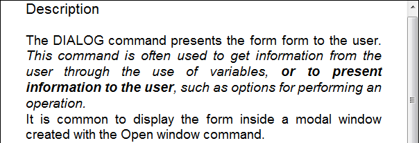

<!--REF #_command_.WP RESET ATTRIBUTES.Syntax-->**WP RESET ATTRIBUTES** ( *objCible* ; *nomAttribut* {; *nomAttribut2* ; ... ; *nomAttributN*} )<!-- END REF-->
<!--REF #_command_.WP RESET ATTRIBUTES.Params-->
| Paramètre | Type |  | Description |
| --- | --- | --- | --- |
| objCible | Objet | &#x1F852; | Plage ou élément ou document 4D Write Pro |
| nomAttribut | Chaîne | &#x1F852; | Nom(s) d'attribut(s) à réinitialiser |

<!-- END REF-->

#### Description 

<!--REF #_command_.WP RESET ATTRIBUTES.Summary-->La commande **WP RESET ATTRIBUTES** vous permet de réinitialiser la valeur d'un ou plusieurs attributs dans la plage, l'élément ou le document 4D Write Pro passé(e) en paramètre.<!-- END REF--> Cette commande peut traiter tout type d'attribut 4D Write Pro : caractère, paragraphe, document, table ou image. 

Dans le paramètre *objCible*, vous pouvez passer :

* un objet plage 4D Write Pro, ou
* un élément (en-tête / pied / corps / tableau / paragraphe / image en ligne ou ancrée / section / sous-section / feuille de style), ou
* un document 4D Write Pro.

Lorsqu'une valeur d'attribut est supprimée à l'aide de la commande **WP RESET ATTRIBUTES**, objCible prend la valeur par défaut. Les valeurs par défaut sont listées dans la section *Attributs 4D Write Pro*.

**Notes :** 

* Lorsque **WP RESET ATTRIBUTES** est appliqué à un objet section/sous-section, les attributs sont alors hérités de la section parent ou du document parent.
* Lorsque **WP RESET ATTRIBUTES** est appliqué à un objet feuille de style, cela supprime les attributs de la feuille de style, sauf s'il s'agit de la feuille de style par défaut ("Normal"), auquel cas la valeur par défaut s'applique à l'attribut (la feuille de style "Normal" définit tous les attributs de feuille de style).

Si l'attribut à réinitialiser n'était pas défini dans l'élément passé en paramètre, la commande ne fait rien.

#### Exemple 

Vous souhaitez supprimer plusieurs attributs de la sélection suivante :


Vous pouvez exécuter :

```4d
 $range:=WP Get selection(*;"WParea")
 WP RESET ATTRIBUTES($range;wk padding)
 WP RESET ATTRIBUTES($range;wk background color)
 WP RESET ATTRIBUTES($range;wk text underline style)
 WP RESET ATTRIBUTES($range;wk margin)
 WP RESET ATTRIBUTES($range;wk border style)
```

Le document résultant est alors :



#### Voir aussi 

*Attributs 4D Write Pro*  
[WP GET ATTRIBUTES](wp-get-attributes.md)  
[WP SET ATTRIBUTES](wp-set-attributes.md)  