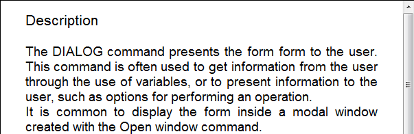

<!--REF #_command_.WP Text range.Syntax-->**WP Text range** ( *objCible* ; *débutPlage* ; *finPlage* ) -> Résultat<!-- END REF-->
<!--REF #_command_.WP Text range.Params-->
| Paramètre | Type |  | Description |
| --- | --- | --- | --- |
| objCible | Object | &#8594;  | Plage ou élément ou document 4D Write Pro |
| débutPlage | Integer | &#8594;  | Position du début de la plage dans la zone |
| finPlage | Integer | &#8594;  | Position de la fin de la plage dans la zone |
| Résultat | Object | &#8592; | Nouvel objet plage |

<!-- END REF-->

#### Compatibilité 

<!--REF #_command_.WP Text range.Summary-->La commande **WP Text range** était nommée **WP Create range** dans les versions précédentes de 4D Write Pro.<!-- END REF--> Elle a été renommée pour plus de clarté. 

#### Description 

La commande **WP Text range** retourne une nouvelle plage contenant les caractères situés entre *débutPlage* et *finPlage* dans l'objet *objCible*.

Un **objet plage 4D Write Pro** peut être utilisé pour manipuler des attributs sur une partie du document (notamment à l'aide des commandes [WP GET ATTRIBUTES](../commands/wp-get-attributes.md) et [WP SET ATTRIBUTES](../commands/wp-set-attributes.md)). Pour plus d'informations, veuillez vous reporter au paragraphe *Gestion des plages*.

Dans *objCible*, vous pouvez passer :

* un objet plage 4D Write Pro, ou
* un élément (tableau / ligne / paragraphe / image en ligne / corps / en-tête / pied / section / sous-section), ou
* un document 4D Write Pro.

Si un objet non valide est passé dans *objCible*, une plage vide est retournée.

Dans *débutPlage* et *finPlage*, passez des valeurs correspondant à la position du premier et du dernier caractère à sélectionner pour la plage. Vous pouvez passer wk start text dans *débutPlage* pour désigner le début du document et wk end text dans *finPlage* pour désigner la fin du document. N'oubliez pas qu'un document 4D Write Pro ne contient pas seulement du texte visible mais également des caractères de formatage et des balises qui sont inclus dans la plage.

**Note :** Si vous avez passé une référence d'élément tableau, ligne, paragraphe, image en ligne, body, en-tête, pied, section ou sous-section dans *objCible*, les valeurs *débutPlage* et *finPlage* seront relatives aux indices de début et de fin de la plage de l'élément. Par exemple, si un en-tête est passé, wk start text désigne le caractère de début de l'en-tête et wk end text le dernier caractère de l'en-tête ; si une référence d'élément tableau est passée, la commande retourne la plage de texte relative au tableau référencé. Si une section est passée, *débutPlage* et *finPlage* sont relatives au corps du document (zone parente d'une plage créée à partir d'une section). Voir l'exemple 2 ci-dessous.

#### Exemple 1 

Vous souhaitez sélectionner une plage de 12 caractères à partir du début d'un champ 4D Write Pro. Le champ est affiché dans un objet de formulaire :



Si vous exécutez :

```4d
 $range2:=WP Text range([SAMPLE]WP;wk start text;12)
 WP SELECT(*;"WParea";$range2)
```

... le résultat est le suivant :


#### Exemple 2 

Vous voulez créer une plage à partir d'une section : 

```4d
 var $wpRange : Object
 $wpRange:=WP Text range(wpSection;1;11) //retourne une plage créée à partir des 10 premiers caractères de la section
  //si la section commence à 100 dans le document :
  //$wpRange.start = 100
  //$wpRange.end = 111
```

#### Voir aussi 

[WP Bookmark range](wp-bookmark-range.md)  
[WP Get body](wp-get-body.md)  
[WP Get header](wp-get-header.md)  
[WP Paragraph range](wp-paragraph-range.md)  
[WP Picture range](wp-picture-range.md)  
[WP SELECT](wp-select.md)  
[WP Selection range](wp-selection-range.md)  
[WP Table range](wp-table-range.md)  