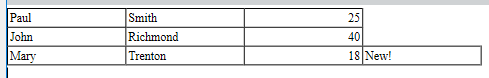
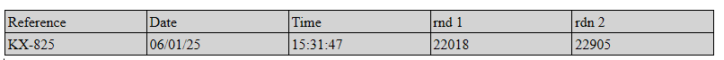
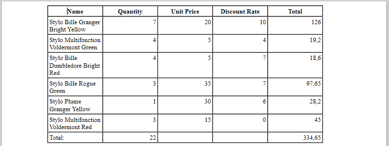

<!--REF #_command_.WP Table append row.Syntax-->**WP Table append row** ( *tableRef* : Object ; *...value* : any )  : Object<br/>**WP Table append row** ( *tableRef* : Object ; *valueColl* : Collection ) : Object<!-- END REF-->

<!--REF #_command_.WP Table append row.Params-->

<div class="no-index">

| Paramètres | Type       |                             | Description                                          |
| ---------- | ---------- | --------------------------- | ---------------------------------------------------- |
| tableRef   | Object     | &#8594; | Référence du tableau                                 |
| value      | any        | &#8594; | Valeur(s) à définir dans la ligne |
| valueColl  | Collection | &#8594; | Collection de valeurs à définir dans la ligne        |
| Résultat   | Object     | &#8592; | Objet plage ligne                                    |

</div>
<!-- END REF-->

## Description

La commande **WP Table append row**<!--REF #_command_.WP Table append row.Summary--> ajoute une ligne à la table *tableRef*, la remplit avec *value*(s) ou une collection *valueColl*, et renvoie l'objet de plage de lignes correspondant.<!-- END REF-->

La commande admet deux syntaxes :

- **Utilisation de valeurs comme paramètres:**
  Ajoute autant de cellules dans la ligne qu'il y a de valeurs fournies dans le(s) paramètre(s) *value*. Vous pouvez passer n'importe quel nombre de valeurs de différents types.

- **Utilisation d'une collection de valeurs (*valueColl)*:**
  Remplit la ligne avec les valeurs de la collection *valueColl*. Chaque élément de la collection correspond à une cellule de la ligne.

  Les types de valeurs suivants sont pris en charge dans les deux syntaxes : Texte, numérique, Heure, Date, Image et Objet (formules ou formules nommées renvoyant un élément de ligne).

L'alignement par défaut des cellules dépend du type de valeur :

- texte : aligné à gauche
- images : centrées
- autres types (nombres, date et heure) : alignés à droite

:::note Notes

- Les valeurs de type tableau ne sont pas prises en charge.
- Veillez à ce que le nombre de valeurs ou la taille de la collection corresponde au nombre de cellules du tableau afin d'éviter des résultats inattendus.

:::

La commande renvoie la nouvelle ligne sous la forme d'un objet de plage de lignes.

## Exemple 1

Vous souhaitez créer un tableau vide et y ajouter plusieurs lignes de tailles différentes. Vous pouvez écrire :

```4d
 var $wpTable;$wpRange;$wpRow1;$wpRow2;$wpRow3 : Object
 $wpRange:=WP Text range(WParea;wk start text;wk end text)
 $wpTable:=WP Insert table($wpRange;wk append)
 $wpRow1:=WP Table append row($wpTable;"Paul";"Smith";25)
 $wpRow2:=WP Table append row($wpTable;"John";"Richmond";40)
 $wpRow3:=WP Table append row($wpTable;"Mary";"Trenton";18;"New!")
```



## Exemple 2

Vous souhaitez créer un tableau vide et ajouter une ligne à l'aide d'une collection :

```4d
$table:=WP Insert table(WParea; wk replace; wk include in range)

$row:=WP Table append row($table; "Reference"; "Date"; "Time"; "rnd 1"; "rdn 2")
WP SET ATTRIBUTES($row; wk background color; "lightgrey")

$colItems:=[]
$colItems.push("KX-825")
$colItems.push(Formula(Current date))
$colItems.push(Formula(String(Current time; HH MM SS)))
$colItems.push(Formula(Random))
$colItems.push({name: "RND NUMBER"; formula: Formula(Random)})

$row:=WP Table append row($table; $colItems)
```



## Exemple 3

Dans une application de facturation, vous souhaitez créer un tableau automatiquement rempli avec les lignes de facture correspondantes :

```4d
 var $wpTable;$wpRange : Object
 
 $wpRange:=WP Text range(4DWPArea;wk start text;wk end text)
 
 $wpTable:=WP Insert table($wpRange;wk append) //créer le tableau
 
  // ajouter la ligne d'en-tête
 $row:=WP Table append row($wpTable;"Name";"Quantity";"Unit Price";"Discount Rate";"Total")
 WP SET ATTRIBUTES($row;wk font bold;wk true;wk text align;wk center)
 
  //simplement appliquer à la sélection
 APPLY TO SELECTION([INVOICE_LINES];WP Table append row($wpTable;[INVOICE_LINES]ProductName;[INVOICE_LINES]Quantity;[INVOICE_LINES]ProductUnitPrice;[INVOICE_LINES]DiscountRate;[INVOICE_LINES]Total))
 
  //ajouter une ligne de pied de page
 $row:=WP Table append row($wpTable;"Total:";Sum([INVOICE_LINES]Quantity);"";"";Sum([INVOICE_LINES]Total))
 
  //formater le tableau
 $range:=WP Table get columns($wpTable;1;5)
 WP SET ATTRIBUTES($range;wk width;"80pt")
 WP SET ATTRIBUTES($wpTable;wk font size;10)
```



## Voir également

[WP Insert table](../commands/wp-insert-table)</br>
[WP Table get rows](../commands/wp-table-get-rows)
