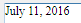
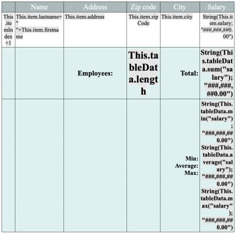
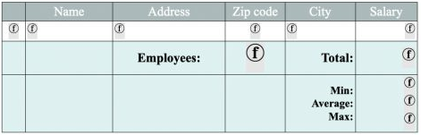
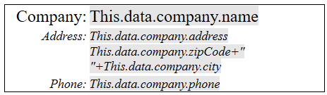
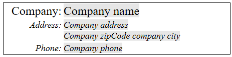
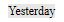
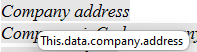

## Vue d’ensemble

Les documents 4D Write Pro peuvent contenir des références à des formules 4D telles que des variables, des champs, des expressions, des méthodes projet ou des commandes 4D. Des informations spécifiques telles que le numéro de page peuvent également être référencées par des formules (voir [Insertion de document et expressions de page](#inserting-date-and-time-formulas) ci-dessous).

L'insertion de formules dans les zones de 4D Write Pro se fait avec la commande [**WP INSERT FORMULA**](commands/wp-insert-formula.md) et peut être lue avec la commande [**WP Get formulas**](commands-legacy/wp-get-formulas.md). Ils sont également retournés par la commande [**WP Get text**](commands-legacy/wp-get-text.md).

### Évaluation des formules

Les formules sont évaluées :

- lorsqu'elles sont insérées dans un objet de formulaire qui affiche des valeurs calculées
- lorsque l'objet 4D Write Pro est chargé dans un objet de formulaire qui affiche les valeurs calculées
- lorsque la commande [**WP COMPUTE FORMULAS**](commands-legacy/wp-compute-formulas.md) est appelée
- lorsqu'elles sont "figées" à l'aide de la commande [**WP FREEZE FORMULAS**](commands-legacy/wp-freeze-formulas.md) (si elles n'ont pas déjà été calculées)
- avant impression (si pas déjà calculé)
- avant d'exporter vers .docx (si la formule ne peut pas être mappée avec les formules MS Word)
- lorsque les actions standard pour figer, imprimer, exporter ou calculer des formules sont appelées. Voir *Actions standard*

Les formules ne sont pas évaluées lorsqu'un document est chargé (en utilisant [**WP New**](commands-legacy/wp-new.md), [**WP Insert document body**](commands/wp-insert-document-body.md), ou `wpArea:=[table]field`) :

- si le document est uniquement hors écran,
- si le document est affiché à l'écran, mais l'objet de formulaire n'affiche que les références.

Les formules deviennent des valeurs statiques si vous appelez la commande [**WP FREEZE FORMULAS**](commands-legacy/wp-freeze-formulas.md) (sauf pour le numéro de page et le nombre de pages, voir ci-dessous).

**Note de compatibilité** : *La gestion des expressions à l'aide des commandes [**ST INSERT EXPRESSION**](../commands/st-insert-expression), [**ST Get expression**](../commands/st-get-expression), [**ST COMPUTE EXPRESSIONS**](../commands/st-compute-expressions), et [**ST FREEZE EXPRESSIONS**](../commands/st-freeze-expressions) est obsolète, mais elle est toujours prise en charge dans 4D Write Pro à des fins de compatibilité*.

:::note

Pour des raisons de sécurité, lorsque des formules sont collées à partir d'une autre application 4D ou d'un environnement externe, seules les *valeurs calculées* (texte ou images) disponibles au moment de la copie sont collées. Si aucune valeur n'est disponible (par exemple, la formule n'a jamais été calculée), 4D colle la source de la formule sous forme de texte brut.

:::

### Exemple

Vous souhaitez remplacer la sélection d'une zone de 4D Write Pro par le contenu d'une variable :

```4d
 var fullName: Text
 var $sel: Object
 fullName:="John Smith"
 $sel:=WP Selection range(4DWPArea)
 Case of
    :(Form event code=On Clicked)
       WP INSERT FORMULA($sel;Formula(fullName);wk replace)
 End case
```

## Objet de contexte de formule

Vous pouvez insérer des expressions spéciales liées aux attributs du document dans n'importe quelle zone du document (corps, en-tête, pied de page) à l'aide de la commande [WP Insert formula](commands/wp-insert-formula.md). Dans une formule, un objet de contexte de formule est automatiquement exposé. Vous pouvez utiliser les propriétés de cet objet par l'intermédiaire de [**This**](../commands/this) :

| Propriétés                                              | Type   | Description                                                                                                                                                                                                                                                                                                                                                                                                                         |
| ------------------------------------------------------- | ------ | ----------------------------------------------------------------------------------------------------------------------------------------------------------------------------------------------------------------------------------------------------------------------------------------------------------------------------------------------------------------------------------------------------------------------------------- |
| This.title                              | Text   | Titre défini dans l'attribut wk title                                                                                                                                                                                                                                                                                                                                                                                               |
| This.author                             | Text   | Auteur défini dans l'attribut wk author                                                                                                                                                                                                                                                                                                                                                                                             |
| This.subject                            | Text   | Sujet défini dans l'attribut wk subject attribute                                                                                                                                                                                                                                                                                                                                                                                   |
| This.company                            | Text   | Entreprise définie dans l'attribut wk company attribute                                                                                                                                                                                                                                                                                                                                                                             |
| This.notes                              | Text   | Notes définies dans l'attribut wk notes                                                                                                                                                                                                                                                                                                                                                                                             |
| This.dateCreation                       | Date   | Date de création définie dans l'attribut wk date creation                                                                                                                                                                                                                                                                                                                                                                           |
| This.dateModified                       | Date   | Date de modification définie dans l'attribut wk date modified                                                                                                                                                                                                                                                                                                                                                                       |
| This.pageNumber (\*) | Number | Numéro de page tel qu'il est défini :<ul><li>A partir du début du document (par défaut) ou </li><li>A partir du début de la page de la section s'il est défini par le début de la page de la section.</li></ul>  Cette formule est toujours dynamique ; elle n'est pas affectée par la commande [**WP FREEZE FORMULAS**](commands-legacy/wp-freeze-formulas.md). |
| This.pageCount (\*)  | Number | Nombre de pages : nombre total de pages.<br/> Cette formule est toujours dynamique ; elle n'est pas affectée par la commande [**WP FREEZE FORMULAS**](commands-legacy/wp-freeze-formulas.md).                                                                                                                                                                                       |
| This.document                           | Object | Document 4D Write Pro                                                                                                                                                                                                                                                                                                                                                                                                               |
| This.data                               | Object | Contexte des données du document 4D Write Pro défini par [**WP SET DATA CONTEXT**](commands-legacy/wp-set-data-context.md)                                                                                                                                                                                                                                                                                                          |
| This.sectionIndex                       | Number | L'indice de la section dans le document 4D Write Pro à partir de 1                                                                                                                                                                                                                                                                                                                                                                  |
| This.pageIndex                          | Number | Le numéro de page courant dans le document 4D Write Pro à partir de 1 (indépendamment des numéros de page de la section)                                                                                                                                                                                                                                                                                         |
| This.sectionName                        | String | Le nom que l'utilisateur donne à la section                                                                                                                                                                                                                                                                                                                                                                                         |

:::note

Lorsque vous **travaillez avec des tables**, des [expressions contextuelles supplémentaires](./user-legacy/handling-tables.md#table-formula-object) telles que `This.item` sont disponibles.

:::

(\*) **Important** : **This.pageNumber**, **This.pageIndex** et **This.pageCount** ne peuvent être utilisés que directement dans une formule 4D Write Pro (elles doivent être présentes dans la chaîne *formula.source*). Elles renverront des valeurs incorrectes si elles sont utilisées par le langage 4D dans une méthode appelée par la formule. Toutefois, elles peuvent être passées en tant que paramètres à une méthode appelée directement par la formule :

- Cela fonctionnera : « *formatNumber(This.pageNumber)* »
- Cela ne fonctionnera pas : " *formatNumber* " avec la méthode *formatNumber* traitant *This.pageNumber*.

Par exemple, pour insérer le numéro de page dans la zone de pied de page :

```4d
 $footer:=WP Get footer(4DWP;1)
 WP INSERT FORMULA($footer;Formula(This.pageNumber);wk append)
  //Utilisation de Formula(myMethod) avec myMethod traitant This.pageNumber
  //ne fonctionnerait pas correctement
```

:::note

Pour plus d'informations sur l'insertion de formules, voir [WP INSERT FORMULA](../commands/wp-insert-formula).

:::

## Insertion des formules date et time

**Date**

Lorsque la commande [**Current date**](../commands/current-date), une variable date ou une méthode renvoyant une date est insérée dans une formule, elle est automatiquement transformée en texte en utilisant le format date système court.

**Time**

Lorsque la commande [**Current time**](../commands/current-time), une variable temporelle ou une méthode retournant une heure est insérée dans une formule, elle doit être incluse dans une commande [**String**](../commands/string) car le type heure n'est pas pris en charge dans JSON. Examinez les exemples de formules suivants :

```4d
  // Bonne pratique
 $formula1:=Formula(String(Current time)) //OK 
 
  // Fonctionnera mais n'est généralement pas recommandé, sauf après "Edit formula"
 $formula2:=Formula from string("String(Current time)") //OK
 
  // Code erroné car les valeurs de temps seraient affichées en tant que longint 
  //pour des secondes (ou millisecondes), pas comme une heure
 $formula3:=Formula from string("Current time") //NON valide
 $formula4:=Formula(Current time) //NON valide
 
```

## Prise en charge de la structure virtuelle

Les expressions de tables et de champs insérées dans les documents de 4D Write Pro prennent en charge la définition de structure virtuelle de la base de données. La structure virtuelle exposée aux formules est définie par les commandes [**SET FIELD TITLES**](../commands/set-field-titles)(...;\*) et [**SET TABLE TITLES**](../commands/set-table-titles)(...;\*).

Quand une structure virtuelle est définie :

- les références aux expressions contenant des champs affichent des noms virtuels alors que le document 4D Write Pro affiche des références et non des valeurs.
- [**WP Get text**](commands-legacy/wp-get-text.md) retourne des noms de structures virtuelles si l'option `wk expressions as source` est définie dans le paramètre d'expression.
- [WP Insert formula](commands/wp-insert-formula.md) ignore la structure virtuelle et attend toujours de vrais noms de table/champs

:::note

Lorsqu'un document est affiché en mode "afficher expressions", les références de tables ou de champs qui n'appartiennent pas à la structure virtuelle sont affichées avec les caractères "`?`", par exemple `[VirtualTableName]?` lorsque le champ n'est pas défini dans la structure virtuelle.

:::

## Affichage des formules

Vous pouvez contrôler comment les formules sont affichées dans vos documents :

- en tant que *valeurs* ou en tant que *références*
- lorsqu'il est affiché en tant que références, afficher le texte source, symbole ou nom.

### Références ou valeurs

Par défaut, les formules 4D sont affichées sous forme de valeurs. Lorsque vous insérez une formule 4D, 4D Write Pro calcule et affiche sa valeur courante.  Si vous voulez savoir quelle formule est utilisée ou quel est son nom, vous devez l'afficher comme référence.

Pour afficher les formules en tant que références, vous pouvez:

- cocher l'option **Afficher les références** dans la liste des propriétés (voir *Configuration des propriétés de vue*), ou
- utiliser l'action standard visibleReferences (voir *Expressions dynamiques*), ou
- utiliser la commande [**WP SET VIEW PROPERTIES**](commands-legacy/wp-set-view-properties.md) avec le sélecteur `wk visible references` à **True**.

Les références de formule peuvent être affichées en tant que :

- textes sources (par défaut)
- symboles
- noms

### Références en textes sources (par défaut)

Lorsque les formules sont affichées en tant que références, le texte source de la formule apparaît par défaut dans votre document, avec un arrière-plan gris (qui peut être personnalisé à l'aide du sélecteur `wk formula highlight`).

Par exemple, vous avez inséré la date courante avec un format, la date s'affiche :



Lorsque vous affichez les formules comme références, la **source** de la formule est affichée :


### Références en symboles

Lorsque les textes sources des formules sont affichés dans un document, le rendu peut être confus si vous travaillez sur des modèles sophistiqués utilisant des tableaux, par exemple, et si les formules sont complexes :



Dans ce cas, vous pouvez afficher les références des formules sous forme de symboles , afin de rendre le document plus compact :



Pour afficher les références de formules en tant que symboles, vous pouvez :

- cocher l'option **Afficher la source de la formule comme symbole** dans la liste des propriétés (voir *Configuration des propriétés de vue*), ou
- utiliser l'action standard displayFormulaAsSymbol (voir *Utilisation des actions standard de 4D Write Pro*), ou
- utiliser la commande [**WP SET VIEW PROPERTIES**](commands-legacy/wp-set-view-properties.md) avec le sélecteur `wk display formula as symbol` sur **True**.

### Références en noms

Vous pouvez attribuer des noms aux formules, ce qui rend les modèles de documents de 4D Write Pro plus faciles à lire et à comprendre pour les utilisateurs. Lorsque les formules sont affichées comme des références (et non comme des symboles) et que vous avez défini un nom pour une formule, le nom de la formule est affiché.

Par exemple, les références de formule suivantes sont affichées comme texte source par défaut :



Si vous attribuez des noms de formule, ils sont affichés à la place des textes :



Pour attribuer un nom à une formule, vous devez utiliser la commande [WP Insert formula](commands/wp-insert-formula.md) avec un paramètre objet. Par exemple :

```4d
  //insère le jour précédent dans le document
 $o:=New object("formula";Formula(Current date-1);"name";"Yesterday")
 $range:=WP Text range(WPArea;wk start text;wk end text)
 WP INSERT FORMULA($range;$o;wk append)
 
```



:::note

Seules les formules en ligne peuvent avoir un nom (les formules pour les images ancrées, les ruptures et les formules de source de données de tableau ne peuvent pas avoir de nom).

:::

### Infobulles des formules

Quel que soit le mode d'affichage des formule, vous pouvez obtenir des informations supplémentaires sur une formule grâce aux **infobulles** qui s'affichent lorsque vous passez la souris sur la formule.

- Lorsque les formules n'ont pas de nom, les infobulles fournissent le texte source des formules :

  

- Lorsque les formules ont des noms mais sont affichées sous forme de valeurs ou de symboles, l'infobulle fournit le nom des formules :

  

Dans ce contexte, vous pouvez afficher le texte source de la formule en appuyant sur **Ctrl** (Windows) ou **Cmd** (macOS) tout en survolant la formule.

- Lorsque les formules ont des noms et sont affichées sous forme de noms, aucune infobulle n'est affichée par défaut.
  Vous pouvez afficher le texte source de la formule en appuyant sur **Ctrl** (Windows) ou **Cmd** (macOS) tout en survolant la formule :
  [
  

#### Voir également

[Télécharger le HDI](http://download.4d.com/Demos/4D_v16/HDI_4DWP_Filter4DExpressions.zip)</br>
*Utilisation des commandes du thème Styled Text*

