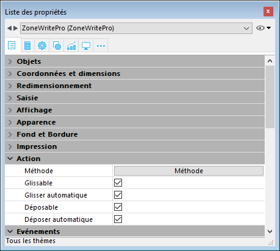
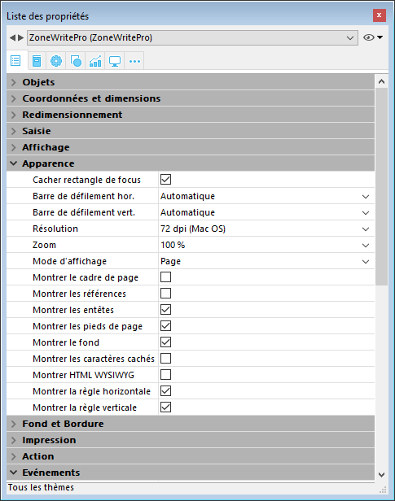
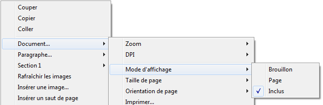

## Glisser-déposer 

Pour configurer les fonctionnalités de glisser-déposer dans vos zones 4D Write Pro, vous devez sélectionner les options appropriées dans le thème "Action" de la Liste des propriétés :

Les zones 4D Write Pro prennent en charge deux modes de glisser-déposer :

* **Mode personnalisé :**  lorsque seules les options "Glissable" et "Déposable" sont cochées.  
Dans ce mode, vous pouvez sélectionner du texte et commencer à le déplacer. La méthode objet est alors appelée avec l'événement [On Begin Drag Over](../../Events/onBeginDragOver.md), et vous pouvez alors définir l'action de déposer via du code personnalisé.  
* **Mode automatique :**  lorsque toutes les options sont cochées ("Glissable", "Déposable", "Glisser automatique" et "Déposer automatique"). Dans ce mode, Vous pouvez automatiquement déplacer ou copier (en maintenant la touche **Alt/Option**) le texte sélectionné. L'événement [On Begin Drag Over](../../Events/onBeginDragOver.md) n'est pas généré.

**Note :** Sélectionner uniquement les options "Glisser automatique" et "Déposer automatique" n'aura pas d'effet sur la zone 4D Write Pro. 

## Les propriétés d'affichage 

Les propriétés de vue des documents 4D Write Pro sont accessibles dans la Liste des propriétés pour les zones 4D Write Pro. Elles vous permettent de définir la façon dont un document sera visualisé par défaut dans cette zone. Ces propriétés définissent, par exemple, si les documents 4D Write Pro doivent être affichés en vue "impression" ou en vue "Web". Vous pouvez définir différentes vues pour un document 4D Write Pro dans le même formulaire.

**Note :** Les propriétés de vue peuvent être gérées dynamiquement à l'aide des commandes [WP FIXER PROPRIETES VUE](../commands/wp-fixer-proprietes-vue) et [WP Lire proprietes vue](../commands/wp-lire-proprietes-vue).

Les propriétés de vue des documents sont gérées via des options spécifiques dans le thème **Apparence** de la Liste des propriétés pour les objets de formulaire 4D Write Pro :

* **Résolution** : Définit la résolution écran pour le contenu de la zone 4D Write Pro. Par défaut, elle est fixée à **72 dpi (Mac OS)**, qui est la résolution standard des formulaires 4D sur toutes les plates-formes. Définir une valeur de dpi fixe permet d'obtenir un rendu de document identique sur les plates-formes Mac OS et Windows. L'option Automatique adapte la résolution à la plate-forme courante, ce qui signifie que le rendu du document sera différent entre les plates-formes Mac OS et Windows.
* **Zoom** : Définit le pourcentage de zoom pour l'affichage du contenu de la zone 4D Write Pro area.
* **Mode d'affichage** : Définit le type de vue à utiliser pour l'affichage du document 4D Write Pro dans la zone du formulaire. Trois modes sont disponibles :  
   * **Page** : vue la plus complète, incluant le cadre de page, l'orientation, les marges, les sauts de page, les en-têtes et les pieds de page, etc. Pour plus d'informations, veuillez vous reporter au paragraphe *Fonctionnalités de l'affichage en page*.  
   * **Brouillon** : mode brouillon avec des propriétés de document basiques.  
   * **Inclus** : mode adapté aux zones incluses ; les marges, en-têtes, pieds de pages, cadre de page, etc. ne sont pas affichés.  
   Ce mode permet également d'obtenir une vue "Web" (en l'associant à la résolution **96 dpi** et à l'option **Montrer HTML WYSIWYG**).  
         
   **Note** : La propriété **Mode d'affichage** est utilisée uniquement pour le rendu écran. Pour l'impression, des règles de rendu spécifiques sont automatiquement mises en oeuvre (cf. *Imprimer des documents 4D Write Pro*).
* **Montrer le cadre de page** : Affiche/masque les limites des pages lorsque le mode d'affichage est "Page".
* **Montrer les références** : Affiche en tant que *références* toutes les formules (ou expressions) 4D insérées dans le document (voir *Gérer des formules*). Lorsque cette option est désélectionnée, les formules 4D sont affichées en tant que *valeurs*.  
**Note** : Les références aux formules peuvent être affichées sous forme de symboles (voir ci-dessous).
* **Montrer les entêtes / pieds de page** : Affiche/masque les en-têtes et les pieds de page lorsque le mode d'affichage est "Page". Pour plus d'informations sur les en-têtes et les pieds de page, veuillez vous reporter à la section *Utiliser une zone 4D Write Pro*.
* **Montrer le fond et les éléments ancrés** : Affiche/masque les images de fond, les couleurs de fond, les images ancrées et les zones de texte.
* Montrer les caractères cachés : Affiche/masque les caractères invisibles.
* **Montrer HTML WYSIWYG** : Active/désactive la vue WYSIWYG HTML, dans laquelle les attributs 4D Write Pro avancés qui ne sont pas compatibles avec tous les navigateurs sont supprimés.
* **Montrer la règle horizontale** : Affiche/masque la règle horizontale dans le document. Pour plus d'informations sur les règles dans 4D Write Pro, reportez-vous à la section *Utiliser les règles*.
* **Montrer la règle verticale :** Affiche/masque la règle verticale lorsque le document est en mode Page. Pour plus d'informations sur les règles dans 4D Write Pro, reportez-vous à la section *Utiliser les règles*.
* **Montrer les images vides ou non prises en charge :** Affiche/masque un rectangle noir pour les images qui ne peuvent pas être chargées ou calculées (images vides ou dans un format non pris en charge). Pour plus d'informations, consultez la section *Empty pictures*.
* **Afficher la formule source avec un symbole :** Affiche le texte source des formules sous forme de symboles  lorsque les expressions sont affichées comme références (voir ci-dessus). L'affichage des formules sous forme de symboles rend les documents de modèle plus compacts et plus wysiwyg(Ce que vous voyez est ce que vous obtenez).

## Menu contextuel 

Lorsque la propriété **Menu contextuel** est [cochée pour une zone 4D Write Pro](./defining-a-4d-write-pro-area.md#using-the-4d-write-pro-area-object), un menu contextuel complet est disponible pour les utilisateurs lorsque le formulaire est lancé à l'exécution :

 

Ce menu donne accès à l'ensemble des fonctions de 4D Write Pro.

## Sélectionner le mode d'affichage 

4D Write Pro propose trois modes d'affichage pour les documents :

* **Brouillon** : Mode brouillon avec des propriétés basiques
* **Page** (défaut) : Mode "vue impression"
* **Inclus** : Mode adapté aux zones incluses dans les formulaires ; dans ce mode, les marges, pieds de page, colonnes, en-têtes, cadres, etc, ne sont pas affichés.  
Ce mode peut également être utilisé pour obtenir un affichage de type Web (si vous avez également sélectionné la résolution 96 dpi et l'option HTML WYSIWYG).

Le mode d'affichage peut être configuré via le menu contextuel de la zone :

**Note :** Le mode d'affichage n'est pas stocké avec le document.

Pour les zones incluses dans les formulaires 4D, le mode d'affichage peut également être défini par défaut à l'aide de la Liste des propriétés. Dans ce cas, le mode d'affichage est une propriété de l'objet de formulaire 4D Write Pro (pour plus d'informations, veuillez vous reporter au paragraphe *Configurer les propriétés d'affichage*).

## Les actions standard 

L'interface utilisateur des zones 4D Write Pro peut être gérée grâce à un grand nombre d'**actions standard**. Les actions standard peuvent être assignées :

* aux commandes de menu, disponibles via une **barre de menu** ou la commande [Pop up menu dynamique](../../commands/pop-up-menu-dynamique),
* aux éléments de listes, disponibles via des pop-ups/listes déroulantes ou des pop-up menus hiérarchiques,
* aux boutons, cases à cocher,
* ou exécutées avec la commande [APPELER ACTION](../../commands/appeler-action).

Lorsqu'elles sont assignées à des objets d'interface, les actions standard gèrent les activations/désactivations de l'objet en fonction du contexte. Pour plus d'informations, référez-vous à la section [Actions standard](#standard-actions).

Deux catégories d'actions sont disponibles pour les zones 4D Write Pro :

* des actions spécifiques à 4D Write Pro, qui ne peuvent être utilisées qu'avec les zones 4D Write Pro,
* des *[Autres actions](#other-actions)* plus génériques de gestion des polices, expressions, du correcteur orthographique et des opérations d'édition, qui peuvent être utilisées avec les zones 4D Write Pro et les autres zones 4D. Ces actions sont détaillées dans la section [Actions standard](#standard-actions).

### Actions 4D Write Pro 

Les actions standard ci-dessous sont disponibles pour les zones 4D Write Pro :

**Notes :**

* Les actions qui affichent un menu/une liste automatique peuvent uniquement être attachées aux commandes de menus ou aux objets pop-ups/liste déroulantes et pop-up menus hiérarchiques (voir *Sous-menu*).
* Les cases à cocher et cases à cocher 3D doivent être associées à des actions de statut, telles que "section/differentFirstPage" ou "visibleHorizontalRuler". L'option "Trois états" est prise en charge avec les cases à cocher standard uniquement.
* Un statut d'action de section est toujours égal au statut courant de la section sélectionnée (statut hérité si l'attribut est hérité de la section parente ou de l'attribut par défaut) car il doit refléter le statut de la section sélectionnée (le statut qui est actuellement appliqué à la section). Cependant, modifier un attribut de section avec une action standard surchargera uniquement l'attribut de la section sélectionnée.
* *Sous-menu* : Lorsqu'elles sont utilisées sans paramètres et associées à une commande de menu, un objet pop-up/Liste déroulante ou pop-up menu hiérarchqiue, ces actions affichent un sous-menu automatique. Par exemple, si vous assignez l'action "backgroundColor" à une commande de menu, la sélection de cette commande de menu à l'exécution affichera automatiquement les commandes du sous-menu "couleur de fond". Si vous assignez l'action "zoom" à un pop-up menu hiérarchique, il contiendra automatiquement une liste de valeurs de zoom prédéfinies. A noter que ces actions ne peuvent pas être assignées à des boutons.
* *showDialog* : Ajouter la chaîne "/showDialog**"** au nom de l'action permet d'afficher la boîte de dialogue standard associée à l'action. Par exemple, vous pouvez utiliser "paragraph/styleSheet/showDialog" pour ouvrir le dialogue permettant de saisir le nom d'une nouvelle feuille de style.

| **Nom de l'action** | **Syntaxe** | **Disponible avec** | **Description** |
|----------------------|-------------|----------------------|------------------|
| anchorHorizontalAlign | {image \| textBox}/anchorHorizontalAlign?value={left | center | right} | Image,  zone de texte,  *Sous-menu* | Définit l'alignement horizontal de l'élément, relatif à **anchorOrigin** pour les images/zones de texte en page ou à la zone de format pour les images/zones de texte en mode inclus. Cette action réinitialise à 0 le décalage horizontal. (non activée pour les images en ligne). |
| anchoring | {image \| textBox}/anchoring | *Sous-menu* | Sous-menu par défaut avec des actions de paramètres d'ancrage pour les images ou les zones de texte |
| anchorLayout | image/anchorLayout?value={front \| behind | wrapTopBottom | wrapSquareLeft | wrapSquareRight | wrapSquareLargest | wrapSquare | inline}   textBox/anchorLayout?value={front | behind | wrapTopBottom | wrapSquareLeft | wrapSquareRight | wrapSquareLargest | wrapSquare} | Image,  zone de texte,  *Sous-menu* | Définit le type de position d'ancre pour une image ou une zone de texte. Peut être utilisée pour transformer une image en ligne en image ancrée, ou l'inverse.  Note : Si une image ancrée est transformée en image en ligne, elle est insérée au début du texte sélectionné.  La valeur " en ligne " n'est pas supportée pour les zones de texte.  |
| anchorOrigin | {image \| textBox}/anchorOrigin?value={paper-box | header-box | footer-box} | Image,  zone de texte,  *Sous-menu* |  Définit la zone relative à la position absolue d'une image ancrée ou d'une zone de texte. Si l'élément est relative à la zone d'en-tête ou de pied (header-box/footer-box) qui n'est pas visible sur une page, l'image n'est pas affichée. Cette action remet à zéro les valeurs de décalage horizontal et vertical.   Mode Page uniquement, non activée pour les images en ligne.   |
| anchorPage | {image \| textBox}/anchorPage?value={all | current | currentSubSection} | Image,  zone de texte,  *Sous-menu* |  Définit la ou les page(s) où l'image ou la zone de texte sélectionnée est affichée (non activée pour les images en ligne).   Mode page uniquement.   |
| anchorSection | {image \| textBox}/anchorSection?value={all | current} | Image,  zone de texte,  *Sous-menu* |  Définit la ou les section(s) où l'image ou la zone de texte sélectionnée est affichée (non activée pour les images en ligne).  Mode page uniquement.   |
| anchorVerticalAlign | {image \| textBox}/anchorVerticalAlign?value={top | center | bottom} | Image,  zone de texte,  *Sous-menu* |  Définit l'alignement vertical de l'image ou la zone de texte, relatif à **anchorOrigin** pour une image ou une zone texte en page, ou à la zone de format pour une image ou une zone texte en mode inclus. Cette action réinitialise à 0 le décalage vertical (non activée pour les images en ligne). Note : Voir l'action "verticalAlign" pour l'alignement vertical à l'intérieur de la zone de texte.   |
| avoidPageBreakInside | {paragraph/}avoidPageBreakInside | Paragraphe |     |
| background             | {doc \| paragraph \| image \| textBox \| section \| header \| footer \| table \| row \| column \| cell/}background                                                                                                                 | Document, Paragraphe, Image, zone de texte, Section, En-tête, Pied, Table, Ligne, Colonne, Cellule, *Sous-menu*                                                                 | Pour les commandes de menu uniquement. Sous-menu par défaut pour tous les attributs de fond.                                                                                                                                        |
| backgroundClip         | {doc \| paragraph \| image \| textBox \| section \| header \| footer \| table \| row \| column \| cell/}backgroundClip?value={paper-box \| border-box \| padding-box \| content-box}                                             | Document, Paragraphe, Image, zone de texte, Section, En-tête, Pied, Tableau, Ligne, Colonne, Cellule, *Sous-menu*                                                               | Modifie la zone de découpe du fond de la cible (par défaut, la cible est le paragraphe). Paper-box est disponible uniquement avec doc et section.                                                                                   |
| backgroundColor        | {doc \| paragraph \| image \| textBox \| section \| header \| footer \| table \| row \| column \| cell/}backgroundColor?value={<Css_color> \| transparent}                                                                         | Document, Paragraphe, Image, zone de texte, Section, En-tête, Pied, Tableau, Ligne, Colonne, Cellule, *Sous-menu*, *showDialog*                                                 | Modifie l'arrière-plan de la cible.                                                                                                                                                                                                 |
| backgroundDisplayMode  | {doc \| paragraph \| image \| textBox \| section \| header \| footer \| table \| row \| column \| cell/}backgroundDisplayMode?value=scaledToFit \| truncated \| truncatedCentered \| proportional \| proportionalCentered \| replicated \| replicatedCentered | Document, Paragraphe, Image, zone de texte, Section, En-tête, Pied, Tableau, Ligne, Colonne, Cellule, *Sous-menu*                                                               | Définit le mode d'affichage des images utilisées comme arrière-plan.                                                                                                                                                                |
| backgroundImage        | {doc \| paragraph \| image \| textBox \| section \| header \| footer \| table \| row \| column \| cell/}backgroundImage?value=none                                                                                                 | Document, Paragraphe, Image, zone de texte, Section, En-tête, Pied, Tableau, Ligne, Colonne, Cellule, *Sous-menu*, *showDialog*                                                 | Efface l'image d'arrière-plan de la cible (par défaut, la cible est le paragraphe).                                                                                                                                                 |
| backgroundOrigin       | {doc \| paragraph \| image \| textBox \| section \| header \| footer \| table \| row \| column \| cell/}backgroundOrigin?value={paper-box \| border-box \| padding-box \| content-box}                                           | Document, Paragraphe, Image, zone de texte, Section, En-tête, Pied, Tableau, Ligne, Colonne, Cellule, *Sous-menu*                                                               | Modifie l'origine de l'image d'arrière-plan de la cible (la cible par défaut est le paragraphe). Paper-box est disponible uniquement avec doc et section.                                                                          |
| backgroundPositionH    | {doc \| paragraph \| image \| textBox \| section \| header \| footer \| table \| row \| column \| cell/}backgroundPositionH?value={left \| right \| center}                                                                       | Document, Paragraphe, Image, zone de texte, Section, En-tête, Pied, Tableau, Ligne, Colonne, Cellule, *Sous-menu*                                                               | Modifie l'alignement horizontal de l'image d'arrière-plan de la cible (la cible par défaut est le paragraphe). Ex: `paragraph/backgroundPositionH?value=left`                                                                  |
| backgroundPositionV    | {doc \| paragraph \| image \| textBox \| section \| header \| footer \| table \| row \| column \| cell/}backgroundPositionV?value={top \| bottom \| center}                                                                       | Document, Paragraphe, Image, zone de texte, Section, En-tête, Pied, Tableau, Ligne, Colonne, Cellule, *Sous-menu*                                                               | Modifie l'alignement vertical de l'image d'arrière-plan de la cible (la cible par défaut est le paragraphe). Ex: `paragraph/backgroundPositionV?value=top`                                                                     |
| backgroundRepeat       | {doc \| paragraph \| image \| textBox \| section \| header \| footer \| table \| row \| column \| cell/}backgroundRepeat?value={no-repeat \| repeat \| repeat-x \| repeat-y}                                                       | Document, Paragraphe, Image, zone de texte, Section, En-tête, Pied, Tableau, Ligne, Colonne, Cellule, *Sous-menu*                                                               | Modifie le mode de répétition de l'image d'arrière-plan de la cible (la cible par défaut est le paragraphe).                                                                                                                        |
| backgroundSizeH        | {doc \| paragraph \| image \| textBox \| section \| header \| footer \| table \| row \| column \| cell/}backgroundSizeH?value={<Css_length> \| <Css_percentage> \| auto \| cover \| contain}                                       | Document, Paragraphe, Image, zone de texte, Section, En-tête, Pied, Tableau, Ligne, Colonne, Cellule, *Sous-menu*                                                               | Modifie la largeur de l'image d'arrière-plan de la cible (la cible par défaut est le paragraphe). Ex: `paragraph/backgroundSizeH?value=100%`, `section/backgroundSizeH?value=cover`                                            |
| backgroundSizeV        | {doc \| paragraph \| image \| textBox \| section \| header \| footer \| table \| row \| column \| cell/}backgroundSizeV?value={<Css_length> \| <Css_percentage> \| auto}                                                           | Document, Paragraphe, Image, zone de texte, Section, En-tête, Pied, Tableau, Ligne, Colonne, Cellule, *Sous-menu*                                                               | Modifie la hauteur de l'image d'arrière-plan de la cible (la cible par défaut est le paragraphe). Ex: `paragraph/backgroundSizeV?value=50%`, `section/backgroundSizeV?value=40pt`                                              |
| bookmark | bookmark?index=\<number> | *Sous-menu* | Sélectionne le Nième signet.   Ex: *bookmark?index=2 // sélectionne le deuxième signet* |
| borderCollapse | borderCollapse | Paragraphe | Fusionne les bordures de paragraphes et les marges intérieures (padding). |
| borderColor | {doc \| paragraph \| image \| textBox \| section \| header \| footer \| table \| row \| column \| cell/}{inside \| outside/}{borderColor \| borderColorLeft \| borderColorRight \| borderColorTop \| borderColorBottom \| borderColorLeftRight \| borderColorTopBottom}?value=\<Css\_color> | Document, Paragraphe, Image, zone de texte, Section, En-tête, Pied, Tableau, Ligne, Colonne, Cellule, *Sous-menu*, *showDialog* | Modifie la couleur de la bordure de la cible (la cible par défaut est le paragraphe).   Ex: *paragraph/borderColorLeft?value=green* |
| borderRadius | {doc \| paragraph \| image \| textBox \| section \| header \| footer/}borderRadius?value=\<Css\_length> | Document, Paragraphe, Image, zone de texte, Section, En-tête, Pied, *Sous-menu* | Change le rayon pour les coins arrondis de la cible (par défaut la cible est le paragraphe).  Ex: *paragraph/borderRadius?value=4pt* |
| borders | {doc \| paragraph \| image \| textBox \| section \| header \| footer \| table \| row \| column \| cell/}{inside \| outside/}borders | Document, Paragraphe, Image, zone de texte, Section, En-tête, Pied, Table, Ligne, Colonne, Cellule, *Sous-menu* | Sous-menu par défaut pour les bordures de la cible. |
| borderStyle | {doc \| paragraph \| image \| textBox \| section \| header \| footer \| table \| row \| column \| cell/}{inside \| outside/}{borderStyle \| borderStyleLeft \| borderStyleRight \| borderStyleTop \| borderStyleBottom \| borderStyleLeftRight \| borderStyleTopBottom}?value={none \| hidden \| dotted \| dashed \| solid \| double \| groove \| ridge \| inset \| outset} | Document, Paragraphe, Image, zone de texte, Section, En-tête, Pied, Tableau, Ligne, Colonne, Cellule, *Sous-menu* | Modifie le style de la bordure de la cible (par défaut la cible est le paragraphe).  Ex: *paragraph/borderStyleLeft?value=double* Ex: *outside/borderStyle?value=solid* Ex: *inside/borderStyle?value=none* |
| borderWidth | {doc \| paragraph \| image \| textBox \| section \| header \| footer \| table \| row \| column \| cell/}{inside \| outside/}{borderWidth \| borderWidthLeft \| borderWidthRight \| borderWidthTop \| borderWidthBottom \| borderWidthLeftRight \| borderWidthTopBottom}?value=\<Css\_length> | Document, Paragraphe, Image, zone de texte, Section, En-tête, Pied, Tableau, Ligne, Colonne, Cellule, *Sous-menu* | Modifie la largeur de la bordure de la cible (par défaut la cible est le paragraphe).   Ex: *paragraph/borderWidthLeft?value=4pt* |
| columnCount | {section/}columnCount?value={1<=number<=20} | Document, Section, *Sous-menu* | Nombre de colonnes dans le document et/ou la section courante (la cible par défaut est le document).  Ex: *section/columnCount?value=3* |
| columnRuleColor | {section/}columnRuleColor?value={CSS color} | Document, Section, *Sous-menu*, *showDialog* | Couleur de la ligne de séparation verticale entre les colonnes du document ou de la section.  Ex: *columnRuleColor?value="#FFFFFF"* |
| columnRuleStyle | {section/}columnRuleStyle?value={none \| dotted \| dashed \| solid \| double \| groove \| ridge \| inset \| outset} | Document, Section, *Sous-menu* | Style de la ligne de séparation verticale entre les colonnes du document ou de la section.  Ex: *columnRuleStyle?value=solid* |
| columnRuleWidth | {section/}columnRuleWidth?value={CSS length} | Document, Section, *Sous-menu* | Largeur de la ligne de séparation verticale entre les colonnes du document ou de la section.  Ex: *columnRuleWidth?value=2pt* |
| columns | {section/}columns | Document, Section, *Sous-menu* | Pour les commandes de menu uniquement. Crée automatiquement un sous-menu **Colonnes** complet avec tous les sous-menus d'action de colonne (hormis *insertColumnBreak*). |
| columnSpacing | {section/}columnSpacing?value={CSS length} | Document, Section, *Sous-menu* | Espacement entre deux colonnes dans le document et/ou la section courante.  Ex: *columnSpacing?value=1cm* |
| deleteColumns | deleteColumns | Table | Supprime toutes les colonnes sélectionnées. |
| deleteRows | deleteRows | Table | Supprime toutes les lignes sélectionnées. |
| deleteStyleSheet | {paragraph \| image/}deleteStyleSheet?index={1<= number <= number of target style sheets} | Paragraphe, Image, *Sous-menu* | Supprime la Nième feuille de style parmi les feuilles de style stockées pour la cible sélectionnée (par défaut la cible est le paragraphe). Le nom de l'élément de menu est remplacé, au moment de l'exécution, par le nom de la feuille de style sur le point d'être supprimée. |
| direction | direction?value={ltr \| rtl} | Paragraphe, *Sous-menu* | Sens de l'écriture du paragraphe (ltr : left to right - rtl : right to left). |
| displayFormulaAsSymbol | displayFormulaAsSymbol | Document | Affiche les références de formules sous la forme d'un symbole . Ne peut être utilisé que lorsque les formules sont affichées en tant que références. |
| doc | doc | Document, *Sous-menu* | Sous-menu par défaut pour la disposition du corps du document (attributs du mode inclus ou attributs par défaut des sections - mais pour la marge réservée au mode inclus seulement). |
| dpi | dpi?value=\<number> | *Sous-menu* | Modifie le dpi de la vue courante (indépendant de l'attribut de document wk dpi utilisé en interne pour la conversion pixels <-> points).  Ex: *dpi?value=72* |
| emptyDatasource | {table}/emptyDatasource?value={showDataRow \| hideDataRow \| showPlaceholderRow \| hideTable} | Table, *Sous-menu* | Définit la manière dont la table est affichée lorsque sa source de données est vide. |
| fontStyleWrite | fontStyleWrite | *Sous-menu* | Pour les commandes de menu uniquement. Affiche le sous-menu Style de police par défaut de 4D Write Pro. |
| fontSubscript | fontSubscript | | Bascule l'attribut de police indice. |
| fontSuperscript | fontSuperscript | | Bascule l'attribut de police exposant. |
| footer | footer | *Sous-menu* | Affiche le sous-menu Pied de page. |
| footer/remove | footer/remove | Pied | Supprime le pied de page sélectionné. |
| formulaHighlight | formulaHighlight?value={values \| references \| always \| never} | Document, *Sous-menu* | Mode de surbrillance de formule pour le document. Peut être utilisé avec un menu déroulant ou un bouton. |
| formulaHighlightColor | formulaHighlightColor?value=<Css_color> | Document, *Sous-menu*, *showDialog* | Couleur de surbrillance de la formule pour le document. |
| formulaHighlightReferences | formulaHighlightReferences | Document | Bascule la surbrillance des références de formule. Peut être utilisé avec une case à cocher ou un élément de menu. |
| formulaHighlightValues | formulaHighlightValues | Document | Active ou désactive la mise en surbrillance des valeurs de formule. Peut être utilisé avec une case à cocher ou un élément de menu. |
| header | header | *Sous-menu* | Affiche le sous-menu En-tête. |
| header/remove | header/remove | En-tête | Supprime l'en-tête sélectionné. |
| height | {image \| textBox \| row}/height?value={<Css_length> \| auto} | Image, zone de texte, Ligne, *Sous-menu* | Hauteur de la cible. Ex : image/height?value=50pt. Pour image/width, voir width. Ex : row/height?value=12pt |
| headerRowCount | {table}/headerRowCount | Tableau, *Sous-menu* | Définit le nombre de lignes d’en-tête dans un tableau (5 au maximum). |
| htmlWYSIWIGEnabled | htmlWYSIWIGEnabled | Document | Bascule du mode html au mode wysiwyg. |
| image | image | Image, *Sous-menu* | Affiche le sous-menu Image. |
| image/displayMode | image/displayMode?value=scaledToFit \| truncated \| truncatedCentered \| proportional \| proportionalCentered \| replicated \| replicatedCentered | Image, *Sous-menu* | Définit le mode d'affichage des images ancrées et des images en ligne.  Ex : image/displayMode?value=scaledToFit |
| image/verticalAlign | image/verticalAlign?value={top \| middle \| bottom \| baseline \| super \| sub} | Image, *Sous-menu* | Alignement vertical de l'image.  Ex: image/verticalAlign?value=super |
| insertColumnBreak | insertColumnBreak | Paragraphe | Insère un saut de colonne dans la sélection. |
| insertColumnToTheLeft | insertColumnToTheLeft | Table | Insère une colonne à gauche de la première colonne sélectionnée. |
| insertColumnToTheRight | insertColumnToTheRight | Table | Insère une colonne à droite de la dernière colonne sélectionnée. |
| insertContinuousSectionBreak | insertContinuousSectionBreak | Paragraphe | Insère un saut de section continu à la sélection. |
| insertImage | insertImage | | Ouvre une boîte de dialogue de sélection d'image et insère l'image sélectionnée (le cas échéant) en tant que caractère dans la zone. |
| insertPageBreak | insertPageBreak | Paragraphe | Insère un saut de page à l'endroit sélectionné. |
| insertRowAbove | insertRowAbove | Table | Insère une ligne au-dessus de la ligne ou des lignes sélectionnée(s). |
| insertRowBelow | insertRowBelow | Table | Insère une ligne en-dessous de la ligne ou des lignes sélectionnée(s). |
| insertSectionBreak | insertSectionBreak | Paragraphe | Insère un saut de section à l'endroit sélectionné. |
| insertSoftHyphen | insertSoftHyphen | | Insère un trait d'union au niveau du curseur. |
| keepWithNext | keepWithNext | Paragraphe | Relie un paragraphe au suivant afin qu'ils ne puissent pas être séparés par des sauts de page ou de colonne automatiques.  Si cette action est appliquée au dernier paragraphe de la dernière cellule d'un tableau, la dernière ligne du tableau est reliée au paragraphe suivant. |
| lineHeight | lineHeight?value={<Css_length> \| <Css_percentage>} | Paragraphe, *Sous-menu* | Hauteur de ligne du paragraphe.  Ex: lineHeight?value=120% |
| listStartNumber | listStartNumber?value={<number> (longint) \| auto} | Paragraphe, *Sous-menu* | Numéro de départ de la liste.  Ex: listStartNumber?value=10 |
| listStyleImage | listStyleImage/showDialog | Paragraphe, *showDialog* | Ouvre un dialogue d'ouverture de fichier pour choisir une image à afficher en tant que puce pour une liste ; définit également un élément de liste sous forme de disque – style à utiliser si l'image n'est pas trouvée. |
| listStyleType | listStyleType?value={none \| disc \| circle \| square \| hollow-square \| diamond \| club \| decimal \| decimal-leading-zero \| lower-latin \| lower-roman \| upper-latin \| upper-roman \| lower-greek \| decimal-greek \| armenian \| georgian \| hebrew \| hiragana \| katakana \| cjk-ideographic} | Paragraphe, *Sous-menu* | Type de style de liste de paragraphes. |
| margin | {doc \| paragraph \| image \| textBox \| section \| header \| footer \| table}/{inside \| outside}/{margin \| marginLeft \| marginRight \| marginTop \| marginBottom \| marginLeftRight \| marginTopBottom}?value={<Css_length> \| auto} | Document, Paragraphe, Image, zone de texte, Section, En-tête, Pied, Tableau, *Sous-menu* | Modifie la marge de la cible (la cible par défaut est le paragraphe).  Ex : `margin?value=4pt` – définit toutes les marges du paragraphe sur 4pt.  Ex : `outside/margin?value=4pt` – définit les marges extérieures du paragraphe sur 4pt.  Ex : `doc/marginLeft?value=1cm` – définit la marge gauche à 1cm pour le document, comme dans le mode intégré.  Ex : `section/marginLeft?value=1cm` – définit la marge gauche à 1cm pour les pages de la première section sélectionnée. |
| merge | {paragraph/}merge cell/merge | Paragraphe, cellule | Utilisé avec les paragraphes : fusionne les paragraphes. Utilisé avec les cellules : fusionne les cellules sélectionnées. |
| minHeight | {paragraph \| image}/minHeight?value=<Css_length> | Paragraphe, Image, *Sous-menu* | Hauteur minimum de la cible (la cible par défaut est le paragraphe).  Ex: paragraph/minHeight?value=50pt |
| minWidth | {paragraph \| image}/minWidth?value=<Css_length> | Paragraphe, Image, *Sous-menu* | Largeur minimum de la cible (la cible par défaut est le paragraphe).  Ex: paragraph/minWidth?value=50pt |
| moveToFront | moveToFront | Image | Place l'image au premier plan (non activée pour les images en ligne). |
| moveToBack | moveToBack | Image | Place l'image à l'arrière-plan (non activée pour les images en ligne). |
| newLineStyleSheet | newLineStyleSheet?index={1<=number<=nombre de feuilles de style paragraphe} \| newLineStyleSheet?value=auto | Paragraphe, *Sous-menu* | Les éléments du paragraphe sélectionné utiliseront la Nième feuille de style pour les nouveaux paragraphes créés par Retour Chariot ou lors d'un fractionnement de paragraphes. Si value=auto, les nouveaux paragraphes utiliseront la même feuille de style (fonctionnement par défaut).  (Le libellé de la ligne de menu est remplacé, à l'exécution, par le nom de la feuille de style.) |
| padding | {doc \| paragraph \| image \| textBox \| section \| header \| footer \| column \| row \| cell}/{inside \| outside}/{padding \| paddingLeft \| paddingRight \| paddingTop \| paddingBottom \| paddingLeftRight \| paddingTopBottom}?value=<Css_length> | Document, Paragraphe, Image, zone de texte, Section, En-tête, Pied, Ligne, Colonne, Cellule, *Sous-menu* | Modifie le padding de la cible (la cible par défaut est le paragraphe). |
| pageMode | pageMode?value={embedded \| page \| draft} | *Sous-menu* | Change le mode d'affichage.  Ex: pageMode?value=page |
| pageOrientation | {section}/pageOrientation?value={landscape \| portrait} | Section, *Sous-menu* | Modifie l'orientation de la page de la première section sélectionnée. Si la section n'est pas spécifiée, l'orientation s'applique à toutes les sections.  Ex: pageOrientation?value=portrait // change l'orientation en Portrait pour tout le document.  Ex: section/pageOrientation?value=landscape // change l'orientation en Paysage pour la première section sélectionnée. |
| pageSize | pageSize?index=<number> | *Sous-menu* | Modifie la taille de la page du document. `<number>` est la Nième taille de page dans la liste des tailles disponibles. La liste contient les formats courants de l'imprimante, les formats ISO et les formats personnalisés définis par l'utilisateur. |
| paragraph | paragraph | Paragraphe, *Sous-menu* | Sous-menu par défaut pour le paragraphe. |
| print | print | Document | Imprime le document en mode Page avec les paramètres de vue courants de la zone 4D Write Pro qui a le focus. |
| refreshImages | refreshImages | Image | Recharge les images du réseau pour les images avec URLs. |
| removeSoftHyphens | removeSoftHyphens |  | Supprime tous les traits d'union conditionnels de la sélection courante. Si la sélection est vide, supprime le trait d'union conditionnel avant ou après le curseur, le cas échéant. |
| row/avoidPageBreakInside | row/avoidPageBreakInside | Tableau, Ligne | Autorise ou désactive les sauts de page à l'intérieur des lignes du tableau.  Cette action est désactivée si : - la sélection courante ne contient pas de tableau - le tableau n'autorise pas les sauts de page - le tableau se trouve dans un en-tête ou un pied de page.  Note : si plusieurs tableaux sont sélectionnés et que certains n'autorisent pas les sauts de page, cette option sera activée mais ne s'appliquera qu'aux tableaux qui les autorisent. |
| section | section | Section, *Sous-menu* | Sous-menu par défaut de disposition de la page pour la première section sélectionnée. |
| section/differentFirstPage | section/differentFirstPage | Section | Active ou désactive une première page différente pour la section. |
| section/differentLeftRightPages | section/differentLeftRightPages | Section | Active ou désactive des pages droites et gauches différentes pour la section. |
| section/name/showDialog | section/name/showDialog | Section, *showDialog* | Affiche un dialogue permettant d'entrer le nom de la première section sélectionnée. |
| section/reset | section/reset | Section | Réinitialise tous les attributs de la première section sélectionnée pour les remplacer par les valeurs par défaut : - héritées du document pour l'arrière-plan, la bordure et les marges intérieures (même en mode inclus) - 2,5 cm pour les marges de page.  Les propriétés de colonnes de la première section sélectionnée sont également réinitialisées (seules les propriétés par défaut sont appliquées). |
| split | {paragraph}/split \| cell/split | Paragraphe, Cellule | Utilisé avec un paragraphe : fractionne le paragraphe. Utilisé avec une cellule : fractionne les cellules sélectionnées (seules les cellules préalablement fusionnées peuvent être fractionnées). |
| styleSheet | {paragraph \| image}/styleSheet?value={1<=number<=nombre de feuilles de style} | Paragraphe, Image, *Sous-menu*, *showDialog* | Applique la Nième feuille de style aux éléments sélectionnés de la cible. Avec la boîte de dialogue, la nouvelle feuille de style utilise les attributs courants de la prem
| tabDecimalSeparator | tabDecimalSeparator?value={point \| comma \| pointOrComma \| system} | Document, *Sous-menu* | Définit le caractère utilisé comme séparateur décimal par les tabulations décimales. |
| tableAlign | tableAlign?value={left \| center \| right} ou table/tableAlign?value={left \| center \| right} | Tableau, *Sous-menu* | Indique l'alignement horizontal d'un tableau. |
| table/avoidPageBreakInside | table/avoidPageBreakInside | Table | Active ou désactive les sauts de page dans les tableaux.  Désactivée si : - la sélection courante ne contient pas de tableau - le tableau se trouve dans un en-tête ou un pied de page |
| table/bottomCarryOverRow | table/bottomCarryOverRow | Table | Bascule l'affichage des lignes à reporter en bas (voir *Carry-over rows*). |
| textAlign | textAlign?value={left \| right \| center \| justify \| initial} | Paragraphe | Alignement du texte du paragraphe. (`initial` utilise `right` pour la direction RTL ou `left` pour la direction LTR). |
| textBox | textBox | *Sous-menu* | Sous-menu avec toutes les actions disponibles pour la zone de texte ciblée ou sélectionnée. |
| textBox/remove | textBox/remove | Zone de texte | Supprime la zone de texte sélectionnée. |
| textIndent | textIndent?value=<Css_length> (peut être négatif) | Paragraphe, *Sous-menu* | Indentation de la première ligne du paragraphe.  Ex: textIndent?value=2cm |
| textLinethrough | textLinethrough | *Sous-menu* | Pour les commandes de menu uniquement. Sous-menu Texte barré (avec style et couleur). |
| textLinethroughColor | textLinethroughColor?value={<Css_color> \| currentColor} | *Sous-menu*, *showDialog* | Définit la couleur du texte barré.  Ex: textLinethroughColor?value=red |
| textLinethroughStyle | textLinethroughStyle?value={none \| solid \| dotted \| dashed \| double \| semi-transparent \| word} | *Sous-menu* | Définit le style du texte barré.  Ex: textLinethroughStyle?value=dotted |
| textShadow | textShadow | *Sous-menu* | Pour les commandes de menu uniquement. Sous-menu Texte ombré (avec couleur et décalage). |
| textShadowColor | textShadowColor?value={<Css_color> \| none} | *Sous-menu*, *showDialog* | Modifie la couleur de l'ombre du texte.  Ex: textShadowColor?value=green |
| textShadowOffset | textShadowOffset?value=<Css_length> | *Sous-menu* | Définit le décalage de l'ombre (uniquement en points).  Ex: textShadowOffset?value=2pt |
| textTransform | textTransform?value={none \| capitalize \| uppercase \| lowercase \| small-uppercase} | *Sous-menu* | Formate le texte.  Ex: textTransform?value=capitalize |
| textUnderline | textUnderline | *Sous-menu* | Pour les commandes de menu uniquement. Sous-menu Texte souligné (avec style et couleur). |
| textUnderlineColor | textUnderlineColor?value={<Css_color> \| currentColor} | *Sous-menu*, *showDialog* | Définit la couleur du soulignement.  Ex: textUnderlineColor?value=red |
| textUnderlineStyle | textUnderlineStyle?value={none \| solid \| dotted \| dashed \| double \| semi-transparent \| word} | *Sous-menu* | Définit le style du soulignement.  Ex: textUnderlineStyle?value=dotted |
| updateStyleSheet | {paragraph \| image}/updateStyleSheet | Paragraphe, Image, *Sous-menu* | Met à jour la première feuille de style de la cible sélectionnée (la cible par défaut est le paragraphe). |
| userUnit | userUnit?value={cm \| mm \| in \| pt} | *Sous-menu* | Modifie l'unité de mise en page du document (répercutée sur les règles). |
| verticalAlign | {paragraph \| row \| column \| cell \| textBox}/verticalAlign?value={top \| middle \| bottom} | Paragraphe, Ligne, Colonne, Cellule, zone de texte, *Sous-menu* | Alignement vertical de la cible (par défaut le paragraphe).  Ex: verticalAlign?value=top L'effet dépend de la valeur `minHeight` de la cible. |
| view | view | *Sous-menu* | Pour les commandes de menu uniquement. Sous-menu par défaut pour les paramétrages de vue. |
| visibleBackground | visibleBackground | Document | Affiche ou masque l'arrière-plan, les images ancrées et les zones de texte. |
| visibleEmptyImages | visibleEmptyImages | Document | Affiche ou masque un rectangle noir par défaut pour les images qui ne peuvent pas être chargées ou calculées (images vides ou dans un format non supporté). |
| visibleFooters | visibleFooters | Document | Affiche ou masque les pieds de page. |
| visibleHeaders | visibleHeaders | Document | Affiche ou masque les en-têtes. |
| visibleHiddenChars | visibleHiddenChars | Document | Affiche ou masque les caractères cachés. |
| visibleHorizontalRuler | visibleHorizontalRuler | Document | Affiche ou masque la règle horizontale. |
| visiblePageFrames | visiblePageFrames | Document | Affiche ou masque les cadres des pages. |
| visibleVerticalRuler | visibleVerticalRuler | Document | Affiche ou masque la règle verticale (Mode Page uniquement). |
| widowAndOrphanControlEnabled | widowAndOrphanControlEnabled | Paragraphe | Active ou désactive le contrôle des veuves et orphelines. |
| width | {paragraph \| image \| textBox \| column}/width?value={<Css_length> \| auto} | Paragraphe, Image, zone de texte, Colonne, *Sous-menu* | Largeur de la cible (par défaut le paragraphe). La valeur `auto` n'est pas disponible pour les zones de texte (converties en 8 cm) et pour les colonnes.  Ex: image/width?value=50pt |
| zoom | zoom?value={25% <= percentage <= 400%} | Document, *Sous-menu* | Modifie le zoom du document.  Ex: zoom?value=120% |

### Autres actions 

De nombreuses autres actions standard proposées avec les formulaires 4D peuvent être utilisées dans les zones 4D Write Pro :

* *Actions d'édition*, comme les actions Copier/Coller.
* Actions sur la *Police*, telles que **fontBold** ou **fontSize**.
* Actions sur les *Expressions dynamiques*, permettant de gérer l'insertion d'expressions.
* Actions du *Correcteur orthographique*.