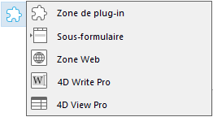
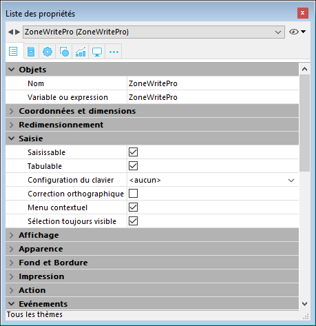
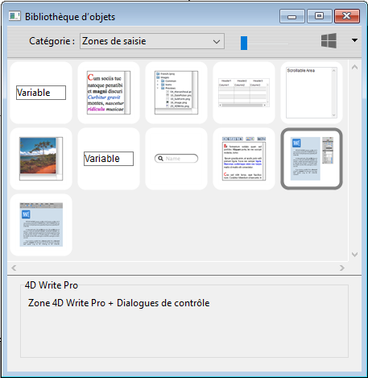
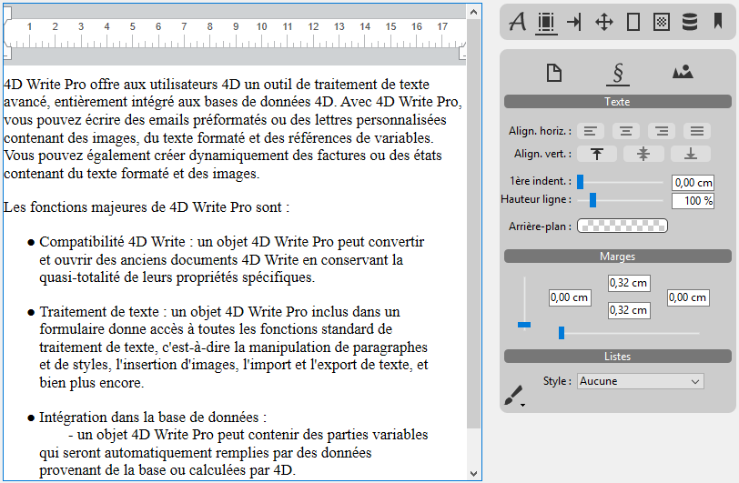

4D Write Pro offre aux utilisateurs 4D un outil de traitement de texte avancé, entièrement intégré aux bases de données 4D. Avec 4D Write Pro, vous pouvez écrire des emails préformatés ou des lettres personnalisées ou tout autre document contenant des images, des tableaux, des marque-pages, du texte formaté et des références de variables. Vous pouvez également créer dynamiquement des factures ou des états contenant du texte formaté et des images.

Les fonctions majeures de 4D Write Pro sont :

* Traitement de texte : un objet 4D Write Pro inclus dans un formulaire donne accès à toutes les fonctions standard de traitement de texte, c'est-à-dire la manipulation de paragraphes et de styles, l'insertion d'images, l'import et l'export de texte, et bien plus encore.
* Intégration dans la base de données :  
   * un objet 4D Write Pro peut contenir des parties variables qui seront automatiquement remplies par des données provenant de la base ou calculées par 4D.  
   * les documents 4D Write Pro peuvent être stockés dans les champs de la base de données ou sur disque.
   

4D Write Pro est fourni avec :

- un **objet formulaire** que vous pouvez installer dans vos formulaires. Vous pouvez charger, manipuler et enregistrer des **documents 4D Write Pro** dans cette zone. Cet objet est configurable via la liste des propriétés et comprend un menu contextuel complet pour les développeurs lors de l'exécution.
- des **commandes de langage**, ajoutées au langage 4D et vous permettant de personnaliser en profondeur la zone.
- des **actions standard**, pour vous aider à créer une interface entièrement personnalisée.
- **4D Write Pro Interface**, une extension qui offre un ensemble de palettes prédéfinies pour les utilisateurs finaux.

## Installation et activation 

4D Write Pro est entièrement intégré à 4D lui-même, ce qui le rend plus facile à gérer et à déployer. Aucune installation supplémentaire n'est requise, vous pouvez directement ajouter des zones 4D Write Pro dans vos formulaires et gérer les variables 4D Write Pro dans vos applications 4D.

Cependant, vous devez disposer d'une licence 4D Write Pro installée dans votre application afin d'activer cette fonctionnalité.

## Création d'une zone 4D Write Pro

### Utilisation de l'objet zone 4D Write Pro

Dans 4D, les documents 4D Write Pro sont affichés et modifiés manuellement dans un objet de formulaire appelé **4D Write Pro**. Cet objet est sélectionnable dans le dernier groupe d'outils (zone de plug-in, zone Web, etc.) de la [barre d'objets](../../FormEditor/formEditor.md#object-bar) de l'éditeur de formulaires :

Une zone de formulaire 4D Write Pro est configurée via les options standard de la Liste des propriétés, telles que **nom** et **nom de** **variable**, **coordonnées**, **saisie**, **affichage**, **apparence** et/ou **événements**.

La propriété **Nom de variable** peut être utilisée dans le langage comme référence de la zone 4D Write Pro. Notez bien que cette variable doit être du type [objet](../../Concepts/dt_object.md).

Les propriétés du thème "Saisie" contrôlent les fonctions élémentaires de saisie de texte :

* **Saisissable** : vous permet de verrouiller/déverrouiller la zone afin d'autoriser ou d'interdire la saisie.
* **Correction orthographique** : disponible pour les zones 4D Write Pro
* **Menu contextuel** : vous permet d'activer/désactiver le menu contextuel lorsque le formulaire est lancé au moment de l'exécution (voir la section [Utiliser une zone 4D Write Pro](./using-a-4d-write-pro-area.md))
* **Sélection toujours visible** : contrôle la sélection de texte comme dans les zones de texte standard.

### Utiliser l'interface 4D Write Pro

Il est possible de créer directement des zones 4D Write Pro préconfigurées via des objets **4D Write Pro** de la [Bibliothèque d'objets](../../FormEditor/objectLibrary.md) (thème "Zones de saisie") :

Les zone ainsi créées sont automatiquement dotées d'un panneau de contrôle ou d'une barre d'outils permettant de gérer tous les attributs de la zone (polices, couleurs, styles...) :

Pour plus d'informations, reportez-vous à la section [Interface 4D Write Pro](../writeprointerface.md).